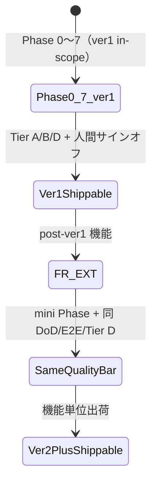

# 00 プロダクト方針・MVP・拡張安全枠 — 横断要件（v1-DRAFT）

> **ステータス**: DRAFT — 人間レビュー待ち。v1.0 格上げは HQ-09 後。  
> **Changelog**:  
> - 2026-06-21 — 更新: `28-個体命名・ブランドテンプレート-v1-DRAFT.md` の Q7 を **確定 2026-06-07: C（ハイブリッド）** に反映（決定記録 / ADR-H-11 連携を追記）
> - 2026-06-21 — 追加DRAFT: `28-個体命名・ブランドテンプレート-v1-DRAFT.md`（観測登録時の命名・ブランドテンプレート・改名履歴 append-only）
> - 2026-06-18 — 初版作成（ユーザー 8 項目 MVP・拡張枠・コンテンツ三体）  
> - 2026-06-18 — **ユーザー確定**: MVP v1 除外（#06/#10/#11）· Sandbox Realm · コスト閲覧全認証ユーザー · D-MVP-01/02/03/05/06/08 → §AI仮定 確定  
> - 2026-06-18 — **§1.5 Phase と ver1 の切り分け** · ver1 shippable 受入 · 完璧先行→同品質拡張
> - 2026-06-18 — **ユーザー確定: 知の広場** — Hub 表示名 · 3 タブ（掲示板/記事/ブログ）· ルート `/knowledge`（§AI仮定）· FR-CONTENT-NAV-07 追加
> - 2026-06-18 — **Phase 0 Go（2026-06-07 ユーザー承認）** をゲートステータスへ反映
> - 2026-06-18 — **Phase 1 完了（HQ-09 Go / 2026-06-07）** を §8 ウォーターフォール進行へ反映
> - 2026-06-18 — **2026-06-07 人間承認記録（全 AI 推奨 Go）** を §8 に反映（Phase 3/4/5 凍結、`DELEGATED-*-GO` 発行）
> - 2026-06-07 — **ユーザー確定: ver2 延期（打鍵フィードバック）** — アキネーター / SwitchBot / タグ洗練 → ver2（OBS-TGT-03, OBS-ENV-02~06, OBS-TAG-01）§1.6
> **用途**: 人間レビュー・設計 AI 引き継ぎ用の横断方針。実装禁止ゲート対象。  
> **非正本**: 採用・実装判断は `docs/REQUIREMENTS.md`・`rag/accepted_requirements.csv`・`civilization/ProjectRules.md` を優先。

---

## §0 ユーザー確定（2026-06-18）

### 確定 A（前セッション）

| 確定項目 | 内容 | 区分 |
|---------|------|------|
| **MVP v1 除外** | **#06 マーケット** · **#10 マチアプ** · **#11 裁判** — v1 スコープ外（Phase 2 以降） | **確定** |
| **サンドボックス** | **全認証ユーザー** — Personal Sandbox Realm + Improvement Template + Promote pipeline（本番 blast radius ゼロ） | **確定** |
| **ランニングコスト** | **全ログインユーザーが閲覧可**（アプリ全体が login-gated のため追加ロール制限なし） | **確定** |

### 確定 B（2026-06-18 追加）

| 確定項目 | 内容 | 区分 |
|---------|------|------|
| **MVP v1 = 観測 First** | マーケット・マチアプ・裁判等は v1 **OUT**。まず観測 MVP を完成させる | **確定** |
| **サンドボックス設計方式** | **Personal Sandbox Realm**（per user） + 改善テンプレート（ScreenDef Δ + ThemePack Δ） + Promote pipeline（micro-waterfall Gate → 任意コミュニティ投票 → Admin Merge）。改善テンプレートは全員への自動伝播なし | **確定** |
| **サンドボックス UX** | amber ストリップ「サンドボックスモード」表示 · diff preview before promote · nav 1 エントリ | **確定** |
| **コスト表示** | ログイン済み全ユーザー閲覧可。未ログイン向け `/transparency/costs` は Phase 2 検討 | **確定** |

### 確定 C（2026-06-18 · コンテンツ Hub）

| 確定項目 | 内容 | 区分 |
|---------|------|------|
| **Hub 表示名** | **知の広場** | **確定** |
| **Hub ルート** | `/knowledge`（表示ラベルのみ日本語） | **§AI仮定 確定**（`/plaza` 不採用） |
| **タブ IA** | 掲示板 \| 記事 \| ブログ（3 タブ） | **確定** |
| **論文の位置** | 4 タブにせず **記事タブ内フィルタ「論文」** | **§AI仮定 確定** |
| **UX 正本** | [`02-設計/E2E/07-09-24-コンテンツ導線・UX提案-v1-DRAFT.md`](../02-設計/E2E/07-09-24-コンテンツ導線・UX提案-v1-DRAFT.md) | **確定** |

### 確定 D（2026-06-07 · 打鍵フィードバック · ver2 延期）

| 確定事項 | 内容 | 区分 |
|---------|------|------|
| **観測拡張 → ver2** | **アキネーター**（質問で絞る経路）· **SwitchBot / 環境 IoT 連携** · **タグ洗練**（append-only タグ運用 UI）を **ver1 から除外**し **ver2** で FR-EXT mini Phase 着手 | **確定 2026-06-07** |
| **正本トレース** | `05-観測.md` — OBS-TGT-03 · OBS-ENV-02~06 · OBS-TAG-01 | **確定** |
| **ver1 影響** | ver1 shippable 判定・Phase 6 W3 コア観測の Tier B/D から上記は **スコープ外**（スタブ・後続 Wave 案内のみ可） | **確定** |

---

## §1 MVP v1 スコープ定義（FR-MVP-*）

> **方針**: 「まず動いて見せる」最小セット。**観測コア 5 機能**（FR-MVP-01〜05）。プラットフォーム除外は §1.1。追加は §2 の拡張安全枠で。

### §1.1 MVP v1 プラットフォーム除外（ユーザー確定）

| 機能 | 番号 | v1 | 正本 | Phase |
|------|------|-----|------|-------|
| **マーケット** | #06 | **OUT** | `06-マーケット.md` | Phase 2 以降 |
| **マチアプ** | #10 | **OUT** | `10-マチアプ.md` | Phase 2 以降 |
| **裁判** | #11 | **OUT** | `11-裁判.md` | Phase 2 以降 |

> **注**: 観測（#05）内の MVP 境界は `05-観測.md` §4.14 参照。

### FR-MVP-01 — 観測データ収集

| 属性 | 値 |
|------|-----|
| **要件** | ユーザーが任意の固体に対して観測セッションを開始し、値（体長・体重・メモ等）を入力して保存できる |
| **受入基準** | 観測セッションが R2 に INSERT され、一覧・詳細画面から参照可能 |
| **正本トレース** | `05-観測.md` OBS-SOL-01〜03、OBS-TPL-01〜09 |
| **MVP 境界** | テンプレ選択 → 値入力 → 保存の最短 3 クリック経路。Vision 解析・BPCMS 準拠は **Phase 2 以降** |

### FR-MVP-02 — 写真登録

| 属性 | 値 |
|------|-----|
| **要件** | 観測セッションに写真（1 枚以上）をアップロードし、R2 に保存できる |
| **受入基準** | 写真サムネイルが詳細画面に表示される |
| **正本トレース** | `05-観測.md` OBS-SOL-01、OBS-IMG-02 |
| **MVP 境界** | thumbnail 生成（長辺 512px）まで。DINOv2 embedding・色特徴は **IHL Phase 1** |

### FR-MVP-03 — 詳細ビュー表示

| 属性 | 値 |
|------|-----|
| **要件** | 保存した観測セッションの詳細（写真・計測値・日時・個体情報）を 1 画面で確認できる |
| **受入基準** | `/observation/sessions/:id` または同等のルートで詳細が表示される。空状態・ローディング・エラーを用意 |
| **正本トレース** | `05-観測.md` OBS-NF-04、`01-要件/00-土台-MiniKernel-C-USB-コンポーネント.md` |
| **MVP 境界** | 閲覧のみ。再解析・bundle export は **Phase 2** |

### FR-MVP-04 — 親個体連携（Individual Linkage）

| 属性 | 値 |
|------|-----|
| **要件** | 観測セッションを特定の親個体（individual）に紐づけられる。父親（sire）・母親（dam）ID の記録ができる |
| **受入基準** | セッション JSON に `individual_id`・`sire_id`（任意）・`dam_id`（任意）が含まれる。個体詳細画面からその個体の観測履歴一覧に遷移できる |
| **正本トレース** | `05-観測.md` OBS-IND-01〜05（新規 §4.12 追加） |
| **重要度** | **MVP で最重要**。血統フロー・研究データの起点となる |
| **MVP 境界** | individual master への登録・参照まで。血統グラフ描画は **Phase 2** |

### FR-MVP-05 — QR コード発行・スキャン・観測再開

| 属性 | 値 |
|------|-----|
| **要件** | (a) 個体 ID から QR コードを生成・印刷できる。(b) QR をカメラでスキャンし、その個体の新規観測セッションを開始できる |
| **受入基準** | (a) `/individuals/:id/qr` で QR 画像を生成・表示。(b) スキャン → 個体詳細または観測入力画面へ遷移。`entryMode: qr` が記録される |
| **正本トレース** | `05-観測.md` OBS-SOL-07、OBS-QR-01〜05（新規 §4.13 追加）|
| **ユースケース例** | 初令→2令後期の継続観測（段階変化をトレース）、土替えタイミングの記録。QR 読取 → 「前回: 初令 45mm」がプリフィルされる |
| **MVP 境界** | v1 は QR 生成（PNG/SVG）+ Web カメラスキャン（`jsQR` 等）まで。ネイティブアプリ連携は **Phase 2** |

---

## §1.5 Phase と ver1 の関係（確定方針）

> **用語正本（工程）**: [`02-設計/ADR-UI-Rebuild-Waterfall-Plan-DRAFT.md`](../02-設計/ADR-UI-Rebuild-Waterfall-Plan-DRAFT.md) §「Phase と ver1 の切り分け」  
> **混同禁止**: 本書 §2 の **FR-EXT mini Phase（0〜5）** は機能追加用の縮小ゲート。UI 再構築の **Phase 0〜7** とは別体系。

### ver1 vs Phase — 対照表

| 観点 | **Phase 0〜7** | **ver1（MVP v1）** |
|------|----------------|-------------------|
| **問い** | **HOW** — どう設計・実装・検証するか | **WHAT** — 初回に何を出荷するか |
| **完了の意味** | 対象スコープについて工程ゲートを通過 | 観測 MVP（`FR-MVP-01〜05`）+ 到達に必要な横断が出荷可能 |
| **全機能同時完成** | 要求しない | 要求しない |
| **Phase 7 / Tier D** | in-scope に対する E2E・打鍵・サインオフ | **ver1 in-scope のみ**が出荷判定対象 |
| **ver1 外（#06/#10/#11 等）** | Wave 表に載っていても Phase 6 で実装可 | **ver1 shippable のブロッカーにしない** |

### 戦略: ver1 完璧 → 同品質で拡張

```text
1. ver1 スコープに Phase 0〜7 を適用（in-scope 限定）
2. ver1 を DoD / E2E Tier B / Tier D と同じ品質バーで「完璧」にする
3. post-ver1 機能は FR-EXT mini Phase で追加
4. 各拡張機能も ver1 と同一品質バー（同 DoD · 同 Tier 体系）を満たしてから次を出荷
```

**一度に全 27 機能を ver1 品質まで上げることは目標としない。** 品質は **ver1 完走 → 機能単位で繰り返し**。

### ver1 shippable — 受入の意味

次を**すべて**満たしたとき **ver1 shippable** と呼ぶ（= ver1 に対する Phase 7 完了相当）:

| # | 受入条件 |
|---|---------|
| 1 | **スコープ**: `FR-MVP-01〜05` の受入基準を満たす（データ · 写真 · 詳細 · 親個体 · QR） |
| 2 | **工程**: ver1 in-scope について Phase 0〜5（設計 5 点）+ Phase 6 該当 Wave + Phase 7 検証が完走 |
| 3 | **自動検証**: ver1 ルートの route-matrix（Tier A）· ver1 主要導線 E2E（Tier B）が PASS |
| 4 | **人間検証**: ver1 in-scope の Tier D 打鍵が ✅（Phase 6 各 Wave の**段階打鍵**を含む · 最終日一括のみは不可） |
| 5 | **UI 品質**: NFR-MVP-02〜04（3 クリック · 空/エ/ロ · ユーザー向け「未実装」禁止） |
| 6 | **明示 backlog**: マーケット · マチアプ · 裁判等 ver1 外は post-ver1 と文書化 — **ver1 Go を阻害しない** |



### ver1 IN / OUT（再掲）

| ver1 IN | ver1 OUT（post-ver1 · 同品質バーで後追い） |
|---------|-------------------------------------------|
| 観測 MVP（§1 `FR-MVP-01〜05`） | マーケット（#06） |
| 認証・ホーム等 ver1 到達に必要な最小横断 | マチアプ（#10） |
| | 裁判（#11） |
| | 記事/ブログ · AI 要約 · コスト透明性等（§4 Wave 3+） |
| | **ver2 観測拡張**（§1.6）— アキネーター · SwitchBot · タグ洗練 |

### §1.6 ver2 観測拡張スコープ（確定 2026-06-07）

> **ステータス**: **確定 2026-06-07**（ユーザー打鍵フィードバック · Phase 6 Wave A 計画と整合）  
> **正本 FR**: [`05-観測.md`](./05-観測.md) · 横断 ADR: [`ADR-H-16`](../02-設計/_横断/adr/ADR-H-16-観測対象ナビゲータ.md) · SwitchBot: Batch 8 ADR-H-19  
> **記録**: [`02-設計/Phase6-打鍵フィードバック-v1.md`](../02-設計/Phase6-打鍵フィードバック-v1.md)

2026-06-07、ユーザーは **ver1 出荷を阻害しない**よう、次を **ver2（post-ver1 · FR-EXT mini Phase）** へ延期することを確定した。

| 機能（ユーザー呼称） | FR ID | ver2 で満たす要件（要約） | ver1 |
|---------------------|-------|---------------------------|------|
| **アキネーター**（質問で絞る） | **OBS-TGT-03** | 観測対象ナビゲータの 3 経路のうち「質問で絞る」· Question Kernel 連携 | **OUT** — 検索 / ツリー分類のみ |
| **SwitchBot / 環境 IoT** | **OBS-ENV-02 ~ OBS-ENV-06** | poller · Placement/DeviceBinding · collector ingest · 手入力 provenance · セッション snapshot 参照 | **OUT** — 手入力環境メモのみ（OBS-ENV-01 相当の最小） |
| **タグ洗練** | **OBS-TAG-01** | append-only `tag_event` · invert / review_needed · 観測・コンテンツ横断のタグ UI | **OUT** — 構造化タグ（OBS-TGT-06 等）の保存のみ、洗練 UI は ver2 |

**実装ゲート**: 各項目は §2 `FR-EXT-02` の mini Phase 0→5 完了 + `DELEGATED-IMPL-GO` 後に着手。ver1 Phase 6 **W3 完了**および ver1 shippable（§1.5）を **ブロッカーにしない**。

---

## §2 マイクロウォーターフォール拡張安全枠（FR-EXT-*）

> **方針**: 要件ギャップが発覚しても **メインライン開発を止めない**設計原則。  
> 各機能は独立した mini Phase 0〜5 を持ち、実装ゲートを個別に管理する。

### FR-EXT-01 — ルーズカップリング原則

| 属性 | 値 |
|------|-----|
| **要件** | 各機能（FeatureNode）は C-USB 契約で疎結合とし、一方の設計ゲート未通過が他方の実装をブロックしない |
| **受入基準** | 新機能追加時に既存 E2E の green が維持される |
| **設計パターン** | IN→Transform→OUT（ITO モデル）+ append-only R2 ストア |

### FR-EXT-02 — 機能追加ミニPhase 手順

新機能追加の標準手順（**Design Gate 5 点の mini 版**）:

```
Phase 0: 要件 DRAFT（FR-XXX-* 採番、§9 未確定 記録）
        ↓
Phase 1: 詳細設計（schema / API / contract、ADR 採番）
        ↓
Phase 2: 遷移設計（状態遷移・エラー導線）
        ↓
Phase 3: UI 設計（ワイヤー・preferences.md 整合）
        ↓
Phase 4: テスト設計（RTM + 4 層計画）
        ↓
Phase 5: 実装 Go（DELEGATED-IMPL-GO 後）
```

**入口文書**: `01-要件/NN-<機能名>-v1-DRAFT.md` の作成で Phase 0 開始。  
**出口**: `04-トレーサ/features/NN-*/RTM-v1.csv` が FR 100% カバー → 人間レビュー → v1.0 格上げ。

### FR-EXT-03 — 既存テストの保護

| 属性 | 値 |
|------|-----|
| **要件** | 追加機能の実装中、既存 E2E・Vitest が回帰しない |
| **受入基準** | `cd 指示/it-hercules-laboratory && pytest` が GREEN を維持 |
| **方針** | STUB-FILL で新機能は E2E STUB を先に作成し、実装前から回帰ガードする |

### FR-EXT-04 — 要件ギャップ記録と凍結後 CR

| 属性 | 値 |
|------|-----|
| **要件** | 実装中に要件の抜けが見つかったとき、**Change Request（CR）** として `01-要件/NN-*.md` の §9 未決 に追記する。勝手に実装に反映しない |
| **受入基準** | CR 追記 → 人間確認 → 採用決定 → FR 番号採番 → RTM 更新 の順を守る |
| **正本** | `01-要件/README.md` 追加仕様反映手順 |

### FR-EXT-05 — 疎結合モジュール設計

| 属性 | 値 |
|------|-----|
| **要件** | 記事・ブログ（#24）・AI 要約（#25）・サンドボックス（#26）・コスト透明性（#27）は既存 #05/#07/#09/#14 の実装を**壊さず**に追加できる |
| **設計拘束** | 各 FeatureNode は独立 R2 キー空間（`world/<feature>/...`）を使う。既存 Node の `schema_version` を bump しない |

---

## §3 コンテンツ三体ナビゲーション（FR-CONTENT-NAV-*）

> **方針**: 論文（#09）・記事（#24 新規）・ブログ（#24 新規）は **共通 CMS 思想** を持つ三位一体。  
> 製品 BBS（#07）と合わせ **知の広場**（`/knowledge`）ハブに集約。ナビゲーション・相互引用・掲示板連携が設計の核。

### FR-CONTENT-NAV-01 — 知の広場ハブ（統一入口）

| 属性 | 値 |
|------|-----|
| **要件** | **`/knowledge`**（表示名 **知の広場**）で、掲示板・記事・ブログの 3 タブを提供する |
| **タブ** | `/knowledge/board`（掲示板）· `/knowledge/articles`（記事）· `/knowledge/blog`（ブログ） |
| **論文** | 独立タブにせず **記事タブ内** `content_type=paper` フィルタ（§AI仮定 確定） |
| **フィルタ** | 記事タブ: 種別（paper/article）· 著者 · タグ · 日付範囲 |
| **受入基準** | ホーム → 知の広場 → 各タブ主要操作が **3 クリック以内** |
| **Alias** | 旧 `/research/content` → `/knowledge` リダイレクト（§AI仮定 · 実装時） |
| **正本トレース** | `09-論文.md` FR-PPR-11、`24-記事・ブログ-v1-DRAFT.md` FR-ART-01 · [`07-09-24-コンテンツ導線・UX提案-v1-DRAFT.md`](../02-設計/E2E/07-09-24-コンテンツ導線・UX提案-v1-DRAFT.md) |

### FR-CONTENT-NAV-02 — 相互引用リンク

| 属性 | 値 |
|------|-----|
| **要件** | 記事・ブログから論文を **Citation** として引用でき、双方向リンクが R2 に記録される |
| **正本トレース** | `09-論文.md` FR-PAPER-01（`paperId` + `sectionId`）、`24-記事・ブログ-v1-DRAFT.md` FR-ART-06 |
| **MVP 境界** | v1 は片方向 mention（`cited_paper_ids[]`）まで。双方向 graph は Phase 2 |

### FR-CONTENT-NAV-03 — 観測データへの連携

| 属性 | 値 |
|------|-----|
| **要件** | 記事・ブログ・論文から観測セッション（`session_id`）または個体（`individual_id`）へのリンクを貼れる |
| **正本トレース** | `05-観測.md` OBS-SOL-08（`priorSessionId`）、`09-論文.md` FR-PPR-04 |

### FR-CONTENT-NAV-04 — 掲示板との接続

| 属性 | 値 |
|------|-----|
| **要件** | 各コンテンツ（論文・記事・ブログ）は `/board/paper` case チップで議論スレを持てる |
| **正本トレース** | `07-掲示板.md` FR-BBS-15/16（`paper_case` enum に `article`・`blog` を追加 — **§AI仮定 確定** D-MVP-08） |

### FR-CONTENT-NAV-05 — 共通タグ空間

| 属性 | 値 |
|------|-----|
| **要件** | 論文・記事・ブログは共通 `tag_event`（append-only）で横断インデックスされる |
| **正本トレース** | `09-論文.md` FR-PAPER-02、`05-観測.md` OBS-TAG-01 |

### FR-CONTENT-NAV-06 — AI 要約との接続

| 属性 | 値 |
|------|-----|
| **要件** | 記事・ブログ・論文は AI 要約バッチ（#25）の対象に含まれ、要約結果が `summary_ref` として紐づく |
| **正本トレース** | `25-AI要約-GitHub改善掲示板-v1-DRAFT.md` FR-AISUM-03 |
| **未確定** | バッチ頻度・コスト上限は §9 未決。§9 参照。 |

### FR-CONTENT-NAV-07 — 知の広場 Hub ラベル・左ナビ

| 属性 | 値 |
|------|-----|
| **要件** | 左ナビ・パンくず・ページ `<title>` に **知の広場** を表示する。英語 slug は `/knowledge`（§AI仮定 確定） |
| **タブラベル** | 掲示板 · 記事 · ブログ（3 のみ。論文は記事タブ内フィルタ） |
| **受入基準** | ホーム左ナビから **1 クリック**で `/knowledge` に着地。掲示板単独入口と二重にならない |
| **正本トレース** | [`知の広場-遷移設計-v1-DRAFT.md`](../02-設計/features/_横断/知の広場-遷移設計-v1-DRAFT.md) · ユーザー確定 2026-06-18 |

---

## §4 システム組み込み方針（FeatureNode / API / E2E）

| 機能 | FeatureNode | API 層 | E2E Wave | 依存 |
|------|------------|--------|----------|------|
| **MVP v1 観測** | `observation` | `POST /api/observations`, `GET /api/observations/:id` | Wave 1（優先） | #05 FR-MVP-01〜03 |
| **親個体連携** | `observation`, `lineage`（将来） | `POST /api/individuals`, `PATCH /api/sessions/:id/individual` | Wave 1 | FR-MVP-04 |
| **QR** | `observation` | `GET /api/individuals/:id/qr` | Wave 1 | FR-MVP-05 |
| **記事・ブログ** | `research` | `POST /api/articles`, `GET /api/articles` | Wave 3 | #24、#09 |
| **AI 要約** | `research`, `board` | バッチ（cron）| Wave 4 | #25、#07、#09 |
| **サンドボックス** | `sandbox`（Personal Realm） | `POST /api/sandbox/realms` 等 | Wave 5 | #26 |
| **コスト透明性** | `admin`, `home` | `GET /api/costs/summary`（全認証ユーザー閲覧） | Wave 4 | #27 |

---

## §5 非機能要件（横断）

| ID | 要件 |
|----|------|
| NFR-MVP-01 | すべての MVP 機能は R2 INSERT ONLY を遵守する |
| NFR-MVP-02 | 主要導線（観測開始→保存）は **3 クリック以内** |
| NFR-MVP-03 | 空状態・ローディング・エラーを全経路で用意（DoD U-*） |
| NFR-MVP-04 | 「未実装」「WIP」を ユーザー向け UI に記載しない（`no-user-facing-unimplemented` ルール） |
| NFR-EXT-01 | 新機能追加時の既存 E2E 回帰率: 0% |
| NFR-EXT-02 | 各機能 FR ID は `01-要件/NN-*.md` で一意に採番 |

---

## §6 MiniKernel / C-USB 上の位置づけ

```text
World
 └── FeatureNode: observation  ← MVP v1 中心
      ├── Kernel: create（commit）, analyze, configure
      ├── Component: IndividualCard, ObservationForm, QRGenerator, QRScanner
      └── Connector: R2（append-only）, camera API

 └── FeatureNode: research
      ├── Component: ArticleEditor, PaperMatchPage, ContentHub
      └── Connector: R2（research/）, AI summarizer（batch）

 └── FeatureNode: admin（コスト透明性）
      └── Connector: Sakura VPS API, R2 usage API
```

---

## §7 IHL repo との関係

| スコープ | 担当 |
|---------|------|
| **MVP v1 観測 / QR / 個体** | **IHL rebuild**（civilization-os は legacy 参照） |
| **記事・ブログ** | **IHL rebuild**（新 FeatureNode `research/article`）|
| **AI 要約バッチ** | **IHL new**（新 component `research/summarizer`）|
| **サンドボックス** | **IHL new**（Personal Sandbox Realm · `sandbox/{user_id}/` R2 namespace + registry fork）|
| **コスト透明性** | **IHL new**（全認証ユーザー閲覧 · FeatureNode `admin/costs`）|

---

## §8 設計ゲートステータス

### ウォーターフォール進行ステータス（参照）

| 項目 | ステータス | 根拠 |
|------|------------|------|
| **Phase 0（前提・方針確定）** | **Go（2026-06-07）** | `02-設計/ADR-UI-Rebuild-Waterfall-Plan-DRAFT.md`（ユーザーチャット承認反映） |
| **Phase 1（要件定義）** | **完了（HQ-09 Go / 2026-06-07）** | `機能一覧/要件定義/21-UI再構築・テーマ分離・E2E要件-v1-DRAFT.md`（v1.0 確定・人間レビュー済） |
| **Phase 2（OSS 選定）** | **完了（Go / 2026-06-07）** | `02-設計/ADR-Phase2-OSS-確定.md`（v1.0 確定・人間レビュー済） |
| **Phase 3（詳細設計）** | **凍結 v1.0（2026-06-07）** | `02-設計/_横断/Phase3-*.md`（人間判断記録反映） |
| **Phase 4（遷移設計）** | **凍結 v1.0（2026-06-07）** | `02-設計/_横断/Phase4-*.md`（人間判断記録反映） |
| **Phase 5（UI 設計）** | **凍結 v1.0（2026-06-07）** | `02-設計/_横断/Phase5-ScreenDef-ver1-P0-v1-DRAFT.md`（2-5 除外あり） |
| **委任 Go チェーン** | **発行済み（2026-06-07）** | `DELEGATED-DESIGN-GO` / `DELEGATED-TEST-DESIGN-GO` / `DELEGATED-IMPL-GO` |

| # | 成果物 | ステータス |
|---|--------|------------|
| 1 | **要件定義** | **Phase 1 完了（HQ-09 Go / 2026-06-07）** — `#21` は v1.0 確定済み。本ファイルは横断方針の更新継続のため DRAFT 管理 |
| 2 | **詳細設計** | **凍結 v1.0（2026-06-07）** — `02-設計/_横断/Phase3-ThemePackトークン定義-v1-DRAFT.md` / `Phase3-shadcnプリミティブカタログ-v1-DRAFT.md` / `Phase3-AppShellレイアウト仕様-v1-DRAFT.md` |
| 3 | **遷移設計** | **凍結 v1.0（2026-06-07）** — `02-設計/_横断/Phase4-ルートマスター-ver1-v1-DRAFT.md` / `Phase4-遷移設計-ver1-v1-DRAFT.md` |
| 4 | **UI 設計** | **凍結 v1.0（2026-06-07）** — `02-設計/_横断/Phase5-ScreenDef-ver1-P0-v1-DRAFT.md`（2-5 除外管理） |
| 5 | **テスト設計** | **既存資産あり** — `03-テスト計画/features/05-観測/` に 4 層（単体/結合/システム/受入）を確認、ScreenDef から参照統合待ち |

**実装ゲート**: 2026-06-07 承認で `DELEGATED-IMPL-GO` まで発行済み。Phase 6 W0 着手可。  
**承認正本**: `02-設計/_横断/Phase5-人間判断記録-v1.md`

---

## §9 §AI仮定 確定（Pro SE 決定 · ユーザー異議なし · 2026-06-18）

> **注**: 下記はたたき台推奨を Pro SE が確定した事項。実装 Go 前の人間レビュー対象だが、**論点はクローズ**。

| ID | 論点 | **確定値** |
|----|------|-----------|
| D-MVP-01 | **individual master** の保存先 | **IHL R2 の `individual` テーブル正本**。civilization-os は `individual_id` 参照 ID のみ |
| D-MVP-02 | **QR スキャン UI** | **v1 は Web カメラ（`jsQR`）**。ネイティブ App は Phase 2 ADR |
| D-MVP-03 | **記事 vs ブログの区別** | **同一スキーマ + `content_type` enum**（`article` / `blog`）で兼用 |
| D-MVP-05 | **サンドボックス設計** | **Personal Sandbox Realm** — `sandbox/{user_id}/` R2 namespace + prod registry fork。**別 port / 別 VPS テナントではない**（`26-サンドボックス環境-v1-DRAFT.md` 正本） |
| D-MVP-06 | **コスト API** | **Sakura VPS は月次手動入力** + **Cloudflare R2 usage API**（利用可能な範囲で自動取得）。Sakura API 自動化は Phase 2 |
| D-MVP-08 | **`paper_case` enum 拡張** | **`article`・`blog` を `07-掲示板.md` FR-BBS-15 に追加**（CR 反映済み扱い） |

---

## §10 未確定・ギャップ（人間に聞くべき事項）

> **注**: 下記のみ未クローズ。1 メッセージで回答可能にまとめる。

| ID | 論点 | たたき台推奨 | 優先度 |
|----|------|------------|--------|
| D-MVP-04 | **AI 要約の対象**: 掲示板 POST のみ vs 記事/ブログ/論文も | 掲示板（GitHub improvement board）優先。記事/ブログは v2 で拡張 | 中 |
| D-MVP-07 | **GitHub 貢献度反映**: GitHub API の rate limit・認証スコープ | `public` repo PR/issue count は unauthenticated API で取得可（5000req/h）| 低 |

---

## §11 設計 AI 参照順

1. 本ファイル（横断方針）
2. `05-観測.md` — MVP 観測・QR・個体連携
3. `09-論文.md` — 論文スキーマ・コンテンツ三体
4. `24-記事・ブログ-v1-DRAFT.md` — 記事/ブログ要件
5. `07-掲示板.md` — BBS 接続点
6. `14-貢献度.md` — GitHub 貢献度連携
7. `25-AI要約-GitHub改善掲示板-v1-DRAFT.md`
8. `26-サンドボックス環境-v1-DRAFT.md`
9. `27-ランニングコスト透明性-v1-DRAFT.md`
10. `_横断/FEATURE-REQUIREMENTS-INVENTORY.md` — #24〜#27 エントリ

---

*DRAFT・非正本 / 人間レビュー用 / 設計 AI 引き継ぎ用*
