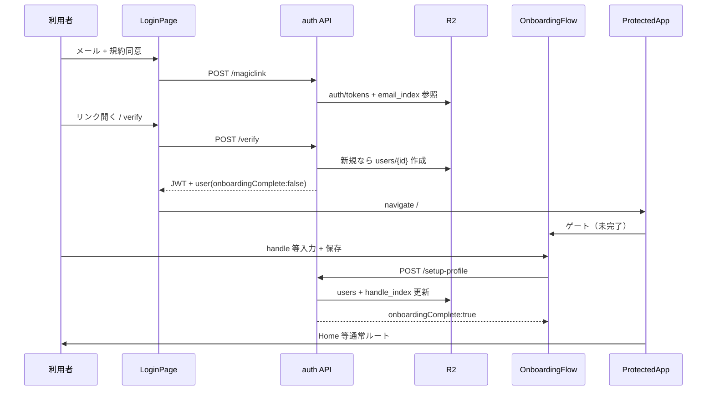

# 03 新規登録 — 機能要件定義（たたき台・非正本）

> **用途**: 人間レビュー・設計 AI 引き継ぎ用。  
> **非正本**: 採用・実装判断は `docs/REQUIREMENTS.md`・`rag/accepted_requirements.csv`・`civilization/`・`design/phases/Phase_auth_login.md` を優先。  
> **作成日**: 2026-06-07  
> **インベントリ**: `01-要件/_横断/FEATURE-REQUIREMENTS-INVENTORY.md` §3  
> **採用要件ID**: REQ-002（認証・RBAC・マジックリンク、`implemented`）

---

> **IHL 読み替え（2026-06-07）**: 本文の「stays in civilization-os」は **IHL rebuild（legacy = salvage 参照）** と読む。正本: [README マスターノート](./README.md) · [06-リポジトリ戦略](../05-運用/_横断/リポジトリ戦略-legacyとIHL.md)

## ① 機能概要

CivilizationOS における「新規登録」は、**独立したサインアップ画面ではない**。利用者がログイン画面でメールアドレスを入力しマジックリンクを受け取り、**初回トークン検証時に R2 上にアカウント行が作成**される。JWT 取得後、`onboardingComplete === false` の間はアプリ全体が **初回セットアップ（オンボーディング）** に閉じ、ここで `@ユーザーID`（handle）・表示名・**言語（必須）**・タイムゾーン・テーマを確定して初めて「文明内の人格」が成立する。

> **IHL rebuild 追記（2026-06-07 · ユーザー確定）**: **表示言語（locale）は必須**。国籍・国コードは **不要**（任意化または廃止）。全画面 UI 文言は登録言語に従う — 詳細は [`21-翻訳-言語.md`](./21-翻訳-言語.md)。legacy civ-os は国+言語必須のまま。

パスワード・OAuth・SMS による登録は **非サポート**（`Phase_auth_login.md` 明示）。利用規約同意はログイン送信前（`LoginPage.tsx`）と、プロフィール保存時（`setupProfile` が `agreedTerms` / `agreedPrivacy` を true にする）の二段で技術的に満たされる。ログイン（機能 #1）とオンボーディングの境界は実装済みだが、一般向け「新規登録」単語の **単独要件 ID は未昇格**（インベントリ分類: **部分**）。

---

> **IHL 読み替え（2026-06-07）**: 本文の「stays in civilization-os」は **IHL rebuild（legacy = salvage 参照）** と読む。正本: [README マスターノート](./README.md) · [06-リポジトリ戦略](../05-運用/_横断/リポジトリ戦略-legacyとIHL.md)

## ② ユーザーができること

| 操作 | 画面 / 経路 | 結果 |
|------|-------------|------|
| 初めてのメールでログインリンクを送る | `LoginPage`（メール + 規約チェック） | 新規メールなら R2 に `users/{userId}.json` が作成される（検証時） |
| マジックリンクを開いて認証する | `LoginPage`（`?token=` 自動検証）または開発用トークン | JWT 取得。新規なら `isNewUser: true` |
| 文明人格を初回確定する | `OnboardingFlow`（`/onboarding` 相当・実質 catch-all） | handle・表示名・地域設定・テーマを保存し `onboardingComplete: true` |
| `@ユーザーID` の空きを確認する | オンボーディング入力中（デバウンス 500ms） | `GET /api/auth/check-handle/:handle` |
| オンボーディング中にヘルプを読む | 手引き・全機能一覧・Builder 境界へのリンク | `ProtectedApp` が `/help/*` のみ例外的に開放 |
| 別メールでやり直す | オンボーディング下部「ログアウトして別のメールでログイン」 | JWT 破棄 → `/login` |
| セットアップ完了後にホームへ進む | 保存成功後（自動） | `ProtectedApp` が通常ルートへ解放。初回は Twin 案内ツアー pending 可 |

**既存ユーザー**は同じログイン経路を使い、オンボーディング完了済みなら検証直後にホームへ遷移する（新規登録フローはスキップ）。

---

> **IHL 読み替え（2026-06-07）**: 本文の「stays in civilization-os」は **IHL rebuild（legacy = salvage 参照）** と読む。正本: [README マスターノート](./README.md) · [06-リポジトリ戦略](../05-運用/_横断/リポジトリ戦略-legacyとIHL.md)

## ③ スコープ内 / スコープ外

### スコープ内（本機能の責務）

- マジックリンク初回検証による **アカウント行の作成**（`verifyMagicLink`）
- JWT 保持中の **初回プロフィール一括確定**（`POST /api/auth/setup-profile`）
- `@ユーザーID` の **重複チェック・不変性**（`handle_index`、変更不可）
- オンボーディング完了までの **ルートゲート**（`ProtectedApp` + `user.onboardingComplete`）
- 利用規約・プライバシー同意の **サーバ側記録**（`setupProfile` 内で `agreedTerms` / `agreedPrivacy`）
- レガシー API との **後方互換**（`register` / `locale` / `complete-onboarding` — UI からは主経路ではない）

### スコープ外（別機能・非サポート）

| 項目 | 扱い |
|------|------|
| パスワード登録・リセット | **非サポート**（`Phase_auth_login.md`） |
| OAuth / OIDC / SNS ログイン | **非サポート** |
| SMS / TOTP 等の第 2 要素 | **非サポート** |
| 独立した `/signup` 画面 | **意図的に無し**（ログインと同一入口） |
| 利用規約条項の法務確定 | 機能 #2（法務人間ゲート） |
| ログイン・JWT・レート制限の詳細 | 機能 #1（ログイン要件定義） |
| IHL 新リポジトリのアカウント体系 | **TBD**（Phase 0 は R2 検証中心） |

---

> **IHL 読み替え（2026-06-07）**: 本文の「stays in civilization-os」は **IHL rebuild（legacy = salvage 参照）** と読む。正本: [README マスターノート](./README.md) · [06-リポジトリ戦略](../05-運用/_横断/リポジトリ戦略-legacyとIHL.md)

## ④ 機能要件（番号付き）

### 登録トリガ（メール初回検証）

- **FR-REG-01** 未登録メールで `POST /api/auth/magiclink` を呼ぶと、トークン発行時点で `isNewUser: true` が返る（`email_index` 未存在判定）。
- **FR-REG-02** `POST /api/auth/verify` で有効トークンを消費したとき、メールが未索引なら `user-{timestamp}-{random}` 形式の `userId` で `users/{userId}.json` を新規作成する。
- **FR-REG-03** 新規ユーザーの初期状態は `handle: null`、`onboardingComplete: false`、`agreedTerms: false`、`agreedPrivacy: false`、`roles: ["user"]`、`karma/platinum/contribution: 0` とする（`authLogic.ts` `verifyMagicLink`）。
- **FR-REG-04** 新規作成時に `auth/email_index/{sha256(email)}.json` → `userId` を登録する（メール平文はファイル名に出さない）。

### オンボーディング UI

- **FR-REG-05** `onboardingComplete === false` の間、認証済みユーザーは `OnboardingFlow` に閉じる（`AppRoutes.tsx` `ProtectedApp`）。`/help/all-features`・`/help/first-launch`・`/help/builder-capability` 等のヘルプのみ例外。
- **FR-REG-06** オンボーディング画面は単一ステップで、次の必須入力を含む: `@ユーザーID`（handle）、ユーザーネーム（displayName）、**表示言語（`locale`）**、タイムゾーン、表示テーマ（light/dark）。**IHL rebuild**: 国・国籍は **必須にしない**（`21-翻訳-言語.md` §4）。
- **FR-REG-06a** **IHL rebuild**: 言語未選択ではオンボーディング完了不可（`FR-I18N-REG-01`）。`Accept-Language` は初期値提案のみ（`FR-I18N-REG-02`）。正本: [`21-翻訳-言語.md`](./21-翻訳-言語.md)。
- **FR-REG-07** `@ユーザーID` は 3〜30 文字、英数字・ピリオド・ハイフン・アンダースコアのみ。入力中に不正文字は除去する。
- **FR-REG-08** handle の空きは 500ms デバウンス後に `checkHandle` でリアルタイム表示する（確認中 / 利用可能 / 使用中）。
- **FR-REG-09** 送信可能条件: 全必須項目入力 + handle 形式 OK + handle 空き確認済み（`handleStatus === "available"`）。
- **FR-REG-10** 保存成功時 `markTwinTourPending()` を呼び、ホーム到達後の初回ツアー用フラグを sessionStorage にセットする（任意 UX・Twin 廃止後も pending 消費ロジックは残存）。
- **FR-REG-11** オンボーディング中は「ログアウトして別のメールでログイン」でセッションを破棄し `/login` へ戻れる。

### オンボーディング API（正経路）

- **FR-REG-12** `POST /api/auth/setup-profile` は `requireAuthActive` 配下。body: `handle`, `display_name`, `country`, `locale`, `timezone`, `theme`。
- **FR-REG-13** 初回のみ `auth/handle_index/{handle}.json` を作成する。既存 handle が他 userId に紐づいていれば `HANDLE_TAKEN`（400）。
- **FR-REG-14** handle 確定後の変更は拒否する（`HANDLE_IMMUTABLE`）。`username` フィールドも handle と同期する。
- **FR-REG-15** 成功時 `agreedTerms` / `agreedPrivacy` を true、`onboardingComplete` を true にし、更新後ユーザーを返す。
- **FR-REG-16** `GET /api/auth/check-handle/:handle` は認証不要。`{ ok: true, available: boolean }` を返す。

### レガシー経路（API のみ・分割 UI なし）

- **FR-REG-17** `POST /api/auth/register` — username / display_name 更新（ステップ分割時代の互換）。
- **FR-REG-18** `POST /api/auth/locale` — 言語のみ更新。
- **FR-REG-19** `POST /api/auth/complete-onboarding` — `agree_terms` / `agree_privacy` 必須。未同意は `MUST_AGREE_TO_TERMS`。
- **FR-REG-20** 現行フロントの正経路は **setup-profile のみ**。レガシー 3 API を再び多段 UI に戻さない（回帰防止）。

### ログイン画面との接続

- **FR-REG-21** ログイン送信前に利用規約チェック必須（`LoginPage` `agreed`）。未チェックでは magiclink 送信不可。
- **FR-REG-22** 検証成功後は `navigate("/", { replace: true })` とし、`ProtectedApp` がオンボーディング or ホームを分岐する。
- **FR-REG-23** ログイン済みかつオンボーディング未完了の状態で `/login` を開いた場合、「初回セットアップが未完了」表示と「アプリへ進む」導線を示す。

### R2・データ境界

- **FR-REG-24** ユーザープロフィール正本は `users/{userId}.json`（CoreEntityBase 準拠の拡張フィールド）。
- **FR-REG-25** handle 索引は `auth/handle_index/{handle}.json`（小文字キー）。username 索引 `auth/username_index/` はレガシー経路と併存しうる。
- **FR-REG-26** JWT は R2 に保存しない。クライアント `localStorage` キー `civilizationos_jwt`。

### 創世・運用特例

- **FR-REG-27** `GENESIS_ADMIN_EMAIL` と一致するメールの stale オンボーディング行は `healGenesisEmailOnboardingIfStale` で冪等補正されうる（運用・CI 用。一般ユーザーには適用しない）。

---

> **IHL 読み替え（2026-06-07）**: 本文の「stays in civilization-os」は **IHL rebuild（legacy = salvage 参照）** と読む。正本: [README マスターノート](./README.md) · [06-リポジトリ戦略](../05-運用/_横断/リポジトリ戦略-legacyとIHL.md)

## ⑤ 非機能要件

- **NFR-REG-01** handle 重複チェック API はオンボーディング入力の体感遅延を避けるため、フロントで 500ms デバウンスする。
- **NFR-REG-02** オンボーディング API 失敗時、サーバ `error` コードをユーザー向け日本語にマッピングする（`HANDLE_TAKEN` 等）。汎用フォールバック文言を必ず用意する。
- **NFR-REG-03** オンボーディング中の主要操作はキーボードで完遂可能とする（select / button / 送信）。
- **NFR-REG-04** 保存中は二重送信防止（`busy` でボタン無効化、「保存中...」表示）。
- **NFR-REG-05** マジックリンク TTL 15 分・JWT 有効 7 日（`authLogic.ts`）。オンボーディング中断後の再開は JWT 期限内であれば同一セッションから継続可能。
- **NFR-REG-06** `requireAuthActive` 経由のため、カルマ停止中ユーザーはプロフィール確定 API が 403（`KARMA_SUSPENDED`）。新規登録直後は通常該当しない。
- **NFR-REG-07** E2E: `frontend/e2e/p0-c5-magic-link-protected.spec.ts` が magiclink → verify → **初回セットアップまたはホーム**到達をカバーする。

---

> **IHL 読み替え（2026-06-07）**: 本文の「stays in civilization-os」は **IHL rebuild（legacy = salvage 参照）** と読む。正本: [README マスターノート](./README.md) · [06-リポジトリ戦略](../05-運用/_横断/リポジトリ戦略-legacyとIHL.md)

## ⑥ MiniKernel / C-USB 上の位置づけ

```
World → FeatureNode: auth → Kernel（view / create / configure）→ Component（LoginPage / OnboardingFlow）
```

| 概念 | 対応 |
|------|------|
| **FeatureNode** | `auth` — 入口体験（ログイン + 初回人格確定） |
| **Kernel 寄せ** | `view`（ログイン UI）、`create`（初回 `users` 行・handle 索引）、`configure`（locale / timezone / theme） |
| **Component** | `OnboardingFlow.tsx` — 文明人格確定の C-USB 原子（fork 可能だが handle 不変はドメイン法則） |
| **Entity** | `CivilizationUser`（`AuthContext` 型 / R2 `users/{id}.json`）— `core` + 認証 `rag` フィールド |
| **既知の負債** | ログイン・オンボーディング・ホームが同一 FeatureNode に同居。画面単位ではなく **フェーズ分岐**で実装（`Phase0_入口_auth.md` 注記） |

**ITO**: IN（メール・プロフィール入力）→ Transform（検証・索引・バリデーション）→ OUT（JWT + 公開ユーザー JSON）。

---

> **IHL 読み替え（2026-06-07）**: 本文の「stays in civilization-os」は **IHL rebuild（legacy = salvage 参照）** と読む。正本: [README マスターノート](./README.md) · [06-リポジトリ戦略](../05-運用/_横断/リポジトリ戦略-legacyとIHL.md)

## ⑦ IHL repo との関係

| 観点 | 分類 |
|------|------|
| civilization-os の新規登録 | **stays in civilization-os** |
| IHL（`it-hercules-laboratory`） | Phase 0 は **R2 検証・画像レイク**中心。**アカウント体系は TBD** |
| 混在禁止 | IHL 公開時は **別認証・別 ToS** を想定（`00-AI-HANDOFF-BRIEF.md` §2） |
| 共有知見 | append-only R2 キー設計・メール索引のハッシュ化方針のみ将来参考になりうる |

IHL 設計 AI は本機能を **文明 OS ドメインの stays** として読み、IHL 側にマジックリンク登録を実装しない（除非 ADR で明示）。

---

> **IHL 読み替え（2026-06-07）**: 本文の「stays in civilization-os」は **IHL rebuild（legacy = salvage 参照）** と読む。正本: [README マスターノート](./README.md) · [06-リポジトリ戦略](../05-運用/_横断/リポジトリ戦略-legacyとIHL.md)

## ⑧ 正本ファイル

| 種別 | パス |
|------|------|
| Phase 正本（認証全体） | `design/phases/Phase_auth_login.md` |
| Phase 入口要約 | `design/phases/Phase0_入口_auth.md` |
| 指示書（画面シナリオ） | `指示/2026.3.27/2026.3.29/Phase0 新規登録` |
| HTTP ルータ | `backend/src/api/routes/auth.ts` |
| ドメインロジック | `backend/src/logic/authLogic.ts` |
| 認証ミドルウェア | `backend/src/middleware/auth.ts` |
| オンボーディング UI | `frontend/src/auth/OnboardingFlow.tsx` |
| セッション・API ラッパ | `frontend/src/auth/AuthContext.tsx` |
| ルートゲート | `frontend/src/app/AppRoutes.tsx`（`ProtectedApp`） |
| ログイン入口（登録トリガ） | `frontend/src/auth/LoginPage.tsx` |
| API エラーコード | `docs/auth-login-surface.md` |
| 採用要件 | `rag/accepted_requirements.csv` — **REQ-002** |
| 憲法 | `/civilization/ProjectRules.md`、`/civilization/Security.md` |

---

> **IHL 読み替え（2026-06-07）**: 本文の「stays in civilization-os」は **IHL rebuild（legacy = salvage 参照）** と読む。正本: [README マスターノート](./README.md) · [06-リポジトリ戦略](../05-運用/_横断/リポジトリ戦略-legacyとIHL.md)

## ⑨ 未決・ギャップ

| ID | 内容 | 優先度 |
|----|------|--------|
| GAP-REG-01 | 「新規登録」という **製品用語の単独要件 ID** が未昇格（REQ-002 に内包） | 中 |
| GAP-REG-02 | ログインとオンボーディングの **製品コピー境界**（「登録」「サインアップ」表記）が oral 多め | 低 |
| GAP-REG-03 | `OnboardingFlow` が **インライン style 中心** — `civ-phase0-login` 系クラスへの統一は UI 負債 | 低 |
| GAP-REG-04 | レガシー API（`register` / `complete-onboarding`）の **廃止時期・Deprecation 表記** 未整理 | 低 |
| GAP-REG-05 | オンボーディング完了後 Twin ツアー pending — Twin 機能廃止後の **UX 文言・ツアー内容** の整理 | 低 |
| GAP-REG-06 | 指示書 `Phase0 新規登録` の A1「3 秒カウントダウン」は **現行 `LoginPage` と差分**（即時 `/` 遷移）。シナリオ正本の更新要 | 中 |
| GAP-REG-07 | 利用規約の **法務確定**（機能 #2）が人間ゲートのまま — 同意の法的効力はドラフト前提 | 人間 |

**実装状態（インベントリ）**: **implemented**（フロー成立）。要件文書としては **部分**。

---

> **IHL 読み替え（2026-06-07）**: 本文の「stays in civilization-os」は **IHL rebuild（legacy = salvage 参照）** と読む。正本: [README マスターノート](./README.md) · [06-リポジトリ戦略](../05-運用/_横断/リポジトリ戦略-legacyとIHL.md)

## ⑩ 設計 AI 参照順

1. `指示/it-hercules-laboratory/00-AI-HANDOFF-BRIEF.md` §2（IHL と civilization-os の混在禁止）
2. `design/phases/Phase_auth_login.md` §初回オンボーディング・非サポート・R2 境界
3. `frontend/src/auth/OnboardingFlow.tsx` + `frontend/src/app/AppRoutes.tsx`（ゲート実態）
4. `backend/src/logic/authLogic.ts`（`verifyMagicLink`, `setupProfile`, `checkHandleAvailable`）
5. `backend/src/api/routes/auth.ts`（`setup-profile`, `check-handle`, レガシー 3 ルート）
6. `指示/2026.3.27/2026.3.29/Phase0 新規登録`（画面シナリオ・禁止事項）
7. `指示/it-hercules-laboratory/01-USER-INTENT-SUMMARY.md`（IHL は別アカウント想定）
8. 機能 #1 `01-ログイン.md`（本フォルダ）— マジックリンク・JWT の前提
9. 機能 #2 `02-利用規約.md`（本フォルダ）— 同意と法務ゲート
10. 横断 `21-翻訳-言語.md` — 登録時 `locale` 必須・UI 全文切替

---

> **IHL 読み替え（2026-06-07）**: 本文の「stays in civilization-os」は **IHL rebuild（legacy = salvage 参照）** と読む。正本: [README マスターノート](./README.md) · [06-リポジトリ戦略](../05-運用/_横断/リポジトリ戦略-legacyとIHL.md)

## フロー図（たたき台）



---

> **IHL 読み替え（2026-06-07）**: 本文の「stays in civilization-os」は **IHL rebuild（legacy = salvage 参照）** と読む。正本: [README マスターノート](./README.md) · [06-リポジトリ戦略](../05-運用/_横断/リポジトリ戦略-legacyとIHL.md)

## 変更履歴

| 日付 | 内容 |
|------|------|
| 2026-06-07 | 初版たたき台（インベントリ §3・コード横断） |
| 2026-06-07 | `21-翻訳-言語` 横断接続 — `locale` 必須・国籍と分離を明示 |
| 2026-06-07 | 経済横断 — 登録直後は **振込コード未発行**（マーケット取引時に [`23-GMO銀行振込判定.md`](./23-GMO銀行振込判定.md) · §06 §11.7） |
