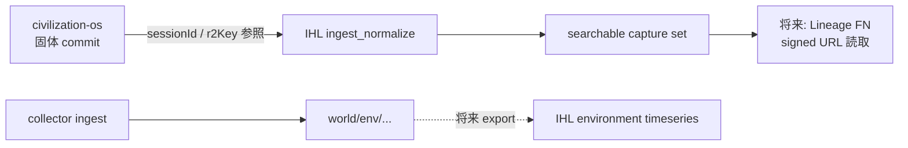

# 05 観測 — 機能要件定義（たたき台・非正本）

> **Changelog**: 2026-06-26 — **観測 ver1 COMPLETE**（ユーザー宣言 · 手動 UI 打鍵完了）— 要件・詳細設計・ADR-H-28〜36 を実装同期 · §「v1 完成サマリー」参照  
> **Changelog**: 2026-06-21 — **§4.16 OBS-RX-* v1.0 要件確定**（ユーザー明示承認 · DELEGATED-DESIGN-GO + DELEGATED-TEST-DESIGN-GO）· IMPL-GO 未付与  
> **Changelog**: 2026-06-21 — **§4.17 次回観測スケジュール**追加 · OBS-FUP-09/11 · OBS-TPL-22/23 · OBS-RX-UX-10/11 — **60 日固定 nudge 廃止** → 入力時 `next_observation_at` + テンプレ stage 間隔 + ホーム「今日の要約」通知（ver1 バナーのみ）  
> **Changelog**: 2026-06-21 — **§4.16 OBS-RX-* 追加**（UX×研究データ品質統合要件）· §4.14 MVP 境界修正（env IoT フル vs commit 宣言分離）· ADR-H-33 §15 矛盾解消  
> **Changelog**: 2026-06-21 — Phase6 打鍵フィードバック反映（/observation/input, /confirm）: テンプレ種族束縛・発育フェーズ候補・計測行 DD「追加」・撮影条件構造化・confirm からテンプレ保存（§4.9 追補）  
> **Changelog**: 2026-06-18 — 追加仕様反映: MVP v1 スコープ境界（§4.14）· 個体連携 OBS-IND-01〜05（§4.12）· QR コード OBS-QR-01〜05 · **ユーザー確定**: #06/#10/#11 v1 OUT  （§4.13）  
> **完成度**: **ver1 COMPLETE**（2026-06-26 ユーザー宣言 · IHL `apps/web` + `apps/api` 手動打鍵済）— 要件 §4.14〜§4.18 · 詳細設計 v2 · UI v2 · テスト設計 v2 と実装同期済。**ver2 延期**は §4.14「Phase 2 以降」および下記 **v1 完成サマリー · ver2 既知延期** を正とする。

> **設計（草案・人間レビュー待ち）**: 観測「入力」UI + **テンプレ一覧/詳細 LIST/DETAIL** は **§4.9 OBS-TPL-01〜17** で要件化済。詳細=[ADR-H-13](../02-設計/_横断/adr/ADR-H-13-観測計測テンプレ契約.md) · 入力 UI=[`05-観測-入力UI設計-v1.md`](../02-設計/features/05-観測/ui/入力UI設計-v1.md) · テンプレ UI=[`05-観測-計測テンプレ-UI設計-v1.md`](../02-設計/features/05-観測-計測テンプレ/ui/UI設計-v1.md) · 遷移=[入力](../02-設計/features/05-観測/05-観測-入力-遷移設計-v1.md)/[テンプレ](../02-設計/features/05-観測/05-観測-計測テンプレ-遷移設計-v1.md) · 辞書=[`measurement_name.yaml`](../02-設計/_横断/schema/schemas/dictionaries/measurement_name.yaml)・[`measurement_method.yaml`](../02-設計/_横断/schema/schemas/dictionaries/measurement_method.yaml)。

> **観測コンテキスト（2026-06-09 追加）**: 種族 + 発育段階を 1 度決めて 05i/05a/05tl に引き継ぐ **WorkflowContext** を **§4.10 OBS-CTX-01〜03** で要件化。契約=[ADR-H-15](../02-設計/_横断/adr/ADR-H-15-観測コンテキスト.md)（[ADR-H-14](../02-設計/_横断/adr/ADR-H-14-グローバル文脈バー.md) 拡張）· ピッカー UI=[`../../02-設計/features/05-観測/ui/コンテキスト.md`](../02-設計/features/05-観測/ui/コンテキスト.md)。**コンテキストは既定値（プリフィル）のみ・taxonomy 確定は常にユーザー**（OBS-SOL-04 · OBS-TAX-07）。

> **観測対象ナビゲータ（2026-06-09 追加）**: 観測は **昆虫専用ではない**（生物・器物・デジタル・環境・カスタム）。観測対象を `ObservationTarget`（domain + 分類パス + ランク + 表示名 + 構造化タグ）として **文字のみ**で選ぶナビゲータを **§4.11 OBS-TGT-01〜10** で要件化。契約=[ADR-H-16](../02-設計/_横断/adr/ADR-H-16-観測対象ナビゲータ.md)。**生物は亜種まで（不可なら「亜種未区別（種まで）」明示）**・**確定は常にユーザー**。H-15 は伝播・H-16 は対象選択（混同禁止）。

> **用途**: 人間レビュー・設計 AI 引き継ぎ用。  
> **非正本**: 採用・実装判断は `docs/REQUIREMENTS.md`・`rag/accepted_requirements.csv`・`civilization/ProjectRules.md` を優先。  
> **作成日**: 2026-06-07  
> **根拠**: `01-要件/_横断/FEATURE-REQUIREMENTS-INVENTORY.md` §5、`指示/it-hercules-laboratory/99-アーカイブ/2026.06-06-legacy/*`、`design/phases/Phase1_固体観測.md`、`docs/heracules-observation-rag-twin-promo-pack.md`、`docs/civilization-total-observation-driver-roadmap.md`

---

## v1 完成サマリー（2026-06-07 スコープ凍結 · 2026-06-26 実装同期）

> **ユーザー宣言**: 観測システム **ver1 は COMPLETE**。以下は **実装正本**（`apps/web` · `apps/api` · `libs/ihl`）に基づく同期メモ。  
> **段階リリース（ver1〜4+ · ユーザー向け正本）**: [`02-設計/_横断/IHL-段階リリース計画-ver1-4+.md`](../02-設計/_横断/IHL-段階リリース計画-ver1-4+.md)  
> **横展開・旧 Phase 詳細**: [`02-設計/_横断/観測v1完了-横展開と段階計画.md`](../02-設計/_横断/観測v1完了-横展開と段階計画.md)

### 入力 UI（`/observation/input`）

| 塊 | data-testid / 実装 | 内容 |
|----|-------------------|------|
| 文脈・命名・環境・次回 | 既存 Card 群 | フェーズ/性別 · 計測テンプレ · 個体命名 · **環境・設置**（Placement · `devices[]` role · 設置開始日のみ）· **次回観測日** |
| **観測個体データ** | `obs-chunk-individual-data` | `StructuredRow` `group=measurement` · 一括取得 · **写真なし時のみ** □環境スナップショット同梱 + `env_snapshot` 行 |
| **写真追加** | `obs-chunk-photo-add` | カメラ modal / ファイル選択 · preview（**色補正なし**） |
| **写真撮影時 環境データ** | `obs-chunk-photo-env`（`hasPhoto` 時） | `photo_conditions[]` のみ — **`environment_snapshot` は commit しない**（B モデル） |

**撮影条件 IoT 規則（OBS-RX-ROW-11）**: `照明` = **手入力のみ** · `照度レベル` = SwitchBot `light_level`（離散 level · lux ではない）· 取得は `POST /api/v1/devices/{id}/sync`（行単位）。

**環境点（B モデル · ADR-H-36）**: `environment_snapshot` と `photo_conditions` **分離**。写真あり時は `clearEnvSnapshotFromDraft` で snapshot 除去。ingest 取得は `GET /api/env/devices/{id}/latest`（`light_level` 含む · **サーバ secret による snapshot 正本取得は禁止** · ADR-H-30）。

### commit 契約（binding moment）

- **`POST /api/solid-observation/commit`** — `placement_id` · `devices[]` · `rows[]`（各行 `device_id` · `source`）· `photo_conditions[]` · 任意 `environment_snapshot` · `prior_capture_id` · `entry_mode` · `next_observation_at` / `skip_next_observation`
- **派生**: `libs/ihl/observation/derive_bindings.py` — Occupancy + DeviceBinding INSERT（`trigger_capture_id`）
- **スケジュール**: `write_observation_schedule` — `observation_schedule.scheduled` イベント

### 環境 IoT（#13 連携 · v1 運用）

| 経路 | API / モジュール |
|------|------------------|
| Tier B ingest 最新 | `GET /api/env/devices/{device_id}/latest` — `libs/ihl/env/env_telemetry.py` |
| SwitchBot Hub CSV | `POST /api/env/import/device-csv`（別名 `…/switchbot-csv`）— `libs/ihl/env/csv_import.py` |
| 行 IoT 手動取得 | `POST /api/v1/devices/{id}/sync` — `libs/switchbot_client.py`（**dev 環境資格情報のみ** · 本番 snapshot 正本にしない） |
| 機器一覧 | `GET /api/v1/devices` — local registry + cloud マージ（secret 非露出） |

**CSV v1 保存列**: 温度 · 湿度 · `light_level`。**保存しない**: `DPT` · `VPD` · Abs Humidity（ADR-H-31/35）。

### 下書き・開発起動

| ID | 内容 | 実装 |
|----|------|------|
| OBS-RX-DRAFT-01 | 入力 draft は **sessionStorage** · 写真 data URL は **タブ内メモリ**（quota 回避） | `apps/web/src/lib/observation-draft.ts` — `slimDraftForSessionStorage` · `inMemoryPhotoCache` |
| OBS-RX-DEV-01 | ローカル開発起動 | IHL ルート `dev-up.cmd` → `scripts/dev-up.ps1`（hybrid: Docker API :8000 + Next :3000）· civ-os ルート `scripts/dev-up.bat` からも可 |

### ver2 既知延期（v1 COMPLETE 後のバックログ）

> **実装 GO 判定**: 下表の ver2 項目を個別に着手する前は、[`02-設計/_横断/観測v1完了-横展開と段階計画.md`](../02-設計/_横断/観測v1完了-横展開と段階計画.md) の **§4.5 Phase 着手前チェックリスト** および **§4.4 Phase 1 必須差分設計成果物**（Phase 1 項目）· **§4.6 Phase 2 必須差分設計成果物**（検索・詳細 polish 項目）を満たすこと。REQ ID と「ver2」ラベルのみでは **実装 GO にならない**（監査 23d5b8ea · 02f61dbb）。

> **検索詳細の可変項目（Phase 2 設計前提 · 監査 02f61dbb）**: `/observation` 検索および `/observation/:capture_id` 詳細での **テンプレ可変計測（1〜100 行）**・`devices` / `photo_conditions` / `environment_snapshot` の **存在ベース動的セクション**・snapshot vs 時系列グラフの **条件付きウィジェット**は、ver1 では固定列サマリーのみ（[`Phase6-打鍵フィードバック-v1.md`](../02-設計/Phase6-打鍵フィードバック-v1.md) §4.6）。Phase 2 着手前に横断計画 **§4.6** の 5 差分設計成果物（UI v2 · 検索状態機械 · 詳細 API 縦持ち契約 · ウィジェット境界 · reanalysis-manifest route）を v1.0 昇格すること。詳細は **Truth 縦持ち `measurements[]`**、検索グリッドは **`searchable_capture_set` 横投影** — 相互代替禁止。

| 項目 | 正本 |
|------|------|
| 観測 **検索詳細 UI** polish（Streamlit 5 pane 相当 · 類似 rerank 本番導線） | §4.14 · OBS-IMG-04/05 |
| **`clientContentDigest`** canonical SHA-256 on commit | OBS-RX-REP-05 · 実装未配線 |
| confirm **binding 差分サマリー**（device A→B 警告 · OBS-RX-UX-08） | 設置サマリーのみ実装 · 差分表示は ver2 |
| 計測行 IoT **必須**化 | OBS-INPUT-06/07 · ver2 OUT |
| BPCMS strict · Vision/DINOv2 · market fork · ネイティブ QR push | §4.14 Phase 2 |
| IHL サーバ secret **常時 poll** | ADR-H-30 · ver1 OUT |

---

> **IHL 読み替え（2026-06-07）**: 本文の「stays in civilization-os」は **IHL rebuild（legacy = salvage 参照）** と読む。正本: [README マスターノート](./README.md) · [06-リポジトリ戦略](../05-運用/_横断/リポジトリ戦略-legacyとIHL.md)

## ① 機能概要

観測は文明 OS の中心 Input である。ユーザーが固体標本・環境・デジタル記録を **観測セッション**として残し、R2 文明史に INSERT し、RAG・Twin・市場・研究レイクへ接続する。

現行 `civilization-os` では固体観測（`/observation/solid`）、環境 IoT（SwitchBot・Placement・collector）、デジタル観測入口（`/observation/digital`）、履歴・再現性（スケールシート・bundle・BPCMS）が **部分実装** されている。理想の「全対象・全 Driver・査読級再現性」は REQ-021/023/025/026 が active で、**IT Hercules Laboratory（IHL）** 側は個体画像レイク（ingest・embedding・manifest 検索）を **新 repo で in-scope** として担う。

種・亜種・個体ラベルの **確定は常にユーザー** とし、GBIF / Wikidata / AI 候補は根拠提示にとどめる（`Phase1_固体観測.md`・REQ-025）。

---

> **IHL 読み替え（2026-06-07）**: 本文の「stays in civilization-os」は **IHL rebuild（legacy = salvage 参照）** と読む。正本: [README マスターノート](./README.md) · [06-リポジトリ戦略](../05-運用/_横断/リポジトリ戦略-legacyとIHL.md)

## ② ユーザーができること

| 経路 | できること（現行・たたき台） |
|------|------------------------------|
| **観測ホーム** (`/observation`) | 固体・環境・デジタル・履歴への分岐。主要導線の説明 |
| **固体観測** (`/observation/solid`) | 写真アップロード／QR／手動 taxonomy、LabelMe 計測、種候補（Vision・GBIF）、タグ、環境スナップショット付き commit |
| **環境 IoT** | SwitchBot 手動取り込み・定期 poller・`env-samples` 時系列、Placement（棚・QR）・DeviceBinding・collector 署名 ingest |
| **デジタル観測** (`/observation/digital`) | ScreenDef 系の記録・分類入口のハブ（固体と併記） |
| **再現性・bundle** | 観測プロファイル bundle の貼り付け／ファイル取り込み、スケールシート JSON・印刷プレビュー、reanalysis manifest |
| **履歴・RAG** | 直近セッション一覧、観測メモの RAG チャンク（`observation_note.csv`） |
| **IHL（将来・別 repo）** | raw 画像登録、metadata／embedding 検索、個体単位の類似画像探索、tag event・usage log の append-only 記録 |

---

> **IHL 読み替え（2026-06-07）**: 本文の「stays in civilization-os」は **IHL rebuild（legacy = salvage 参照）** と読む。正本: [README マスターノート](./README.md) · [06-リポジトリ戦略](../05-運用/_横断/リポジトリ戦略-legacyとIHL.md)

## ③ スコープ内 / スコープ外

### スコープ内（本機能 #5 として扱う）

- 固体観測フロー全体（写真〜commit〜R2 セッション JSON）
- 環境データの観測時点スナップショット（手入力・SwitchBot・collector）
- デジタル観測入口と Kernel 経由の動的記録導線
- taxonomy 候補提示とユーザー確定、タグ（user / ai / merged）
- R2 **INSERT ONLY** キー規約・セッション索引・env-samples
- 観測再現性（スケールシート・BPCMS 参照・bundle・manifest）
- 全観測 taxonomy / Driver の **要件定義**（実装の一部は active backlog）

### スコープ外（別機能・別 repo・人間ゲート）

| 項目 | 扱い |
|------|------|
| Twin 台本・動画投稿の本番公開 | REQ-025／human gate（広報は素材候補まで） |
| マーケット listing 本体 | #6 マーケット（観測 bundle の市場自動 fork は未完了） |
| 血統 FeatureNode 本体 | FN-Lineage（IHL manifest を consumer しうる） |
| 常駐 DB を正本にする設計 | 憲法・IHL 双方で禁止 |
| BLE / WebHID 温度直結 | ADR 非目標（`ADR-p0-d2-ble-webhid-temperature-non-goal.md`） |
| IHL Phase 1 の Streamlit 検索 UI 実装 | **IHL repo**（civilization-os は consumer 導線のみ） |
| 査読級 BPCMS strict 完全準拠 | REQ-021 Phase 4 以降・論文利用は別検証 |

---

> **IHL 読み替え（2026-06-07）**: 本文の「stays in civilization-os」は **IHL rebuild（legacy = salvage 参照）** と読む。正本: [README マスターノート](./README.md) · [06-リポジトリ戦略](../05-運用/_横断/リポジトリ戦略-legacyとIHL.md)

## ④ 機能要件（番号付き）

### 4.1 固体観測（civilization-os · P0 コア）

| ID | 要件 | 受入の目安 | 正本 |
|----|------|------------|------|
| OBS-SOL-01 | ルート `/observation/solid` で写真〜commit の一連フロー | E2E `p0-d6-solid-critical-path.spec.ts` 緑 | `Phase1_固体観測.md` |
| OBS-SOL-02 | R2 キー `world/observation/solid/{userId}/images\|sessions\|index.json` | `solidImageKey` / `solidSessionKey` と一字一句一致 | 同上 §R2 |
| OBS-SOL-03 | `POST /api/solid-observation/commit` 契約（必須 `sessionId`, `r2Key`、任意 `labelme`, `taxonomy`, `environmentSnapshot` 等） | OpenAPI・Vitest と整合 | 同上 §commit |
| OBS-SOL-04 | 種・亜種は **ユーザー確定のみ**（OS 自動確定禁止） | propose-species は候補、commit は draft 確定値 | Phase1・REQ-025 §7.3 |
| OBS-SOL-05 | LabelMe 互換計測・mm 換算・テンプレ ScreenDef ガイド | `docs/solid-labelme-shapes-commit-map.md` | REQ-011 |
| OBS-SOL-06 | 撮影条件の併記・**色補正しない**表示 | `ui-reference/preferences.md` §C | REQ-025 AUTO-W2-132 |
| OBS-SOL-07 | `entryMode`（`photo_ai` / `manual_taxonomy` / `qr` / `device_api` 等）の記録 | セッション JSON に保持 | Phase1 §commit |
| OBS-SOL-08 | `priorSessionId` によるセッション連鎖 | 自参照・他人セッションは拒否 | Phase1 §commit |

### 4.2 環境 IoT（civilization-os · Placement / SwitchBot / collector）

| ID | 要件 | 受入の目安 | 正本 |
|----|------|------------|------|
| OBS-ENV-01 | `SolidEnvironmentSnapshot`（`capturedAt` 必須、SwitchBot・manual 任意）を commit に載せられる | 型は `solidObservationLogic.ts` 正本 | Phase1 §環境データ |
| OBS-ENV-02 | SwitchBot poller → R2 `env-samples/{YYYY-MM-DD}/{sampleId}.json` + index | precheck 5 分類・秘密値非表示 | REQ-025 §3.2、`solid-switchbot-operating-checklist.md` |
| OBS-ENV-03 | Placement / DeviceBinding / Occupancy / TelemetryIngest（`world/env/...` INSERT ONLY） | ADR キー案とイベント種別 | `ADR-env-placement-device-binding.md` |
| OBS-ENV-04 | ローカル collector（Ed25519 署名）→ `POST /api/env/collector/ingest` | 秘密は `collector/.env` のみ | REQ-027 |
| OBS-ENV-05 | セッション任意参照 `placementId` / `occupancyId` / `roleTemplateId` | 計測値は snapshot、棚属性は R2 参照 | ADR §SolidEnvironmentSnapshot |
| OBS-ENV-06 | 手入力温度の `provenance`（source / confidence / methodTag）で SwitchBot と区別 | `evidenceMode: no_photo` 等と併用可 | REQ-025 追補 |

**v1 運用凍結（2026-06-21 · 実装同期 2026-06-26）**: SwitchBot / env IoT の取得は [`ADR-H-30`](../02-設計/_横断/adr/ADR-H-30-SwitchBot-秘密非保持-v1-DRAFT.md) §10 — **(1) ユーザー PC Docker 定期 poll** + **(2) たまに Export→Import**（[`ADR-H-31`](../02-設計/_横断/adr/ADR-H-31-SwitchBot-Import-API-v1-DRAFT.md)）。IHL サーバ secret poll は却下。**個体がどの期間どの温度計下にいたか**は Placement **Occupancy**（`subjectRef`）+ **DeviceBinding** で記録（[`ADR-H-32`](../02-設計/_横断/adr/ADR-H-32-生体-デバイス-期間-紐づけ-v1-DRAFT.md) · `ADR-env-placement-device-binding.md`）。**UX 主経路**は観測 commit 時の **デバイス宣言 → 区間自動派生**（[`ADR-H-33`](../02-設計/_横断/adr/ADR-H-33-観測追記-デバイス紐づけ-v1-DRAFT.md)）— **`derive_bindings_from_observation` 実装済**（`libs/ihl/observation/derive_bindings.py`）。

**IHL との接続（将来）**: 環境時系列は IHL `environment timeseries` schema（`指示/it-hercules-laboratory/99-アーカイブ/2026.06-06-legacy/詳細設計書`）へ **エクスポート／参照 ID 連携** を設計する。Phase 1 IHL では本格統合は任意、ディレクトリ・schema は壊さない。

### 4.3 デジタル観測（civilization-os · Kernel / ScreenDef 経路）

| ID | 要件 | 受入の目安 | 正本 |
|----|------|------------|------|
| OBS-DIG-01 | 観測ホームから固体・デジタル・環境を **分離表示**（3〜5 チャンク） | `ObservationHubPage.tsx` | REQ-024 UX |
| OBS-DIG-02 | `/observation/digital` で ScreenDef 系の記録・分類入口を束ねる | `ObservationDigitalHubPage.tsx` | `DIGITAL_OBSERVATION_ROUTE` |
| OBS-DIG-03 | デジタル経路の観測記録リスト・空状態・エラー表示 | 未実装/WIP 文言禁止 | `no-user-facing-unimplemented` ルール |
| OBS-DIG-04 | Kernel UUID ルーティング（画面単位設計禁止） | FeatureNode `observation` 配下 | `WorldSystem.md` |

デジタル観測は **固体の代替ではない**。固体が写真・計測・R2 セッション正本、デジタルは動的フォーム／テンプレ記録の入口である。

### 4.4 R2 append-only（共有 · civilization-os + IHL）

| ID | 要件 | civilization-os | IHL（`指示/it-hercules-laboratory/99-アーカイブ/2026.06-06-legacy`） |
|----|------|-----------------|---------------------------|
| OBS-R2-01 | 永続正本は R2 のみ。UPDATE/DELETE 禁止 | `world/observation/solid/...`・`world/env/...` | `raw/` `normalized/` `derived/` `manifests/` `runs/` |
| OBS-R2-02 | 修正は新規レコード／新 snapshot で表現 | 新 sessionId・新 env-sample・新 binding event | 新 run_id・新 snapshot_id |
| OBS-R2-03 | 同一キー再 put 拒否（no-overwrite） | 実装・テストで担保 | Phase 0 受入基準（`00-AI-HANDOFF-BRIEF.md` §11） |
| OBS-R2-04 | 派生成果物に run id / schema version / input hash / provenance | commit digest・Vision backend 設定 | 全 component の `run_info.json` + `output_manifest.parquet` |
| OBS-R2-05 | 索引は追記型（`index.json` 末尾追記等） | solid `index.json`・`env-samples-index.json` | `manifests/latest/` pointer 方式（D-01 未決） |

**責務分離（たたき台）**

```text
civilization-os R2 ツリー     … 観測セッション・環境スナップショット・文明史イベント（INSERT）
IHL R2 ツリー（別バケット案） … 個体画像レイク・Parquet manifest・embedding・tag/usage JSONL
```

IHL dev バケット **`it-hercules-laboratory-dev`**（H-03=A · 2026-06-07 · [ADR-H-03](../02-設計/_横断/adr/ADR-H-03-r2-bucket-dedicated.md)）。legacy `civilization-world` は移行しない。キー相互参照は **capture id / session id / individual id** マッピング（`docs/migration/from-civilization-os.md`）。

### 4.5 taxonomy（候補と確定の分離）

| ID | 要件 | 受入の目安 | 正本 |
|----|------|------------|------|
| OBS-TAX-01 | `TaxonomyCandidate` と `UserConfirmedTaxonomy` の型分離 | TOT-OBS-01 backlog | REQ-026 §3.2 |
| OBS-TAX-02 | GBIF Driver：生物名・taxonKey 候補（確定値に混ぜない） | `gbifClient`・固体 UI | total-observation-roadmap §3.1 |
| OBS-TAX-03 | Wikidata Driver：汎用物体・QID 候補（draft） | TOT-OBS-02 | 同上 |
| OBS-TAX-04 | Local R2 Catalog：飼育・個体・ユーザー世界の正本行 | 固体 `solidUserSpeciesCatalog` | 同上 |
| OBS-TAX-05 | Question Kernel：Akinator 的絞り込み（確定しない） | TOT-OBS-03 | 同上 |
| OBS-TAX-06 | 表示 alias `Heracules hercules` / 正規 `Dynastes hercules` の二重管理 | UI・RAG・Twin で混同禁止 | REQ-025 §7.3 |
| OBS-TAX-07 | 外部 ID は候補根拠として保存、commit taxonomy は user confirmed のみ | セッション JSON 検査 | Phase1・promo-pack |

**IHL in-scope**: searchable capture set の `species`・`lineage_id`・`stage_name` 列と辞書 enum（`指示/it-hercules-laboratory/99-アーカイブ/2026.06-06-legacy/詳細設計書`）を **taxonomy の研究用正本** とする。civilization-os の固体セッションは **観測イベント**、IHL individual master は **個体の採用解釈（latest snapshot）**。

### 4.6 bundle / 再現性（BPCMS・スケールシート・manifest）

| ID | 要件 | 状態 | 正本 |
|----|------|------|------|
| OBS-REP-01 | 参照規格 BPCMS・甲虫色彩計測（人手・機材義務含む） | active（strict 完全準拠は Phase 4+） | `指示/2026.3.30/`、REQ-021 |
| OBS-REP-02 | `scale-sheet-template-v1.schema.json` + 印刷 SVG 単一レンダラ | データ層・印刷は実装済み | `observation-reproducibility-roadmap.md` |
| OBS-REP-03 | `observationProfile` / 撮影プロファイル（幾何 vs BPCMS ラボ） | Phase 2 roadmap | 同上 |
| OBS-REP-04 | **bundle v1** 許可フィールドの貼り付け・ファイル取り込み → commit 反映 | **implemented**（REQ-022） | `observation-profile-bundle-req-022.md` |
| OBS-REP-05 | `GET .../reanalysis-manifest`・再解析手順の文書化 | 実装済み | `observation-solid-reanalysis-manifest.md` |
| OBS-REP-06 | 市場 → bundle **完全自動** fork | **未完了**（手動正本） | `observation-market-bundle-fork-map.md`、REQ-023 残 |
| OBS-REP-07 | ScreenDef `content[]` と観測紙 JSON の同一キャンバス統合 | backlog | REQ-023 |
| OBS-REP-08 | `clientContentDigest`（canonical SHA-256）で再現性トレース | commit ボディ | Phase1 §commit |

**IHL in-scope（再現性の研究レイク側）**

| ID | 要件 | 根拠 |
|----|------|------|
| OBS-REP-IHL-01 | 全派生に `run_id`・`model_name`・`model_version`・`input_hash` | `指示/it-hercules-laboratory/99-アーカイブ/2026.06-06-legacy/要件定義1` §9.2 |
| OBS-REP-IHL-02 | `value_origin`（direct_observed / image_derived / environment_derived / estimated 等）で混同禁止 | 詳細設計書・辞書 enum |
| OBS-REP-IHL-03 | embedding モデル変更時は旧 run 残存＋新 snapshot 採用 | append-only 運用例 §8 |
| OBS-REP-IHL-04 | QC（blur・exposure・scale visible）を searchable capture set に join | Phase 1 任意 component |

### 4.7 タグ・RAG・Driver（横断）

| ID | 要件 | 正本 |
|----|------|------|
| OBS-TAG-01 | タグは append-only イベント（invert / review_needed 可） | IHL tag event JSONL；civilization-os は `ai_tags` / `user_tags` / `merged_tags` |
| OBS-RAG-01 | R2 セッション JSON が正本、RAG は短文チャンク | `rag/observation_note.csv`、promo-pack §5 |
| OBS-RAG-02 | チャンクに種・日時・環境・観測方法・未確定点を含める | promo-pack §5.2 |
| OBS-DRV-01 | SwitchBot / n8n / device API は C-USB Driver IR の adapter 対象（draft→承認） | REQ-026 §4、REQ-030 |

### 4.8 写真解析・embedding（IHL in-scope · #18 連携）

| ID | 要件 | civilization-os | IHL |
|----|------|-----------------|-----|
| OBS-IMG-01 | Vision 種候補（openai / http / both） | `solid-vision-backends.md` | — |
| OBS-IMG-02 | thumbnail 生成（長辺 512px 等） | sharp（固体アップロード） | thumbnail_builder component |
| OBS-IMG-03 | DINOv2 embedding + L2 normalize | — | embedding_builder_dinov2 |
| OBS-IMG-04 | metadata 絞り込み → subset cosine 類似検索 | — | Streamlit search UI Phase 1 |
| OBS-IMG-05 | 類似スコア rerank（embedding + color + size + lineage） | 固体は LabelMe/mm | [ADR-H-12](../02-設計/_横断/adr/ADR-H-12-D02-類似検索重み.md)（v0 暫定 0.50/0.20/0.20/0.10） |

### 4.9 計測テンプレ・入力 UI（OBS-TPL · IHL core · 監査班 D 対応）

> **追記 2026-06-08**: 監査班 D **FAIL**（計測「入力」UI・雌雄テンプレ・Fork 未定義）への要件化。詳細契約は [ADR-H-13](../02-設計/_横断/adr/ADR-H-13-観測計測テンプレ契約.md)、UI/遷移は [`05-観測-入力UI設計-v1.md`](../02-設計/features/05-観測/ui/入力UI設計-v1.md)・[`05-観測-入力-遷移設計-v1.md`](../02-設計/features/05-観測/05-観測-入力-遷移設計-v1.md)、辞書は [`measurement_name.yaml`](../02-設計/_横断/schema/schemas/dictionaries/measurement_name.yaml)・[`measurement_method.yaml`](../02-設計/_横断/schema/schemas/dictionaries/measurement_method.yaml)。

**雌雄ユーザー追加項目（OBS-TPL-01〜04）**

| ID | 要件 | 受入の目安 | 正本 |
|----|------|------------|------|
| OBS-TPL-01 | 観測に性別（`sex`）に応じた項目セットを切替えて記録できる | 性別トグルで既定表示が変化 | `measurement_name.yaml` `sex_visibility_rule` |
| OBS-TPL-02 | `sex=male` で角長/体長/胸幅、`sex=female` で体長/胸幅（角長は既定非表示） | 雄/雌モック 2 枚 | 同 `applicable_sex` |
| OBS-TPL-03 | 項目名（`measurement_name`）を候補選択 or 自由入力で追加 | 「＋ 自由入力」導線 | ADR-H-13 §5 |
| OBS-TPL-04 | 追加項目は `measurement`（縦持ち）行として IHL R2 に保存（INSERT ONLY） | 1 項目=1 行 | ADR-H-13 §4 |

**計測方法・機器導線（OBS-TPL-05〜09）**

| ID | 要件 | 受入の目安 | 正本 |
|----|------|------------|------|
| OBS-TPL-05 | 計測方法を `手入力 / IoT取得` 等から選べる | 計測方法 DD | `measurement_method.yaml` |
| OBS-TPL-06 | 計測方法 → `value_origin` の既定写像（保存時確定） | direct/image/environment_derived | ADR-H-13 §3 |
| OBS-TPL-07 | 単位を候補選択 or 自由入力で指定（`unit_default` 初期） | 単位 DD + 「＋ 追加」 | `measurement_name.unit_default` |
| OBS-TPL-08 | IoT 選択かつ機器未登録時に「機器管理へ」誘導 | 注意バナー + 大ボタン | `ihl-05-obs-device-link.png` · `device_route` |
| OBS-TPL-09 | 数値は `value_type`（numeric/categorical/boolean/text）で入力種別が変化 | text は単位非表示・boolean はトグル | `value_type_to_input` |

**テンプレ作成・Fork（OBS-TPL-10〜15 · ADR-H-04 §7 Template Platform）**

| ID | 要件 | 受入の目安 | 正本 |
|----|------|------------|------|
| OBS-TPL-10 | テンプレート作成（名前・説明・項目リスト） | 作成フォーム | ADR-H-13 §2 D2 |
| OBS-TPL-11 | 既存テンプレを fork してカスタマイズ（`TemplateForkEvent` INSERT） | parent→child | ADR-H-04 §7 |
| OBS-TPL-12 | テンプレに項目リスト（`measurement_name` + unit + method）を設定 | 項目行編集 | ADR-H-13 §2 |
| OBS-TPL-13 | テンプレ選択でその項目フォームが入力フローに自動展開 | 雄/雌 標準計測 | 遷移 §1 |
| OBS-TPL-14 | テンプレ使用時に `TemplateUsageEvent` を記録 | usage INSERT | ADR-H-04 §7 |
| OBS-TPL-15 | テンプレに公開 / 自分のみ の可視性（Phase 3 Marketplace 先行設計） | 可視性フラグ | ADR-H-04 §7 |
| OBS-TPL-16 | **計測テンプレ一覧 LIST 画面** — 公開/自分/フォーク済フィルタ・カードグリッド | `/observation/templates` · mock 仕様 `ihl-05-obs-template-list.png`（PNG 未生成） | [`05-観測-計測テンプレ-UI設計-v1.md`](../02-設計/features/05-観測-計測テンプレ/ui/UI設計-v1.md) §2 |
| OBS-TPL-17 | **計測テンプレ詳細 DETAIL 画面** — 項目リスト閲覧 · 記録/Fork/編集 | `/observation/templates/:id` · mock 仕様 `ihl-05-obs-template-detail.png`（PNG 未生成） | 同 UI 設計 §3 · [遷移 v1](../02-設計/features/05-観測/05-観測-計測テンプレ-遷移設計-v1.md) |
| OBS-TPL-18 | **confirm 画面で「今回入力をテンプレ保存」**を実行できる（都度再入力を回避） | `/observation/input/confirm` に「テンプレとして保存」CTA。保存後に `template_id` を返却して次回 DD で選択可能 | Phase6 打鍵FB 2026-06-21 |
| OBS-TPL-19 | テンプレは **種族/分類スコープ（`target_scope`）に束縛**し、入力時に対象と不一致なら警告する | `Dynastes hercules hercules` などの対象でテンプレ候補が絞られる | OBS-TGT-07・ADR-H-16 §6 |
| OBS-TPL-20 | 公開テンプレは **community fork** で派生できる（親子系譜と作者を保持） | `TemplateForkEvent` に parent/child/author が残る。共有配布は ver2 で有効化 | ADR-H-04 §7 |
| OBS-TPL-21 | テンプレ・タグの **投票/自然淘汰（ランキング更新）** は governance イベントで扱う | `vote_event` と連携した採用/非推奨フラグを持つ（ver2） | `20-投票-プラチナコイン-自然淘汰.md` |
| OBS-TPL-22 | 計測テンプレに **次回観測の既定間隔**を登録できる — 単一 `default_follow_up_interval` または **stage 別** `follow_up_intervals_by_stage` | テンプレ編集 UI · JSON schema 検証 · ユーザー固有ルーティンをテンプレに保存 | **ver1 IN** · §4.17 |
| OBS-TPL-23 | 観測入力でテンプレ選択 + **現在 stage が一致**するとき、`next_observation_at` を **テンプレ間隔でプリフィル**（ユーザー上書き可） | 初令→二令=1 ヶ月等 · `source=template_default` で commit | **ver1 IN** · OBS-FUP-09 |

> **3 クリック以内**（OBS-NF-03）: テンプレ選択 → 値入力 → 保存 / Fork は 詳細 → 複製 → 保存（3 クリック）。**一覧 LIST + 詳細 DETAIL** は管理・Fork 専用；日常記録は入力画面の DD + 「一覧で管理」リンク（[遷移 v1](../02-設計/features/05-観測/05-観測-計測テンプレ-遷移設計-v1.md) §4）。性別変更はデータ非破壊の **表示分岐**（ADR-H-13 §D6）。

### 4.9.1 Phase6 打鍵フィードバック追補（2026-06-21）

> **対象**: `/observation/input`・`/observation/input/confirm` のキーボード打鍵フィードバック。  
> **方針**: 既存 OBS-TPL を補強し、入力固有の不足は `OBS-INPUT-*` / `OBS-PHOTO-*` で追記する。

| ID | 要件 | 受入の目安 | ver |
|----|------|------------|-----|
| OBS-INPUT-01 | 発育フェーズ候補を **初令 / 2令 / 3令初期 / 3令後期 / 前蛹 / 蛹 / 生体** から選択できる | DD で全候補が表示され、`stage_name` + `larva_subtype` + 任意 `phase_label` に正規化保存 | **ver1 IN** |
| OBS-INPUT-02 | 性別は **任意入力**（unknown 既定）で、判明時に後から設定できる | 未入力でも保存可能・既存 OBS-TPL-01/02 の表示分岐が動く | **ver1 IN** |
| OBS-INPUT-03 | 計測行 DD の末尾に **「追加」**を固定表示し、行内で新規行を即時追加できる | DD 最下段に `追加`。選択で新行が挿入される | **ver1 IN** |
| OBS-INPUT-04 | 項目（`measurement_name`）を入力画面から新規追加できる（テンプレ未登録項目を阻害しない） | 「項目を追加」で自由入力項目が `measurement` 行として保存される | **ver1 IN** |
| OBS-INPUT-05 | 単位（`measurement_unit`）を入力画面から新規追加できる | 単位 DD + 「追加」導線。保存値に新規 unit が残る | **ver1 IN** |
| OBS-INPUT-06 | `IoT取得` 選択時は **実デバイス選択**を必須化し、未登録なら機器管理へ遷移できる | デバイス未選択で保存不可。`機器を追加/管理` 導線で遷移 | **ver2 OUT**（2026-06-07 方針整合） |
| OBS-INPUT-07 | 定期取得（温湿度）有効時は **取得元デバイス**を選択できる | polling source の device_id を選択して保存できる | **ver2 OUT**（2026-06-07 方針整合） |
| OBS-PHOTO-01 | 撮影条件は自由テキスト単一欄でなく、**計測行と同様の構造化行**（項目DD+値+単位+追加）で入力できる | 例: 照明/角度/背景/露出を行追加で管理。RAG へ構造化出力される | **ver1 IN** |

#### 4.9.1.1 ver1 / ver2 境界（打鍵FB由来）

| フィードバック項目 | FR | 判定 |
|---|---|---|
| テンプレ種族束縛の明確化 | OBS-TPL-19 | **ver1 IN** |
| 発育フェーズ候補（初令〜生体） | OBS-INPUT-01 | **ver1 IN** |
| 性別の任意選択 | OBS-INPUT-02 | **ver1 IN** |
| 項目/単位「追加」導線 | OBS-INPUT-03〜05（+ OBS-TPL-03/07） | **ver1 IN** |
| SwitchBot 実デバイス選択・管理遷移（**計測行**） | OBS-INPUT-06 | **ver2 OUT** |
| 定期取得のデバイス選択（**計測行**） | OBS-INPUT-07 | **ver2 OUT** |
| commit 時 device 宣言・「環境・設置」チャンク | OBS-FUP-04/06/08 · OBS-RX-03 | **ver1 IN**（[ADR-H-33](../02-設計/_横断/adr/ADR-H-33-観測追記-デバイス紐づけ-v1-DRAFT.md)）— **計測行 IoT 必須（OBS-INPUT-06/07）とは分離** |
| **次回観測日**（入力時指定 · テンプレプリフィル · ホーム通知） | OBS-FUP-09/11 · OBS-TPL-22/23 · OBS-RX-UX-10/11 | **ver1 IN** · §4.17 · [ADR-H-33](../02-設計/_横断/adr/ADR-H-33-観測追記-デバイス紐づけ-v1-DRAFT.md) §5.3 |
| 撮影条件の構造化入力 | OBS-PHOTO-01 · OBS-RX-08 | **ver1 IN** |
| confirm からテンプレ保存 | OBS-TPL-18 | **ver1 IN** |
| community fork 共有 | OBS-TPL-20 | **ver2 OUT** |
| タグ投票/自然淘汰 | OBS-TPL-21 | **ver2 OUT（C-2）** |

### 4.10 観測コンテキスト（OBS-CTX · IHL core · [ADR-H-15](../02-設計/_横断/adr/ADR-H-15-観測コンテキスト.md)）

> **追記 2026-06-09**: ユーザー指摘「種・段階を観測画面ごとに選び直すのが面倒」への対応。種族 + 発育段階（+ 任意フェーズ）を **WorkflowContext** として 1 度決め、検索 05a / 入力 05i / テンプレ一覧 05tl に **クエリパラメータ** で引き継ぐ。契約は [ADR-H-15](../02-設計/_横断/adr/ADR-H-15-観測コンテキスト.md)（[ADR-H-14](../02-設計/_横断/adr/ADR-H-14-グローバル文脈バー.md) 拡張）、ピッカー UI は [`../../02-設計/features/05-観測/ui/コンテキスト.md`](../02-設計/features/05-観測/ui/コンテキスト.md)。

| ID | 要件 | 受入の目安 | 正本 |
|----|------|------------|------|
| OBS-CTX-01 | 文脈バーから **WorkflowContext（種族 + `stage_name` + 任意 `phase`）** を設定でき、05i/05a/05tl に `?species=&stage=&scope_route=` で引き継がれる | 種を設定 → 入力/検索/テンプレでプリフィルされる | ADR-H-15 §2/§5 |
| OBS-CTX-02 | コンテキストは **既定値（プリフィル）のみ**。観測の種・段階は **入力画面でユーザーが確定**し、コンテキストが自動確定しない | 種を変えても保存レコードは入力確定値（OBS-SOL-04） | ADR-H-15 §2 · OBS-TAX-07 |
| OBS-CTX-03 | 永続は **localStorage（既定）+ 任意プロフィール保存**。優先順は **URL クエリ > localStorage > profile** | リロード/別画面で保持・URL 明示が勝つ | ADR-H-15 §6 |

> **境界**: ピッカーは **全画面遷移ではなくボトムシート**（05ctx）で開き、作業（入力途中等）を失わない。種族チップは **観測ドメイン（05*）のみ**表示（ADR-H-15 §3/§4）。`stage_name` enum は §⑪.2、`larva_subtype`（L1〜L3）も同表。

### 4.11.5 MVP v1 フォーカス（OBS-MVP-*）

> **追記 2026-06-18**: ユーザーMVP要求を「初令・2令・後期幼虫段階ごとに観測継続」「土替えを親個体と紐づけて記録」「QR スキャンで前回観測から再開」の 3 ユースケースに整理。

| ID | 要件 | 受入の目安 | Wave |
|----|------|-----------|------|
| OBS-MVP-01 | 段階変化（初令→2令→後期）を `stage_name` + `larva_subtype` で時系列に記録できる | セッション一覧で段階チップが表示される | Wave 1 |
| OBS-MVP-02 | 前回セッションの `stage_name` が今回入力フォームにプリフィルされる（変更自由） | プリフィル値と今回保存値が別レコード | Wave 1 |
| OBS-MVP-03 | 「土替え」イベントを `life_event`（`event_type=substrate_change`）として個体に INSERT できる | R2 `life_event` に 1 行追記。観測セッションとは独立 | Wave 2 |
| OBS-MVP-04 | 個体詳細画面から土替えイベント一覧（日時・メモ）を参照できる | `GET /api/individuals/:id/events?type=substrate_change` | Wave 2 |

**§AI仮定（OBS-MVP）**: 土替えイベントの `event_type` 列挙値に `substrate_change` を追加（既存 `life_event` schema の `event_type` 列が enum 拡張可能な設計のため）。フロント表示名は「土替え」（日本語固定）。

---

### 4.12 親個体連携（OBS-IND · MVP core）

> **追記 2026-06-18**: ユーザー要求「初令2令後期の継続観測を親個体（sire/dam）と紐づけて管理したい」への対応。個体マスター（`individual`）を起点にセッション履歴を追える構造を定義。

| ID | 要件 | 受入の目安 | 正本 |
|----|------|-----------|------|
| OBS-IND-01 | 観測セッションを `individual_id` で特定の個体に紐づけられる。個体未登録の場合は anonymous セッションとして保存可能（任意） | セッション JSON に `individual_id` が含まれる（nullable） | IHL individual schema |
| OBS-IND-02 | 個体登録時に `sire_id`（父親）・`dam_id`（母親）を任意で設定できる | `POST /api/individuals` に `sire_id`・`dam_id` フィールド | `05-観測.md` ⑪.1 individual 列 |
| OBS-IND-03 | 個体詳細画面でその個体の観測セッション一覧を時系列降順で表示できる | `GET /api/individuals/:id/sessions` で一覧取得。空状態あり | OBS-NF-04 |
| OBS-IND-04 | 観測セッション一覧から `individual_id` でフィルタできる | フィルタ UI（個体チップ or DD）が動作する | |
| OBS-IND-05 | `sire_id`・`dam_id` から 1 世代の親個体詳細へナビゲートできる（血統グラフは Phase 2） | 「父親を見る」「母親を見る」ボタンが詳細画面にある | `00-プロダクト方針.md` FR-MVP-04 |

**§AI仮定（OBS-IND）**:
- `individual_id` の形式は `ind_{ulid}`（既存 IHL schema に合わせる）
- 血統グラフ描画は Phase 2 ADR。v1 は 1 世代親ナビのみ
- individual master の正本は IHL R2、civilization-os は `individual_id` 参照 ID のみを持つ

---

### 4.13 QR コード発行・スキャン・観測再開（OBS-QR · MVP core）

> **追記 2026-06-18**: ユーザー要求「QR コードを個体ケースに貼り、スキャンして前回観測から続きを始めたい」への対応。初令→2令→後期の継続観測ユースケースを QR で高速再開する。

| ID | 要件 | 受入の目安 | 正本 |
|----|------|-----------|------|
| OBS-QR-01 | `GET /api/individuals/:id/qr` で個体 QR コード（PNG または SVG）を生成・取得できる | QR 画像が `/individuals/:id/qr` で表示・印刷できる | `00-プロダクト方針.md` FR-MVP-05 |
| OBS-QR-02 | QR には `https://<domain>/observation/new?individual_id=<id>` 形式の URL を埋め込む | スキャン後ブラウザで直接アクセス可能 | §AI仮定参照 |
| OBS-QR-03 | QR スキャン後の観測入力画面で、対象個体の **前回セッション値**（`stage_name`・計測値サマリー）がプリフィルされる | プリフィル表示・上書き自由 | OBS-CTX-01/OBS-IND-03 |
| OBS-QR-04 | `entryMode: qr` がセッション JSON に記録される | セッション JSON 検査 | OBS-SOL-07 |
| OBS-QR-05 | Web カメラ経由の QR スキャン UI（`jsQR` 等）が v1 で動作する。ネイティブ App 連携は Phase 2 | QR カメラページで個体 URL を読み取れる | `00-プロダクト方針.md` §9 D-MVP-02（**§AI仮定 確定**） |

**ユースケース例（§AI仮定適用）**:
```
ケース1: 初令→2令 継続記録
  ケース蓋の QR スキャン → 個体詳細（前回: 初令 L1・32mm）
  → 「観測追加」→ stage=larva/L2・計測値入力 → 保存
  → life_event の段階変化は別途 substrate_change または stage_change で記録

ケース2: 土替えトリガー記録
  土替え作業中にケース QR スキャン → 「今日土替えしました」1タップ
  → life_event(substrate_change) INSERT → 次の観測セッション開始へ
```

**§AI仮定（OBS-QR）**:
- QR URL は `https://<domain>/observation/new?individual_id=<id>&from=qr`（`from` パラメータで entryMode 判定）
- `jsQR`（MIT ライセンス）を採用。WebRTC `getUserMedia` で Web カメラアクセス
- プリフィル値は最新セッションの `stage_name`・`horn_length_mm`・`body_length_mm` のみ（過剰プリフィル禁止）
- QR 画像キャッシュは R2 `world/individuals/{id}/qr.png` に INSERT（再生成時は新規 PUT なしで URL ベース再生成で対応可）

---

### 4.11 観測対象ナビゲータ（OBS-TGT · IHL core · [ADR-H-16](../02-設計/_横断/adr/ADR-H-16-観測対象ナビゲータ.md)）

> **追記 2026-06-09**: ユーザー指摘「観測は昆虫だけではない（生物・器物・デジタル・環境・カスタム）」「生物は亜種まで」「絵を出さず文字で選ぶ」への対応。観測対象を **`ObservationTarget`**（domain + 分類パス + ランク + 表示名 + タグ）として選ぶ **ナビゲータ**（文字のみ）を定義。契約は [ADR-H-16](../02-設計/_横断/adr/ADR-H-16-観測対象ナビゲータ.md)、ピッカー UI は [`../../02-設計/features/05-観測/ui/コンテキスト.md`](../02-設計/features/05-観測/ui/コンテキスト.md)（v2）。**[ADR-H-15](../02-設計/_横断/adr/ADR-H-15-観測コンテキスト.md) は伝播・本節は対象選択**（混同禁止）。

| ID | 要件 | 受入の目安 | 正本 |
|----|------|------------|------|
| OBS-TGT-01 | 観測対象を **5 ドメイン**（biological/artifact/digital/environment/custom）から選べる（昆虫専用にしない） | ドメインチップで分岐 | ADR-H-16 §3 · [`observation_target_domain.yaml`](../02-設計/_横断/schema/schemas/dictionaries/observation_target_domain.yaml) |
| OBS-TGT-02 | ナビゲータ・ピッカーは **文字のみ**（画像/サムネイル無し）。外部メタはテキスト参照のみ | ピッカーに img 要素なし | ADR-H-16 §1/§9 |
| OBS-TGT-03 | 各ドメインに **3 経路**（検索 / 質問で絞る / 分類・カテゴリツリー）。確定はユーザー | 3 タブ表示・候補のみ | ADR-H-16 §4 · OBS-TAX-05 |
| OBS-TGT-04 | 生物は **亜種まで到達** か **「亜種未区別（種まで）」を明示**（空確定禁止） | subspecies 未達 + 未区別なしは確定無効 | ADR-H-16 §4.1 · [`biological_rank.yaml`](../02-設計/_横断/schema/schemas/dictionaries/biological_rank.yaml) |
| OBS-TGT-05 | 確定対象を `ObservationTarget`（domain/path/rank/canonical_ids/display_ja/tags）として保持 | エンティティに整合 | ADR-H-16 §2 |
| OBS-TGT-06 | `path` から **構造化タグ**を生成し観測へ紐付け（検索・整理 · append-only） | `order:` `family:` 等の facet | ADR-H-16 §5 · §4.5 query whitelist |
| OBS-TGT-07 | 計測テンプレを **`target_scope`（domain + path 接頭辞）** で絞る。令・性別・段階は入力側 | テンプレ一覧が対象で絞れる | ADR-H-16 §6 · ADR-H-13 |
| OBS-TGT-08 | 対象選択は WorkflowContext に **`ObservationTarget` 参照**として載り 05i/05a/05tl に伝播 | プリフィルされる | ADR-H-16 §8 · ADR-H-15 §2 |
| OBS-TGT-09 | GBIF/Wikidata は **候補根拠（テキスト）** として `canonical_ids` に保存・確定は user_confirmed のみ | セッション JSON 検査 | ADR-H-16 §9 · OBS-TAX-07 |
| OBS-TGT-10 | ロールアウト Phase 1（生物+器物+custom · 検索+ツリー）/ Phase 2（質問+デジタル）/ Phase 3（環境） | Phase 境界の明示 | ADR-H-16 §7 |

> **境界**: 対象（何を観たか）の確定は常にユーザー（OBS-SOL-04 · OBS-TAX-07）。ナビゲータは候補提示まで。**令（instar）・発育段階・性別は対象選択（05ctx）ではなく入力側（05i）の属性**（ADR-H-16 §6）。`stage_name` enum は §⑪.2。

---

### 4.12 個体連携・親子関係（OBS-IND-* · MVP v1 最重要）

> **追記 2026-06-18**: ユーザー指摘「親個体連携は IMPORTANT」への要件化。MVP v1 で最優先。  
> 観測セッションを特定の **individual**（個体）に紐づけ、父親（`sire_id`）・母親（`dam_id`）を記録することで血統フロー・研究データの起点を作る。

| ID | 要件 | 受入の目安 | 正本 |
|----|------|------------|------|
| OBS-IND-01 | 観測セッションに `individual_id`（個体マスター ID）を紐づけられる（任意・MVP必須） | セッション JSON の `individual_id` フィールドに保存 | `00-プロダクト方針` FR-MVP-04 |
| OBS-IND-02 | 個体マスター（`individual` テーブル）に `sire_id`（父親）・`dam_id`（母親）を記録できる（各任意） | 個体詳細画面で sire/dam リンクが表示される | `05-観測.md` ⑪.1 individual schema |
| OBS-IND-03 | 個体詳細画面（`/individuals/:id`）から、その個体の観測履歴一覧に遷移できる | 一覧に観測セッションカードが時系列で表示される | FR-MVP-03 |
| OBS-IND-04 | 新規観測入力時に `individual_id` をプリフィル・選択できる（WorkflowContext 経由または直接入力） | 個体 QR スキャン → 入力画面で個体名が表示される（OBS-QR-03 参照） | OBS-CTX-01 |
| OBS-IND-05 | 個体マスターは R2 の `world/individuals/{individual_id}.json` に INSERT ONLY で保存する | append-only 遵守 | OBS-R2-01 |

> **境界**: 血統グラフ描画（sire/dam のツリー可視化）は **Phase 2**。MVP v1 は ID 記録と一覧表示まで。  
> 個体マスター正本: IHL R2 `individual` スキーマ（`⑪.1` の `individual` 列名を参照）。

### 4.13 QR コード発行・スキャン・観測再開（OBS-QR-* · MVP v1）

> **追記 2026-06-18**: ユーザー指摘「QR code - create from individual ID, scan with camera → continue observation」への要件化。  
> **ユースケース例**: 飼育ケースの個体ラベルに QR を貼る → スキャン → 「前回 初令 45mm（2026-05-10）」がプリフィル → 「2令後期に変化」「土替え実施」を継続観測として記録。

| ID | 要件 | 受入の目安 | 正本 |
|----|------|------------|------|
| OBS-QR-01 | 個体詳細画面（`/individuals/:id`）から、その個体 ID を埋め込んだ **QR コード** を生成・表示できる | QR コード PNG が画面上に表示され、印刷・スクリーンショット可 | `00-プロダクト方針` FR-MVP-05 |
| OBS-QR-02 | `GET /api/individuals/:id/qr` エンドポイントで QR コード画像（PNG または SVG）を返す | Content-Type: image/png、200 OK | |
| OBS-QR-03 | スキャン用ページ（`/scan`）でカメラを起動し、QR コードを読み取ると、対象個体の詳細画面または新規観測入力画面へ遷移する | スキャン成功 → 遷移先に個体名・最終観測サマリーが表示される | |
| OBS-QR-04 | 観測入力時に `entryMode: qr` を記録する（OBS-SOL-07 と整合） | セッション JSON に `entryMode` フィールドが保存される | OBS-SOL-07 |
| OBS-QR-05 | QR スキャン後の観測入力画面に **前回観測サマリー**（最終 stage_name・body_length_mm・日時）をプリフィル表示する | 前回記録があれば「前回: 初令 45mm (2026-05-10)」が表示される | OBS-CTX-01、OBS-IND-03 |

> **ver 1 スコープ境界**: Web カメラスキャン（`jsQR` または `@zxing/library`）まで。ネイティブ App 連携（iOS/Android ネイティブ QR スキャン）は **Phase 2**。  
> **依存ライブラリ**: `qrcode`（生成）+ `jsQR` or `@zxing/browser`（読取）を想定。OSS 選定は Phase 1 ADR。

### 4.14 MVP v1 観測スコープ境界（OBS-MVP-*）

> **追記 2026-06-18**: 「MVP v1 OK」の明示的なスコープ境界定義。§4.1〜§4.13 の中から MVP v1 で実装する最小セットを示す。

**MVP v1 で必ず実装**:

| MVP 機能 | 対応 FR |
|---------|---------|
| 観測データ収集（値入力・保存） | OBS-SOL-01〜03、OBS-TPL-01〜09（性別・項目入力）· OBS-RX-01/02/08 |
| 写真登録（アップロード・サムネイル） | OBS-SOL-01、OBS-IMG-02 · OBS-PHOTO-01 |
| 詳細ビュー（セッション詳細画面） | OBS-SOL-01、OBS-NF-04 · OBS-RX-04 |
| 親個体連携（individual 紐づけ・sire/dam） | OBS-IND-01〜05 |
| QR 発行・スキャン・観測再開 | OBS-QR-01〜05 · OBS-FUP-03 · OBS-RX-05 |
| **commit 時 device 宣言 + binding 派生**（poll/import 連携の前提） | OBS-FUP-04〜08 · OBS-RX-03/06/07/10 · [ADR-H-33](../02-設計/_横断/adr/ADR-H-33-観測追記-デバイス紐づけ-v1-DRAFT.md) |
| **研究メタデータ最小セット**（provenance · 時系列 · 再現性フック） | OBS-RX-06〜11 |
| **次回観測スケジュール**（入力時日付 · テンプレ間隔 · ホーム要約） | OBS-FUP-09/11 · OBS-TPL-22/23 · OBS-RX-UX-10/11 · §4.17 |

**MVP v1 では実装しない（Phase 2 以降）**:

| Phase 2 以降 | 対応 FR / 正本 |
|-------------|---------|
| **マーケット（#06）** | `06-マーケット.md` — **v1 OUT**（ユーザー確定 · `00-プロダクト方針` §1.1） |
| **マチアプ（#10）** | `10-マチアプ.md` — **v1 OUT**（ユーザー確定 · `00-プロダクト方針` §1.1） |
| **裁判（#11）** | `11-裁判.md` — **v1 OUT**（ユーザー確定 · `00-プロダクト方針` §1.1） |
| Vision 種候補・DINOv2 embedding | OBS-IMG-01、OBS-IMG-03〜05 |
| BPCMS **strict 完全準拠**（機材義務・査読級 B+） | OBS-REP-01 strict · OBS-RX-11 ver2 部分 |
| Akinator / Question Kernel | OBS-TGT-03（質問で絞る） |
| market×bundle 自動 fork | OBS-REP-06 |
| 血統グラフ描画 | lineage FR（IHL Phase 2） |
| 環境 IoT **サーバ live fetch** · **計測行 IoT 必須** | OBS-ENV-02 サーバ poll · OBS-INPUT-06/07 |
| プッシュ通知（次回観測） · サーバ JOIN telemetry API | OBS-FUP-11 push 部分 · ADR-H-33 §7.2 ver2 |
| **`clientContentDigest`** on commit | OBS-RX-REP-05 · commit body 未配線 |
| confirm **binding 差分**（device A→B 警告） | OBS-RX-UX-08 · 設置サマリーのみ · 差分は ver2 |
| 観測検索 **詳細 UI**（5 pane · 類似本番導線） | OBS-IMG-04/05 · API はあるが UI polish は ver2 |
| community fork · タグ投票/自然淘汰 | OBS-TPL-20/21 |

> **§4.14 矛盾解消（2026-06-21 · ADR-H-33 §15）**: 「環境 IoT フル統合 Phase2」と「commit 宣言 ver1 IN」は **別軸**。v1 IN は **(a) 観測 commit からの device 宣言 + binding 派生** · **(b) ユーザー PC poll / import による Tier B 蓄積** · **(c) 手入力 snapshot**。v1 OUT は **(d) IHL サーバ secret poll** · **(e) 計測行ごとの IoT デバイス必須** · **(f) サーバ JOIN チャート API**。

---

### 4.15 観測追記・デバイス宣言（OBS-FUP · [ADR-H-33](../02-設計/_横断/adr/ADR-H-33-観測追記-デバイス紐づけ-v1-DRAFT.md)）

> **追記 2026-06-21**: ユーザー vision — APPEND 履歴 · QR/継続観測 · 観測 commit = binding moment · 「環境・設置」チャンク（ADR-H-32 §5.1 継承）。

| ID | 要件 | 受入の目安 | ver |
|----|------|------------|-----|
| OBS-FUP-01 | 観測 commit は **常に新 capture INSERT**（同一 capture の UPDATE 禁止） | 再観測のたびに新 `capture_id` · R2 INSERT ONLY | **ver1 IN** |
| OBS-FUP-02 | `prior_capture_id` で同一 `individual_id` 内の観測連鎖を記録できる | 直前 capture 参照 · 自他拒否 · OBS-SOL-08 整合 | **ver1 IN** |
| OBS-FUP-03 | QR または「観測を続ける」から追記観測に入れる（`entry_mode`: `qr` / `continue`） | 新 capture · 前回サマリープリフィル · OBS-QR-* 整合 | **ver1 IN** |
| OBS-FUP-04 | commit ボディに `placement_id` + `devices[]`（`device_id` · `role` · `source`）を載せ、**観測時刻を区間境界**として DeviceBinding/Occupancy を **自動派生 INSERT** | device 変更時に旧 binding end + 新 start · `subject_ref=@individual/{id}` | **ver1 IN** |
| OBS-FUP-05 | 新観測が **異なる device** を宣言したとき、前 binding を **暗黙終了**（ユーザー end 操作不要 · 主経路） | 区間 `[T0,T1)` / `[T1,…)` が history から復元可能 | **ver1 IN** |
| OBS-FUP-06 | 「環境・設置」チャンクを **個体命名の直後・計測行の直前**に配置（Placement · Devices · スナップショット checkbox） | ADR-H-32 §5.1 · ADR-H-33 §8 | **ver1 IN** |
| OBS-FUP-07 | 観測瞬間の env は **ingest 最新バケット（poll）** または **手入力 snapshot** — サーバ secret live fetch 禁止 | ADR-H-30 §10 · `include_env_measurements` / manual | **ver1 IN** |
| OBS-FUP-08 | 温湿度以外（ジャイロ等）も `devices[].role` で **同一 commit 宣言**可能 | role 別 binding 区間 · 計測行 device 引用可 | **ver1 IN** |
| OBS-FUP-09 | 観測 commit 時にユーザーが **`next_observation_at`**（次回観測予定日）を設定できる — **ハードコード 60 日 nudge 禁止** | commit ボディ or 派生 `observation_schedule` INSERT · テンプレ stage 一致時は OBS-TPL-23 でプリフィル · 省略可（未設定=通知対象外） | **ver1 IN** |
| OBS-FUP-10 | 観測なしの温度計交換のみ **単独 DeviceBinding API**（任意 · P1） | 棚フロー · commit 派生と同一イベント種 | **ver1 P1** |
| OBS-FUP-11 | **`next_observation_at` 接近/超過**時 — ver1: ホーム **「今日の要約」**に個体を表示（upcoming/overdue） · ver2: プッシュ通知（任意） | `/` · `today_lines` または cards 内 1 行 · **別バナー乱立禁止**（[`04-ホーム画面.md`](./04-ホーム画面.md) H-044 同型） | **ver1 IN**（ホームのみ）/ **ver2 OUT**（push） |

**§AI仮定（OBS-FUP）**: `devices[]` 省略時は既存単一 `device_id` を `{ role: temp_humidity }` に正規化（後方互換）。`next_observation_at` 未設定時は `observation_schedule` イベントを **発行しない**（NULL 更新禁止 · INSERT ONLY）。

---

### 4.16 観測データ品質・UX統合要件（OBS-RX-* · **v1.0 要件確定**）

> **追記 2026-06-21**: UX 品質（`preferences.md` §A · OBS-NF-03）と研究データ価値（provenance · 時系列整合 · 再現性）を **同一 commit 操作**で両立する統合要件。エグゼクティブ要約=[ADR-H-34](../02-設計/_横断/adr/ADR-H-34-観測UX-研究データ-v1-DRAFT.md)。上位 ADR: [H-30](../02-設計/_横断/adr/ADR-H-30-SwitchBot-秘密非保持-v1-DRAFT.md) · [H-32](../02-設計/_横断/adr/ADR-H-32-生体-デバイス-期間-紐づけ-v1-DRAFT.md) · [H-33](../02-設計/_横断/adr/ADR-H-33-観測追記-デバイス紐づけ-v1-DRAFT.md)。

#### 4.16.1 設計原則（両立の芯）

| # | 原則 | UX 側 | 研究側 |
|---|------|-------|--------|
| P1 | **1 操作 = 1 capture** | confirm の **主ボタン 1 つ**で観測確定 | 計測点 + デバイス宣言 + binding 派生が **同一 TX** |
| P2 | **構造化優先** | 行 DD・taxonomy 候補提示（自由入力は escape hatch） | `measurement` 縦持ち · 撮影条件行 · 辞書 enum |
| P3 | **出所を隠さない** | gap は UI で「未取得」と表示 | `source` / `value_origin` / `missing_reason` を必ず保存 |
| P4 | **追記のみ** | 履歴一覧が常に見える | UPDATE 禁止 · `prior_capture_id` 連鎖 |
| P5 | **負担はチャンクに集約** | 3〜5 チャンク · 環境は **1 チャンク**に集約 | メタデータは commit ボディに自動付与（二重入力禁止） |

#### 4.16.2 バランス表 — UX 目標 ↔ 研究メタデータ ↔ ユーザー負担

| UX 目標 | 必要な研究メタデータ | ユーザー負担（v1 設計） | 自動化 |
|---------|---------------------|------------------------|--------|
| **3 クリックで観測開始**（OBS-NF-03） | `entry_mode` · `individual_id` · `capture_id` | QR/続ける/ホームから 3 タップ以内 | サーバが ID 採番 · `prior_capture_id` 自動候補 |
| **3〜5 チャンク**（`preferences.md` §A） | チャンク境界 = スキーマ境界 | 個体 → 環境・設置 → 計測 → 写真条件 → confirm | WorkflowContext プリフィル |
| **commit = 主操作 1 つ** | `observed_at` · `committed_at` · `devices[]` · measurements | confirm で **「観測を確定」** のみ必須 | binding/occupancy 派生 · digest 計算 |
| **環境・設置を迷わず** | `placement_id` · `devices[].role` · `subject_ref` | 棚 DD + device 複数選択 + snapshot checkbox | 前回 context プリフィル · poll 最新値参照 |
| **追記観測が自然** | `prior_capture_id` · capture 連鎖 | QR スキャン or「観測を続ける」 | 前回サマリー表示（上書き自由） |
| **履歴が信頼できる** | append-only · 時系列一覧 | 個体詳細で capture 降順 | 編集 UI なし · 訂正は新 capture |
| **計測の出所が説明可能** | 各行 `source` · `measurement_method` | 計測行 DD（方法は既定写像） | IoT 行は devices[] から引用 |
| **温湿度 gap が正直** | Tier B `missing_flag` · imputed 分離 | gap 期間をチャート/UI で明示 | 補間を fact として保存 **禁止** |
| **再解析可能** | `capture_id` · `schema_version` · `clientContentDigest` | 追加操作 **なし**（commit 内蔵） | BPCMS strict は ver2 · 最小メタ ver1 |
| **次回観測リマインド**（任意） | `next_observation_at` · `observation_schedule` · `source` | 入力時 1 日付 DD（テンプレプリフィル） | ホーム要約 · overdue/upcoming クエリ |

#### 4.16.3 UX 柱 — 機能要件（OBS-RX-UX-*）

| ID | 要件 | 受入の目安 | ver |
|----|------|------------|-----|
| OBS-RX-UX-01 | 観測入力画面は **3〜5 チャンク**（個体 · 環境・設置 · **次回観測** · 計測 · 写真/条件 · confirm）— 「次回観測」はコンパクト 1 Card | 1 画面に 6 塊以上の独立 Card が **ない** | **ver1 IN** |
| OBS-RX-UX-02 | ホーム/QR/個体詳細から **観測入力まで 3 クリック以内** | キーボード/タップ計測で主要導線 ≤3 | **ver1 IN** |
| OBS-RX-UX-03 | confirm 画面の **主ボタンは 1 つ**（「観測を確定」）— 副次 CTA（テンプレ保存等）は secondary | `preferences.md` §A · U-A11Y-MIN 理由表示 | **ver1 IN** |
| OBS-RX-UX-04 | **「環境・設置」チャンク** — Placement DD · `devices[]` 複数 role · □温湿度スナップショット同梱 | OBS-FUP-06 · ADR-H-32 §5.1 配置順 | **ver1 IN** |
| OBS-RX-UX-05 | 追記経路 — **QR**（`entry_mode=qr`）· **「観測を続ける」**（`continue`）· 前回サマリープリフィル | OBS-FUP-03 · OBS-QR-03 | **ver1 IN** |
| OBS-RX-UX-06 | 個体詳細に **最終観測日** と **次回観測予定日**（直近 `observation_schedule`）を表示 | ハードコード 60 日 timer **禁止** · 未設定時は「次回未設定」 | **ver1 IN** |
| OBS-RX-UX-07 | **append-only** — 同一 capture の編集 UI **禁止** · 個体/capture 履歴は時系列で **常時閲覧可** | UPDATE API 404/405 · 履歴空状態あり | **ver1 IN** |
| OBS-RX-UX-08 | confirm に **binding 変更サマリー**（device/placement 変更時）— 誤選択即区間切替の安全弁 | 「device A → B に変更」等が confirm に表示 | **ver2**（v1: 環境・設置 **静的サマリー**のみ · `obs-chunk-periodic`） |
| OBS-RX-UX-09 | 空状態・ローディング・エラー・409 競合を全経路で **理由付き** 表示 | OBS-NF-04 · U-EMPTY | **ver1 IN** |
| OBS-RX-UX-10 | 観測入力（`/observation/input?…`）に **次回観測日ピッカー** — 現観測と **同一フェーズ**で設定 | §4.17.3 配置 · テンプレプリフィル · confirm に読取サマリー | **ver1 IN** |
| OBS-RX-UX-11 | ホーム **「今日の要約」** — upcoming（例: 7 日以内）/ overdue の個体を **最大 3 行**表示 · タップで観測入力へ | [`04-ホーム画面.md`](./04-ホーム画面.md) NF-H-01 · IHL `today_lines` · push は ver2 | **ver1 IN** |

#### 4.16.4 研究価値柱 — 機能要件（OBS-RX-RD-*）

| ID | 要件 | 受入の目安 | ver |
|----|------|------------|-----|
| OBS-RX-RD-01 | **全 measurement 行**に `source` enum — `manual_entry` \| `registry_poll` \| `switchbot_import` \| `csv_import` \| `imputed` | commit JSON 検査 · 欠落は 400 | **ver1 IN** |
| OBS-RX-RD-02 | **`observed_at`**（計測・区間境界の意味時刻）と **`committed_at`**（サーバ受理時刻）を **分離保存** | `observed_at` = `capture_timestamp` · `committed_at` = サーバ付与 | **ver1 IN** |
| OBS-RX-RD-03 | commit 時 `devices[]` + `observed_at` から **DeviceBinding/Occupancy 区間**を派生 — telemetry JOIN の正本 | integration test: A→B 切替で区間 3 本 | **ver1 IN** |
| OBS-RX-RD-04 | **構造化入力** — 計測行（`measurement_name` 辞書）· 撮影条件行（OBS-PHOTO-01）· taxonomy（OBS-TAX-07）— 自由テキスト単独フィールドを **正本にしない** | RAG 出力が facet 可能 | **ver1 IN** |
| OBS-RX-RD-05 | Tier B **gap 透明性** — 未取得バケットは **補間して fact 化しない** · UI/API で gap 表示 · imputed は `source=imputed` + 別 event | ADR-H-30 §2.3 · ADR-H-19 §6 同型 | **ver1 IN** |
| OBS-RX-RD-06 | **再現性フック ver1 最小** — `capture_id` · `prior_capture_id` · commit 時 `devices[]` · 各行 `measurement_method` · `schema_version` · `clientContentDigest` | reanalysis-manifest が参照可能 | **ver1 IN** |
| OBS-RX-RD-07 | **`subject_ref` 正本** — `@individual/{individual_id}`（ver1）。`@annotation/{id}` は legacy 互換のみ | Occupancy 派生イベント検査 | **ver1 IN** |
| OBS-RX-RD-08 | **FR-ENV-02 409 キー** — 同一 `(placement_id, device_id, role)` の **未終了 binding 重複**で 409（device 単体キーから拡張） | 409 body に conflict key 3 要素 | **ver1 IN** |
| OBS-RX-RD-09 | capture 応答に **`derived_bindings[]`** 読取専用スナップショット（任意 · 監査/UI 説明用） | commit 直後 GET capture で確認可 | **ver1 IN** |
| OBS-RX-RD-10 | **`trigger_capture_id`** を binding/occupancy 派生イベントに記録（どの観測が境界を切ったか） | 派生 JSON にフィールド存在 | **ver1 IN** |
| OBS-RX-RD-11 | **`observation_schedule.scheduled`** INSERT — `scheduled_at` · `source` · `prior_capture_id` · `set_by_capture_id` | 同一 individual の **最新 schedule のみ**がホーム/個体詳細の正本（履歴は event 列） | **ver1 IN** · §4.17.2 |

#### 4.16.5 BPCMS / 再現性 — ver1 IN vs ver2（OBS-RX-REP-*）

| ID | 要件 | ver1 | ver2 |
|----|------|------|------|
| OBS-RX-REP-01 | BPCMS 参照規格の **機材義務・ラボ条件 strict** | **OUT**（OBS-REP-01 strict） | IN |
| OBS-RX-REP-02 | **スケールシート JSON** + 印刷 SVG | データ層 IN（OBS-REP-02） | UI 統合 polish |
| OBS-RX-REP-03 | **observationProfile / bundle v1** 取り込み | IN（OBS-REP-04） | 市場自動 fork（OBS-REP-06） |
| OBS-RX-REP-04 | commit メタ — `camera_body` · `lens_name` · `light_source_type` · 構造化撮影条件 | **ver1 IN 最小**（capture schema 列） | BPCMS 全フィールド |
| OBS-RX-REP-05 | **`clientContentDigest`** canonical SHA-256 | **ver2**（legacy civ-os 契約 · IHL commit 未配線） | — |
| OBS-RX-REP-06 | **`reanalysis-manifest`** API | **ver1 IN**（OBS-REP-05） | 再解析パイプライン自動化 |
| OBS-RX-REP-07 | **`value_origin`** 各行（direct_observed / environment_derived / imputed 等） | **ver1 IN**（OBS-TPL-06 写像） | image_derived QC join |
| OBS-RX-REP-08 | ScreenDef キャンバス統合 · 査読級 B+ | OUT | OBS-REP-07 backlog |

> **ver1 最小メタデータセット（BPCMS 査読前）**: `capture_id` · `individual_id` · `observed_at` · `committed_at` · `prior_capture_id` · `devices[]` · `placement_id` · `measurement[]`（name/value/unit/method/source/value_origin）· `photo_conditions[]` · `taxonomy` user-confirmed · `entry_mode` · `schema_version` · `clientContentDigest` · 任意 `environment_snapshot`（点）· 任意 **`next_observation_at`** / 派生 **`observation_schedule`**（§4.17）。

#### 4.16.6 ADR-H-33 §15 矛盾解消（確定）

| 論点 | 旧記載 / 矛盾 | **v1.0 確定** |
|------|--------------|---------------|
| 計測行 IoT vs commit 宣言 | OBS-INPUT-06/07=ver2 vs OBS-FUP=ver1 | **計測行 IoT 必須 = ver2 OUT** · **環境・設置チャンク device 宣言 = ver1 IN**（ADR-H-33 §10） |
| MVP env IoT | §4.14「フル統合 Phase2」と commit 宣言が混在 | **分離**: v1 IN = commit 宣言 + poll/import + 手入力 · v1 OUT = サーバ poll + 計測行 IoT 必須 |
| `subjectRef` | ADR-H-32 G2「`@annotation/{id}` 推奨」 | **ver1 正本 = `@individual/{individual_id}`** · annotation は civ-os legacy 互換 |
| FR-ENV-02 409 | deviceId のみ | **`(placement_id, device_id, role)` 三元組** — 同一棚に温湿度+ジャイロ共存可 |
| 単独 DeviceBinding API | ADR-H-32 G1 P0 blocking | **P0 = commit 派生** · 単独 API = **P1 任意**（OBS-FUP-10） |

#### 4.16.7 v1.0 凍結要件一覧（受入チェックリスト）

| # | 凍結 ID 束 | 受入の目安（テスト可能） |
|---|-----------|-------------------------|
| 1 | OBS-RX-UX-01〜05, OBS-FUP-01〜08 | E2E: QR → 入力（5 チャンク以内）→ confirm 主ボタン 1 つ → 新 capture · binding 派生 |
| 2 | OBS-RX-RD-01, OBS-TPL-06, OBS-RX-REP-07 | Vitest: 全 measurement 行に `source` + `value_origin` |
| 3 | OBS-RX-RD-02, OBS-RX-RD-03, OBS-RX-RD-07〜10 | Integration: device A 観測 → device B 観測 → 区間 3 本 · `subject_ref=@individual/…` |
| 4 | OBS-RX-RD-04, OBS-PHOTO-01, OBS-TAX-07 | 構造化行のみ保存 · 自由テキスト単独フィールドなし |
| 5 | OBS-RX-RD-05 | Tier B gap UI · imputed 行は fact と混在しない |
| 6 | OBS-RX-RD-06, OBS-RX-REP-04〜06 | reanalysis-manifest が ver1 最小メタを返す |
| 7 | OBS-RX-UX-07, OBS-RX-UX-08 | UPDATE 拒否 · confirm binding サマリー表示 |
| 8 | OBS-RX-RD-08 | 409 on duplicate `(placement, device, role)` open binding |
| 9 | OBS-FUP-09/11, OBS-RX-UX-10/11, OBS-TPL-22/23 | commit + schedule INSERT · ホーム要約 1 行 · テンプレ stage プリフィル |

#### 4.16.8 人間ゲートチェックリスト

| 項目 | ステータス | 備考 |
|------|-----------|------|
| **OBS-RX-* 本文** | **✓ v1.0 要件確定**（2026-06-21 ユーザー明示承認） | 本 §4.16 — `docs/requirements/v1.0.md` 昇格は任意 |
| ADR-H-30 運用凍結 | **凍結済 · ADR 昇格待ち** | HUMAN-ADR-H-30（任意） |
| ADR-H-33 commit=binding | **DRAFT · 設計ゲート承認済** | HUMAN-ADR-H-33（DRAFT→Accepted 昇格は **任意**） |
| ADR-H-34 エグゼクティブ要約 | **DRAFT · 設計ゲート承認済** | HUMAN-ADR-H-34（DRAFT→Accepted 昇格は **任意**） |
| `subject_ref` / FR-ENV-02 | **要件確定** | §4.16.6 — IMPL 待ち |
| BPCMS strict · 査読級 B+ | **ver2 · 人間判断** | 論文利用時別検証 |
| テンプレ stage 間隔の **community デフォルト** | **任意 · 人間判断** | ユーザー固有テンプレ優先 · 共有テンプレは ver2 |
| プッシュ通知（次回観測） | **ver2 · 人間判断** | ver1=ホーム要約のみ（OBS-FUP-11） |
| Import CSV 列マッピング | **✓ 実機確定（2026-06-25）** | [ADR-H-35](../02-設計/_横断/adr/ADR-H-35-汎用デバイスCSV取り込み-v1-DRAFT.md) §2 · `tests/fixtures/switchbot_hub_export_sample.csv` |
| 実機 SwitchBot · 本番 R2 | **人間確認** | OBS-NF-09 · CONTINUE_QUEUE |
| 設計ゲート 5 点 | **✓ ユーザー明示承認**（2026-06-21） | DELEGATED-DESIGN-GO + DELEGATED-TEST-DESIGN-GO · **DELEGATED-IMPL-GO 未付与** |

---

### 4.17 次回観測スケジュール（OBS-SCH · 2026-06-21 ユーザー要件）

> **背景**: 旧 OBS-FUP-09 の「約 2 ヶ月 / `follow_up_policy` 60 日 nudge」は **廃止**。ユーザーは **観測入力時**に次回日を決め、テンプレに **stage 別の固定ルーティン**（例: 初令→二令=1 ヶ月 · 二令→三令=3 または 6 ヶ月）を登録する。通知 ver1 = **ホーム「今日の要約」**のみ。

#### 4.17.1 要件束（早見）

| ID | 要件 | 正本 |
|----|------|------|
| OBS-FUP-09 | commit 時 `next_observation_at` · schedule INSERT | 本節 · ADR-H-33 §5.3 |
| OBS-TPL-22/23 | テンプレ既定間隔 · stage 一致プリフィル | §4.9 · §4.17.4 |
| OBS-RX-UX-10 | 入力画面ピッカー | §4.17.3 |
| OBS-RX-UX-11 / OBS-FUP-11 | ホーム要約 upcoming/overdue | [`04-ホーム画面.md`](./04-ホーム画面.md) · IHL `GET /api/v1/home/summary` |
| OBS-RX-RD-11 | append-only `observation_schedule` イベント | §4.17.2 |

#### 4.17.2 データモデル草案（INSERT ONLY）

**方針**: capture 本体に **埋込フィールド** `next_observation_at`（スナップショット）+ **正本イベント** `observation_schedule.scheduled`（履歴・監査）。

```json
{
  "event_type": "observation_schedule.scheduled",
  "individual_id": "ind_…",
  "set_by_capture_id": "cap_…",
  "prior_capture_id": "cap_prev_…",
  "scheduled_at": "2026-07-21T09:00:00+09:00",
  "source": "user",
  "template_id": "tpl_…",
  "stage_at_set": "L2",
  "interval_applied": { "unit": "month", "value": 1 }
}
```

| フィールド | 必須 | 説明 |
|-----------|------|------|
| `scheduled_at` | ○（イベント発行時） | ユーザーが選んだ **次回観測日**（日付のみ可 · 時刻は任意） |
| `source` | ○ | `user` \| `template_default` — テンプレプリフィルをそのまま確定したか |
| `set_by_capture_id` | ○ | 本観測 commit の `capture_id` |
| `prior_capture_id` | △ | OBS-FUP-02 連鎖 · 追記観測時 |
| `template_id` | △ | `source=template_default` 時 |
| `stage_at_set` | △ | プリフィルに使った stage（初令/二令等） |
| `interval_applied` | △ | テンプレから適用した間隔（監査用） |

**クエリ正本**: 個体ごとに `observation_schedule.scheduled` を **`committed_at` 降順**で取り **先頭 1 件** = 現在有効な次回予定。新 commit で日付を設定すると **新 event INSERT**（旧 event の UPDATE/DELETE **禁止**）。

**commit ボディ（最小）**:

```json
{
  "next_observation_at": "2026-07-21",
  "next_observation_source": "template_default"
}
```

サーバは受理時に `observation_schedule.scheduled` を **同一 TX** で INSERT（binding 派生と同型）。

#### 4.17.3 UX 配置（ワイヤメモ · 推奨）

**推奨: 入力ページ内 · 「環境・設置」の直後 · 計測行の直前**（独立サブチャンク「次回観測」）。

```text
┌─ 個体 / コンテキスト ─────────────────────┐
├─ 【環境・設置】OBS-FUP-06 ──────────────────┤
├─ 【次回観測】← ★ 本要件（NEW）───────────────┤
│    次回観測日 [ date picker ]              │
│    プリフィル: テンプレ「初令→二令 1 ヶ月」 │
│    □ 今回は設定しない（任意）               │
├─ 計測行 Card …                             │
├─ 写真/条件 …                               │
└─ confirm ──▶ 「次回: 2026-07-21」読取表示  ┘
```

| 配置案 | 判定 | 理由 |
|--------|------|------|
| **A. 環境・設置の直後**（**推奨**） | **採用** | ルーティン（棚・device）と同じ「観測セッション計画」文脈 · 計測前に「次いつ来るか」を決める自然な流れ · 5 チャンク上限内（環境と統合せず **1 行コンパクト Card**） |
| B. 計測の後 | 却下 | 計測に集中後は日付設定を忘れやすい |
| C. confirm のみ（編集可能） | 部分採用 | confirm に **読取サマリー必須**（OBS-RX-UX-08 同型）· 編集は **戻る** で入力へ — confirm 単独では初回設定負担が高い |
| D. 個体チャンク内 | 却下 | 個体命名と次回計画は認知目的が異なる |

**UI 細則**:
- 1 主操作は計測保存のまま — 日付ピッカーは **optional**（未設定 checkbox）
- テンプレプリフィル時は `source=template_default` バッジ + 1 行理由（「テンプレ: 二令→三令 3 ヶ月」）
- confirm: binding サマリー行の下に **「次回観測: YYYY-MM-DD（テンプレ由来）」** — 主ボタンは「観測を確定」のまま

#### 4.17.4 テンプレート stage 間隔 JSON 例（OBS-TPL-22）

計測テンプレ metadata（ADR-H-13 拡張 · INSERT ONLY fork）:

```json
{
  "template_id": "tpl_dynastes_standard",
  "target_scope": { "species": "Dynastes hercules hercules" },
  "default_follow_up_interval": { "unit": "month", "value": 2 },
  "follow_up_intervals_by_stage": {
    "L1": { "next_stage": "L2", "interval": { "unit": "month", "value": 1 } },
    "L2": { "next_stage": "L3", "interval": { "unit": "month", "value": 3 } },
    "L2_alt": { "next_stage": "L3", "interval": { "unit": "month", "value": 6 }, "label": "低頻度ルート" }
  }
}
```

**プリフィル算法（OBS-TPL-23）**:

```text
next_observation_at =
  observed_at の日付
  + follow_up_intervals_by_stage[current_stage].interval
  （無ければ default_follow_up_interval · それも無ければ空）
```

- `L2_alt` 等の複数候補がある場合: テンプレ作者が **default 1 本**を指定 · ユーザーはピッカーで上書き
- stage 不一致（テンプレ scope 外）: プリフィルなし · 警告のみ（OBS-TPL-19 同型）

#### 4.17.5 ホーム「今日の要約」連携（OBS-RX-UX-11 · OBS-FUP-11）

| 状態 | 表示例（1 行 1 情報 · 最大 3 行） |
|------|-----------------------------------|
| **overdue** | 「○○（ind）— 次回観測日を 3 日過ぎています」→ `/observation/input?…` |
| **upcoming**（例: 7 日以内） | 「△△ — 次回観測は 2 日後（7/23）」 |
| なし | 従来どおり観測件数等のみ |

- **ver1**: `GET /api/v1/home/summary` の `today_lines` に統合（**プッシュ禁止**）
- **ver2**: Web Push / モバイル通知（別 ADR · オプトイン）
- civ-os legacy [`04-ホーム画面.md`](./04-ホーム画面.md) H-044「通知統合」方針に合わせ **別バナー乱立禁止**

---

### 4.18 構造化行統一・環境スナップショット（OBS-RX-ROW · B モデル · 2026-06-25 ユーザー確定）

> **背景**: Phase6 実装で計測行・撮影条件行の UI が重複し、撮影時に `mergePhotoEnvConditions` で温湿度が **撮影条件行へ自動注入**されていた。ユーザー確定 **B モデル**では環境（点）は **環境・設置チャンクのスナップショット**に集約し、行 UI は **1 コンポーネント**に統一する。  
> **ADR**: [ADR-H-36](../02-設計/_横断/adr/ADR-H-36-構造化行統一-v1-DRAFT.md) · [ADR-H-30](../02-設計/_横断/adr/ADR-H-30-SwitchBot-秘密非保持-v1-DRAFT.md) §10 · [ADR-H-33](../02-設計/_横断/adr/ADR-H-33-観測追記-デバイス紐づけ-v1-DRAFT.md)

#### 4.18.1 設計決定（凍結）

| # | 決定 | 根拠 |
|---|------|------|
| B-1 | 温湿度を **撮影条件行へ自動マージしない** | 撮影条件 = カメラ/照明等のみ · 環境点は別契約 |
| B-2 | **StructuredRow** — 1 行 = 項目 / 値 / 単位 / 方法（+ IoT 時 device） | 計測 / 撮影条件 / 環境スナップショットの差は **`group` + 項目候補リスト** のみ |
| B-3 | 環境温湿度スナップショットは **環境・設置とは分離** — 写真あり→**撮影時環境**ブロック / 写真なし→計測付近 checkbox + snapshot · ingest 最新 or 手入力 · `source` 読取専用バッジ | OBS-FUP-07 · ADR-H-30 サーバ secret poll 禁止 |
| B-4 | commit — `measurements[]` · `photo_conditions[]` · `environment_snapshot`（点）を **分離** | OBS-RX-RD-04 · ADR-H-33 §5.1 |
| B-5 | 計測行にも **`device_id`** を commit へ載せる（撮影条件行との非対称解消） | OBS-RX-RD-01 拡張 |

#### 4.18.2 機能要件（OBS-RX-ROW-*）

| ID | 要件 | 受入の目安 | ver |
|----|------|------------|-----|
| OBS-RX-ROW-01 | 入力 UI の計測行・撮影条件行は **同一 StructuredRow コンポーネント**（UIbuilder 向け `group` prop） | 重複 JSX なし · `apps/web/.../StructuredRow.tsx` | **ver1 IN** |
| OBS-RX-ROW-02 | `group` ∈ `measurement` \| `photo_condition` \| `env_snapshot` — 列は共通 4 スロット | Vitest: group ごとに項目候補が切り替わる | **ver1 IN** |
| OBS-RX-ROW-03 | **B モデル**: 撮影完了時に温湿度を `photo_conditions[]` へ **自動追加しない** | `mergePhotoEnvConditions` 無効 · 撮影条件に「温度」行が勝手に増えない E2E | **ver1 IN** |
| OBS-RX-ROW-04 | **写真なし**: 観測個体データ内 checkbox + `env_snapshot` StructuredRow（温度/湿度）· `/latest` 取得 or 手入力。**写真あり**: `photo_conditions[]` のみ（`environment_snapshot` commit しない） | `obs-measurement-env-snapshot-*` / `obs-chunk-photo-env` | **ver1 IN** |
| OBS-RX-ROW-05 | スナップショット `source` ∈ `manual_entry` \| `ingest_snapshot` \| `registry_poll` — confirm に表示 | commit JSON + confirm サマリーに source ラベル | **ver1 IN** |
| OBS-RX-ROW-06 | `source` が `ingest_snapshot` / `registry_poll` のとき値・単位は **read-only（locked）** | 手入力切替で unlock（`source=manual_entry`） | **ver1 IN** |
| OBS-RX-ROW-07 | ingest 取得は **`GET /api/env/devices/{id}/latest`**（Tier B バケット）— **サーバ SwitchBot secret 禁止** | ADR-H-30 · 503 時は理由表示 | **ver1 IN** |
| OBS-RX-ROW-08 | commit `environment_snapshot` — `{ temperature_c?, humidity_pct?, device_id?, source, captured_at? }` | pytest: capture に snapshot 埋込 | **ver1 IN** |
| OBS-RX-ROW-09 | commit `measurements[]` 各行に `device_id`（任意）· `source` 写像 | 手入力=`manual_entry` · IoT 行=`registry_poll` 等 | **ver1 IN** |
| OBS-RX-ROW-10 | 既存 UX 維持 — フェーズ DD · Placement 作成 · 行削除 · 次回観測日 · sire/dam · confirm フロー | Phase6 回帰なし | **ver1 IN** |
| OBS-RX-ROW-11 | **撮影条件 IoT**: `照度レベル` のみ SwitchBot `light_level`（離散 1–10 · lux ではない）を IoT 取得可。**`照明` は手入力のみ**（LED/色温度）— `light_level` を照明行へマップしない | ADR-H-35 `Light_Value` · `resolveRowReading` strict match | **ver1 IN** |

#### 4.18.4 環境・設置 UX（OBS-RX-ENV · 2026-06-25 フィードバック）

| ID | 要件 | 受入の目安 | ver |
|----|------|------------|-----|
| OBS-RX-ENV-01 | **設置開始日のみ**入力（`placementStartedAt` · 既定=当日）— **終了日は UI に置かない** | 次回観測で棚/機器が変わったとき、前区間は **暗黙終了**（`derive_bindings` · `observed_at`） | **ver1 IN** |
| OBS-RX-ENV-02 | **環境・設置チャンク**は binding のみ（Placement · 機器+役割 · 設置開始日）— **ingest 取得 UI は置かない** | 温湿度スナップショット checkbox / 「最新を取得」/ env_snapshot StructuredRow が **環境・設置に無い** | **ver1 IN** |
| OBS-RX-ENV-03 | **写真あり**時は **写真撮影時 環境データ** Card に `photo_conditions[]` 構造化行（デフォルト: アスペクト比・色補正・撮影角度 · 任意追加: 温度/湿度/照明/照度レベル等）— **`environment_snapshot` は commit しない**（`clearEnvSnapshotFromDraft`） | `照度レベル` のみ IoT（`light_level`）· `照明` は手入力 · 取得元 binding は環境・設置の温湿度 role | **ver1 IN** |
| OBS-RX-ENV-04 | **写真なし**時は計測チャンク付近に **観測に環境スナップショットを同梱** checkbox（任意）— オン時のみ snapshot UI | `include_env_snapshot` + `environment_snapshot` commit | **ver1 IN** |
| OBS-RX-ENV-05 | スナップショット `source`（`ingest_snapshot` / `registry_poll` / `manual_entry`）は **内部メタ** — ユーザーは **選択不可** | StructuredRow `env_snapshot` の DD に `ingest 最新` 等が出ない | **ver1 IN** |
| OBS-RX-ENV-06 | `GET /api/env/devices/{id}/latest` は **内部 dev_* / SwitchBot external id** の両方を受け付ける（CSV import と同型の `_resolve_telemetry_device_id`） | pytest: `E855…` 形式で 200 · 応答に `light_level` | **ver1 IN** |

#### 4.18.4 下書き・開発（OBS-RX-DRAFT / OBS-RX-DEV）

| ID | 要件 | 受入の目安 | ver |
|----|------|------------|-----|
| OBS-RX-DRAFT-01 | 入力 draft は **sessionStorage** 永続化 · 写真 blob は **タブ内メモリ**（quota 超過回避） | `readDraft`/`writeDraft` · リロード後は写真再選択を許容 | **ver1 IN** |
| OBS-RX-DRAFT-02 | confirm からの **セクション編集**（`?edit=measurement\|photo\|env`）で draft 保持 | `resolveDraftForInput` · `from=confirm` | **ver1 IN** |
| OBS-RX-DEV-01 | ローカル開発 **hybrid 起動**（API Docker + Web hot reload） | IHL `dev-up.cmd` / `scripts/dev-up.ps1` · civ-os `scripts/dev-up.bat` | **ver1 IN** |

#### 4.18.3 `environment_snapshot` vs `include_env_snapshot`

| フィールド | 意味 |
|-----------|------|
| `include_env_snapshot`（UI checkbox） | 本 commit に **点**の温湿度を同梱する意思表示 |
| `environment_snapshot` | 同梱する **値の正本**（ingest or manual · `source` 付き） |
| `include_env_measurements`（legacy） | `include_env_snapshot=true` かつ snapshot あり時、telemetry から **measurement 2 行**（temperature_c / humidity_pct）も INSERT — ADR-H-33 経路 C |

**禁止**: 撮影条件行への環境自動注入 · IHL サーバでの SwitchBot live fetch（`POST .../sync` は dev のみ · 本番スナップショット正本は ingest）。

---

> **IHL 読み替え（2026-06-07）**: 本文の「stays in civilization-os」は **IHL rebuild（legacy = salvage 参照）** と読む。正本: [README マスターノート](./README.md) · [06-リポジトリ戦略](../05-運用/_横断/リポジトリ戦略-legacyとIHL.md)

## ⑤ 非機能要件

| ID | 要件 | 備考 |
|----|------|------|
| OBS-NF-01 | R2 INSERT ONLY（憲法） | `ProjectRules.md`・`R2Engine.md` |
| OBS-NF-02 | 秘密値（SwitchBot・R2 鍵）をリポジトリ・docs 本文に書かない | REQ-025 §3.1.2 |
| OBS-NF-03 | 主要導線 3 クリック以内（観測開始まで） | REQ-026 Lane B |
| OBS-NF-04 | 空状態・ローディング・エラー・権限なしを全経路で用意 | U-* DoD |
| OBS-NF-05 | 色は意味のみ（装飾的多色化禁止） | `preferences.md` |
| OBS-NF-06 | Phase 1 IHL：低レイテンシ非要求（manifest 検索数秒・バッチ数分可） | `要件定義1` §9.5 |
| OBS-NF-07 | OSS は薄くラップ、入出力契約固定 | C-USB / component contract |
| OBS-NF-08 | 監査：docs / boards / GitHub / R2 の対応 ID | REQ-026 §8 SYNC-AUDIT |
| OBS-NF-09 | 実機 SwitchBot・本番 R2 成功は人間確認ゲート | promo-pack・CONTINUE_QUEUE |

---

> **IHL 読み替え（2026-06-07）**: 本文の「stays in civilization-os」は **IHL rebuild（legacy = salvage 参照）** と読む。正本: [README マスターノート](./README.md) · [06-リポジトリ戦略](../05-運用/_横断/リポジトリ戦略-legacyとIHL.md)

## ⑥ MiniKernel / C-USB 上の位置づけ

```text
World
 └── FeatureNode: observation（observation_create / observation_template 等と並行概念）
      ├── Kernel 寄せ（概念）: create（commit）, analyze, configure — 固体は専用 API で単一フロー内混在
      ├── Component（固体フロー）: SolidObservationFlow, LabelMePointPicker, TaxonomyHierarchyPicker, …
      ├── Connector（X）: SwitchBot, collector, GBIF, Vision HTTP
      └── 将来 Driver（C-USB IR）: GBIF / Wikidata / Local Catalog / Question Kernel / MCP / Python / Java
```

- **画面という概念は存在しない**（Kernel UUID ルーティング）。`/observation/solid` は Phase1 の **実装ショートカット**。
- 観測 Component は C-USB 準拠・fork 可能。IHL の ingest / embedding component は **別 repo の文明原子** であり、civilization-os Builder に無断混在しない。
- ITO：**IN**（写真・env・metadata）→ **Transform**（解析・taxonomy 候補・manifest）→ **OUT**（R2 セッション・RAG チャンク・IHL parquet）。

---

> **IHL 読み替え（2026-06-07）**: 本文の「stays in civilization-os」は **IHL rebuild（legacy = salvage 参照）** と読む。正本: [README マスターノート](./README.md) · [06-リポジトリ戦略](../05-運用/_横断/リポジトリ戦略-legacyとIHL.md)

## ⑦ IHL repo との関係

`01-要件/_横断/FEATURE-REQUIREMENTS-INVENTORY.md` に基づく **in-scope / shared / stays** の整理。

### IHL **in-scope**（新 repo `it-hercules-laboratory` で設計・実装）

| インベントリ # | 観測との関係 | IHL で担うもの |
|----------------|--------------|----------------|
| **#5 観測**（本書） | **主担当** | 個体画像レイク、ingest→thumbnail→embedding→manifest、類似検索、tag/usage append-only |
| **#13 データ取得元管理** | collector 契約の研究側 | R2 `raw/` 登録、run 管理、再解析パイプライン（civilization-os collector は **ingress**） |
| **#18 写真解析** | embedding・QC・色特徴 | DINOv2、color/shape feature、QC builder（固体 Vision は OS 側） |

### **shared**（両 repo で契約を揃える）

| インベントリ # | 共有する契約・知見 |
|----------------|-------------------|
| **#5 観測** | R2 append-only、taxonomy 候補 vs 確定、`value_origin`、species 辞書 |
| **#4 ホーム** | 観測 CTA 導線のみ（IHL は Streamlit 入口を別 URL） |
| **#15 データ設計** | CoreEntityBase 思想・ID 規約・manifest 契約（实体は IHL schema YAML） |
| **#10 マチアプ** | 画像タグ・価値観スコアと観測 tag event の将来接続（TBD） |

### **stays in civilization-os**

- 固体観測 UI・認証・SwitchBot poller UI・Placement 棚フロー・Twin／広報・市場連携
- `world/observation/solid/{userId}/` セッション正本（IHL は **参照またはエクスポート**）

### 接続パターン（たたき台）



---

> **IHL 読み替え（2026-06-07）**: 本文の「stays in civilization-os」は **IHL rebuild（legacy = salvage 参照）** と読む。正本: [README マスターノート](./README.md) · [06-リポジトリ戦略](../05-運用/_横断/リポジトリ戦略-legacyとIHL.md)

## ⑧ 正本ファイル

| 領域 | パス |
|------|------|
| 固体 Phase1 | `design/phases/Phase1_固体観測.md` |
| Heracules 最短パック | `docs/heracules-observation-rag-twin-promo-pack.md`（REQ-025） |
| 全観測・Driver 親計画 | `docs/civilization-total-observation-driver-roadmap.md`（REQ-026） |
| 環境 Placement | `design/adr/ADR-env-placement-device-binding.md` |
| 再現性 ADR / roadmap | `design/adr/ADR-observation-reproducibility-bpcms-and-scale-sheet.md`、`docs/observation-reproducibility-roadmap.md` |
| bundle | `docs/observation-profile-bundle-req-022.md`（REQ-022） |
| BPCMS 参照規格 | `指示/2026.3.30/` |
| IHL 設計の種 | `指示/it-hercules-laboratory/99-アーカイブ/2026.06-06-legacy/要件定義1`、`詳細設計書`、`AI実装指示書` |
| IHL 引き継ぎ | `指示/it-hercules-laboratory/00-AI-HANDOFF-BRIEF.md` |
| 採用要件 | `rag/accepted_requirements.csv`（REQ-003, 011, 015, 021–027） |
| 実装（固体） | `frontend/src/observation/`、`backend/src/api/routes/solidObservation.ts`、`backend/src/logic/solidObservationLogic.ts` |
| ギャップ横断 | `docs/implementation-gap-matrix.md` 観測節 |

---

> **IHL 読み替え（2026-06-07）**: 本文の「stays in civilization-os」は **IHL rebuild（legacy = salvage 参照）** と読む。正本: [README マスターノート](./README.md) · [06-リポジトリ戦略](../05-運用/_横断/リポジトリ戦略-legacyとIHL.md)

## ⑨ 未決・ギャップ

### 採用要件ステータス

| REQ | 要約 | 状態 |
|-----|------|------|
| REQ-003 | 固体観測フロー・SwitchBot | implemented |
| REQ-011 | 固体バックログ（LabelMe・Vision・taxonomy catalog） | implemented |
| REQ-015 | taxonomy R2 永続・LLM 本番 | implemented |
| REQ-021 | 再現性・BPCMS・スケールシートデータ層 | **active**（strict 完全準拠残） |
| REQ-022 | bundle 取り込み UI | implemented |
| REQ-023 | 観測紙ビジュアル・Builder | 紙スコープ完走、**市場自動・査読級 B 残** |
| REQ-025 | Heracules 最短観測パック | **active**（実機 poller・投稿先人間） |
| REQ-026 | 全観測・Driver・同期 | **active**（TOT-OBS-*・Driver runtime） |
| REQ-027 | collector・観測 UX | implemented |

### 主なギャップ（インベントリ §5 より）

- BPCMS 理想・Driver 全体系・**market×bundle 自動**・査読級 B+ が active
- Akinator / Question Kernel 本実装（TOT-OBS-03）
- `TaxonomyCandidate` / `UserConfirmedTaxonomy` 型分離（TOT-OBS-01）
- IHL repo 本体（Python components・Phase 0 R2 spike **未検証**）
- デジタル観測と固体のデータモデル統一（イベント ID マッピング未整備）

### 文書間未決（IHL D-01〜D-08 抜粋）

| ID | 論点 | たたき台推奨 |
|----|------|--------------|
| D-01 | latest manifest 更新 | pointer JSON（append-only 両立） |
| D-02 | 類似スコア重み | **☑** v0 暫定: 0.50 emb + 0.20 color + 0.20 size + 0.10 lineage → [ADR-H-12](../02-設計/_横断/adr/ADR-H-12-D02-類似検索重み.md)（2026-06-07） |
| D-04 | R2 バケット | **☑** IHL dev: `it-hercules-laboratory-dev`（ADR-H-03）· legacy 共用なし |
| D-07 | 個体 ID 移行 | civilization-os lineage JSON からの移行要否は人間確認 |
| — | `Heracules hercules` 表示名 | promo-pack：維持、taxonomy は `Dynastes hercules` |
| — | 初回広報投稿先 | YouTube / X / note / 内部 — **人間決定** |

---

> **IHL 読み替え（2026-06-07）**: 本文の「stays in civilization-os」は **IHL rebuild（legacy = salvage 参照）** と読む。正本: [README マスターノート](./README.md) · [06-リポジトリ戦略](../05-運用/_横断/リポジトリ戦略-legacyとIHL.md)

## ⑩ 設計 AI 参照順

1. `指示/it-hercules-laboratory/00-AI-HANDOFF-BRIEF.md` — 混在禁止・IHL Phase 境界  
2. `指示/it-hercules-laboratory/01-要件/_横断/FEATURE-REQUIREMENTS-INVENTORY.md` §5 — 本機能の横断位置  
3. `design/phases/Phase1_固体観測.md` — civilization-os 固体コア契約  
4. `docs/heracules-observation-rag-twin-promo-pack.md` — Heracules 明日観測 Runbook  
5. `docs/civilization-total-observation-driver-roadmap.md` — 全観測・taxonomy・Driver 親計画  
6. `指示/it-hercules-laboratory/99-アーカイブ/2026.06-06-legacy/要件定義1` → `詳細設計書` → `AI実装指示書` — **IHL image lake** の schema・component・検索順  
7. `指示/2026.3.30/` + `docs/observation-reproducibility-roadmap.md` — 再現性・BPCMS  
8. `design/adr/ADR-env-placement-device-binding.md` — 環境 IoT 拡張  
9. `rag/accepted_requirements.csv` — REQ-003, 011, 015, 021–027 の採用行（最新 timestamp 優先）  
10. `docs/implementation-gap-matrix.md` — 実装 vs 理想の差分更新先  

**実装着手の分岐**

- **civilization-os のみ**: Phase1 + REQ-025 checklist + `CONTINUE_QUEUE.md` の `P2-NEXT-ENV-*` / 観測 active 項  
- **IHL のみ**: `00-AI-HANDOFF-BRIEF.md` Step 1–11 → Phase 0 R2 spike → `libs/` → `components/ingest_normalize`  
- **両方**: 先に ID マッピング ADR（`sessionId` ↔ `capture_id`）とバケット方針（D-04）を人間ゲート

---

## ⑪ schema 昇格表（`指示/it-hercules-laboratory/99-アーカイブ/2026.06-06-legacy/詳細設計書` 由来）

> **ステータス**: **Auto 下準備済（2026-06-07）** — 列名の転記のみ。YAML 化・型/required 確定は高性能 AI Step 5（`02-設計/_横断/schema/*.yaml`）。**invent 禁止** — 本表に無い列は追加しない。  
> **出典**: `指示/it-hercules-laboratory/99-アーカイブ/2026.06-06-legacy/詳細設計書` 圧縮版 v0.21 L7–29 · 追補 v0.2。Phase 0 前チェック: [`00-Phase0前-人間ToDoとAuto下準備.md`](../05-運用/queues/00-Phase0前-人間ToDoとAuto下準備.md) §D。

### ⑪.1 主要 Parquet schema 列一覧

#### capture

| 列名 | 備考 |
|------|------|
| capture_id | `cap_{ulid}` |
| individual_id | `ind_{ulid}` |
| image_id | `img_{ulid}` |
| image_path | R2 キー |
| capture_timestamp | UTC ISO8601 |
| year | |
| species | 辞書 / taxonomy |
| sex | enum → §⑪.2 |
| alive_status | enum |
| stage_name | enum |
| stage_subtype | larva instar 等 |
| view_type | enum |
| operator_id | |
| camera_body | |
| lens_name | |
| iso | |
| white_balance | |
| light_source_type | |
| background_id | |
| scale_object_id | |
| color_chart_id | |
| source_type | enum |
| raw_source_ref | |
| missing_reason | enum |
| record_version | |
| schema_version | |
| run_id | |
| created_at | |

#### individual

| 列名 |
|------|
| individual_id |
| local_label_text |
| species |
| birth_or_hatch_date |
| source_type |
| raw_source_ref |
| note |
| record_version |
| schema_version |
| run_id |
| created_at |

#### searchable_capture_set（検索中核）

| 列名 | 備考 |
|------|------|
| capture_id | |
| individual_id | |
| image_id | |
| snapshot_id | |
| species | |
| year | |
| capture_timestamp | |
| sex | |
| alive_status | |
| stage_name | |
| stage_subtype | |
| view_type | |
| qc_flag | enum |
| qc_score | |
| body_length_mm | |
| body_length_value_origin | * |
| horn_length_mm | |
| horn_length_value_origin | * |
| thorax_width_mm | |
| thorax_width_value_origin | * |
| body_area_mm2 | |
| weight_g | |
| weight_value_origin | * |
| hue_mean | |
| hue_std | |
| saturation_mean | |
| saturation_std | |
| brightness_mean | |
| brightness_std | |
| black_ratio | |
| region_color_summary_ref | |
| aspect_ratio | |
| symmetry_score | |
| contour_descriptor_ref | |
| horn_shape_embedding_ref | |
| sire_id | |
| dam_id | |
| lineage_id | |
| lineage_group | |
| breeding_group_id | |
| parentage_confidence | |
| thumbnail_path | |
| image_path | |
| embedding_ref | |
| mask_ref | |
| measurement_ref | |
| qc_ref | |
| pipeline_name | |
| pipeline_version | |
| model_name | |
| model_version | |
| input_hash | |
| schema_version | |
| run_id | |
| created_at | |

> `* value_origin` 列 — 直接観測と画像由来を混同しない（詳細設計書 データ由来規則）。

#### individual_master（個体 latest）

| 列名 |
|------|
| individual_id |
| species |
| current_stage |
| current_stage_subtype |
| current_sex |
| current_alive_status |
| latest_capture_id |
| representative_capture_id |
| best_qc_capture_id |
| capture_count |
| first_capture_timestamp |
| latest_capture_timestamp |
| body_length_mm_adopted |
| horn_length_mm_adopted |
| thorax_width_mm_adopted |
| sire_id |
| dam_id |
| lineage_id |
| lineage_group |
| breeding_group_id |
| parentage_confidence |
| adopted_snapshot_id |
| snapshot_id |
| schema_version |
| run_id |
| created_at |

#### embedding_manifest

| 列名 |
|------|
| embedding_id |
| capture_id |
| individual_id |
| image_id |
| part_type |
| embedding_model |
| embedding_version |
| embedding_dim |
| embedding_file |
| vector_offset |
| vector_length |
| normalized_flag |
| input_image_path |
| input_hash |
| preprocessing_name |
| preprocessing_version |
| model_name |
| model_version |
| pipeline_name |
| pipeline_version |
| snapshot_id |
| schema_version |
| run_id |
| created_at |

#### embedding_locator

| 列名 |
|------|
| capture_id |
| individual_id |
| image_id |
| part_type |
| embedding_id |
| embedding_model |
| embedding_version |
| embedding_dim |
| embedding_file |
| vector_offset |
| normalized_flag |
| adopted_flag |
| snapshot_id |
| source_run_id |
| schema_version |
| run_id |
| created_at |

#### thumbnail_manifest · qc_result · color_feature · shape_feature

| schema | 主要列（詳細設計書準拠） |
|--------|--------------------------|
| thumbnail_manifest | thumbnail_id, capture_id, image_id, individual_id, thumbnail_path, width_px, height_px, format, source_image_path, input_hash, thumbnail_version, pipeline_name, pipeline_version, schema_version, run_id, created_at |
| qc_result | qc_id, capture_id, image_id, individual_id, qc_flag, qc_score, blur_score, blur_flag, occlusion_flag, scale_visible_flag, background_ok_flag, exposure_ok_flag, note, input_hash, pipeline_name, pipeline_version, schema_version, run_id, created_at |
| color_feature | color_feature_id, capture_id, individual_id, image_id, part_type, color_space, hue_mean, hue_std, saturation_mean, saturation_std, brightness_mean, brightness_std, black_ratio, white_ratio, mask_ref, calibrated_image_ref, value_origin, input_hash, pipeline_name, pipeline_version, schema_version, run_id, created_at |
| shape_feature | shape_feature_id, capture_id, individual_id, image_id, part_type, aspect_ratio, symmetry_score, area_px, perimeter_px, solidity, eccentricity, contour_descriptor_ref, landmark_ref, mask_ref, value_origin, input_hash, pipeline_name, pipeline_version, schema_version, run_id, created_at |

#### measurement（縦持ち）· lineage · life_event · environment_timeseries

| schema | 主要列 |
|--------|--------|
| measurement | measurement_id, individual_id, capture_id, timestamp, measurement_name, measurement_value, measurement_unit, value_origin, measurement_method, instrument_name, instrument_id, operator_id, replicate_index, qc_flag, missing_reason, note, raw_source_ref, record_version, schema_version, run_id, created_at |
| lineage | lineage_record_id, individual_id, sire_id, dam_id, generation_depth, lineage_id, lineage_group, breeding_group_id, parentage_confidence, lineage_label, lineage_class_name, regional_lineage_group, source_type, raw_source_ref, note, record_version, schema_version, run_id, created_at |
| life_event | event_id, individual_id, event_type, event_timestamp, related_individual_id, related_object_id, operator_id, event_value, event_unit, event_confidence, note, source_type, raw_source_ref, record_version, schema_version, run_id, created_at |
| environment_timeseries | environment_record_id, shelf_id, case_id, container_id, sensor_id, position_in_case, timestamp, sensor_type, sensor_value, sensor_unit, missing_flag, missing_reason, imputed_flag, imputation_method, sensor_model_name, sensor_device_identifier, calibration_info, acquisition_version, source_type, raw_source_ref, schema_version, run_id, created_at |

#### usage_event · output_manifest · run_info · errors · snapshot（Phase 1）

| schema | 形式 | 主要列 |
|--------|------|--------|
| usage_event | JSONL | usage_event_id, event_type, user_id_hash, session_id, query_id, target_type, target_id, filters, sort_key, result_count, top_result_ids, ui_name, ui_version, created_at, schema_version |
| output_manifest | Parquet | record_id, capture_id, individual_id, artifact_type, artifact_path, artifact_format, pipeline_name, pipeline_version, model_name, model_version, input_hash, schema_version, run_id, created_at |
| run_info | JSON | run_id, component_name, component_version, pipeline_name, pipeline_version, input_manifest, output_path, output_manifest, errors_path, created_at, finished_at, status, git_commit, docker_image, parameters, input_count, output_count, error_count, warning_count, schema_version |
| errors | JSONL | error_id, capture_id, individual_id, input_path, error_type, severity, message, detail, run_id, created_at, schema_version |
| snapshot_manifest | Parquet | snapshot_id, snapshot_type, source_paths, output_paths, adopted_flag, build_reason, schema_version, run_id, created_at |

#### id_map · build_info（Phase 2 · FAISS）

| schema | 主要列 |
|--------|--------|
| id_map | vector_row_id, embedding_id, capture_id, individual_id, image_id, part_type, embedding_model, embedding_version, snapshot_id, schema_version, run_id, created_at |
| build_info | build_id, index_scope, index_name, index_type, faiss_metric, source_snapshot_id, source_manifest_paths, id_map_path, index_file_path, embedding_model, embedding_version, embedding_dim, vector_count, normalized_flag, build_parameters, run_id, created_at, schema_version |

> **tag_event / tag_aggregate** — マチアプ shared。列定義は [`10-マチアプ.md`](./10-マチアプ.md) §⑩ appendix。

### ⑪.2 辞書 enum（詳細設計書 L31 転記）

| 辞書 | 値 |
|------|-----|
| sex | male, female, unknown, undetermined |
| alive_status | alive, dead, unknown, not_applicable |
| stage_name | egg, larva, pupa, adult, unknown |
| larva_subtype | L1, L2, L3, unknown_instar |
| view_type | dorsal, ventral, lateral_left, lateral_right, frontal, oblique, unknown |
| qc_flag | usable, warning, reject, unchecked |
| source_type | manual_import, camera_exif, batch_import, user_raw, system_raw, human_added, batch_added, reviewer_added, model_inference, unknown |
| value_origin | direct_observed, image_derived, environment_derived, lineage_derived, estimated, imputed, aggregate, unknown |
| missing_reason | not_observed, not_applicable, sensor_failure, communication_loss, record_lost, unknown, withheld, estimation_not_possible, not_yet_recorded |
| tag_action | add, invert, review_needed, deprecate, weak_add, alias, merge, split |
| tag_state | strong, weak, disputed, deprecated, machine_only, user_only, confirmed_multi_source |
| tag_type | topic, domain, method, morphology, color, lineage, quality, status, warning, disputed, duplicate_hint, research_gap, hypothesis, review |
| usage_event_type | search, view, cite, download, similar_search, tag_add, tag_invert, export |
| artifact_type | raw_image, normalized_table, thumbnail, qc_result, color_feature, shape_feature, embedding, mask, measurement, manifest, snapshot, index, id_map, run_info, error_log |

### ⑪.3 検索・UI cross-ref（YAML 化は未）

| 項目 | 詳細設計書 | IHL 要件 | 未決 |
|------|------------|----------|------|
| 類似 rerank | final = 0.50×embedding + 0.20×color + 0.20×size + 0.10×lineage + qc_boost + view_penalty | OBS-IMG-05 | **☑** [ADR-H-12](../02-設計/_横断/adr/ADR-H-12-D02-類似検索重み.md) |
| query whitelist | species, year range, sex, alive_status, stage_name, view_type, qc_flag, body/horn/thorax mm range, lineage_group, lineage_id, capture_timestamp range, tag includes | — | UI 設計（D2） |
| Streamlit 5 pane | filter sidebar → grid → detail → similar → tag | — | UI 未 |
| latest 更新 | 方式A 実体コピー推奨 vs 方式B pointer | OBS-R2-05 | **D-01（H-04）** |

---

*たたき台 / 非正本 / レビュー後に IHL `docs/requirements/v1.0.md` へ昇格候補*
