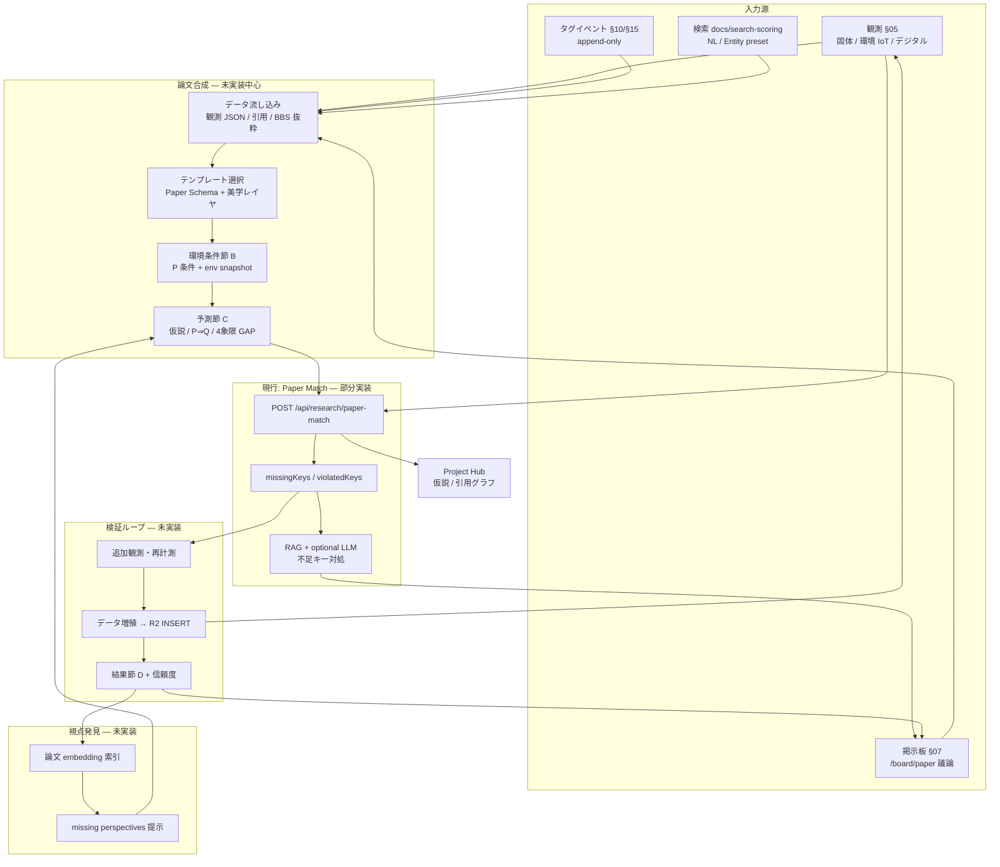

# 09 論文 — 機能要件定義（たたき台・非正本）

> **非正本**: 採用・実装判断は `docs/REQUIREMENTS.md`・`rag/accepted_requirements.csv`・`civilization/` を優先。  
> **作成日**: 2026-06-07  
> **インベントリ出典**: `01-要件/_横断/FEATURE-REQUIREMENTS-INVENTORY.md` §9

---

> **IHL 読み替え（2026-06-07）**: 本文の「stays in civilization-os」は **IHL rebuild（legacy = salvage 参照）** と読む。正本: [README マスターノート](./README.md) · [06-リポジトリ戦略](../05-運用/_横断/リポジトリ戦略-legacyとIHL.md)

## インベントリ抜粋（§9）

| 項目 | 値 |
|------|-----|
| 要件定義ステータス | **部分** — E2E 到達（REQ-014）のみ採用。アルゴリズム正本は feedback 候補 |
| 採用 REQ | REQ-014（到達スモークのみ） |
| 実装 | **partial** — demo ルートあり。JSON Schema 最終化・本番データフロー未採用 |
| IHL 関係 | **TBD**（研究データ lake 連携は将来） |

**概要（インベントリ）**: 論文条件（P）と観測データのマッチング UI（`/research/paper-match`・プロジェクト配下 match）。RAG 連携・不足条件提示は feedback 候補。

---

> **IHL 読み替え（2026-06-07）**: 本文の「stays in civilization-os」は **IHL rebuild（legacy = salvage 参照）** と読む。正本: [README マスターノート](./README.md) · [06-リポジトリ戦略](../05-運用/_横断/リポジトリ戦略-legacyとIHL.md)

## 1. 機能概要

論文機能は、論文が要求する **条件 P（JSON Schema 風）** と、ユーザーが持つ **観測データ JSON** を突き合わせ、**充足キー・不足キー・違反キー** を提示するマッチング UI である。固体観測フローから **ブリッジ**（`?solid=1`・`paperMatchBridge`）で観測 JSON を流し込み、プロジェクト仮説への **ワンクリック追記** も可能。現状は **デモ寄り** — REQ-014 は E2E 到達スモークのみ採用。アルゴリズム・Schema 最終化・不足→RAG→解決策提示は **`rag/feedback.csv` fb_00032/33（未昇格）** に oral 理想がある。

---

> **IHL 読み替え（2026-06-07）**: 本文の「stays in civilization-os」は **IHL rebuild（legacy = salvage 参照）** と読む。正本: [README マスターノート](./README.md) · [06-リポジトリ戦略](../05-運用/_横断/リポジトリ戦略-legacyとIHL.md)

## 2. ユーザーができること

- **Paper Match UI**（`/research/paper-match` および `/projects/:projectId/papers/:paperId/match`）:
  - 観測 JSON・条件 P JSON を編集してマッチ実行。
  - 結果表示: マッチ度・`missingKeys`・`violatedKeys`・RAG ヒント（サーバ返却に依存）。
  - オプション **LLM アドバイス**（不足キー計測・運用提案、`include_llm` — API キー要）。
- **固体ブリッジ**: `?solid=1` で固体観測 JSON 自動読込。`?auto=1` で条件 P 復元＋自動マッチ。
- **下書き**: ログインユーザが条件 P 下書きを保存・一覧・再読込（`savePaperConditionDraft`）。
- **仮説追記**: プロジェクト ID がある場合、マッチ結果から `postProjectHypothesis` ワンクリック。
- **掲示板入口**: メニュー「論文」→ `/board/paper`（議論用 BBS、§07 参照）。

---

> **IHL 読み替え（2026-06-07）**: 本文の「stays in civilization-os」は **IHL rebuild（legacy = salvage 参照）** と読む。正本: [README マスターノート](./README.md) · [06-リポジトリ戦略](../05-運用/_横断/リポジトリ戦略-legacyとIHL.md)

## 3. スコープ内 / スコープ外

### スコープ内

- `PaperMatchPage.tsx` + `paperMatchApi` + 固体 `paperMatchBridge`。
- REQ-014 E2E: `p1-req014-recommended-scenarios.spec.ts`（論文マッチ到達）。
- 観測→論文の **データ橋**（localStorage 経由の PoC）。
- プロジェクト仮説 API 連携（gap quadrant `auto_from_match`）。

### スコープ外

- fb_00032/33 の **完全採用**（JSON Schema 正本・ワイヤーフrame・プロンプト設計・画面遷移図）。
- 査読ワークフロー本実装（IHL `research/` ディレクトリは Phase 1 プレースホルダ可）。
- 論文 PDF 取込・DOI 解決（未着手）。
- IHL R2 `research/` parquet 連携（**TBD**）。

---

> **IHL 読み替え（2026-06-07）**: 本文の「stays in civilization-os」は **IHL rebuild（legacy = salvage 参照）** と読む。正本: [README マスターノート](./README.md) · [06-リポジトリ戦略](../05-運用/_横断/リポジトリ戦略-legacyとIHL.md)

## 4. 機能要件

| ID | 要件 |
|----|------|
| FR-PPR-01 | **マッチ API**: 観測 `Record` + 条件 P `Record` を POST し、構造化 `PaperMatchPayload` を返す（`postPaperMatch`）。 |
| FR-PPR-02 | **キー分類**: 結果に `missingKeys`（未提供）・`violatedKeys`（型/範囲違反 + reason）・充足情報を含む。 |
| FR-PPR-03 | **条件 P 表現**: JSON オブジェクト。各キーに `type`/`min`/`max`/`required` 等（デモ DEFAULT_P 参照）。**最終 Schema は未確定**（fb_00032）。 |
| FR-PPR-04 | **固体ブリッジ**: `loadSolidBridgedObservationJson` / `saveLastConditionsPJson` で固体フローと連携。 |
| FR-PPR-05 | **自動実行**: `solid=1` & `auto=1` で bridged 観測一致時に 1 回自動マッチ。 |
| FR-PPR-06 | **RAG ヒント**: 不足キーに対しサーバ側 RAG 参照（詳細は `docs/search-scoring.md`・実装準拠）。 |
| FR-PPR-07 | **LLM 拡張**: `include_llm=true` で計測・運用アドバイス生成（任意・鍵依存）。 |
| FR-PPR-08 | **下書き CRUD**: 認証ユーザの `conditionsP` 下書き保存・一覧・エディタ読込。 |
| FR-PPR-09 | **仮説生成**: マッチ結果から自然言語 `hypothesisCandidate` を組み立て Project に POST。 |
| FR-PPR-10 | **空状態・エラー**: JSON パース失敗・API 失敗をユーザー向け文言で表示（raw stack 非表示）。 |
| FR-PPR-11 | **E2E 到達**: 第一級ルートから Paper Match 画面に到達可能（REQ-014 採用範囲）。 |

---

> **IHL 読み替え（2026-06-07）**: 本文の「stays in civilization-os」は **IHL rebuild（legacy = salvage 参照）** と読む。正本: [README マスターノート](./README.md) · [06-リポジトリ戦略](../05-運用/_横断/リポジトリ戦略-legacyとIHL.md)

## 5. 非機能要件

| ID | 要件 |
|----|------|
| NFR-PPR-01 | **候補と正本の分離**: fb_00032/33 は feedback **候補**。昇格前に accepted へ載せない。 |
| NFR-PPR-02 | **UI 規範**: `PageColumn`・`CivButton`・`civUi.css` — 新規 DS 禁止（`preferences.md`）。 |
| NFR-PPR-03 | **再現性**: マッチ入力 JSON はユーザーが export 可能な形（現状エディタコピー）。将来 R2 append-only 連携 TBD。 |
| NFR-PPR-04 | **LLM 境界**: キー未設定時は LLM  OFF デフォルトまたは明示トグル（`includeLlm` state）。 |
| NFR-PPR-05 | **テスト**: REQ-014 シナリオ CI 維持。アルゴリズム変更時は Vitest + E2E 更新。 |

---

> **IHL 読み替え（2026-06-07）**: 本文の「stays in civilization-os」は **IHL rebuild（legacy = salvage 参照）** と読む。正本: [README マスターノート](./README.md) · [06-リポジトリ戦略](../05-運用/_横断/リポジトリ戦略-legacyとIHL.md)

## 6. MiniKernel / C-USB 上の位置づけ

- **FeatureNode**: `search` / `observation` 横断（固体→論文ブリッジ）。
- **Kernel**: 検索・RAG 系 **G（Gnosis）** + 観測 **Input** 接続。
- **Component**: `PaperMatchPage` は View Component。マッチロジックは backend `logic`（ITO: IN=観測+P → Transform=検証・RAG → OUT=マッチ payload）。
- **core + rag**: 論文条件・観測は将来 CoreEntityBase 準拠エンティティ化候補（現状 JSON PoC）。

---

> **IHL 読み替え（2026-06-07）**: 本文の「stays in civilization-os」は **IHL rebuild（legacy = salvage 参照）** と読む。正本: [README マスターノート](./README.md) · [06-リポジトリ戦略](../05-運用/_横断/リポジトリ戦略-legacyとIHL.md)

## 7. IHL repo との関係

**TBD** — IHL `research/` ディレクトリ（査読・仮説・論文メタ）は Phase 1 で **ディレクトリのみ可**（`指示/it-hercules-laboratory/99-アーカイブ/2026.06-06-legacy`）。文明 OS Paper Match は **観測 JSON マッチ UI**、IHL は **R2 上の研究データレイク**。将来連携案:

- IHL manifest から観測条件を export → civ-os Paper Match 入力。
- 不足キーを IHL capture メタ列と突合。

**Phase 1 IHL スコープ外** — 連携 API は未設計。

---

> **IHL 読み替え（2026-06-07）**: 本文の「stays in civilization-os」は **IHL rebuild（legacy = salvage 参照）** と読む。正本: [README マスターノート](./README.md) · [06-リポジトリ戦略](../05-運用/_横断/リポジトリ戦略-legacyとIHL.md)

## 8. 正本ファイル

| 種別 | パス |
|------|------|
| UI | `frontend/src/search/PaperMatchPage.tsx` |
| API クライアント | `frontend/src/search/lib/paperMatchApi.ts` |
| 固体ブリッジ | `frontend/src/observation/solid-flow/paperMatchBridge.ts` |
| 候補 oral | `rag/feedback.csv` fb_00032, fb_00033 |
| ギャップ | `docs/implementation-gap-matrix.md`（推奨シナリオ） |
| スコア/RAG | `docs/search-scoring.md` |
| E2E | `frontend/e2e/p1-req014-recommended-scenarios.spec.ts` |
| 採用 REQ | `rag/accepted_requirements.csv` REQ-014 |
| IHL 将来 | `指示/it-hercules-laboratory/99-アーカイブ/2026.06-06-legacy/要件定義1` §research/ |

---

> **IHL 読み替え（2026-06-07）**: 本文の「stays in civilization-os」は **IHL rebuild（legacy = salvage 参照）** と読む。正本: [README マスターノート](./README.md) · [06-リポジトリ戦略](../05-運用/_横断/リポジトリ戦略-legacyとIHL.md)

## 9. 未決・ギャップ

| 項目 | 状態 |
|------|------|
| 条件 P の JSON Schema 最終化 | fb_00032 — **未昇格** |
| マッチングアルゴリズム正本 | fb_00032/33 — コード+デモ DEFAULT |
| マッチ度 UI ワイヤーフrame | fb_00032 — 未整備 |
| 不足→RAG→解決策プロンプト | fb_00032 — 部分実装（`include_llm`） |
| データ提供フロー画面遷移図 | fb_00033 — 未整備 |
| 本番観測データフロー（R2 直結） | **未採用** |
| IHL research/ 連携 | **TBD** |

---

> **IHL 読み替え（2026-06-07）**: 本文の「stays in civilization-os」は **IHL rebuild（legacy = salvage 参照）** と読む。正本: [README マスターノート](./README.md) · [06-リポジトリ戦略](../05-運用/_横断/リポジトリ戦略-legacyとIHL.md)

## 10. 設計 AI 参照順

1. `01-要件/_横断/FEATURE-REQUIREMENTS-INVENTORY.md` §9  
2. `frontend/src/search/PaperMatchPage.tsx`  
3. `rag/feedback.csv` fb_00032 行（Schema・アルゴリズム oral）  
4. `rag/feedback.csv` fb_00033 行（優先順位・RAG 自然検索 oral）  
5. `docs/search-scoring.md`  
6. `frontend/src/observation/solid-flow/paperMatchBridge.ts`  
7. `docs/implementation-gap-matrix.md` REQ-014 節  
8. `指示/it-hercules-laboratory/99-アーカイブ/2026.06-06-legacy/要件定義1` §research/（IHL 将来）

---

> **IHL 読み替え（2026-06-07）**: 本文の「stays in civilization-os」は **IHL rebuild（legacy = salvage 参照）** と読む。正本: [README マスターノート](./README.md) · [06-リポジトリ戦略](../05-運用/_横断/リポジトリ戦略-legacyとIHL.md)

## 11. 現状要件 vs ユーザー構想（2026-06-07）

> **出典**: 本節の「現状」は §1–10・`01-要件/_横断/FEATURE-REQUIREMENTS-INVENTORY.md` §9・`rag/accepted_requirements.csv` REQ-014・`rag/feedback.csv` fb_00032/33・`指示/2026.03.31/*` oral。「ユーザー構想」は 2026-06-07 チャットで提示されたメンタルモデル（たたき台）。

### 11.1 現行要件が言う「論文の作り方」

| 観点 | 採用済み要件が定義する内容 | 根拠 |
|------|---------------------------|------|
| **正体** | 論文 = **条件 P（JSON）** と **観測 JSON** の **マッチング UI**。論文本文エンティティの執筆フローは **スコープ外** | §1–3、FR-PPR-01〜11 |
| **入力** | ユーザーがエディタで観測 JSON・条件 P を **手編集** → POST マッチ。固体観測からは `?solid=1` + `paperMatchBridge`（localStorage PoC） | FR-PPR-04〜05、`PaperMatchPage.tsx` |
| **出力** | `matchScore`・`missingKeys`・`violatedKeys`・不足キー向け **RAG ヒント**（任意 LLM アドバイス） | FR-PPR-02/06/07、`paperMatchLogic.ts` |
| **保存** | 条件 P **下書き**（認証ユーザ）。観測・マッチ結果の R2 本番永続は **未採用** | FR-PPR-08、§9 ギャップ表 |
| **議論** | メニュー「論文」→ `/board/paper`（**掲示板入口のみ**。査読・レビュー WF 本実装はスコープ外） | §2、§07 参照 |
| **プロジェクト連携** | マッチ結果から **仮説 1 行** を Project に POST（`gapQuadrant: auto_from_match`） | FR-PPR-09 |
| **採用 REQ** | **REQ-014** = E2E **到達スモークのみ**（`/research/paper-match` に辿り着ける） | `accepted_requirements.csv` |

**要約**: 現行の「論文作成」は **「既にある条件 P と観測を突き合わせ、不足を見る」** まで。テンプレート執筆・環境条件節・予測節・結果節・検証ループ・論文エンティティの lifecycle は **oral（fb_00032/33・`指示/2026.03.31`）に留まり、accepted 未昇格**。

### 11.2 ユーザー構想 A — 複合モデル（BBS + タグ + 検索）

| 柱 | ユーザー構想 | 現状 | ギャップ |
|----|-------------|------|----------|
| **掲示板（自前 BBS）** | 論文 = GitHub ではなく **自ホスト BBS** 上の議論・査読・レビュー層 | `/board/paper` 入口あり。**Citation・BBS→論文引用 WF** は `指示/2026.03.31/論文　設計書.txt` oral のみ | 議論スレと paperId / section の **双方向リンク未実装**。REQ-024 BBS posting rescue も未完 |
| **タグ** | IHL / civ-os から **append-only タグイベント** で論文・観測を横断索引 | 観測タグ・MatchApp/ValueCheck 系は **別機能**（§05・§10）。論文専用 tag event **未定義** | 論文セクション・条件 P キーへの **タグ付与契約なし**（§15 FR-DATA-15 は IHL 向け oral 整合） |
| **検索（観測系）** | 観測検索結果を **テンプレに流し込む** データ源 | Entity 検索 `paper` preset・NL 検索・Paper Match RAG（**不足キー単位**）は **部分実装** | **「論文テンプレ穴埋め用の観測検索」** 導線なし。P と観測の **逆引き一括抽出**（`論文マッチングシステム.txt` §1）は UI 未接続 |

### 11.3 ユーザー構想 B — 4 節モデル（テンプレ + 環境 + 予測 + 結果）

| 節 | ユーザー構想 | 現状 | ギャップ |
|----|-------------|------|----------|
| **A. テンプレ + データ流し込み** | 構造化テンプレに観測・引用・BBS 抜粋を **自動差し込み** | JSON エディタ + 固体ブリッジ PoC のみ。美学テンプレ 5 種は `論文本来の姿.txt` oral | **Paper Schema + Template Engine** 未採用。セクション JSON（`論文　設計書.txt` §3）未実装 |
| **B. 環境条件** | 飼育環境・IoT・計測条件を論文の **条件 P / 環境節** に正規化 | 観測 JSON に `temperature_c` 等デモキー。SwitchBot / Placement **観測スナップショット**は §05 部分実装 | 環境 IoT → 論文テンプレ **自動マッピング契約なし** |
| **C. 予測（仮説）** | P⇒Q・4 象限空白から **仮説論文** 自動生成 | マッチ **不足キー** から 1 段落 `hypothesisCandidate` のみ。4 象限 GAP は oral | **命題論理・空白領域検出**（設計書 §4–5）未実装 |
| **D. 最後の結果** | 検証後の **結果節** と信頼度 | マッチ度スコアのみ。**verification → データ増殖** ループなし | 結果エンティティ・再マッチ履歴・`observation-paper-verification-report-template.md` 連携は **手動テンプレ止まり** |

### 11.4 ユーザー構想 C — ベクトル化と「不足視点」検出

| 項目 | ユーザー構想 | 現状 | ギャップ |
|------|-------------|------|----------|
| **論文 embedding** | 完成・下書き論文をベクトル化し **類似論文・未カバー視点** を提示 | RAG コーパスに `paper` chunk type。Entity 検索 preset `paper`（`docs/search-scoring.md`） | **論文ドキュメント単位の embedding 索引** と Paper Match **横連携なし** |
| **ギャップ検出** | ベクトル空間で **missing perspectives**（論点の空白）を発見 | Paper Match = **キー充足率** + 不足キー RAG。oral の「空白領域」= 4 象限 **観測密度** | **セマンティック gap**（視点の欠落）と **データ gap**（キー不足）が **未分離・未統合** |
| **拡張イメージ** | PaperMatch の延長で **類似論文 cluster → 未論及軸** 提案 | `nlQueryExpand`・Twin 重みは検索 general。IHL `embedding_manifest` は **TBD** | FR 化前。**設計ゲート §14** 参照 |

### 11.5 oral 資産との位置づけ（2026.03.31）

`指示/2026.03.31/` 三ファイルはユーザー構想と **高い一致** があるが、すべて **feedback 未昇格 / 実装禁止ゲート前** の oral:

- `論文マッチングシステム.txt` → fb_00033 と同型（P 構造化・マッチ・RAG・データ提供フロー）
- `論文　設計書.txt` → Project・Citation・仮説自動生成・投票・引用ネットワーク（**論文作成 OS** 全体像）
- `論文本来の姿.txt` → 観測→命題→仮説→検証→記録、美学テンプレ分離（**哲学 + UI スキン**）

**結論（たたき台）**: ユーザー構想は oral 資産と整合するが、**accepted 上の論文機能は Paper Match デモに限定**。BBS・タグ・検索・4 節・ベクトル gap は **§13 FR-PAPER-* として要件化候補**、実装前に **§14 設計ゲート 4 点** が必要。

---

> **IHL 読み替え（2026-06-07）**: 本文の「stays in civilization-os」は **IHL rebuild（legacy = salvage 参照）** と読む。正本: [README マスターノート](./README.md) · [06-リポジトリ戦略](../05-運用/_横断/リポジトリ戦略-legacyとIHL.md)

## 12. 論文作成フロー構想（たたき台）

> **注意**: 以下は **目標フロー**。**現行実装**は `PaperMatchPage` + `/board/paper` 入口 + 固体ブリッジ PoC のみ（破線 = 未実装）。

**現行で動く経路（太字相当）**: 観測 JSON（手入力 or 固体ブリッジ）→ **Paper Match** → RAG/LLM → （任意）Project 仮説 POST。それ以外は **設計対象**。

---

> **IHL 読み替え（2026-06-07）**: 本文の「stays in civilization-os」は **IHL rebuild（legacy = salvage 参照）** と読む。正本: [README マスターノート](./README.md) · [06-リポジトリ戦略](../05-運用/_横断/リポジトリ戦略-legacyとIHL.md)

## 13. 追加機能要件（FR-PAPER-01〜）

> **ステータス**: すべて **草案・未昇格**。採用前に `accepted_requirements.csv` へ ID 付与・§14 ゲート通過が必要。既存 FR-PPR-* との関係: PPR = 現行 Match 最小、PAPER = ユーザー構想拡張。

| ID | 要件 | 依存・接続 | 現状 |
|----|------|-----------|------|
| **FR-PAPER-01** | **自ホスト BBS レビュー層**: `paperId` + `sectionId` と `/board/paper` スレを **Citation Entity** で双方向リンク。査読コメントは R2 append-only | §07 FR-BBS-05/06、`論文　設計書.txt` §2/9 | 入口のみ |
| **FR-PAPER-02** | **論文タグ**: civ-os / IHL 起源の **tag_event** を論文・観測・条件 P キーに付与。aggregate view は再計算（上書き禁止） | §15 FR-DATA-15、§10 FR-MCH-15/16 | 観測タグのみ |
| **FR-PAPER-03** | **観測検索 → テンプレ流し込み**: Entity/NL 検索（preset `observation`）結果を Paper Template の **スロット** にドラッグ or 一括 bind | §05 観測 JSON、`docs/search-scoring.md` | 未着手 |
| **FR-PAPER-04** | **テンプレートエンジン**: Paper Schema（sections[], conditions, state, confidence）+ **美学テンプレ**（構造と文体分離、`論文本来の姿.txt`） | §15 CoreEntityBase、oral §3 | JSON 手編集のみ |
| **FR-PAPER-05** | **環境条件節**: 観測 commit 時の env snapshot / SwitchBot 系列を **条件 P** へ正規化マップ（キー辞書要 ADR） | §05 環境 IoT、§13 データ取得元 | デモキーのみ |
| **FR-PAPER-06** | **予測節**: P⇒Q 命題 + **4 象限観測密度** から GAP 検出 → 仮説論文候補（type=hypothesis） | oral 設計書 §4–5、FR-PPR-09 拡張 | 1 段落仮説のみ |
| **FR-PAPER-07** | **結果節**: 検証 run 後に results[] を INSERT。`matchScore` 履歴・信頼度 `confidence` を論文 state に反映 | `observation-paper-verification-report-template.md` | テンプレのみ |
| **FR-PAPER-08** | **検証ループ → データ増殖**: 不足キー解消観測 → 再マッチ → 充足時に **Citation / 引用ネットワーク** 更新。Project グラフ再描画 | Project API、oral §5 データ提供フロー | PoC 仮説 POST のみ |
| **FR-PAPER-09** | **論文 embedding 索引**: 論文全文（sections + conditions + tags）を embedding manifest に載せ Entity 検索 `paper` と統合 | §15 embedding、IHL manifest TBD | chunk type のみ |
| **FR-PAPER-10** | **missing perspectives（gap 拡張）**: (a) キー不足 = 既存 Paper Match、(b) **視点不足** = embedding 近傍論文との差分軸提示（cluster 外の tag/命題） | FR-PAPER-09、fb_00033 RAG 自然検索 | (a) 部分 (b) 未着手 |
| **FR-PAPER-11** | **条件 P JSON Schema 正本**: fb_00032 案を Schema ファイル化し、マッチ algorithm・UI を **単一正本** に固定 | fb_00032、FR-PPR-03 | デモ DEFAULT_P |
| **FR-PAPER-12** | **データ提供フロー UI**: マッチ度高ユーザへ観測 bundle 提供 → Citation 生成（画面遷移 fb_00032 案） | oral マッチングシステム §5 | 未着手 |

**優先付け（oral fb_00033 整合・たたき台）**: FR-PAPER-11 → 現行 Match 安定化 → FR-PAPER-04/05（テンプレ+環境）→ FR-PAPER-03/08（観測逆流）→ FR-PAPER-01/02（BBS+タグ）→ FR-PAPER-09/10（embedding gap）。

**優先順位を velocity 基準に再掲（[ADR-H-09](../02-設計/_横断/adr/ADR-H-09-研究フロー-低コスト設計.md) 昇格反映 · 2026-06-08 · 昇格 2-4）**: 研究の主導線は **「観測→仮説→試す→記録→引用」を最短（約 7〜9 クリック・往復ゼロ）** で回すこと。よって実装優先は **(1) テンプレ駆動の進行中論文（FR-PAPER-04）+ 参加導線（FR-PAPER-05）→ (2) 観測逆流（FR-PAPER-03/08）→ (3) BBS/タグ（FR-PAPER-01/02）→ (4) embedding/gap（FR-PAPER-09/10）** とする。**Dashboard・Knowledge Graph は作り込みすぎない**（[ADR-H-09](../02-設計/_横断/adr/ADR-H-09-研究フロー-低コスト設計.md) §4）。指標は「論文数」より **research velocity（追試・引用・データ追加の回転）**。

### 13.1 テンプレ駆動 UI（フィードバック反映 2026-06-07 · UI 設計層）

ユーザーフィードバック（2026-06-07）「**前提・条件をテンプレ化し、空欄を埋めればほぼ完成形の論文に。今この phase・どんな条件で何を検証しているかを示し、読者が『自分の環境でも貢献できそう』『条件を合わせてデータを足そう』と思える形に**」を **UI 設計層**で反映（要件は **草案・未昇格**）。

| 反映点 | テンプレ節 / UI | 対応 FR / ADR |
|--------|----------------|----------------|
| 前提・条件のテンプレ化（穴埋め→ほぼ完成形） | 目的 / 仮説 / **条件（温度・湿度・餌）** / 検証したいこと / 現在のフェーズ / 必要なデータ・ギャップ + 完成度メータ | **FR-PAPER-04**（構造のみ Phase 1・文体は後）・[ADR-H-09](../02-設計/_横断/adr/ADR-H-09-研究フロー-低コスト設計.md) §4 |
| **今この phase**（現在のフェーズ表示） | 5 ステップ進行（観測→仮説→試す→記録→引用）・状態チップ | [ADR-H-09](../02-設計/_横断/adr/ADR-H-09-研究フロー-低コスト設計.md) §1「in_progress を一級」 |
| 条件提示 → **参加導線** | CTA〔同じ条件でデータを追加する〕→ 観測/Capture（条件プリセット） | FR-PAPER-05（環境条件節）・[ADR-H-09](../02-設計/_横断/adr/ADR-H-09-研究フロー-低コスト設計.md) §2「運ぶ」 |
| 必要なデータ / ギャップ（〔不足〕タグ） | 読者が足せるデータを可視化 | FR-PAPER-06/10（gap）・現行 Paper Match 不足キー |
| 進行中のまま保存（消えません） | append-only・下書き概念を使わない | [ADR-H-09](../02-設計/_横断/adr/ADR-H-09-研究フロー-低コスト設計.md) §1・[ADR-H-04](../02-設計/_横断/adr/ADR-H-04-設計規約-v1.2.md) §8 |

**UI 設計正本（モック）**: [`../../02-設計/features/09-論文/ui/低コスト導線.md`](../02-設計/features/09-論文/ui/低コスト導線.md) §4・§4.1 — `mockups/ihl-09-paper-in-progress.png`（進行中・テンプレ駆動）・`mockups/ihl-09-paper-template-fill.png`（穴埋め）。

> **実装 Go 不可**: 本節は UI 設計たたき台。FR-PAPER-* 実装は §14 ゲート 4 点の人間確定後（[`design-before-implementation-gate.mdc`](../../../.cursor/rules/design-before-implementation-gate.mdc)）。

---

> **IHL 読み替え（2026-06-07）**: 本文の「stays in civilization-os」は **IHL rebuild（legacy = salvage 参照）** と読む。正本: [README マスターノート](./README.md) · [06-リポジトリ戦略](../05-運用/_横断/リポジトリ戦略-legacyとIHL.md)

## 14. 設計ゲート（未着手）

`design-before-implementation-gate.mdc` に従い、**§13 FR-PAPER-* の実装コード変更前** に次 4 点を人間確定 or 明示 Go する。

| # | 成果物 | 論文スコープで最低限含む内容 | ステータス |
|---|--------|------------------------------|------------|
| 1 | **要件定義** | 論文 = Match のみ vs 4 節合成 OS の **境界**；FR-PPR vs FR-PAPER の採用順；BBS/タグ/検索の **責務分割**（§07/10、`docs/search-scoring.md` 参照） | **草案**（本ファイル §11–13） |
| 2 | **詳細設計** | Paper Schema・条件 P JSON Schema（fb_00032）・Citation・tag_event・embedding manifest API 契約；R2 キー；Project 連携 | **未着手**（oral `論文　設計書.txt` をたたき台可） |
| 3 | **遷移設計** | `/research/*`・`/projects/:id/papers/*`・固体ブリッジ・BBS 引用・検証ループの **状態機械** とエラー導線 | **未着手**（fb_00032 画面遷移図 oral） |
| 4 | **UI 設計** | 4 節レイアウト・Match 結果・gap/視点提示・BBS サイドパネ；`preferences.md` 準拠 | **未着手**（fb_00032 ワイヤー oral） |

**IHL 連携ゲート（追加）**: `research/` lake と civ-os Paper の **export/import 契約** は §7 TBD のまま。Phase 1 は **ディレクトリ placeholder** のみ（`指示/it-hercules-laboratory/99-アーカイブ/2026.06-06-legacy`）。

**エージェント向けチェック**: 上表 4 点が **確定 or Go** になるまで `frontend/src` / `backend/src` への FR-PAPER 機能実装は **禁止**（Paper Match バグ修正・REQ-014 維持は除外）。

---

> **IHL 読み替え（2026-06-07）**: 本文の「stays in civilization-os」は **IHL rebuild（legacy = salvage 参照）** と読む。正本: [README マスターノート](./README.md) · [06-リポジトリ戦略](../05-運用/_横断/リポジトリ戦略-legacyとIHL.md)

## 15. 関連機能ドキュメント（横断参照）

| 機能 | ファイル | 論文との接点 |
|------|----------|-------------|
| **05 観測** | [05-観測.md](./05-観測.md) | 論文の **入力正本**（固体 JSON・env snapshot・タグ・R2 session）。固体→Paper ブリッジ。再現性・査読は REQ-021/検証テンプレ |
| **07 掲示板** | [07-掲示板.md](./07-掲示板.md) | `/board/paper` 議論入口。将来 **FR-PAPER-01** レビュー層。file-board RAG は開発スレ索引（製品 BBS とは別系統） |
| **10 マチアプ** | [10-マチアプ.md](./10-マチアプ.md) | append-only **tag_event** 思想・検索 rerank。論文タグ（FR-PAPER-02）と shared |
| **13 データ取得元管理** | [13-データ取得元管理.md](./13-データ取得元管理.md) | 観測・論文引用の **出典・信頼度** メタ。環境条件節・結果節の provenance |
| **15 データ設計** | [15-データ設計.md](./15-データ設計.md) | core+rag・R2 INSERT ONLY・embedding/tag_event **横断スキーマ**。Paper Entity 化の憲法根拠 |
| **18 写真解析** | [18-写真解析.md](./18-写真解析.md) | 計測値→観測 JSON→テンプレ流し込み。LabelMe / BPCMS 結果を **条件 P** へ |
| **24 記事・ブログ** | [24-記事・ブログ-v1-DRAFT.md](./24-記事・ブログ-v1-DRAFT.md) | **コンテンツ三体**の 1 柱。**知の広場**（`/knowledge`）· **記事タブ内「論文」フィルタ**（FR-CONTENT-NAV-01/07）。論文の `cited_paper_ids` を引用可（FR-ART-05/06）。`/board/paper` case チップ `article`/`blog` を共有（FR-BBS-15 CR予定） |
| **25 AI 要約** | [25-AI要約-GitHub改善掲示板-v1-DRAFT.md](./25-AI要約-GitHub改善掲示板-v1-DRAFT.md) | 論文・記事・ブログが AI 要約バッチ（FR-AISUM-03）の対象。`summary_ref` として論文エンティティに紐づく（FR-CONTENT-NAV-06） |

**コンテンツ三体ナビゲーション（2026-06-18 追加 · 2026-06-18 Hub 確定）**:

論文（#09）・記事・ブログ（#24）は **共通 CMS 思想** で設計する。`content_type` enum（`paper`/`article`/`blog`）による単一スキーマ、共通 `tag_event` 横断索引、`/board/paper` case チップ共有、AI 要約バッチ（#25）の対象となる。

- **Hub 表示名**: **知の広場**（`/knowledge` · §AI仮定 確定）
- **論文の UI 位置**: 独立タブにせず **記事タブ**（`/knowledge/articles`）内フィルタ **「論文」**（`content_type=paper`）
- **正本**: `00-プロダクト方針・MVP・拡張安全枠-v1-DRAFT.md` §3 FR-CONTENT-NAV-* · [`07-09-24-コンテンツ導線・UX提案-v1-DRAFT.md`](../02-設計/E2E/07-09-24-コンテンツ導線・UX提案-v1-DRAFT.md)

**検索（横断・20機能リスト外）**: `docs/search-scoring.md`・`/search/nl`・Entity preset `paper`/`observation` — FR-PAPER-03/09/10 の検索基盤。

** oral スレッド索引**: `指示/2026.04.01/normalized/threads/025-論文.md`（ロードマップ・計測ポリシー等、研究 **内容** の oral。Paper Match **機能** とは別軸）。

---

*たたき台・非正本 / 人間レビュー用 / 設計 AI 引き継ぎ用*
