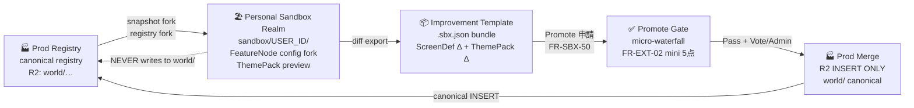

# 26 サンドボックス環境 — 機能要件定義（Personal Sandbox Realm · v1-DRAFT）

> **ステータス**: DRAFT — 人間レビュー待ち。設計ゲート未通過。  
> **Changelog**:  
> - 2026-06-18 — 初版作成（ユーザー項目 7：サンドボックス）  
> - 2026-06-18 — **確定**再設計: Personal Sandbox Realm アーキテクチャに全面改訂（ユーザー確定回答 §10）  
> **用途**: 人間レビュー・設計 AI 引き継ぎ用。  
> **非正本**: 採用・実装判断は `docs/REQUIREMENTS.md`・`rag/accepted_requirements.csv`・`civilization/` を優先。

> **IHL 読み替え**: 本文の実装は **IHL rebuild**（civilization-os は legacy 参照）。  
> 正本: `01-要件/README.md` · `_横断/FEATURE-REQUIREMENTS-INVENTORY.md` §26  
> 依存: `00-プロダクト方針・MVP・拡張安全枠-v1-DRAFT.md` §9 D-MVP-05（**§AI仮定 確定**）

---

## §0 ユーザー確定（2026-06-18）

| 確定項目 | 内容 | 区分 |
|---------|------|------|
| アクセス対象 | **全認証ユーザー**（ログイン済み） | **確定** |
| 改善テンプレートの伝播 | **明示的 Promote まで本番に波及しない** | **確定** |
| デザイン方針 | **全ユーザー開放 + 強く美しい** — 個人 Realm + diff preview | **確定** |
| 設計方式 | **Personal Sandbox Realm** — 以下 §1〜§6 参照 | **確定（本ファイル）** |

---

## §1 なぜ Personal Sandbox Realm が「一番美しいか」

### 1.1 設計哲学

| 観点 | 理由 |
|------|------|
| **個人の自律性** | 自分の Realm で自分のペースで試験できる。他人の実験に左右されない |
| **本物の手触り** | 本番スナップショットから fork するため、架空データではなく「本物の写し」で検証できる |
| **明確な昇格路** | 「試す → 検証 → Promote 申請」という一方通行のパイプラインがあり、実験が本番を汚染しない |
| **共有可能な改善** | 改善テンプレートはエクスポート・インポートできる。コミュニティで再利用できる |
| **安心の保証** | `sandbox/{user_id}/` は prod canonical registry と完全に別名前空間。ゼロ blast radius |
| **情報設計の美** | ナビに「Sandbox」1 エントリ。amber ストリップ「サンドボックスモード」。Promote 前に diff preview モーダル |

### 1.2 比較（Why not alternatives）

| 案 | 問題点 |
|----|--------|
| 共有サンドボックス 1 インスタンス | ユーザー同士が干渉。テンプレートを「全員に適用」するリスク |
| 本番 DB に sandbox フラグ列 | スキーマ汚染。blast radius がある |
| 別 VPS テナント（旧案） | コスト高・プロビジョニング複雑・美しくない UX |
| **Personal Sandbox Realm（採用）** | R2 prefix 分離で低コスト・ユーザー自律・昇格パイプライン明確 |

---

## §2 アーキテクチャ概要

### 2.1 昇格パイプライン（Mermaid）

> **正本フロー**: Prod Registry → Personal Realm → Improvement Template → Promote Gate → Prod



**不変条件**:
- Personal Realm は prod canonical への **書き込み禁止**（blast radius ゼロ）
- Promote Gate 通過前は本番 registry に **一切波及しない**
- 本番 Merge は R2 INSERT ONLY（UPDATE/DELETE 禁止）

### 2.2 R2 名前空間分離

```text
R2 バケット: it-hercules-laboratory
├── world/                         ← 本番 canonical（読み書き不可からサンドボックス）
│    ├── research/content/…
│    ├── observation/sessions/…
│    └── costs/…
└── sandbox/                       ← サンドボックス名前空間（本番 API は読まない）
     ├── {user_id}/                ← Personal Sandbox Realm（ユーザーごと分離）
     │    ├── realm-config.json    ← Realm 設定（forked snapshot version）
     │    ├── templates/           ← 改善テンプレート一覧
     │    │    └── {template_id}.sbx.json
     │    └── preview/             ← ThemePack preview cache
     └── promotions/               ← Promote 申請一覧（admin 確認用）
          └── {promotion_id}.json
```

---

## §3 機能概要

Personal Sandbox Realm は、**全認証ユーザーが本番の写しから安全に試験し、改善テンプレートとして昇格できる**環境である。

**3 つの中心概念**:

| 概念 | 説明 |
|------|------|
| **Personal Sandbox Realm** | ユーザーごとの隔離 FeatureNode config + ThemePack preview + mock data テナント。`sandbox/{user_id}/` prefix 下に保存 |
| **改善テンプレート（Improvement Template）** | ScreenDef delta + ThemePack delta + config を 1 bundle（`.sbx.json`）にパック。本番スナップショットからの fork diff のみを持つ |
| **Promote Pipeline** | Sandbox → micro-waterfall Gate（FR-EXT-02 準拠）→ コミュニティ投票（任意）→ Admin Merge → prod canonical INSERT |

---

## §4 ユーザーができること

| 操作 | ルート（案） | 説明 |
|------|------------|------|
| Sandbox ホーム | `/sandbox` | 自分の Realm 一覧・テンプレート一覧・Promote 申請状況 |
| Realm 開始 | `/sandbox/realm/new` | 本番スナップショット fork → Personal Realm 生成 |
| 設定変更・プレビュー | `/sandbox/realm/:realm_id/edit` | FeatureNode config 変更・ThemePack カラー変更・UI プレビュー |
| テンプレート作成 | `/sandbox/templates/new` | Realm の diff を `.sbx.json` bundle にエクスポート |
| テンプレート適用 | `/sandbox/templates/:id/apply` | 他ユーザーのテンプレートを自 Realm に適用してプレビュー |
| Promote 申請 | `/sandbox/templates/:id/promote` | diff preview モーダル → micro-waterfall Gate 申請 |
| Promote 進捗確認 | `/sandbox/promotions` | 申請した昇格の進捗（Gate 審査 / Vote / Merge 待ち）|
| テンプレート共有 | `/sandbox/community` | 公開テンプレート一覧（コミュニティ改善ライブラリ） |

---

## §5 機能要件（FR-SBX-*）

### 5.1 Personal Sandbox Realm

| ID | 要件 | 正本 |
|----|------|------|
| FR-SBX-30 | 全認証ユーザー（`role >= user`）は Personal Sandbox Realm を **1 つ以上**作成できる | Security.md |
| FR-SBX-31 | Realm は本番の **FeatureNode config スナップショット**を fork して開始する。`realm_config.json` に `forked_from_version`（スナップショット ID）・`user_id`・`created_at` を記録する | R2Engine.md |
| FR-SBX-32 | Realm のデータは R2 `sandbox/{user_id}/{realm_id}/` prefix に INSERT ONLY で保存する。`world/` prefix への書き込みを禁止する | R2Engine.md, ADR |
| FR-SBX-33 | Realm 内では FeatureNode config（表示順・有効/無効・パラメータ）・ThemePack（カラー・フォント・間隔トークン）・観測テンプレートを変更できる | ComponentFramework.md §ThemePack |
| FR-SBX-34 | Realm は **削除可能**（ユーザー自身による。R2 prefix 一括削除 + soft-delete marker）| Security.md |

### 5.2 改善テンプレート（Improvement Template）

| ID | 要件 | 正本 |
|----|------|------|
| FR-SBX-40 | ユーザーは Realm の変更差分を **改善テンプレート**（`.sbx.json` bundle）としてエクスポートできる。bundle には `template_id`・`title`・`description`・`diff`（config delta + ThemePack delta）・`base_version`（fork 元スナップショット ID）・`author_id`・`created_at` を含む | |
| FR-SBX-41 | テンプレートは R2 `sandbox/{user_id}/templates/{template_id}.sbx.json` に保存する | R2Engine.md |
| FR-SBX-42 | テンプレートを **公開共有**するとコミュニティライブラリに掲載される（`sandbox/community/{template_id}.json`）。公開は任意 | |
| FR-SBX-43 | 他ユーザーのテンプレートを **自 Realm に適用**してプレビューできる（本番・他人の Realm には影響しない）| |
| FR-SBX-44 | テンプレート適用前に **diff preview モーダル**を表示する。変更後の FeatureNode config 状態・ThemePack プレビューを並列表示する（Before / After）| preferences.md |

### 5.3 Promote Pipeline（昇格）

| ID | 要件 | 正本 |
|----|------|------|
| FR-SBX-50 | ユーザーはテンプレートを **Promote 申請**できる。申請は `sandbox/promotions/{promotion_id}.json` に記録し、micro-waterfall Gate（FR-EXT-02）を適用する | FR-EXT-02 |
| FR-SBX-51 | Promote Gate では「要件 DRAFT」「影響範囲」「テスト計画」の **3 点チェックリスト**を申請者が記述する（mini Phase 0–4）| FR-EXT-02 |
| FR-SBX-52 | Gate 通過後、**コミュニティ投票**（任意）を実施できる。投票は貢献度 #14 の「コミュニティ参加」イベントとして記録する | `14-貢献度.md` |
| FR-SBX-53 | 投票閾値または Admin 直接承認によって、テンプレートを **本番 canonical registry に Merge** できる（admin `role=admin` のみ実行可）| Security.md |
| FR-SBX-54 | 本番 Merge は R2 `world/` への **INSERT ONLY**（UPDATE/DELETE 禁止）。旧 canonical 設定は上書きせず履歴として残す | R2Engine.md |
| FR-SBX-55 | Promote が拒否された場合、申請者に理由を通知し、Realm での修正 → 再申請が可能 | |

### 5.4 UX / UI 要件

| ID | 要件 | 正本 |
|----|------|------|
| FR-SBX-60 | ナビに **「Sandbox」1 エントリ**を置く（3 クリック以内でアクセス可能）| preferences.md §NFR |
| FR-SBX-61 | Sandbox 内での操作中は画面上部に **amber ストリップ**「🏖️ サンドボックスモード — 本番には影響しません」を表示する。stripe は dismiss 不可（明確な環境識別）| preferences.md — amber = 警告色、意味のある使用 |
| FR-SBX-62 | diff preview モーダルは **Before（現在本番）/ After（テンプレート適用後）の 2 ペイン**で表示する。変更のある項目のみ強調表示する | preferences.md §B |
| FR-SBX-63 | コミュニティライブラリ（`/sandbox/community`）は **作者・適用件数・Promote 状態**を表示する。空状態・ローディング・エラーを用意する | DoD U-* |
| FR-SBX-64 | Promote 申請一覧（`/sandbox/promotions`）は **ステータス別**（Gate 審査中 / Vote 中 / Merge 待ち / 完了 / 拒否）で表示する | |

### 5.5 認証・アクセス制御

| ID | 要件 | 正本 |
|----|------|------|
| FR-SBX-70 | Sandbox 機能は **全認証ユーザー（ログイン済み）**が利用できる。未認証のアクセスは認証画面にリダイレクトする | Security.md |
| FR-SBX-71 | ユーザーは自分の Realm のみ編集できる。他ユーザーの Realm への書き込みを禁止する | Security.md |
| FR-SBX-72 | 公開テンプレートの **閲覧・適用**は全認証ユーザーが可能 | |
| FR-SBX-73 | Promote の **Merge 実行**は `role=admin` のみ | Security.md |

---

## §6 非機能要件

| ID | 要件 |
|----|------|
| NFR-SBX-01 | `sandbox/` prefix は `world/` canonical と **完全に名前空間分離**（prod API は `sandbox/` を読まない）|
| NFR-SBX-02 | R2 INSERT ONLY — Sandbox データも `world/` データも UPDATE/DELETE 禁止 |
| NFR-SBX-03 | Realm 生成のスナップショット fork は **5 秒以内**に完了する |
| NFR-SBX-04 | diff preview モーダルの表示は **2 秒以内** |
| NFR-SBX-05 | amber ストリップは `preferences.md` の「色は意味のみ」原則に従う（装飾禁止、識別のみ）|
| NFR-SBX-06 | Sandbox 機能の追加が既存 `world/` API の E2E テストを破壊しない（FR-EXT-03）|
| NFR-SBX-07 | テンプレート bundle（`.sbx.json`）は **スキーマバージョン**（`schema_version`）を持ち、後方互換を担保する |

---

## §7 MiniKernel / C-USB 上の位置づけ

```text
World
 └── FeatureNode: sandbox（新規）
      ├── Kernel: fork（スナップショット生成）, diff（delta 計算）, promote（申請・審査）
      ├── Component: SandboxNav（ナビエントリ）
      ├── Component: RealmEditor（config + ThemePack 編集）
      ├── Component: TemplateBundle（エクスポート・インポート）
      ├── Component: PromotePipeline（申請・Gate・Vote）
      ├── Component: CommunityLibrary（公開テンプレート一覧）
      └── Connector: R2（sandbox/…）, Contribution（#14 Vote イベント）
```

ITO モデル:
- **IN**: ユーザーの config/ThemePack 変更 + bundle export 指示
- **Transform**: prod snapshot fork → delta 計算 → `.sbx.json` bundle 生成
- **OUT**: R2 `sandbox/{user_id}/` INSERT + コミュニティ掲載（任意）+ Promote 申請 R2 INSERT

---

## §8 IHL repo との関係

| 区分 | 内容 |
|------|------|
| **IHL new** | `apps/web/sandbox/` — Realm Editor, Template Browser, Promote Pipeline UI |
| **IHL new API** | `apps/api/routes/sandbox.py` — Realm CRUD, Template export/import, Promotion CRUD |
| **IHL new script** | `scripts/snapshot_fork.py` — prod canonical → Realm snapshot 生成 |
| **shared** | R2 `sandbox/` namespace（既存 `world/` と同一バケット、prefix 分離）|
| **civilization-os** | N/A（civ-os には Sandbox UI なし）|

---

## §9 正本ファイル（予定）

| 種別 | パス（予定） |
|------|------------|
| 要件（本ファイル） | `01-要件/26-サンドボックス環境-v1-DRAFT.md` |
| ADR（未着手） | `02-設計/_横断/adr/ADR-H-2X-sandbox-realm-design.md` |
| 詳細設計（未着手） | `02-設計/features/26-サンドボックス/詳細設計-v2.md` |
| UI 設計（未着手） | `02-設計/features/26-サンドボックス/ui/` |
| テンプレートスキーマ（未着手） | `02-設計/_横断/schema/schemas/sandbox_template.yaml` |
| E2E STUB（未着手） | `02-設計/E2E/26-サンドボックス-E2E-v1-DRAFT.md` |

---

## §10 未確定・ギャップ

| ID | 論点 | たたき台推奨 | 優先度 |
|----|------|------------|--------|
| D-SBX-10 | **FeatureNode config fork の範囲**: UI 表示順 + ThemePack のみ vs API パラメータも含む | v1 は UI config（表示順・有効/無効・ThemePack）のみ。API パラメータは Phase 2 | 高 |
| D-SBX-11 | **Snapshot バージョン管理**: スナップショット ID の採番方式（timestamp vs semantic version）| `YYYYMMDD-HHMMSS` UTC timestamp 形式で十分（v1）| 中 |
| D-SBX-12 | **Community Vote の閾値**: 貢献度 N 以上 / 投票数 N 以上 / Promote 申請から N 日 | v1 は Admin 直接承認のみ。Vote 閾値は Phase 2 で ADR（`14-貢献度.md` FR-CONT-* 連携）| 中 |
| D-SBX-13 | **Realm 数の上限**: 1 ユーザーあたり何 Realm まで | v1 は 5 Realm/user を上限（管理者は無制限）。R2 コスト軽微 | 低 |
| D-SBX-14 | **テンプレートの後方互換**: `base_version` と現在の prod canonical が乖離した場合の扱い | 乖離が大きい場合は diff 適用に警告表示。強制適用は禁止（ユーザーが手動調整）| 中 |

---

## §11 設計ゲートステータス

| # | 成果物 | ステータス |
|---|--------|------------|
| 1 | 要件定義 | **DRAFT（本ファイル）— Personal Sandbox Realm 設計確定** |
| 2 | 詳細設計（R2 スキーマ・API 設計）| 未着手 |
| 3 | 遷移設計（Realm 開始 → Edit → Promote フロー）| 未着手 |
| 4 | UI 設計（Realm Editor・amber strip・diff preview・Community Library）| 未着手 |
| 5 | テスト設計（Realm 分離・Promote Gate・blast radius ゼロ確認）| 未着手 |

---

*DRAFT・非正本 / 人間レビュー用 / 設計 AI 引き継ぎ用*
