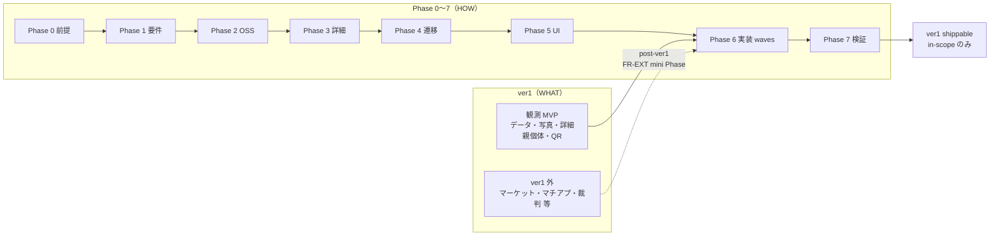

# ウォーターフォール型 UI 再構築計画（たたき台）

> **ステータス**: v1.0 凍結（Phase 3/4/5）・人間承認済（2026-06-07）
> **作成日**: 2026-06-17
> **対象**: IHL（IT Hercules Laboratory）フロントエンド全画面再構築
> **正本前提**:
> - モック正本: `02-設計/_ui-global/mockups/ihl-*.png`（53 枚 · 2026-06-09 承認スナップショット）
> - OSS 草案: `ADR-Phase1-OSS選定表.md` · `ADR-Phase2-web-architecture.md`
> - UI 規範: `docs/ui-redesign-system-spec.md` · `ui-reference/preferences.md`
> - ゲートルール: `.cursor/rules/design-before-implementation-gate.mdc`  
> **Changelog**: 2026-06-18 — Phase 1 入力正本（`01-要件/0X`）・追加仕様反映手順リンクを追記  
> **Changelog**: 2026-06-18 — **Phase と ver1 の切り分け（用語正本）** · Phase 7 in-scope 定義 · Phase 6 段階打鍵
> **Changelog**: 2026-06-18 — **Phase 0 Go（2026-06-07 ユーザー承認）** を反映 · Phase 1 ver1 成果物（RTM/E2E/廃止一覧）トラッキングを追加
> **Changelog**: 2026-06-18 — **2026-06-07 人間承認記録を反映**（全 AI 推奨で Go、Phase 3/4/5 凍結、`DELEGATED-DESIGN-GO` / `DELEGATED-TEST-DESIGN-GO` / `DELEGATED-IMPL-GO` 発行）

---

## 2026-06-07 人間承認記録（凍結・委任 Go）

> 承認原文: **「全部推奨でOK　凍結　していいよ」**（ユーザーチャット 2026-06-07）

| 項目 | 判定 | 補足 |
|------|------|------|
| `DELEGATED-DESIGN-GO` | **Yes** | 設計委任 Go |
| `DELEGATED-TEST-DESIGN-GO` | **Yes** | テスト設計委任 Go |
| `DELEGATED-IMPL-GO` | **Yes** | 5-1=A / 6-2=A を満たしブロッカーなし |
| Phase 3（ThemePack / AppShell / shadcn） | **凍結 v1.0** | AI 推奨値を人間承認 |
| Phase 4（ルートマスター / 遷移） | **凍結 v1.0** | ルート・alias・QR URL を推奨どおり採用 |
| Phase 5（ScreenDef） | **凍結 v1.0（条件付き）** | 2-5 の除外範囲を維持したまま凍結 |
| Phase 6 着手条件 | **充足** | W0（AppShell 最小実装）着手可 |

**正本**: `02-設計/_横断/Phase5-人間判断記録-v1.md`

---

## Phase と ver1 の切り分け（用語正本）

> **確定方針（2026-06-18）** — Phase（工程）と ver1（初回出荷スコープ）を混同しない。正本は本節 + [`01-要件/00-プロダクト方針・MVP・拡張安全枠-v1-DRAFT.md`](../01-要件/00-プロダクト方針・MVP・拡張安全枠-v1-DRAFT.md) §1.5。

| 用語 | 意味 | 典型の誤解 |
|------|------|-----------|
| **Phase 0〜7** | **HOW** — UI 再構築の工程ゲート（要件 → OSS → 設計 → 実装 waves → 検証） | 「Phase 7 = 全 27 機能完成」ではない |
| **ver1（MVP v1）** | **WHAT** — 初回に出荷するプロダクト境界（観測 MVP のみ） | 「ver1 = Phase 1 だけ」ではない |
| **ver1 shippable** | ver1 スコープに対して **Phase 0〜7 を完走**した状態 | 全 FeatureNode 完成ではない |
| **Wave（W0〜W8）** | Phase 6 内の**実装着手バッチ**（依存関係・E2E 単位） | プロダクト優先度そのものではない |
| **FR-EXT mini Phase** | ver1 以降の機能追加用の**縮小版** 5 点ゲート（`00-プロダクト方針` §2） | 本 ADR の Phase 0〜7 と番号体系が異なる — 混同禁止 |

### 関係図



### ver1 スコープ（初回出荷境界）

| 区分 | 内容 |
|------|------|
| **ver1 IN** | 観測データ収集 · 写真 · 詳細ビュー · 親個体連携 · QR（`FR-MVP-01〜05`）+ 土台・認証等 ver1 到達に必要な横断 |
| **ver1 OUT** | マーケット（#06）· マチアプ（#10）· 裁判（#11）— Phase 6 Wave 表に載っていても **ver1 出荷判定の対象外** |
| **品質バー** | ver1 の「完璧」= **ver1 スコープ限定**の DoD / E2E Tier B / Tier D（全 28 画面一括ではない） |

**戦略**: **まず ver1 を同品質バーで完璧化** → 以降の機能は **FR-EXT mini Phase** で ver1 と**同じ DoD/E2E/Tier D 基準**を満たしてから次を出荷する。

### Phase 7 の定義（in-scope 限定）

Phase 7 完了 = **対象スコープ（ver1 先行）について「出荷してよい」証跡が揃った状態**。

| 検証 Tier | ver1 先行時の適用 |
|-----------|------------------|
| **Tier A** route-matrix | **ver1 in-scope ルート**が PASS（ver1 外ルートは N/A または post-ver1  backlog と明記） |
| **Tier B** E2E | **ver1 主要導線**（観測入力→保存→詳細・QR 等）が PASS |
| **Tier C** a11y | ver1 in-scope 画面 |
| **Tier D** 手動打鍵 | **ver1 in-scope 画面・導線**が ✅（人間のみ · AI は推測で `[x]` 禁止） |

全 28 画面・全 Wave の Tier D を **ver1 出荷のブロッカーにしない**。ver1 外は post-ver1 として **FR-EXT** または後続 Wave 完了時に同 Tier を適用する。

### 段階打鍵（Phase 6〜7 · 確定方針）

**全機能一括の Tier D を最終日まで待たない。** 品質は Phase 6 の Wave 単位で段階的に人間確認する。

| タイミング | 内容 | 目的 |
|-----------|------|------|
| **各 Wave 完了後（Phase 6）** | 当該 Wave の in-scope 画面を**サンプル打鍵**（主要 CTA・空/エラー・戻る） | 実装ドリフトを早期検知 |
| **ver1 Wave 束ね完了後** | ver1 全導線の **Tier B 緑 + Tier D チェックリスト完走** | **ver1 shippable** 判定 |
| **Phase 7 クローズ** | ver1 に対する Tier A〜D の証跡が揃い、人間サインオフ | ver1 出荷 Go |
| **post-ver1 Wave** | 各 Wave または機能単位で Tier D を繰り返し | ver1 と同品質バーで拡張 |

> **正本参照**: civ-os 側の全 path Tier D は `docs/CONTINUE_QUEUE.md` の `P2-NEXT-SHIP-MANUAL-KB`（IHL ver1 とはスコープを分けて読む）。

---

## 前提回答（3 問）

### Q1. OSS + 配線でモックと同等の見た目になるか？

**YES — ただし条件あり。**

| 条件 | 必要な作業 |
|------|-----------|
| shadcn/ui のトークンを IHL 黒基調に上書き | `globals.css` / `tailwind.config` で `#0D0D0D / #1A1A1A / #E6E6E6` 等を CSS 変数として再定義（**ThemePack-dark**） |
| shadcn/ui のトークンをコア明基調に上書き | 同構造で **ThemePack-light**（`preferences.md` §A · 既存 civ 明テーマ参照）— **HQ-06 確定** |
| shadcn コンポーネントをコピーインして IHL 用に薄くカスタム | `components/ui/` に vendoring 済みを置き、枠・角丸・影なし仕様に合わせる |
| 3〜5 チャンク構造・F 型配置を手配線 | `PageColumn` / `Stack` の IHL 実装を Page ごとに組む |
| ドメイン固有 UI（pairwise・二人部屋・テンプレ Fork 等）はカスタム Composition | shadcn の汎用カードに IHL ロジックを被せる |

**条件を守れば、モックと「同等の清潔さ」は達成できる。**  
「ピクセルパーフェクト」より「目的・状態・1 主ボタン」の整合を優先すること。

### Q2. 既存 `frontend/src/` を捨てて OK か？

**YES。**  
現行コードは旧 A 系 120 画面構造（legacy）で IHL の FeatureNode / C-USB アーキに不整合。  
`docs/ui-redesign-system-spec.md` も「現行 UI は archive 行き候補でよい」と明記している。  
**HQ-02 Option A 確定（2026-06-18）** — salvage 方針は以下で確定済み：

| 対象 | 判断 |
|------|------|
| `frontend/src/lib/api.ts` | **✅ 移植** — api layer として `apps/web/` へ |
| `frontend/src/observation/` · `frontend/src/lineage/` | **✅ 移植** — hook・型定義（logic / R2 契約）のみ |
| `frontend/src/ui/civUi.css` | **❌ 廃棄** — ThemePack 新規。旧クラス名は参照のみ |
| 旧 UI JSX 全体 | **❌ 廃棄** — shadcn/ui + ScreenDef から再構築 |

正本: `機能一覧/要件定義/21-UI再構築・テーマ分離・E2E要件-v1-DRAFT.md` §3.2 · §10 HQ-02

### Q3. OSS 選定は重要フェーズか？

**YES + いつが重要か：**

| タイミング | 内容 | 理由 |
|-----------|------|------|
| **Phase 2（OSS 選定 ADR 確定）** | Next.js + shadcn / Discourse / Medusa パターン 最終確定 | ここが決まらないとテーマトークンも Shell 配線図も書けない |
| Phase 1 は既に草案あり | Streamlit / DuckDB / Polars / boto3 等（`ADR-Phase1-OSS選定表.md`） | 人間確定が未了 — Phase 2 着手前に必ず確定する |

---

## Phase 0: 前提・方針確定

### 目的

「何を作るか」の輪郭を全員で揃える。設計開始前に曖昧さをゼロにする。

### 成果物

| 成果物 | 内容 |
|-------|------|
| **前提確認シート** | 「捨てる UI」の範囲・「残す契約」の一覧（salvage 4 点の可否） |
| **Phase 1 OSS 確定** | `ADR-Phase1-OSS選定表.md` を人間レビューして「確定」に格上げ |
| **再構築スコープ表** | IHL 28 画面（O1-O4 + 01-23）の再構築対象 / Phase 境界 / 優先度 |
| **モック品質確認** | 53 枚の現状スナップショットと「だいぶよかった」承認記録の確認 |

### 完了条件

- [x] Phase 1 OSS ADR の方針利用で進行（HQ-01〜09 を前提に waterfall 実行）
- [x] salvage 対象コードの決定（**HQ-02 Option A 確定** · 2026-06-18）
- [x] 再構築スコープ表に優先度（P0 / P1 / P2）記載（本 ADR §Phase 1）

### 人間ゲート

**あり（必須）** — Phase 0 の全成果物は人間確定が必要。AI が勝手に「確定」にしない。

### ステータス（2026-06-07 承認反映）

- **Phase 0 判定**: **Go**
- **承認日**: 2026-06-07（ユーザーチャット承認）
- **意味**: ウォーターフォール工程の実行ゲート（Phase 1 以降のドキュメント作業）を通過
- **注意**: `DELEGATED-IMPL-GO` 発行までは実装コード変更禁止（設計ドキュメントのみ）

---

## Phase 1: 要件定義（何を捨てる・何をモック正とする）

### 目的

「モックが正本」という合意を形式化し、各画面の要件 ID と紐づける。

### 入力（正本）

| 種別 | 正本パス | 用途 |
|------|---------|------|
| **機能要件（FR/NFR）** | [`01-要件/NN-*.md`](../01-要件/README.md)（`0X-*.md`）| Phase 1 RTM · **STUB E2E 拡張の入力源**（`#05` 観測 · `#06` マーケットと同型）|
| **横断 UI/E2E 要件** | [`機能一覧/要件定義/21-UI再構築・テーマ分離・E2E要件-v1-DRAFT.md`](../機能一覧/要件定義/21-UI再構築・テーマ分離・E2E要件-v1-DRAFT.md) | ThemePack · 観測フロー · CI ゲート（**#21 のみ**本パスに残留）|
| **詳細・遷移・UI 草案** | [`02-設計/features/NN-*/`](features/README.md)（`詳細設計-v2.md` · `遷移設計-v1.md` · `ui/`）| REQ からの下流設計。Phase 1 では参照・ギャップ照合のみ |
| **E2E 仕様** | [`02-設計/E2E/NN-*-E2E-v1-DRAFT.md`](E2E/00-E2E設計・運用正本-v1-DRAFT.md) | `01-要件/NN-*.md` から導出。詳細版=`05`/`06`、他=STUB→拡張 |

> **移行済み（参照禁止）**: `機能一覧/要件定義/0X-*.md`（`00`〜`23`）→ **`01-要件/0X-*.md` が正本**。旧パスは [`機能一覧/要件定義/README.md`](../機能一覧/要件定義/README.md) のリダイレクト stub のみ。

**追加仕様反映**: ユーザー提示の「追加仕様」は [`01-要件/README.md`](../01-要件/README.md) の **追加仕様反映手順** に従い、対象 `01-要件/NN-*.md` を更新する（HQ-09 人間レビュー前）。

### 成果物

| 成果物 | 内容 |
|-------|------|
| **モック↔要件 RTM** | `ihl-*.png` × `01-要件/NN-*.md` の対応表（RTM v1） |
| **廃止画面一覧** | 旧 frontend/src/ のルートで「廃止」「移植」「維持」を分類 |
| **非機能要件確定** | レスポンシブ・キーボード操作・アクセシビリティ最低基準 |
| **境界定義** | 「IHL が固定する契約」（状態機械・R2 イベント）vs「OSS に委ねる部分」 |

### ver1 / post-ver1 再構築スコープ表（Phase 0 サインオフ項目）

| 区分 | 優先度 | 対象 Wave / 機能 | 画面例 |
|------|--------|------------------|--------|
| **ver1 in-scope** | **P0** | W0 Shell · W1 認証 · W2 ホーム · W3 観測コア/テンプレ | O1/O2/O3/O4 · 01 · 05ctx/05a/05b/05i/obs.confirm/05tl/05td/05t |
| **post-ver1（早期）** | **P1** | #06 マーケット · #10 マチアプ · #11 裁判 | 06a/06b · 10 · 11 |
| **post-ver1（後続）** | **P2** | W4 以降（血統/掲示板/経済/その他） | 03/07/08/14/16/17-23 など |

> 正本整合: `01-要件/00-プロダクト方針・MVP・拡張安全枠-v1-DRAFT.md` §1.1（#06/#10/#11 は ver1 OUT）· `機能一覧/要件定義/21-UI再構築・テーマ分離・E2E要件-v1-DRAFT.md` §10 HQ-09。

### 完了条件

- [x] ver1 in-scope（W0-W3）RTM v1 を作成し FR-MVP-01〜05 と画面/route を紐づけ
- [x] HQ-08 観測 mock ギャップ（P0 不足 6 枚）を RTM 側へ明示転記
- [x] 廃止画面一覧に「why（理由）」を記載（旧 A 系 UI の扱いを分類）
- [x] E2E STUB 拡張（ホーム詳細化・認証 skeleton）を作成し index を更新
- [x] NFR（3 クリック以内・1 主ボタン・空状態必須）を E2E/RTM 文書に反映

### 人間ゲート

**あり** — RTM と廃止一覧は人間確認後に「確定」にする。

### Phase 1 完了チェック（HQ-09 連動）

| 項目 | 状態 | 備考 |
|------|------|------|
| RTM v1（ver1 観測中心） | ✅ 作成 | `02-設計/_横断/Phase1-RTM-v1-観測-ver1-DRAFT.md` |
| 廃止画面一覧 | ✅ 作成 | `02-設計/_横断/Phase1-廃止画面一覧-v1-DRAFT.md` |
| E2E `04-ホーム` STUB 拡張 | ✅ 完了 | 5 シナリオ詳細化 |
| E2E `03-認証` skeleton | ✅ 追加 | W1（#01/#03）の設計骨子 |
| E2E index 更新 | ✅ 反映 | `02-設計/E2E/00-E2E設計・運用正本-v1-DRAFT.md` |
| **HQ-09: #21 v1.0 格上げ** | **✅ Go（2026-06-07）** | ユーザー「OKです」承認により `21-UI再構築・テーマ分離・E2E要件-v1-DRAFT.md` を **v1.0 確定・人間レビュー済** へ格上げ |

### Phase 1 判定（人間サインオフ）

- **ステータス**: **完了（HQ-09 Go）**
- **承認日**: 2026-06-07
- **次フェーズ**: **Phase 2（OSS 選定・ADR 確定）**

---

## Phase 2: OSS 選定・ADR 確定

### 目的

Web シェル・フォーラム・マーケット UI の OSS を **1 本に確定**し、後続設計の前提とする。

### 成果物

| 成果物 | 内容 |
|-------|------|
| **`ADR-Phase2-OSS-確定.md`** | 独立 ADR 化済み（**v1.0 確定・人間レビュー済 / 2026-06-07**）。比較表・ver1/post-ver1 境界・§AI仮定・承認記録を記載 |
| **比較表（Web Shell）** | Next.js 15 + shadcn/ui vs Remix + DaisyUI（採用/不採用理由を明記） |
| **比較表（Forum）** | Next 内カスタム埋め込み UI vs Discourse vs GitHub Discussions（post-ver1） |
| **比較表（Market UI）** | Next カスタム + 既存 API vs Medusa/Saleor（post-ver1） |
| **「採用 1 本」宣言** | AI 側は推奨を記述済み。最終確定は人間レビューで承認 |

### Web Shell 比較表（案）

| 観点 | Next.js 15 + shadcn/ui（推奨） | Remix + DaisyUI |
|------|-------------------------------|-----------------|
| IHL 黒基調テーマ適合 | CSS 変数上書きで完全対応 ◎ | 同様に対応可 〇 |
| shadcn コピーイン（vendoring）| 標準対応 ◎ | 別途取り込み必要 △ |
| App Router / RSC | Phase2 FastAPI 連携と整合 ◎ | Loader/Action パターン △ |
| DuckDB-Wasm 将来対応 | Wasm 統合容易 ◎ | 問題なし 〇 |
| エコシステム・事例 | 最大 ◎ | 十分 〇 |
| **結論** | **推奨** | 代替 |

> **HQ-01 確定メモ**: Web Shell は **Next.js 15 + shadcn/ui** を採用（2026-06-07 ユーザー確認）。

### 進捗（2026-06-18 更新）

- **AI 完了**: 比較表・推奨・境界整理・Auth/ThemePack/Salvage 整合の文書化
- **人間承認完了**: Forum/Market §AI仮定・Auth 方針が 2026-06-07 に承認済み
- **Phase 2 完了率（運用）**: **100%（Go）**

### 完了条件

- [x] 各層で「第一候補 / 代替 / 不採用」（草案）を文書化
- [x] `ADR-Phase2-OSS-確定.md` に「v1.0 草案」記載と cross-link 反映
- [x] 人間が採用 OSS を承認（2026-06-07）

### 人間ゲート

**完了済み（2026-06-07）** — OSS 確定ゲートを通過。  
この Phase の人間ゲートは最重要だったが、承認記録によりクローズ。  
**参照**: [`ADR-Phase2-OSS-確定.md`](./ADR-Phase2-OSS-確定.md) §12（承認記録）・§13（Phase 3 着手条件）。

---

## Phase 3: 詳細設計（プリミティブ契約・テーマトークン・Shell 配線図）

### 目的

「どう作るか」の構造を固定する。実装チームが迷わず着手できる精度にする。

### 成果物

| 成果物 | 内容 |
|-------|------|
| **テーマトークン定義書** | **`ThemePack-light` + `ThemePack-dark`**（**HQ-06 確定 · 2026-06-18**）。各 pack の CSS 変数 + Tailwind config 対応表。dark: `#0D0D0D / #121212 / #1A1A1A / #E6E6E6 / #5CD68D / #FF6B6B` 等（`preferences.md` §B）。light: コア明基調（`preferences.md` §A）。切替: ユーザー設定 or `prefers-color-scheme` |
| **ThemePack 切替仕様** | active pack 選択（`data-theme` / `theme_pack_id`）· 画面スコープ既定（lineage/obs → dark、core → light 維持可）· UI Builder 両 pack 編集 or 単一 pack セレクタ |
| **UIプリミティブカタログ** | shadcn ベース + IHL カスタムの共通パーツ一覧（Button / Card / Badge / Stack / PageColumn 等） |
| **AppShell 配線図** | 全画面共通レイアウト（ヘッダ / 文脈バー / ナビ / コンテンツ / フッタ）の責務と props |
| **API 契約書 v1** | FastAPI OpenAPI 正本（観測・マーケット・掲示板・経済 エンドポイント一覧） |
| **状態遷移定義** | 各画面の `loading / empty / error / saved / draft / confirmed` の表示ルール |

### 成果物配置（2026-06-18）

- `02-設計/_横断/Phase3-ThemePackトークン定義-v1-DRAFT.md`
- `02-設計/_横断/Phase3-shadcnプリミティブカタログ-v1-DRAFT.md`
- `02-設計/_横断/Phase3-AppShellレイアウト仕様-v1-DRAFT.md`

### UIプリミティブカタログ 構成案

```
primitives/
  tokens-light.css    ← ThemePack-light CSS 変数（コア明基調 · preferences §A）
  tokens-dark.css     ← ThemePack-dark CSS 変数（血統黒基調 · preferences §B）
  theme-switch.ts     ← ユーザー切替 · prefers-color-scheme 追随
  tailwind.config.ts  ← active pack の token → Tailwind クラス
  components/
    PageColumn.tsx    ← 水平 max-width · 中央寄せ
    Stack.tsx         ← 縦積み gap（civ-stack* 後継）
    HubBlock.tsx      ← civ-hubBlock* 後継
    HeroBanner.tsx    ← 画面目的 + 1 CTA
    StatusStrip.tsx   ← 保存・API・権限状態バー
    ChunkCard.tsx     ← 1 目的 1 カード
    EmptyState.tsx    ← なぜ空か + 最初の操作
    ErrorBoundary.tsx ← 事実 + 次アクション
```

### 完了条件

- [x] テーマトークン定義書が **light/dark 2 パック**で `preferences.md` §A/§B と整合（**HQ-06 確定**）
- [x] ThemePack 切替（ユーザー / system）の仕様が文書化されている
- [x] プリミティブカタログに全共通コンポーネントの props・使用例が記載
- [x] AppShell 配線図に文脈バー（ADR-H-14/H-15/H-16）の連携が図示
- [x] API 契約書に全 28 画面が使う endpoint が網羅（実装参照は Phase 6 で順次）

### 人間ゲート

**完了（2026-06-07）** — テーマトークン・プリミティブカタログ・AppShell を人間承認し凍結。  
API 契約は実装時に差分が出た場合、CR 手順で更新する。

---

## Phase 4: 遷移設計（ルート・ナビ・旧 URL）

### 目的

全 28 画面のルート・ナビ構造・旧 URL リダイレクト規則を確定する。

### 成果物

| 成果物 | 内容 |
|-------|------|
| **ルートマスター表 v1** | 全画面の URL・routeId・FeatureNode・Display name 対応表（`docs/ui-redesign-route-inventory.md` ベース） |
| **ナビ構造図** | サイドナビ / ボトムナビ / 文脈バー / パンくずの責務分担図 |
| **旧 URL リダイレクト規則** | `frontend/src/` の旧ルートから新ルートへの 301/302 規則 |
| **3 クリック検証表** | 全主要タスク（ホームからの最短クリック数）の確認表 |

### ルートマスター表（抜粋）

| # | URL（確定案） | routeId | FeatureNode | クリック |
|---|--------------|---------|-------------|----------|
| 01 | `/` | `home` | home | 0 |
| O1 | `/login` | `onboarding.login` | onboarding | 0 |
| O2 | `/register` | `onboarding.register` | onboarding | 1 |
| 05a | `/observation` | `observation.grid` | observation | 1 |
| 05b | `/observation/:id` | `observation.detail` | observation | 2 |
| 05i | `/observation/input` | `observation.input` | observation | 2 |
| 06a | `/market` | `market.browse` | market | 1 |
| 07a | `/board` | `board.hub` | board | 1 |
| 10 | `/match` | `match.pairwise` | match | 1 |
| … | … | … | … | … |

### 完了条件

- [x] ルートマスター表に全 28 画面 + オンボーディング 4 画面が記載（ver1 優先 + post-ver1 参照を分離）
- [x] 「3 クリック以内」違反が 0 件（例外なし）
- [x] 旧 URL リダイレクト規則が `frontend/src/app/` の現行ルート方針を網羅（段階適用）

### 人間ゲート

**完了（2026-06-07）** — ルートマスター・遷移設計を人間承認し凍結。

### 成果物配置（2026-06-18）

- `02-設計/_横断/Phase4-ルートマスター-ver1-v1-DRAFT.md`
- `02-設計/_横断/Phase4-遷移設計-ver1-v1-DRAFT.md`

---

## Phase 5: UI 設計（モック → ScreenDef → チャンクテンプレ固定）

### 目的

承認済み 53 枚のモックを ScreenDef（配置定義）に変換し、実装可能な粒度まで落とす。

### 成果物

| 成果物 | 内容 |
|-------|------|
| **ScreenDef v1（全 28 画面）** | 各画面の Chunk 構成・使用プリミティブ・props・状態バリアント 一覧 |
| **ドメインテンプレ 6 種** | 観測 / 検索 / 掲示板 / マーケット / 経済 / Builder のチャンク固定テンプレ（`docs/ui-redesign-system-spec.md` §6 を形式化） |
| **モック差分メモ** | 「モックと ScreenDef の意図的差異」を記録（モックで省略した状態等） |
| **UIビルダー REFRAME 対応確認** | catalog/screen_defs との整合（ADR-H-01 · B-15） |

### ScreenDef 形式例（05a 観測検索グリッド）

```yaml
screen_id: observation.grid
route: /observation
chunks:
  - type: Hero
    title: "観測を探す"
    cta: { label: "計測入力へ", href: /observation/input }
  - type: StatusStrip
    bindings: [context_target, api_status]
  - type: MainTask
    component: ObservationFilterGrid
    props: { initialFilter: "$querystring" }
  - type: SupportPanel
    collapsible: true
    component: ObservationSavedPresets
states: [loading, empty(0件), error, context_prefilled]
mock_ref: mockups/ihl-05-obs-search-grid.png
```

### 完了条件

- [x] 全 28 画面の ScreenDef 方針を定義（**2-5 除外分は凍結除外として管理**）
- [x] ドメインテンプレ 6 種が確定（実装チームが「このテンプレに従って作る」と言える精度）
- [x] `ui-reference/preferences.md` §U-* との照合チェック完了

### 人間ゲート

**完了（2026-06-07）** — ScreenDef を v1.0 として凍結。  
ただし 2-5 指定の除外（`mock_ref=TODO` 系）は凍結除外として別管理し、Phase 6 で段階確定する。

### 成果物配置（2026-06-18）

- `02-設計/_横断/Phase5-ScreenDef-ver1-P0-v1-DRAFT.md`

---

## Phase 6: 実装 waves（ドメイン順）

> **前提**: Phase 0〜5 の 5 点（要件 / 詳細 / 遷移 / UI / テスト設計）が人間確定 + `DELEGATED-IMPL-GO` 発行後のみ着手可。

### Wave 構成

| Wave | 対象 | 含む画面 | 優先理由 |
|------|------|---------|----------|
| **W0: AppShell + プリミティブ** | 全画面共通基盤 | 文脈バー / ナビ / PageColumn / Stack / HeroBanner / EmptyState | 全 wave の土台 |
| **W1: オンボーディング** | auth | O1 ログイン / O2 新規登録 / O3 利用規約 / O4 言語 | 新規ユーザーの入口 |
| **W2: ホーム** | home | 01 ホーム（司令塔） | ナビの起点 |
| **W3: 観測（コア+テンプレ）** | observation | 05ctx / 05a / 05b / 05i / obs.confirm / **05tl / 05td / 05t** | IHL 最重要 · **HQ-05 確定**（テンプレは W3 統合）|
| **W4: 血統** | lineage | 03 血統・交配 / 03d 死亡一覧 | 旧 W5（HQ-05 で観測テンプレ Wave 廃止・前詰め）|
| **W5: 掲示板** | board | 07a ハブ / 07b スレッド | Discourse ブリッジと同時 |
| **W6: マーケット** | market | 06a 出品一覧 / 06b 詳細+ボード | 決済なし状態で先行 |
| **W7: 経済・プロフィール** | economy / profile | 14 貢献度 / 22 PT ショップ / PR プロフィール | W6 完了後 |
| **W8: 残り** | others | 10 好み / 11 争い / 16 UIビルダー / 17-20 / 23 | 順次 |

### 各 Wave の完了条件

- [ ] TypeScript tsc エラー 0
- [ ] `vitest run` 対象 Wave のテストがすべて PASS
- [ ] 空状態・エラー・ローディングが全画面に実装済み
- [ ] モック対比で「3 クリック以内・1 主ボタン」が守られている

### 段階打鍵（Wave 単位 · ver1 先行）

各 Wave 完了時点で、**当該 Wave の in-scope 画面**に対し次を実施する（最終 Phase 7 まで待たない）:

| 実施内容 | Tier | 備考 |
|---------|------|------|
| 主要 CTA・空/エラー/ローディング・戻る導線の**手動打鍵** | **Tier D（Wave サブセット）** | ver1 外 Wave（W6 マーケット等）は ver1 判定に含めない |
| 当該 Wave の Playwright / vitest | Tier A/B | Wave 完了条件と一体 |
| チェックリスト行の ✅ | 人間のみ | AI が推測で `[x]` しない |

**ver1 shippable** = W0 + W1 + W2 + **W3（観測）** + ver1 到達に必要な横断が、上記段階打鍵 + Tier B 緑 + **ver1 範囲 Tier D 完走**。

### 人間ゲート

**W0 着手時**: `DELEGATED-IMPL-GO` **発行済み（2026-06-07）**  
**W1-W8**: 各 Wave 完了後に**段階打鍵** + 目視確認してから次 Wave に進む（**必須** · ver1 品質のため）

### HQ-05（観測テンプレ W3 vs W4）— **✅ 確定（2026-06-18）**

> **Wave とは**: 実装の**着手バッチ順**（「どの画面群を先にコード化するか」）。プロダクト上の機能優先度そのものではない。W0（土台）→ W1（認証）→ … と依存関係と E2E 検証単位で区切る。

**確定**: **観測テンプレ（05tl / 05td / 05t）は W3 に含める**。W3 スコープ = 05ctx / 05a / 05b / 05i / obs.confirm / 05tl / 05td / 05t。旧「W4 観測テンプレ」Wave は廃止し、W4 以降を前詰め（血統→W4、掲示板→W5、…）。

| 選択肢 | 含む画面 | 採否 |
|--------|---------|------|
| **W3 にテンプレ込み（確定）** | 05ctx / 05a / 05b / 05i / obs.confirm / **05tl / 05td / 05t** | **✅ 採用** — 観測ドメインを W3 で一括完了。SC-05-TPL-01 含む全 13 シナリオが同一 Wave で Tier B 緑化可能 |
| ~~W4 にテンプレ分離~~ | W3: コアのみ · W4: テンプレ | **却下** — ユーザー確定により W3 統合 |

### Phase 6/7 サブWF（プチWF）連携

Phase 6 W0〜W3 完了後の観測残件（打鍵指摘 A-1..G-1）と `#28 個体命名` は、**大WFを崩さずにサブWFで閉じる**。  
正本: [`ADR-プチWF-観測ver1残件と命名-v1-DRAFT.md`](./ADR-プチWF-観測ver1残件と命名-v1-DRAFT.md)

- 位置づけ: Phase 6/7 内の補助計画（PW-0〜PW-6）
- 境界固定: H1/H2/H3・Q1〜Q7・ver1/ver2 スコープを再定義しない
- 目的: Wave A 完了固定 + Wave B〜E の詳細設計/遷移/ScreenDef差分/テスト設計を順次クローズ

---

## Phase 7: 検証（E2E・route-matrix・目視）

### 目的

**対象スコープ（ver1 先行）** について「出荷してよい」証跡を機械・人間の両方で揃える。  
Phase 7 完了 ≠ 全 27 機能完成。**ver1 shippable** = Phase 0〜7 を **ver1 in-scope のみ**で完走した状態（用語正本: 上文 §「Phase と ver1 の切り分け」）。

### 成果物と方法

| 種別 | 内容 | Tier | ver1 先行時のスコープ |
|------|------|------|---------------------|
| **route-matrix 自動テスト** | Playwright で「200 OK・主 CTA・空状態」を確認 | Tier A（自動） | **ver1 in-scope ルート**（全 28 画面一括は post-ver1 でも可） |
| **E2E シナリオ** | 観測入力→保存→詳細/グリッド · 認証→ホーム 等 | Tier B（自動） | **ver1 主要導線**（マーケット・掲示板 E2E は ver1 外） |
| **アクセシビリティ基本チェック** | Tab 到達・コントラスト・role 属性 | Tier C（半自動） | ver1 in-scope 画面 |
| **手動打鍵チェックリスト** | 人間が操作し「迷わない・戻れる・回復できる」 | **Tier D（人間のみ）** | **ver1 in-scope**（Phase 6 各 Wave で段階実施済みを Phase 7 で総括サインオフ） |

> **段階打鍵との関係**: Phase 6 の各 Wave 完了時に Tier D サブセットを実施済みとする。Phase 7 は **ver1 範囲の残行・総合サインオフ** — 最終日に初めて全画面を一括打鍵する運用は**採用しない**。

### 完了条件（ver1 shippable）

- [ ] ver1 in-scope の route-matrix が PASS
- [ ] ver1 主要導線の E2E（Tier B）が PASS
- [ ] ver1 in-scope の Tier D チェックリストが全行 ✅（人間のみ · Phase 6 段階打鍵の証跡を含む）
- [ ] ver1 外機能は backlog 明示（post-ver1 · FR-EXT）— ver1 出荷のブロッカーにしない

### 完了条件（全スコープ · post-ver1 参考）

全 Wave・全 28 画面を同品質バーで揃える場合は、ver1 shippable **後**に機能ごとに FR-EXT mini Phase + 同 Tier 体系を適用する。

### 人間ゲート

**あり（ver1 最終）** — ver1 in-scope の Tier D は人間のサインオフが必須。  
AI がリストを推測で `[x]` にすることは禁止。

---

## まとめ：フェーズ全体像

```
Phase 0: 前提確定     [人間ゲート] ────────────────────────────── 1〜2 週
Phase 1: 要件定義     [人間ゲート] ──────────────────────────────── 1 週
Phase 2: OSS 選定     [人間ゲート ★最重要] ──────────────────────── 1 週
Phase 3: 詳細設計     [人間ゲート] ──────────────────────────────── 2 週
Phase 4: 遷移設計     [人間ゲート] ──────────────────────────────── 1 週
Phase 5: UI 設計      [人間ゲート] ──────────────────────────────── 2 週
                        ↑ ここまで実装禁止ゲート
Phase 6: 実装 waves   [DELEGATED-IMPL-GO 後] ───────────────────── 4〜8 週
Phase 7: 検証         [最終人間サインオフ] ──────────────────────── 2 週
```

**AI が自律で進められるフェーズ**: Phase 1〜5 の**ドキュメント作成・ScreenDef 作成・RTM 作成**  
**人間確定なしに進めないフェーズ**: Phase 0（OSS 草案確定）・Phase 2（OSS 1 本確定）・Phase 5 最終 UI レビュー・Phase 7 Tier D

---

## 次アクション（推奨）

1. **このたたき台を読んで「OK / 修正」を返す** → Phase 0 着手 Go に
2. Phase 0 の最優先タスク:
   - `ADR-Phase1-OSS選定表.md` を人間がレビューして「確定」にサインオフ
   - ~~salvage 対象コードの Yes/No を決める~~ → **HQ-02 Option A 確定済み**（api + obs/lineage hooks 移植 · civUi.css + 旧 JSX 廃棄）
3. Phase 2 の OSS 選定は **HQ-01（Next.js 15 + shadcn/ui）確定済み**を前提に、Forum/Market UI など未確定 OSS を ADR 化して進める
4. Phase 6 W0 の実装着手は `02-設計/Phase6-W0-実装着手メモ-v1.md` を入口に、`apps/web/` の AppShell 差分から開始する

---

*たたき台 · 非正本 / 人間レビュー用 / 実装禁止ゲート有効 / 2026-06-17 作成 · HQ-06 ThemePack 明暗 2 パック同期（2026-06-18）· **HQ-01〜09 すべて確定** · **Phase≠ver1 用語正本（2026-06-18）***
