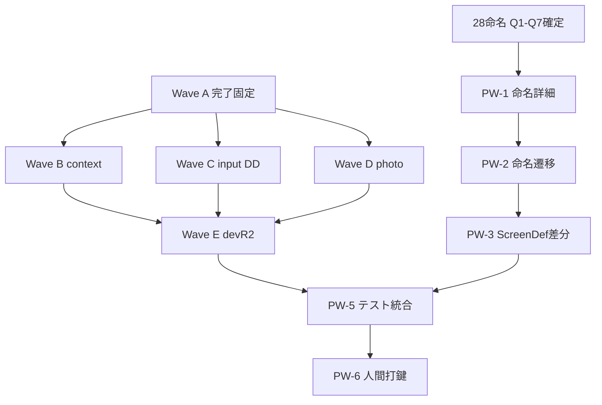

# ADR-プチWF-観測ver1残件と命名-v1-DRAFT

> ステータス: DRAFT（PW-1 完了: 詳細設計 v1 DRAFT 作成済）  
> 作成日: 2026-06-21  
> 対象: Phase 6/7 内のサブWF（観測 ver1残件 + #28 個体命名）  
> 正本参照: `ADR-UI-Rebuild-Waterfall-Plan-DRAFT.md` / `Phase6-打鍵フィードバック-v1.md` / `Phase6-W1-W3-進捗-v1.md` / `01-要件/00-プロダクト方針・MVP・拡張安全枠-v1-DRAFT.md` / `01-要件/05-観測.md` / `01-要件/28-個体命名・ブランドテンプレート-v1-DRAFT.md`

---

## 1. 目的・位置づけ

本ADRは、大ウォーターフォール（Phase 0〜7）のうち **Phase 6/7 の残件を漏れなく閉じるためのサブWF（プチWF）** を定義する。  
対象は次の2本柱:

1. 打鍵フィードバック（A-1..G-1）に基づく観測 ver1 残件整理  
2. `#28 個体命名・ブランドテンプレート`（Q1〜Q7確定済）の詳細設計投入

境界は固定する:

- **固定済み**: Phase 0〜5 凍結、`DELEGATED-IMPL-GO` 発行済、W0〜W3 実装済
- **ver1外固定（H1）**: アキネーター / SwitchBot / タグ洗練は post-ver1（ver2）扱い
- **契約固定（H2/H3）**: commit 契約 / R2ハイブリッド運用
- **命名固定**: Q1〜Q7 確定（Q7=C ハイブリッド）

---

## 2. 現状スナップショット（打鍵指摘 ID × 状態）

| ID | Wave | 優先 | 指摘要約 | 要件トレース | 現在状態 | 根拠 |
|---|---|---|---|---|---|---|
| A-1 | A | P1 | `/` の観測導線分離 | OBS-SOL-01 | ✅ 完了 | `Phase6-W1-W3-進捗-v1.md` 3.1 |
| B-1 | B | P1 | context の種族/対象カバレッジ不足 | OBS-TGT-01/04/05 | ⏳ 未着手 | `05-観測.md` 4.11 |
| B-2 | B | P2 | アキネーター不足 | OBS-TGT-03 | 💤 ver2延期確定 | `Phase6-打鍵フィードバック-v1.md` |
| C-1 | C | P0 | 入力項目/単位 DD 不足 | OBS-TPL-03/07 | 🟨 部分完了 | 辞書正規化は反映済、DD本格化は未了 |
| C-2 | C | P2 | タグ自然淘汰運用 | OBS-TAG-01 | 💤 ver2延期確定 | `00-プロダクト方針` 1.6 |
| C-3 | C | P2 | SwitchBot取得/管理/機器選択UI | OBS-ENV-02〜06 / OBS-TPL-08 | 💤 ver2延期確定 | H1確定・ver1外 |
| C-4 | D | P1 | 撮影と選択の分岐不足 | SC-05-PHOTO-01 | ⏳ 未着手 | `Phase5-ScreenDef-ver1-P0-v1-DRAFT.md` |
| D-1 | A | P0 | confirm編集で値が消える | SC-05-CONFIRM-01 | ✅ 完了 | `Phase6-W1-W3-進捗-v1.md` 3.1 |
| E-1 | A | P0 | 登録時 Internal Server Error | OBS-R2-01〜03 | ✅ 完了 | 辞書整合正規化で500回避 |
| E-2 | A | P0 | `sessionId/r2Key` stub | commit 契約 | ✅ 完了 | Wave A 反映済 |
| F-1 | E | P1 | dev R2 運用固定不足 | OBS-R2-04/05 | 🟨 部分完了 | H3方針確定、Runbook未整備 |
| G-1 | B/C | P2 | #06/#10/#11 連携不足 | ver1 OUT 境界 | 💤 ver2/post-ver1 | `00-プロダクト方針` 1.1/1.5 |

### 優先度集計（現時点）

- **P0（登録完走ブロッカー）**: C-1, D-1, E-1, E-2  
  - うち **D-1/E-1/E-2 は完了**、**残は C-1 のDD本格化**
- **P1（品質・運用）**: A-1, B-1, C-4, F-1  
  - うち **A-1 は完了**、残は B-1/C-4/F-1
- **P2（post-ver1）**: B-2, C-2, C-3, G-1（方針確定済）

---

## 3. プチWF Phase 定義（PW-0〜PW-6）

| PW | 名称 | 目的 | 主成果物 | Go条件 |
|---|---|---|---|---|
| PW-0 | 要件確定 | 境界漏れ防止 | 本ADR + トレース表 | H1/H2/H3/Q1-Q7固定確認 |
| PW-1 | 詳細設計 | API/Event/UI契約を確定 | Wave別詳細設計 md/yaml | 5点ゲート中「詳細」承認 |
| PW-2 | 遷移設計 | 画面遷移/状態機械固定 | 遷移図・状態表 | エラー導線まで確定 |
| PW-3 | ScreenDef差分 | ScreenDef を残件に追従 | ScreenDef差分表 | testid/SC紐付け完了 |
| PW-4 | 実装 | WIPを実装反映 | 実装PR群 | `DELEGATED-IMPL-GO` 維持 |
| PW-5 | テスト | Tier A/B/C準備 | UT/IT/ST/UAT更新 + E2E | CI緑 + SC充足 |
| PW-6 | 打鍵 | Tier D人間確認 | 打鍵記録 + サインオフ | 人間のみ |

---

## 4. Wave A〜E を PW Phase にマッピング（詳細設計成果物）

### 4.1 Wave A（即fix・既存完了の固定）

**状態**: ✅ 実装反映済（A-1, D-1, E-1, E-2）

**PW-1 で維持すべき成果物（差分管理）**

- `02-設計/features/05-観測/詳細設計-v2.md`（commit 契約章の最終反映）
- `02-設計/E2E/05-観測-E2E-v1-DRAFT.md`（SC-05-CONFIRM-01 / SC-05-REG-01 の期待値固定）
- `02-設計/_横断/Phase5-ScreenDef-ver1-P0-v1-DRAFT.md`（A系完了行に ✅ 注記）

### 4.2 Wave B（context）

**対象ID**: B-1（P1） + B-2（P2延期管理）

**PW-1 作成済（詳細設計）**

- `02-設計/features/05-観測/sub/WaveB-context-詳細設計-v1-DRAFT.md`
- `02-設計/_横断/schema/schemas/observation/observation_target_projection.schema.yaml`
- `02-設計/_横断/schema/schemas/events/observation_target_selected.event.schema.yaml`

**PW-2 作成済（遷移）**

- `02-設計/features/05-観測/sub/WaveB-context-遷移設計-v1-DRAFT.md`

**PW-3 作成済（ScreenDef差分）**

- `02-設計/features/05-観測/sub/WaveB-context-ScreenDef差分-v1-DRAFT.md`

**PW-5 作成予定（テスト設計）**

- `03-テスト計画/features/05-観測/sub/WaveB-context-テスト設計-v1-DRAFT.md`

### 4.3 Wave C（input 本格化）

**対象ID**: C-1（P0残） + C-2/C-3（P2延期管理）

**PW-1 作成済（詳細設計）**

- `02-設計/features/05-観測/sub/WaveC-input-dd-詳細設計-v1-DRAFT.md`
- `02-設計/_横断/schema/schemas/events/measurement_dictionary_selected.event.schema.yaml`
- `02-設計/_横断/schema/schemas/events/measurement_dictionary_extended.event.schema.yaml`

**PW-2 作成済（遷移）**

- `02-設計/features/05-観測/sub/WaveC-input-遷移設計-v1-DRAFT.md`

**PW-3 作成済（ScreenDef差分）**

- `02-設計/features/05-観測/sub/WaveC-input-ScreenDef差分-v1-DRAFT.md`

**PW-5 作成予定（E2Eシナリオ）**

- `02-設計/E2E/sub/SC-05-DD-INPUT-v1-DRAFT.md`
- `03-テスト計画/features/05-観測/sub/WaveC-input-テスト設計-v1-DRAFT.md`

### 4.4 Wave D（写真）

**対象ID**: C-4（P1）

**PW-1 作成済（詳細設計）**

- `02-設計/features/05-観測/sub/WaveD-photo-詳細設計-v1-DRAFT.md`
- `02-設計/_横断/schema/schemas/events/photo_capture_mode_selected.event.schema.yaml`

**PW-2 作成済（遷移）**

- `02-設計/features/05-観測/sub/WaveD-photo-遷移設計-v1-DRAFT.md`

**PW-3 作成済（ScreenDef差分）**

- `02-設計/features/05-観測/sub/WaveD-photo-ScreenDef差分-v1-DRAFT.md`

**PW-5 作成予定（E2E）**

- `02-設計/E2E/sub/SC-05-PHOTO-CAPTURE-SELECT-v1-DRAFT.md`

### 4.5 Wave E（dev R2運用）

**対象ID**: F-1（P1）

**PW-1 作成済（詳細設計/運用契約）**

- `02-設計/_横断/adr/ADR-H-28-devR2-運用固定-v1-DRAFT.md`
- `02-設計/features/05-観測/sub/WaveE-devR2-詳細設計-v1-DRAFT.md`

**PW-5 作成予定（検証Runbook）**

- `05-運用/runbooks/WaveE-devR2-確認手順-v1-DRAFT.md`
- `03-テスト計画/features/05-観測/sub/WaveE-devR2-テスト設計-v1-DRAFT.md`

---

## 5. 28命名の PW 計画（IND-NAME-xx）

### 5.1 ver1 IN / ver2 OUT（FR単位）

| FR | スコープ | 理由 | 対応PW |
|---|---|---|---|
| IND-NAME-01 | ver1 IN | 観測入力でID+表示名は必須 | PW-1/2/3 |
| IND-NAME-02 | ver1 IN | 未設定フォールバックは運用必須 | PW-1 |
| IND-NAME-03 | ver1 IN | name_event追記はINSERT ONLY必須 | PW-1/5 |
| IND-NAME-04 | ver1 IN | 改名履歴は研究再現性に直結 | PW-1/5 |
| IND-NAME-05 | ver1 IN | テンプレ作成は命名運用の入口 | PW-1/3 |
| IND-NAME-06 | ver1 IN | テンプレ適用は観測導線短縮 | PW-1/2/3 |
| IND-NAME-07 | ver1 IN | 更新/無効化は履歴保持で対応可能 | PW-1 |
| IND-NAME-08 | ver1 IN | 論理削除は履歴性要件 | PW-1 |
| IND-NAME-09 | ver1 IN | 親子表示（Q7=C）最優先 | PW-1/2/3 |
| IND-NAME-10 | ver2 OUT | 世代運用はlineage連携追加設計が必要 | post-ver1 |
| IND-NAME-11 | ver2 OUT | 昇格運用は評価運用設計が前提 | post-ver1 |
| IND-NAME-12 | ver2 OUT | 昇格主体記録は昇格導線と同時設計が安全 | post-ver1 |

### 5.2 命名向け成果物（PW-1更新）

- ✅ `02-設計/features/28-個体命名/詳細設計-v1-DRAFT.md`（PW-1 作成済）
- ✅ `02-設計/features/28-個体命名/遷移設計-v1-DRAFT.md`（PW-2 作成済）
- ✅ `02-設計/features/28-個体命名/ScreenDef差分-v1-DRAFT.md`（PW-3 作成済）
- `02-設計/features/28-個体命名/ui/UI設計-v1-DRAFT.md`
- ✅ `02-設計/_横断/schema/schemas/events/name_event.schema.yaml`（PW-1 作成済）
- ✅ `02-設計/_横断/schema/schemas/events/brand_template_event.schema.yaml`（PW-1 作成済）
- `03-テスト計画/features/28-個体命名/テスト設計-v1-DRAFT.md`

---

## 6. 既存 Phase 6/7 との整合表

| 既存工程 | 現状 | プチWF対応 | 整合ポイント |
|---|---|---|---|
| Phase 6 W0-W3 | ✅ 完了 | Wave Aを「完了固定」 | 再オープン禁止（証跡のみ更新） |
| Phase 6 W4 以降 | 未着手/後続 | Wave B〜E をPWで前段設計 | W4開始前に契約差分を閉じる |
| Phase 7 Tier A/B | 段階実施中 | PW-5で不足SCを補完 | ver1 in-scope限定 |
| Phase 7 Tier C | 部分 | PW-5にa11y明記 | 画面差分ごとに更新 |
| Phase 7 Tier D | 人間ゲート | PW-6で再打鍵 | AIは代替不可 |

---

## 7. 依存関係 DAG

---

## 8. 人間ゲート一覧（固定済 + 今後）

| Gate | 内容 | 状態 |
|---|---|---|
| H1 | ver2延期（Akinator/SwitchBot/タグ） | ✅ 固定 |
| H2 | commit 契約採用 | ✅ 固定 |
| H3 | R2 ハイブリッド運用 | ✅ 固定 |
| Q1-Q7 | 命名方針（Q7=C含む） | ✅ 固定 |
| PW-1 Go | Wave B〜E/命名の詳細設計着手 | ✅ 完了（詳細設計 v1 DRAFT） |
| PW-4 Go | 実装着手（設計成果物反映後） | ✅ 実行中（2026-06-21） |
| PW-6 | Tier D最終サインオフ | ⏳ 人間専用 |

---

## 9. チェックリスト（grep用ID）

- [x] A-1
- [x] B-1
- [x] B-2
- [x] C-1
- [x] C-2
- [x] C-3
- [x] C-4
- [x] D-1
- [x] E-1
- [x] E-2
- [x] F-1
- [x] G-1
- [x] Wave-A
- [x] Wave-B
- [x] Wave-C
- [x] Wave-D
- [x] Wave-E
- [x] IND-NAME-01
- [x] IND-NAME-02
- [x] IND-NAME-03
- [x] IND-NAME-04
- [x] IND-NAME-05
- [x] IND-NAME-06
- [x] IND-NAME-07
- [x] IND-NAME-08
- [x] IND-NAME-09
- [x] IND-NAME-10
- [x] IND-NAME-11
- [x] IND-NAME-12

---

## 10. 次アクション

1. **PW-4 実装継続**（Wave B/C/D + #28 ver1 IN）  
2. PW-5 でテスト設計と自動検証を更新  
3. PW-6 人間打鍵（Tier D）へ接続

---

*本ADRは docs-only 設計文書。実装変更・コミットは本書のスコープ外。*
