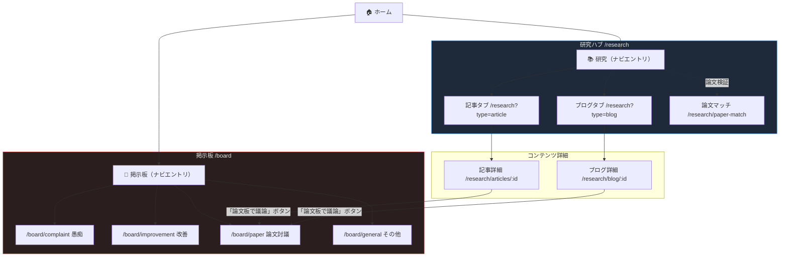
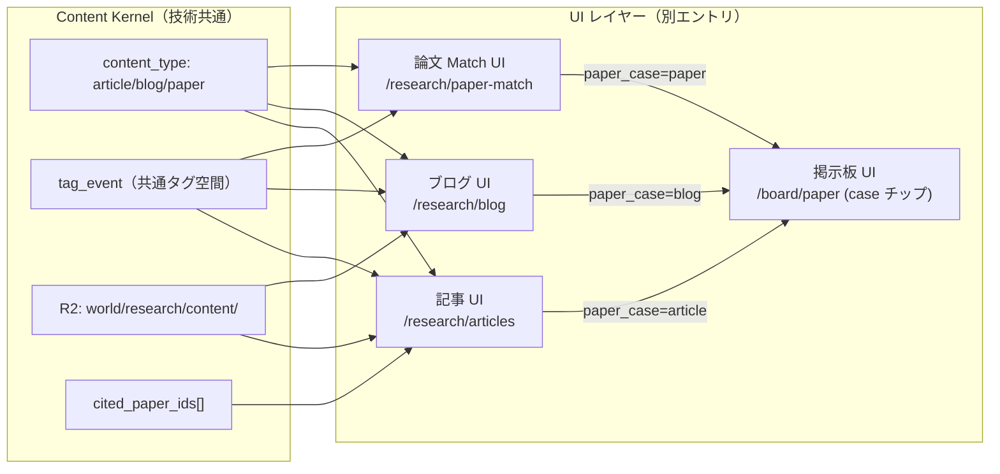

# 07/09/24 — 掲示板・論文・記事・ブログ コンテンツ導線 UX 提案 v1

> **ステータス**: DRAFT — 人間レビュー待ち（設計ゲート未通過・実装禁止）  
> **作成日**: 2026-06-18  
> **担当**: A90（AI 管理官）  
> **目的**: 掲示板・記事・ブログ のナビゲーション整理。技術基盤は共通だが、ユーザー体験はどう切り分けるか。**1 つの推奨案**を提示し、人間判断を求める。  
> **凡例**: `[v1]` = Wave 3 E2E 設計に含める候補 · `[post-v1]` = Wave 4 以降 · `[AI仮定]` = 未確定・人間に確認が必要  
> **対象 spec**: `07-掲示板.md` · `09-論文.md` · `24-記事・ブログ-v1-DRAFT.md` · `00-プロダクト方針` §3 FR-CONTENT-NAV-*

---

## §A — ユーザー向けメンタルモデル（平易な日本語）

### A.1 三者の直感的な違い

| 場所 | 一言 | 使う動詞 | 主役 |
|------|------|---------|------|
| **掲示板** | みんなで話す場所 | 「書き込む」「返信する」「愚痴る」「提案する」 | スレッドと会話 |
| **記事** | 読んで学ぶ。誰かが整理した知識 | 「読む」「引用する」「参照する」 | 編集された知識・解説 |
| **ブログ** | 書いて発信する。自分の観察の記録 | 「書く」「記録する」「観測を残す」 | 個人の声・観察ログ |
| **論文** | 仮説を検証する。条件と観測を突き合わせる | 「マッチさせる」「検証する」「仮説を作る」 | 観測データと条件 P |

**直感ルール（3 秒で説明できる切り分け）**:  
- 「誰かに話しかけたい・議論したい」→ **掲示板**  
- 「何かを整理して共有したい・人に読ませたい」→ **記事**  
- 「自分の観察・経験を記録したい」→ **ブログ**  
- 「観測データが論文の条件を満たすか調べたい」→ **論文（Paper Match）**

### A.2 共通する技術基盤 vs ユーザー体験の切り分け

| 観点 | 技術レイヤー（内側） | UX レイヤー（外側・ユーザーが見る） |
|------|---------------------|-------------------------------------|
| データ構造 | `content_type` enum（`article`/`blog`/`paper`）で 1 スキーマ | **3 つの入口**。一緒に見せない |
| タグ | 共通 `tag_event`（append-only） | 横断ハブでのみ「全コンテンツからタグ絞り込み」 |
| 議論 | `/board/paper?case=article`（`paper_case` enum 共通） | **コンテンツ詳細画面からリンク**。掲示板は独立エントリ不要 |
| 保存 | R2 `world/research/content/` 共通 | ユーザーは「記事を書く」「ブログを書く」の区別で操作 |

> **設計原則**: 「技術が同じ = 一緒にしてよい」ではない。**認知コスト**がナビ統合のコスト・ベネフィットを決める。

---

## §B — IA パターン比較（3 案）と推奨

### B.1 比較表

| # | 案名 | ナビエントリ | 長所 | 短所 |
|---|------|------------|------|------|
| **P1** | **研究ハブ + 社交ボード 分離**（**推奨**） | `研究` → 記事/ブログ/論文 タブ。`掲示板` → 4 入口 | 「読む・書く」と「話す」が明確。3 クリック達成。既存 ADR-H-07 に整合 | ハブ内のタブが 3 つ（記事・ブログ・論文）で若干多い。冗長感あり |
| **P2** | Hub「知の広場」1 エントリ | `/knowledge` に 4 タブ（掲示板・記事・ブログ・論文） | 1 エントリでシンプル | 掲示板の「話す」と記事の「読む」を同列に並べると認知混乱 |
| **P3** | 読者 / 書き手 分離 | `/read`（記事＋掲示板閲覧）/ `/write`（ブログ＋投稿） | ロール明快 | 掲示板が 2 分割（閲覧と投稿でエントリ違う）。直感に反する |

**推奨: P1「研究ハブ + 社交ボード 分離」** — 後述 §C で詳述。

### B.2 推奨根拠

1. **ADR-H-07 と整合**: 掲示板の入口は「愚痴・改善・論文・その他」4 つで確定。これは **社交・提案・議論の場**。記事/ブログは **コンテンツ創作の場**。2 つは異なる動機。
2. **preferences.md §A 整合**: 1 画面 1 主タスク。ハブ画面の主タスクは「コンテンツ発見」。掲示板の主タスクは「発言・返信」。混在は 1 画面 1 目的に反する。
3. **技術共通基盤の境界**: 議論スレ（`/board/paper?case=article`）はコンテンツ詳細画面の **ボタン 1 つ**で到達（FR-ART-11）。ユーザーはコンテンツを読んでから「議論したい」と思う。ナビ上で掲示板と記事を隣に置く必要はない。
4. **コンテンツ三体ハブ（FR-CONTENT-NAV-01）**: `論文・記事・ブログ` は `content_type` で共通スキーマ。横断ハブで一覧するのは **この 3 者のみ**が自然。

---

## §C — 推奨 IA・ルート・ナビラベル

### C.1 ナビゲーション構造

```
トップナビ（主要エントリ）
  ├── ホーム（/）
  ├── 観測（/observation）
  ├── 研究（/research）          ← 記事・ブログ・論文の起点
  ├── 掲示板（/board）           ← 社交・議論・愚痴・改善の起点
  └── ... （設定・プロフィール等）
```

### C.2 「研究」配下の詳細

```
/research                       横断コンテンツハブ（FR-CONTENT-NAV-01）
  ├── タブ: 論文          /research?type=paper
  ├── タブ: 記事          /research?type=article   または /research/articles
  └── タブ: ブログ        /research?type=blog      または /research/blog

/research/articles/:id          記事詳細
/research/blog/:id              ブログ詳細
/research/articles/new          記事投稿
/research/blog/new              ブログ投稿
/research/paper-match           論文マッチ UI（#09 既存）
```

### C.3 「掲示板」配下の詳細（ADR-H-07 確定）

```
/board                          掲示板トップ（4 入口）
  ├── 愚痴          /board/complaint
  ├── 改善          /board/improvement
  ├── 論文          /board/paper                   ← 研究討議（case チップあり）
  └── その他        /board/general
```

`/board/paper` の `paper_case` チップ:  
`paper` · `observation` · `breeding_log` · `analysis` · `review` · **`article`** · **`blog`** · `other`  
（D-MVP-08 §AI仮定 確定済み）

### C.4 3 クリック導線（主要パス）

| ユーザー目的 | パス | クリック数 |
|------------|------|-----------|
| 記事を読む | ホーム → 研究 → 記事一覧 | **2 クリック** |
| 記事から議論 | 記事詳細 → 「論文板で議論」ボタン → `/board/paper?case=article` | **1 クリック（詳細から）** |
| ブログを書く | ホーム → 研究 → 「ブログを書く」ボタン | **2 クリック** |
| 愚痴を書く | ホーム → 掲示板 → 愚痴スレッドへ | **2 クリック** |
| 改善提案 | ホーム → 掲示板 → 改善スレッドへ | **2 クリック** |
| 横断検索 | 研究ハブのタグチップ or 検索 | **1 操作（ハブから）** |

全パス **3 クリック以内** — preferences.md §A 達成。

---

## §D — 共通技術レイヤー vs ユーザー向け区別

### D.1 Content Kernel（共通）

```text
Content Kernel
  ├── schema: content_type = 'article' | 'blog' | 'paper'
  ├── tag_event（append-only、横断タグ空間）
  ├── cited_paper_ids[]（引用リンク、片方向 v1）
  ├── observation_session_ids[]（観測リンク）
  └── summary_ref（AI 要約バッチ #25 連携）
```

**一本化すること**:
- R2 保存先: `world/research/content/{content_id}.json`（FR-ART-02）
- `tag_event` スキーマ: `09-論文.md` FR-PAPER-02 と共通
- 掲示板接続: `/board/paper?case={content_type}` で 3 種共通化（FR-CONTENT-NAV-04）

### D.2 Board Kernel（独立）

```text
Board Kernel
  ├── board_type = 'complaint' | 'improvement' | 'paper' | 'general'
  ├── paper_case（/board/paper のみ）: 論文系・article・blog の case チップ
  └── board_pointer（裁判連携・FR-BBS-12）
```

**一本化しないこと**:
- 掲示板スレッドの本体（メッセージ・投稿者）は Content スキーマと **別エンティティ**
- `/board/paper` スレッドは「このコンテンツを議論するスペース」であり、記事/ブログの本文ではない

---

## §E — 統合してはいけない境界

### E.1 掲示板 vs コンテンツ（最重要）

| 境界 | 統合 NG の理由 |
|------|--------------|
| 掲示板スレッド ≠ 記事本文 | スレッドは発言者が多人数、記事は著者が主体。認知的に別物 |
| `/board` エントリ ≠ コンテンツ発見経路 | ユーザーが「記事を探す」動機で掲示板を開く設計は不自然 |
| 掲示板投稿 ≠ ブログ投稿 | 掲示板は「返信を期待した発言」、ブログは「記録・発信」。用途が違う |

### E.2 ネイティブ CMS vs 外部 Discourse の境界

本仕様では **Discourse ブリッジは想定外**（07-掲示板.md IHL rebuild 方針）。  
掲示板は **IHL ネイティブ CMS**（GitHub + R2）で運営。  
外部 Discourse を導入する場合は **別 ADR** が必要。統合しない限り：

| 項目 | ネイティブ CMS（採用） | Discourse（不採用） |
|------|---------------------|---------------------|
| 議論スレッド | `/board/paper` ネイティブ実装 | Discourse embed |
| 認証 | 共通 auth（IHL） | Discourse SSO 別途 |
| R2 append-only | 遵守 | Discourse は UPDATE 前提 |
| 工数 | ネイティブ設計の延長 | SSO・embed・R2 同期すべて追加工数 |

**結論**: Discourse ブリッジは v1 スコープ外。追加 ADR 前は統合しない。

### E.3 論文マッチ UI vs コンテンツ閲覧

`/research/paper-match`（#09 Paper Match）はデータ検証ツールであり、  
`/research/articles`（#24 記事一覧）とは **ユースケースが別**。  
ハブタブに「論文マッチ」を置くか「論文」タブ（=記事一覧相当）にするかは要確認（後述 §G）。

---

## §F — E2E への含意（STUB 展開方針）

### F.1 E2E 正本の分割方針

| スコープ | E2E STUB | 優先度 |
|---------|---------|--------|
| 掲示板（4 入口・投稿・case チップ） | `07-掲示板-E2E-v1-DRAFT.md`（既存） | Wave 2 |
| コンテンツハブ `/research/content`（記事・ブログ横断一覧） | `24-記事ブログ-E2E-v1-DRAFT.md`（未作成） | Wave 3 |
| 記事詳細 → 「論文板で議論」導線 | `24-記事ブログ-E2E-v1-DRAFT.md` 内シナリオ | Wave 3 |
| 論文マッチ UI 到達（REQ-014） | `09-論文-E2E-v1-DRAFT.md`（未作成） | Wave 3 |

**STUB は 1 本に集約**（`24-記事ブログ-E2E-v1-DRAFT.md`）:  
記事・ブログの E2E は同一スキーマ・同一ハブから到達するため、1 STUB で `article` と `blog` の両 `content_type` をカバーする。  
論文は `paper-match` の独立動線のため **別 STUB**（`09-論文-E2E-v1-DRAFT.md`）。

### F.2 主要 E2E シナリオ骨子

```
SC-24-HUB-01: /research → 記事タブ → 記事詳細 → 「論文板で議論」ボタン → /board/paper?case=article
SC-24-CREATE-01: /research → 記事タブ → 「記事を書く」ボタン → 投稿フォーム → 保存 → 詳細画面
SC-24-BLOG-01: /research → ブログタブ → ブログ詳細 → 観測セッションリンク → /observation/sessions/:id
SC-24-TAG-01: /research → タグチップ選択 → 論文・記事・ブログ混在リスト表示
```

掲示板 E2E（既存）との接続:  
`SC-07-PAPER-01`（`/board/paper` 到達）は `SC-24-HUB-01` の後続シナリオとして **独立維持**。  
2 つの STUB が `paper_case=article` のパスで疎結合に接続する。

---

## §G — AI 仮定（人間判断を最小化）

### G.1 確定済み（§AI仮定 確定・ユーザー返答不要）

| ID | 確定内容 | 根拠 |
|----|---------|------|
| D-MVP-03 | 記事 vs ブログは `content_type` enum で兼用。別スキーマなし | `00-プロダクト方針` §9 |
| D-MVP-08 | `paper_case` enum に `article`・`blog` を追加 | `00-プロダクト方針` §9 |

### G.2 本提案の AI 仮定（ユーザー確認が必要なもの）

| ID | 仮定 | 推奨値 | 不確実度 |
|----|------|-------|---------|
| D-NAV-01 | ナビの「研究」ラベル vs「知識」「コンテンツ」 | **「研究」**（既存 `/research/*` と整合） | 低 |
| D-NAV-02 | `/research` ハブのタブ: `記事 / ブログ / 論文` の 3 タブ vs `記事 / ブログ` の 2 タブ（論文マッチは別導線） | **2 タブ（記事・ブログ）+ 論文マッチは `研究` 配下の別ページ**。ハブタブは `content_type` に揃える | 中 |
| D-NAV-03 | 掲示板ナビラベル: 「掲示板」vs「コミュニティ」vs「議論」 | **「掲示板」**（ADR-H-07 に準拠。ユーザーへの馴染みが高い） | 低 |

**ユーザーへの最小確認事項（2 点のみ）**:

> 1. **D-NAV-02**: `/research` ハブに「論文（Paper Match）」タブを入れますか？  
>    推奨は「記事・ブログ 2 タブ + 論文マッチは別導線」です。  
>    理由: Paper Match はデータ検証ツールであり、コンテンツ閲覧とは目的が異なります。
>
> 2. **掲示板 Discourse ブリッジ**: 将来的な Discourse 導入を想定していますか？  
>    現仕様はネイティブ CMS 前提です。Discourse を使う場合は ADR が必要です。

---

## §H — ダイアグラム（Mermaid）

### H.1 推奨 IA 全体像



### H.2 Content Kernel 共通基盤と各 UI の接続



---

## §I — クロスリンク（更新推奨）

本提案が採用された場合、以下に 1 行追記する:

- `07-掲示板.md` §2 — 「掲示板からコンテンツ詳細へのリンクはない。逆方向のみ（FR-ART-11）」を明記  
- `24-記事・ブログ-v1-DRAFT.md` §② — ルート一覧に `[推奨案 P1]` タグを付与  
- `00-プロダクト方針` §4 — Wave 3 の記事/ブログ E2E STUB 追記

---

## §J — 設計ゲートステータス（本提案の位置）

| # | 成果物 | 本提案での扱い |
|---|--------|--------------|
| 1 | 要件定義 | `24-記事・ブログ-v1-DRAFT.md` DRAFT 状態。本提案は **遷移設計・UI の先行ドラフト** |
| 2 | 詳細設計 | 未着手（スキーマは §D で概念整理済み） |
| 3 | **遷移設計** | 本提案 §C が骨子。**人間確認後に `02-設計/features/24-*/遷移設計-v1.md` へ昇格候補** |
| 4 | **UI 設計** | 本提案 §C/H が骨子。ワイヤーフレームは未作成 |
| 5 | テスト設計 | 未着手（§F が E2E 骨子） |

**実装禁止**: 上記ゲート 5 点が人間確定・明示 Go になるまでコード変更禁止（`design-before-implementation-gate.mdc`）。

---

*DRAFT・非正本 / 人間レビュー用 / 設計 AI 引き継ぎ用*
