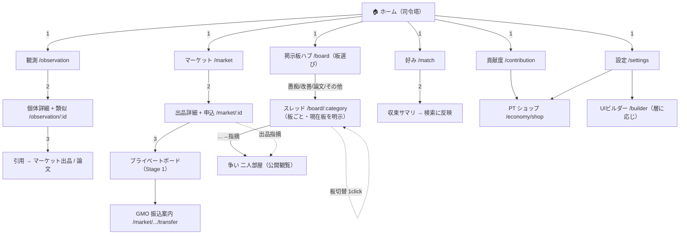
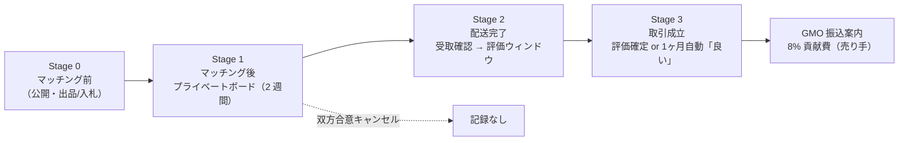
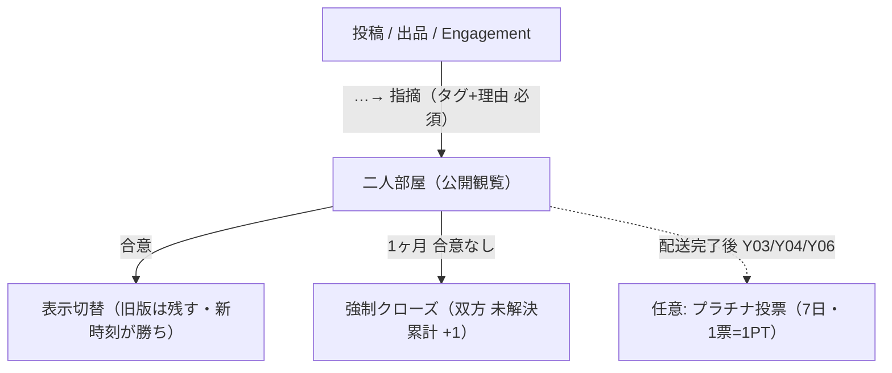

# 00 遷移マップ — ホーム → 主要導線（迷路化禁止）

> **ステータス**: **草案 · 人間目視レビュー待ち**（設計ゲート「遷移設計」）
> **作成日**: 2026-06-07
> **原則**: ホームからの行先は **5〜7 個まで** · どの主タスクも **最大 3 クリック**（`ui-reference/preferences.md` §A · anti-maze）。
> **正本**: 各機能の遷移は `01-要件/NN-*-遷移設計-v1.md`（16/10 は作成済）。本図は **全体像の俯瞰**。
> **クリックパス表（mock 対応）**: [`00-遷移マップ-全体.md`](./00-遷移マップ-全体.md) — UX ウォークスルー用 Step 表。
> **掲示板は板サブツリー**（ハブ + 板種別）。板ごとの投稿先・クリック数・指摘入口は [`07-掲示板-遷移詳細.md`](./07-掲示板-遷移詳細.md)。

---

## 1. トップレベル導線（ホーム = ハブ）

> 太線 = 主導線（クリック数）。点線 = 文脈リンク（出品 → 指摘で争いへ）。

---

## 2. クリック深度表（最大 3）

| 到達したい主タスク | 経路 | クリック |
|--------------------|------|:--------:|
| 観測を探す | ホーム → 観測 | **1** |
| 個体を引用する | ホーム → 観測 → 個体詳細 → 引用 | **3** |
| 出品を見る | ホーム → マーケット | **1** |
| 取引を申し込む | ホーム → マーケット → 出品詳細（申込） | **2** |
| 振込案内を出す | ホーム → マーケット → 出品 → （取引成立後）振込案内 | **3** |
| 好みを記録する | ホーム → 好み（タップ） | **1** |
| 投稿する | ホーム → 掲示板ハブ → 板 → スレッド（投稿） | **3** |
| 指摘 → 二人部屋 | ホーム → 掲示板ハブ → 板スレッド → 指摘 | **3** |
| 板を切り替える | スレッド左ナビで別板を選ぶ | **1** |
| 貢献度を見る | ホーム → 貢献度 | **1** |
| 免罪符を買う | ホーム → 貢献度/設定 → PT ショップ（購入） | **2** |

> いずれも **3 クリック以内**。4 クリック以上が必要なら導線を見直す（迷路化サイン）。

---

## 3. 取引タイムライン（マーケット → 振込）

> 正本: [`../01-要件/06-マーケット.md`](../01-要件/06-マーケット.md) §11.0 / §11.0.1 · [`23-GMO銀行振込判定.md`](../01-要件/23-GMO銀行振込判定.md) §3。

> **注意**: 成約／`settled` は **取引成立ではない**。8% 振込案内は **Stage 3（取引成立）後** にのみ表示。

---

## 4. 争いの分岐（掲示板・マーケット共通の「指摘」）

> 正本: [`../01-要件/11-裁判.md`](../01-要件/11-裁判.md) §3 / §6 · §14（哲学）。

> **通報ボタンは置かない**（指摘 + 対話モデル）。開発者は裁判官ではない（§1.1）。

---

## 5. レビュー観点

- [ ] ホームの行先が **5〜7 個** に収まっているか
- [ ] すべての主タスクが **3 クリック以内** か（§2）
- [ ] 取引の **8% 振込が Stage 3 後** に紐づくか（成約直後に出さない）
- [ ] 「指摘」入口が掲示板・マーケットで **同型** か（特別フロー乱立なし）

---

*草案 · 非正本 / 人間目視レビュー待ち / 実装禁止ゲート有効*
