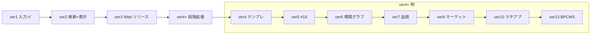

# IHL 段階リリース計画 — ver1 / ver2 / ver3 / ver4+

> **用途**: IHL の **ユーザー向けバージョン語彙**（ver1〜4+）の正本。旧 **Phase 0〜7** は本 doc の **付録 A** にマッピング表として残す。  
> **作成日**: 2026-06-26  
> **前提**: 観測 **ver1 COMPLETE**（2026-06-26 ユーザー宣言）  
> **関連**: [`観測v1完了-横展開と段階計画.md`](./観測v1完了-横展開と段階計画.md)（reuse パターン・設計ゲート・旧 Phase 詳細）· [`01-要件/05-観測.md`](../../01-要件/05-観測.md) §「v1 完成サマリー」  
> **ステータス**: **v1.0 確定**（2026-06-26 · §8.1 全 24 件確定）

---

## 0. バージョン語彙（一文定義）

| バージョン | 定義 | 状態 |
|------------|------|------|
| **ver1** | **観測入力**の完成 — context → input → confirm → commit · binding 派生 · 3 データチャンク · StructuredRow | **✅ COMPLETE**（2026-06-26） |
| **ver2** | **検索 + 表示**の完成 — **`.dev` 環境**で観測を検索でき、**画像表示** + **Q2 可変詳細表示**（テンプレ可変 1〜100 行）ができる | **✅ COMPLETE**（2026-06-26） |
| **ver3** | **初回 Web リリース** — ユーザーが日常利用したい **コア機能が揃った時点**で、インターネット上に一旦公開 | **🔄 進行中**（2026-06-26 · M1 詳細 polish 完了 · **順2 認証基盤着手**） |
| **ver4+** | **段階的機能拡張** — 後続開発が楽になる順に、機能区分ごとに ver を切る（**ver4, ver5, …** — §8.1 C8 確定） | **バックログ整理済み（優先順 §8.1 C4 確定）** |

**旧 Phase との関係**: Phase 番号は **設計ゲート・V-model 実行用の内部ラベル**として継続利用可。ユーザー向けマイルストーンは **ver1〜4+** を正とする（付録 A 参照）。

---

## 1. ver1 — 観測入力 COMPLETE ✅

### 1.1 完了宣言

- **日付**: 2026-06-26  
- **根拠**: ユーザー宣言 · 手動 UI 打鍵完了 · [`05-観測.md`](../../01-要件/05-観測.md) §「v1 完成サマリー」同期

### 1.2 IN スコープ（要約）

| 区分 | 内容 |
|------|------|
| **入力導線** | WorkflowContext · テンプレ適用 · 可変計測行 · 写真 3 チャンク · confirm → commit |
| **永続化** | R2 INSERT ONLY · `capture_id` スパイン · binding 派生 · StructuredRow |
| **環境 IoT（最小）** | Tier B ingest / CSV import · `/latest` · dev のみ `/sync` |
| **個体** | `individual_id` · sire/dam 記録 · 1 世代親ナビ（グラフは ver4+） |
| **開発起動** | OBS-RX-DEV-01 — hybrid Docker API :8000 + Next :3000 |

### 1.3 意図的 OUT（ver2 以降）

- 観測検索 **Next.js 詳細 UI**（可変セクション全面）  
- `clientContentDigest` commit 配線 · binding **差分** confirm  
- 計測行 IoT **必須**化（OBS-INPUT-06/07）  
- #18 本番パイプライン · 類似検索本番 · BPCMS strict · マーケット / マチアプ / 裁判

**横展開パターン正本**: [`観測v1完了-横展開と段階計画.md`](./観測v1完了-横展開と段階計画.md) §2

---

## 2. ver2 — 検索 + 表示 ✅ COMPLETE（2026-06-26）

### 2.0 完了宣言

- **日付**: 2026-06-26  
- **根拠**: ユーザー宣言（ver2 COMPLETE = 全 UAT 一括承認）· §2.2 A〜E 充足 · [`docs/ver2-human-signoff.md`](../../docs/ver2-human-signoff.md)

### 2.1 目標（ユーザー定義）

> **ver2 完了** = `.dev` で検索でき、**画像表示** + **Q2 の可変詳細表示**ができる。

「Q2」= 監査 02f61dbb · [`Phase6-打鍵フィードバック-v1.md`](../Phase6-打鍵フィードバック-v1.md) §4.6 — テンプレ可変の計測行（1〜100 行）・`devices[]` · `photo_conditions[]` · `environment_snapshot` の **存在ベース動的セクション**。

### 2.2 ver2 DONE 判定基準（機械 + 人手）

以下 **すべて** を満たした時点で **ver2 COMPLETE** と宣言する。

#### A. 環境（`.dev`）— §8.1 **C1=A** 確定

| # | 基準 | 検証方法 |
|---|------|----------|
| A1 | **`.dev` 環境**が文書化され、チーム全員が同一定義で起動できる | §2.3 · [`docs/dev-runbook.md`](../../docs/dev-runbook.md) · OBS-RX-DEV-01 |
| A2 | その環境で **Next.js Web**（`:3000`）+ **API**（`:8000`）が稼働 | `dev-up` · `/health` · ホーム表示 |
| A3 | 観測データが **読み取り可能**（**ローカル hybrid R2 / dev バケット** — §8.1 **C2**） | 既存 commit データで検索ヒット |

> **確定**: `.dev` = **ローカル hybrid**（OBS-RX-DEV-01）。staging URL は **ver3（B7=B 本番ドメイン）** まで任意。

#### B. 検索

| # | 基準 | 検証方法 |
|---|------|----------|
| B1 | `/observation` で **フィルタ → 結果グリッド**がキーボード操作可能 | E2E / Tier B · `data-testid` |
| B2 | 検索は **`searchable_capture_set` 横投影**（whitelist 列）— 詳細の代替にしない | API 契約 · 設計 §4.6 #3 |
| B3 | **深リンク** `/observation/:capture_id` で詳細へ遷移 | 遷移設計 v2 検索節 |
| B4 | 空状態 · ローディング · 404 に代替導線 | U-* ルーブリック |

#### C. 表示（Q2 可変詳細）

| # | 基準 | 検証方法 |
|---|------|----------|
| C1 | 詳細は **`GET /api/v1/observation/{capture_id}` 縦持ち Truth** から描画 | §4.6 #3 · 横投影と読み分け |
| C2 | **`measurements[]`** — テンプレ可変 1〜100 行を欠落なく表示（折りたたみ / グルーピング可） | 20+ 行の手動 UAT |
| C3 | **存在ベース動的セクション**: `devices[]` · `photo_conditions[]` · `environment_snapshot`（B モデル準拠） | 写真あり/なし両ケース |
| C4 | **画像表示** — commit 済み **blob 直接表示**（§8.1 **A2=A** · #18 thumbnail パイプラインは ver3） | 実データ 1 件以上 |
| C5 | **snapshot 表**（単一 capture の環境・撮影条件）— **時系列グラフは ver4+**（説明リンクのみ可） | §4.6 #4 境界 |

#### D. ver2 IN/OUT（§8.1 A1〜A8 確定）

| # | 項目 | 旧 Phase | 確定 |
|---|------|----------|------|
| D1 | **類似検索導線**（embedding 未本番 · locator 有時表示） | Phase 2 | **IN**（§8.1 **A3=A** · 本番 rerank は ver5） |
| D2 | **reanalysis-manifest** 閲覧 route | Phase 2 | **IN**（§8.1 **A4=A** · 最小メタ） |
| D3 | **`clientContentDigest`** commit 配線 | Phase 1 | **IN**（§8.1 **A5=A** · ver2 必須） |
| D4 | confirm **binding 差分サマリー** | Phase 1 | **OUT ver2 / IN ver3**（§8.1 **A5=A**） |
| D5 | Streamlit 検索 UI | — | **OUT**（§8.1 **A1=A** · Next.js `/observation` のみが DONE 条件） |
| D6 | **OBS-INPUT-06/07**（計測行 IoT 必須） | Phase 1 | **OUT**（§8.1 **A6=A** · ver4+ まで維持） |
| D7 | 検索詳細 **時系列グラフ** | Phase 4 | **OUT**（§8.1 **A7=A** · snapshot 表のみ · グラフは ver6） |
| D8 | 手動検証 | — | **Tier B 自動 + 代表 path 手打鍵**（§8.1 **A8=A** · Tier D は ver3） |

#### E. 設計ゲート（実装 GO 前）

ver2 着手・完了宣言の前に [`観測v1完了-横展開と段階計画.md`](./観測v1完了-横展開と段階計画.md) の以下を満たすこと:

- **§4.5** 着手前チェックリスト 全 `[x]`  
- **§4.4** Phase 1 差分設計 3 点（D3/D4 を IN にする場合）  
- **§4.6** Phase 2 差分設計 5 点（検索 UI v2 · 遷移 · 詳細 API · ウィジェット境界 · reanalysis-manifest）

### 2.2.1 進捗メモ（2026-06-26 · COMPLETE）

| 区分 | 状態 |
|------|------|
| 実装 | 検索グリッド · Q2 可変詳細 · 写真あり/なし · digest · manifest · 類似導線 — **完了** |
| 機械検証 | `pytest tests/unit/test_observation_detail.py` · Playwright `e2e/ihl-observation-ver2.spec.ts`（`npm run test:e2e:ver2`）— **緑** |
| ドキュメント | [`docs/dev-runbook.md`](../../docs/dev-runbook.md) · [`docs/ver2-verification-checklist.md`](../../docs/ver2-verification-checklist.md) · [`docs/ver2-human-signoff.md`](../../docs/ver2-human-signoff.md) |
| 人手 UAT | **2026-06-26 ユーザー宣言** — A〜G 全承認（残項目は完了前提の一括 signoff） |
| **ver2 COMPLETE** | **✅ 2026-06-26** — 次マイルストーン **ver3** |

### 2.2.2 詳細画面の完成度（mock 感との切り分け）

| バージョン | 詳細画面で「完成」と言えること | まだ mock 的に見えてよい／後回しでよいこと |
|------------|-------------------------------|------------------------------------------|
| **ver2 DONE** | **機能完成** — Truth 縦持ち API からの **存在ベース動的セクション**（計測 1〜100 行 · 折りたたみ · 撮影条件 · 環境 snapshot · デバイス · 写真 blob · 類似導線 · manifest）· 検索→詳細深リンク · 代表 path 手打鍵 · Tier B 自動 | **高完成度ビジュアル polish ではない**。`_ui-global/mockups/` の PNG との **ピクセル一致**は要求外。デスクトップ中心レイアウト · 最小限の civ トークンで可 |
| **ver3** | **リリース品質** — **レスポンシブ**（§8.1 B6=A）· **一貫トークン**（`preferences.md` · `civUi.css`）· 空状態・404・キーボード導線の **U-*** 整合 · confirm **binding 差分** UI · #18 最小 thumbnail パイプライン · **Tier D** 相当の公開導線手打鍵 | 類似 rerank 本番 · 時系列グラフ · IoT 必須化 |
| **ver5+** | 類似検索 **本番 rerank** · embedding 品質上限 | — |
| **ver6+** | 環境 **時系列グラフ**（Occupancy JOIN 可視化） | — |

> **要点**: 詳細が「まだ mock っぽい」と感じるのは **ver2 スコープ外の visual polish** が未着手だからであり、**ver2 としての機能完成とは矛盾しない**。UI polish は **独立バージョンではなく ver3（初回 Web リリース）の IN スコープ**（§3.2 · Phase 2 残 polish · `definition-of-done-high-finish.md` U-* ゲート）。

**設計正本**: [`観測検索-v2.md`](../features/05-観測/ui/観測検索-v2.md) §2 registry · [`観測v1完了-横展開と段階計画.md`](./観測v1完了-横展開と段階計画.md) §4.6

### 2.3 `.dev` 環境定義（§8.1 **C1=A** 確定）

| 候補 | 内容 | 採用 |
|------|------|------|
| **A** | ローカル hybrid — `dev-up.ps1` · API Docker :8000 · Next :3000 · ローカル R2 または dev バケット | **✅ 確定** |
| B | チーム共有 **staging URL**（例: `*.dev` TLD または Cloudflare Pages preview） | ver3 直前まで任意 |
| C | ローカル + staging **両方**を ver2 DONE の検証対象にする | 不採用 |

### 2.4 旧 Phase → ver2 マッピング

| 旧 Phase | 名称 | ver2 への含め方 |
|----------|------|-----------------|
| **Phase 1** | ver2 配線（digest · binding diff · INPUT-06/07） | **IN**: D3（digest）· **ver3**: D4（binding diff）· **OUT**: D6（INPUT-06/07） |
| **Phase 2** | 検索・一覧 UI + Q2 詳細 | **ver2 コア（必須）** — A1=A Next.js のみ |
| **Phase 3（一部）** | 写真表示 | **ver2**: 既存 blob 表示（A2=A）· **ver3**: #18 最小パイプライン（B5①） |

---

## 3. ver3 — 初回 Web リリース

### 3.1 目標

**インターネット上で、信頼できるユーザーが日常利用できる**最初の公開版。ver2 の「検索 + 表示」に加え、**入力〜閲覧の一連ループ**と **最低限の運用基盤**を揃える。

### 3.1.1 ver3 サブ優先順位（2026-06-26 確定）

ver3 着手時の **実装・ polish の優先順**（§3.2 IN 全体のうち、並行作業の先頭付け）:

| 順 | 項目 | 内容 | 状態 |
|----|------|------|------|
| **1** | **観測詳細 polish** | `ihl-05-obs-detail-similar.png` mock 準拠 — パンくず · ヒーロー写真 · 撮影条件構造化 · 計測由来タグ · 類似サイドバー · 引用 CTA | **✅ M1 完了**（2026-06-26） |
| **2** | **認証・本番デプロイ** | magic link · CF Pages + `api.it-hercules.uk`（Sakura VPS 512MB）· 本番 R2 · 本番ドメイン（§8.1 B1/B2/B3/B7） | **🔄 基盤着手** — session API · 観測ルート保護 · [`docs/ver3-deploy-runbook.md`](../../docs/ver3-deploy-runbook.md) ハイブリッド確定 |
| **3** | **その他 ver3 IN** | §3.2 残 — ホーム #04 · binding 差分 · #18 最小パイプライン · 利用規約 · 個体/QR · テンプレ本番化 · Tier D | 未着手 |
| **4** | **PTショップ・ブランド PNG polish**（**延期**） | §3.1.2 · `P2-NEXT-DEFER-IHL-BRAND-SHOP-UI` — 認証・デプロイ（順 2）**後**の ver3 polish パス。ver9 マーケット本実装とは別 | 延期 |

> **ver3 マイルストーン 1** = 上表 **順 1**（観測詳細 polish）— **完了**。現在の先頭は **順 2**（認証・本番デプロイ）。

### 3.1.3 進捗メモ（2026-06-26 · ver3 進行中）

| 区分 | 状態 |
|------|------|
| M1 詳細 polish | **完了**（ユーザー確認済み） |
| 認証基盤 | magic link · verify · cookie · `GET /auth/session` · 観測 API `IHL_AUTH_REQUIRED` ゲート · dev bypass |
| デプロイ runbook | [`docs/ver3-deploy-runbook.md`](../../docs/ver3-deploy-runbook.md) **ハイブリッド確定**（CF Pages + Sakura VPS 512MB API · `api.it-hercules.uk`） |
| CF 実デプロイ · メール送信 · DNS | **人間ゲート**（秘密情報） |
| ブランド shop UI | **延期** — `P2-NEXT-DEFER-IHL-BRAND-SHOP-UI` |

### 3.1.2 延期 — PTショップ・ブランド PNG on light UI（2026-06-26）

**ユーザー判定**: 2026-06-26 暫定 UI 修正は **不採用**（「全然だめ」）— **実装は後回し**、バックログのみ記録。

| 項目 | 内容 |
|------|------|
| **Defer ID** | `P2-NEXT-DEFER-IHL-BRAND-SHOP-UI` |
| **正本** | [`docs/implementation-deferrals.md`](../../docs/implementation-deferrals.md) |
| **問題** | ユーザー提供ブランド PNG（`logo-primary` / `logo-mark` · `pt-coin` · `indulgence-token`）を **ライトテーマ UI** に載せた際の **視覚バランス不良** — 黒背景ボックスのアーティファクト · ヘッダロゴサイズ · PT ショップカードレイアウト · アイコンとテキストの整列 |
| **スコープ（route / コンポーネント）** | `/economy/shop` · `EconIcon` · `BrandLogo` · `app-shell` ヘッダ |
| **対象 ver** | **ver3 polish パス**（§3.1.1 **順 4** — **認証・本番デプロイ完了後**）。**ver9 マーケット #06 全体ではない**（経済イベント・bundle は ver9 · 本件は既存 dev ショップ導線の **横断ブランド polish**） |
| **前提（アセット）** | [`00-世界観アセット一覧-v1.md`](../_ui-global/00-世界観アセット一覧-v1.md) §3.1 — **透過 PNG 再エクスポート** または **ダークサーフェス専用レイアウト spec** のいずれかを先に確定 |
| **完了判定** | ユーザー **スクリーンショット sign-off** — `_ui-global/mockups/` 相当の **品質バー**（ピクセル一致は要求外 · §2.2.2）に対し shop + header の一体感が許容範囲 |
| **ユーザー向け UI** | **「未実装」文言は禁止**（[`no-user-facing-unimplemented.mdc`](../../../.cursor/rules/no-user-facing-unimplemented.mdc)）— 現状の機能導線は維持し、polish のみ延期 |

### 3.2 確定 IN スコープ（§8.1 B1〜B7 確定）

| 区分 | IN | 根拠 |
|------|-----|------|
| **観測** | ver2 完了内容すべて + 入力導線（ver1）の本番同等品質 | コアループ |
| **ホーム #04** | 「今日の要約」· 次回観測 nudge（OBS-RX-UX-11） | B5② |
| **個体 / QR** | 個体詳細 · QR スキャン再開（ver1 範囲の本番化） | B5③ |
| **テンプレ** | 一覧 · 編集 · confirm から保存（ver1） | B5④ |
| **認証** | **メール + magic link**（§8.1 **B3=A**）· **オープン登録**（**B2=B** · it-hercules.uk 置換） | 公開必須 |
| **利用規約** | 本番文言（#02 stub 以上） | B5⑤ |
| **データ** | **本番 R2 バケット**（§8.1 **C2=A** · ver2=dev / ver3=prod）· **移行不要**（**C3=B**） | 信頼性 |
| **#18 パイプライン** | ingest → thumbnail → **検索可能 manifest**（embedding は dummy 可） | B5① |
| **ホスティング** | **CF Pages（Web）+ Sakura VPS 512MB API**（§8.1 **B1=A** · ハイブリッド脚注） | 運用基盤 |
| **ドメイン** | **本番ドメインを ver3 で確定**（§8.1 **B7=B** · it-hercules.uk 置換） | 公開 URL |
| **モバイル** | **レスポンシブ必須**（§8.1 **B6=A** · ネイティブは ver4+） | U-* |
| **binding 差分** | confirm binding diff サマリー（§8.1 **A5=A** · ver2 OUT → ver3 IN） | Phase 1 残 |

### 3.3 推奨 OUT スコープ（初回公開では含めない）

| 区分 | OUT | 移先 |
|------|-----|------|
| **GMO / 決済 #23** | 本番入金 · サブスク | **§8.1 B4=A OUT** · 人間ゲート `P0-NEXT-GMO-LIVE-EXEC` · ver4+ |
| **マーケット #06** | bundle · 取引 · platinum | **ver9**（§8.1 **C5=A** · 製品 Go 後） |
| **マチアプ #10 / 裁判 #11** | マッチング · 争い | ver4+ |
| **血統グラフ / 環境時系列グラフ** | Occupancy JOIN 可視化 | ver4+ |
| **collector 本番** | 実 SwitchBot live poll | **ver6 着手前必須**（§8.1 **C6=A** · `HUMAN-COLLECTOR-KEYS`） |
| **BPCMS strict / 論文級 #09** | 査読級エクスポート | **ver13 optional branch**（§8.1 **C7=A**） |
| **community fork / タグ投票** | OBS-TPL-20/21 | ver4+ |

### 3.4 ver3 DONE 判定基準（§8.1 確定）

| # | 基準 |
|---|------|
| V3-1 | **本番ドメイン**（§8.1 **B7=B** · it-hercules.uk 置換）で ver2 DONE 相当の検索・詳細・画像が動作 |
| V3-2 | **観測入力 → commit → 検索で自分のデータが見える** E2E が本番環境（**本番 R2** · §8.1 **C2=A**）で通る |
| V3-3 | **認証・認可** — **メール/magic link**（**B3=A**）· **オープン登録**（**B2=B**）· 他ユーザーデータ非露出 |
| V3-4 | **利用規約・プライバシー** — 公開に耐える文言（B5⑤） |
| V3-5 | **運用 runbook** — CF Pages + `api.it-hercules.uk`（Sakura VPS 512MB · **B1=A** ハイブリッド）· 障害時連絡 · R2 キー管理 |
| V3-6 | **Tier D（または ver3 相当）** — 公開導線の手動打鍵証跡 |
| V3-7 | **データ移行不要** — 本番 R2 は空または意図的 seed のみ（§8.1 **C3=B**） |

### 3.5 旧 Phase → ver3 マッピング

| 旧 Phase | ver3 への含め方 |
|----------|-----------------|
| Phase 2 残（類似本番 · polish） | ver2 で未完了なら ver3 必須 |
| **Phase 3** | **#18 パイプライン本番** — ver3 推奨 IN |
| Phase 1 残（binding diff 等） | ver3 前までに IN 推奨 |
| Phase 4〜7 | **原則 ver4+**（ver3 はコアループ優先） |

---

## 4. ver4+ — 段階的機能拡張

ver4 以降は **機能区分ごとに 1 ver**（**ver4, ver5, …** — §8.1 **C8=A** 確定）。

### 4.0 ver4 インフラ（Workers × VPS · 未出荷）

機能 ver4（テンプレ platform）とは **別トラック**だが **ver4 ゲート必須**: **Workers = 主 API + R2 bindings** · **VPS = SMTP magic-link kick のみ**（512MB 偏在・Workers-only 禁止）。ver3 の **FastAPI 全量 on VPS** は暫定妥協。正本: [`ADR-H-33-ver4-Workers-VPS-役割分離-v1.md`](./adr/ADR-H-33-ver4-Workers-VPS-役割分離-v1.md) · [`docs/ver4-infra-agreement.md`](../../docs/ver4-infra-agreement.md) · **現状: 未完了**。

### 4.1 確定優先順（§8.1 **C4=①②③** 確定）

| 順 | ver 案 | 機能区分 | 主スコープ | 旧 Phase | 工数 | 人間ゲート |
|----|--------|----------|------------|----------|------|------------|
| **1** | **ver4** | **テンプレ platform** | `TemplateForkEvent` / `TemplateUsageEvent` 配線 · fork 系譜 · usage 計測 | §4.3 ギャップ | S〜M | — |
| **2** | **ver5** | **#18 深化** | DINOv2 embedding · 類似検索本番 · manifest 完全性 | Phase 3 残 | M | GPU/コスト ADR |
| **3** | **ver6** | **環境 IoT グラフ** | `environment_timeseries` · Occupancy×telemetry JOIN · snapshot→時系列 UI | Phase 4 一部 | M/L | **HUMAN-COLLECTOR-KEYS**（§8.1 **C6=A** · ver6 着手前） |
| **4** | **ver7** | **血統 lineage** | sire/dam グラフ · cross 集計 · 個体ライフサイクル UI | Phase 4 一部 | M/L | — |
| **5** | **ver8** | **ホーム / ダッシュボード** | #04 本番 polish · REQ-024 IA 整合 | Phase 4 連携 | M | — |
| **6** | **ver9** | **マーケット #06** | bundle fork · 経済イベント · 一覧〜詳細 | Phase 5 | L | **製品 Go**（§8.1 **C5=A** · 最早 ver9） |
| **7** | **ver10** | **マチアプ #10** | rerank · タグ · マッチング 3 クリック | Phase 6 一部 | L | — |
| **8** | **ver11** | **裁判 #11** | 争いインボックス · `capture_id` 参照 | Phase 6 一部 | L | U-MKT-DSP 実装 SO |
| **9** | **ver12** | **試験・投票 #20 等** | トライアル連携（マーケット依存） | — | M | — |
| **10** | **ver13** | **BPCMS / 論文 #09** | strict 準拠 · 論文級エクスポート · community fork | Phase 7 | L | optional branch（§8.1 **C7=A**） |

** rationale（要約）**:

1. **テンプレ fork/usage 先行** — ADR-H-04 で Truth 定義済み・未配線のみ。マーケット・コミュニティの前提データ。  
2. **#18 深化** — ver3 で最小パイプライン後、検索品質の上限を上げる。  
3. **環境グラフ** — binding 区間は ver1 済み。collector 本番は人間ゲート後。  
4. **血統** — 個体 ID・親ナビは ver1 済み。グラフは独立 ver に分割可能。  
5. **マーケット以降** — 経済・争いは **事実キー（capture）安定**後。GMO は別トラック。

### 4.2 旧 Phase 4〜7 → ver4+ 一括対応

| 旧 Phase | ver4+ バケット |
|----------|----------------|
| Phase 4 | ver6（IoT グラフ）+ ver7（血統）+ ver8（ホーム） |
| Phase 5 | ver9（マーケット） |
| Phase 6 | ver10（マチアプ）+ ver11（裁判） |
| Phase 7 | ver13（BPCMS / 論文） |

---

## 5. 依存関係図（ver 語彙）

---

## 6. 設計ゲート（全 ver 共通）

各 ver の実装着手前:

1. [`観測v1完了-横展開と段階計画.md`](./観測v1完了-横展開と段階計画.md) **§4.5** 着手前チェックリスト  
2. [`05-運用/queues/00-Vモデル実行計画-v1.md`](../../05-運用/queues/00-Vモデル実行計画-v1.md)  
3. `.cursor/rules/design-before-implementation-gate.mdc`（5 点 + テスト設計）

**retrofit 原則**: 既存 `it-hercules-laboratory/` 実装は TC 追加のみ。

---

## 6.1 UI品質ターゲット（モック対応表）

観測・公開導線の **mock → ver** 対応。ピクセル一致は要求外（§2.2.2）だが、**レイアウト・チャンク・主操作**は各 ver の IN スコープと揃える。

| Mock（正本: `_ui-global/mockups/`） | 画面 / route | 目標 ver | 状態 |
|-------------------------------------|--------------|----------|------|
| `ihl-05-obs-search-grid.png` | 観測検索 `/observation` | **ver2** | ✅ COMPLETE |
| `ihl-05-obs-detail-similar.png` | 観測詳細 + 類似 `/observation/:id` | **ver3 M1**（§3.1.1 順 1） | 🔄 polish 着手 |
| `ihl-05-obs-input-confirm.png` | 登録確認 `/observation/input/confirm` | **ver1** 機能 · ver3 で本番同等品質 | ✅ 機能 / polish 残 |
| `ihl-03-lineage-cross.png` | 血統・交配グラフ | **ver7** | OUT（§4.1 順 4） |

**設計正本**: [`観測検索-v2.md`](../features/05-観測/ui/観測検索-v2.md) · [`Streamlit.md`](../features/05-観測/ui/Streamlit.md) §2.2 · [`00-画面一覧-全体像.md`](../_ui-global/00-画面一覧-全体像.md) §05b

---

## 7. 参照リンク

| 種別 | パス |
|------|------|
| 観測要件 | [`01-要件/05-観測.md`](../../01-要件/05-観測.md) |
| 横展開・旧 Phase 詳細 | [`観測v1完了-横展開と段階計画.md`](./観測v1完了-横展開と段階計画.md) |
| Q2 可変詳細 | [`Phase6-打鍵フィードバック-v1.md`](../Phase6-打鍵フィードバック-v1.md) §4.6 |
| AI 引き継ぎ | [`00-AI-HANDOFF-BRIEF.md`](../../00-AI-HANDOFF-BRIEF.md) |
| 開発起動 | OBS-RX-DEV-01 · `IMPLEMENTATION.md` |
| 意図的延期 | [`docs/implementation-deferrals.md`](../../docs/implementation-deferrals.md)（`P2-NEXT-DEFER-IHL-BRAND-SHOP-UI` 等） |

---

## 8. ユーザー決定用質問票（**v1.0 確定 · 2026-06-26**）

> **書き方**: 各問の **推奨デフォルト**は `(推奨)` で示す。**§8.1 に全 24 件の確定回答を記録済み**。

### グループ A — ver2 境界

| ID | 質問 | 選択肢 |
|----|------|--------|
| **A1** | ver2 の検索 UI の **正**はどれか？ | (推奨) **A)** Next.js `/observation` のみ · B) Streamlit と Next 両方が DONE 条件 · C) Streamlit のみで ver2 完了 |
| **A2** | **画像表示**に #18 本番パイプライン（ingest→thumbnail）は ver2 **必須**か？ | (推奨) **A)** 既存 commit blob の表示だけで ver2 OK · B) thumbnail パイプラインまで必須 · C) embedding まで必須 |
| **A3** | **類似検索**は ver2 に含めるか？ | (推奨) **A)** 導線 + API 結果表示のみ（本番 rerank は ver4+）· B) 含めない · C) 本番品質まで ver2 必須 |
| **A4** | **reanalysis-manifest** 閲覧は ver2 必須か？ | (推奨) **A)** はい（最小メタ）· B) いいえ（ver3） |
| **A5** | Phase 1 **配線**（`clientContentDigest` · binding 差分）は ver2 に含めるか？ | (推奨) **A)** digest のみ ver2 · binding 差分は ver3 · B) 両方 ver2 · C) 両方 ver3 |
| **A6** | **OBS-INPUT-06/07**（計測行 IoT 必須）は ver2 に含めるか？ | (推奨) **A)** 含めない（ver2 OUT 維持）· B) 任意フラグのみ ver2 · C) 必須化を ver2 で実装 |
| **A7** | 検索詳細の **時系列グラフ**は？ | (推奨) **A)** ver2 は snapshot 表のみ（グラフは ver6）· B) 簡易グラフを ver2 に含める |
| **A8** | ver2 DONE の **手動検証**は？ | (推奨) **A)** Tier B 自動 + 代表 path 手打鍵 · B) Tier D 全 path 相当 · C) 自動のみ |

### グループ B — ver3 リリース

| ID | 質問 | 選択肢 |
|----|------|--------|
| **B1** | **ホスティング**の第一候補は？ | (推奨) **A)** Cloudflare Pages + Workers/API · B) Vercel + 別 API · C) 自前 VPS · D) 未定 |
| **B2** | **公開範囲（誰がアクセスできるか）**は？ | (推奨) **A)** 招待制（allowlist）で初回 · B) オープン登録 · C) 単一テナント（自分のみ）· D) その他 |
| **B3** | **認証**モデルは？ | (推奨) **A)** メール + パスワード（または magic link）· B) OAuth のみ · C) ver3 は認証なし（非推奨） |
| **B4** | **GMO / 決済 #23** は ver3 に含めるか？ | (推奨) **A)** **OUT**（`P0-NEXT-GMO-LIVE-EXEC` まで待つ）· B) テスト決済のみ IN · C) 本番決済 IN |
| **B5** | ver3 **必須機能**（ver2 以外）を選んでください（複数可） | (推奨) **①** #18 最小パイプライン **②** ホーム要約 **③** QR/個体 **④** テンプレ編集 **⑤** 利用規約本番文言 **⑥** なし（ver2 のみで ver3） |
| **B6** | **モバイル**対応の ver3 期待は？ | (推奨) **A)** レスポンシブ必須・ネイティブは ver4+ · B) デスクトップ優先・モバイルは最低限 · C) モバイルファースト |
| **B7** | ver3 の **ドメイン**は？ | A) `*.dev` staging から開始 · (推奨) **B)** 本番ドメインを ver3 で確定 · C) 両方 |

### グループ C — インフラ・データ・ver4+ 優先

| ID | 質問 | 選択肢 |
|----|------|--------|
| **C1** | **`.dev` 環境**の定義は？ | (推奨) **A)** ローカル hybrid（OBS-RX-DEV-01）· B) 共有 staging URL のみ · C) ローカル + staging 両方 |
| **C2** | ver2/ver3 の **R2** は？ | (推奨) **A)** ver2=ローカル/dev バケット · ver3=本番バケットへ移行 · B) 最初から本番のみ · C) ずっとローカル |
| **C3** | **データ移行**（dev→prod）は ver3 で必要か？ | (推奨) **A)** エクスポート/インポート手順を ver3 前に文書化 · B) 手動コピーで十分 · C) 自動 migration 必須 |
| **C4** | **ver4+ 優先順**（§4.1）の確認 — 先頭 3 つを選ぶ | (推奨) **①** テンプレ fork/usage **②** #18 深化 **③** 環境グラフ — 順序変更あれば番号列挙 |
| **C5** | **マーケット #06** の最早 ver は？ | (推奨) **A)** ver9（草案どおり）· B) ver3 に一部 IN · C) さらに後ろ |
| **C6** | **HUMAN-COLLECTOR-KEYS**（実 SwitchBot）はいつ必須か？ | (推奨) **A)** ver6（環境グラフ）着手前 · B) ver3 で必須 · C) ver4+ では不要（CSV のみ） |
| **C7** | **BPCMS strict / 論文**は必須ロードマップか？ | (推奨) **A)** optional branch（ver13）· B) ver3 前に必須 · C) 不要 |
| **C8** | ver4 以降の **番号付け**は？ | (推奨) **A)** ver4, ver5, …（機能ごと）· B) ver4.0, ver4.1（小リリース）併用 · C) 日付ベース（2026.07 等） |

### §8.1 確定回答（全 24 件 · 2026-06-26）

> **確定方法**: B2 · C3 · **B1 ハイブリッド脚注** はユーザー明示。A1〜A8 · B1（選択肢 A）· B3〜B7 · C1 · C2 · C4〜C8 は **推奨デフォルト採用**（ユーザー「あとは推奨でいいよ」）。

| ID | 回答 | 根拠・メモ |
|----|------|------------|
| **A1** | **A) Next.js `/observation` のみ** | Streamlit は dev 補助。ver2 DONE は Next.js 検索 UI のみ。 |
| **A2** | **A) 既存 commit blob の表示だけで ver2 OK** | #18 thumbnail パイプラインは ver3（B5①）。 |
| **A3** | **A) 導線 + API 結果表示のみ** | 本番 rerank / embedding は ver5（#18 深化）。 |
| **A4** | **A) はい（最小メタ）** | reanalysis-manifest 閲覧 route を ver2 IN。 |
| **A5** | **A) digest のみ ver2 · binding 差分は ver3** | Phase 1 配線の段階分割。 |
| **A6** | **A) 含めない（ver2 OUT 維持）** | OBS-INPUT-06/07（計測行 IoT 必須）は ver4+ まで延期。 |
| **A7** | **A) ver2 は snapshot 表のみ** | 時系列グラフは ver6（環境 IoT グラフ）。 |
| **A8** | **A) Tier B 自動 + 代表 path 手打鍵** | Tier D 全 path は ver3（V3-6）。 |
| **B1** | **A) Cloudflare Pages + Workers/API** | ホスティング第一候補。ver3 実装形態は **ハイブリッド脚注**（2026-06-26 ユーザー確定）。 |
| **B2** | **B) オープン登録** | 現行 https://it-hercules.uk/login を **ver3 で本 IHL に置換**。招待制ではない。 |
| **B3** | **A) メール + パスワード（または magic link）** | OAuth のみは不採用。 |
| **B4** | **A) OUT** | GMO/決済 #23 は `P0-NEXT-GMO-LIVE-EXEC` まで待つ。 |
| **B5** | **①②③④⑤** | ① #18 最小 · ② ホーム要約 · ③ QR/個体 · ④ テンプレ編集 · ⑤ 利用規約本番文言。 |
| **B6** | **A) レスポンシブ必須 · ネイティブは ver4+** | モバイル Web 対応を ver3 必須化。 |
| **B7** | **B) 本番ドメインを ver3 で確定** | `*.dev` staging からではなく it-hercules.uk 本番ドメインで公開。 |
| **C1** | **A) ローカル hybrid（OBS-RX-DEV-01）** | `.dev` = dev-up · API :8000 · Next :3000。 |
| **C2** | **A) ver2=ローカル/dev バケット · ver3=本番バケットへ移行** | 環境ごとに R2 を分離。 |
| **C3** | **B) 手動コピーで十分 / 移行不要** | dev はテスト専用。ver3 prod は空または意図的 seed のみ。下記 C3 補足参照。 |
| **C4** | **①②③**（テンプレ fork/usage → #18 深化 → 環境グラフ） | §4.1 優先順を確定。順序変更なし。 |
| **C5** | **A) ver9（草案どおり）** | マーケット #06 最早 ver。 |
| **C6** | **A) ver6（環境グラフ）着手前** | `HUMAN-COLLECTOR-KEYS` · 実 SwitchBot live poll。 |
| **C7** | **A) optional branch（ver13）** | BPCMS strict / 論文 #09 は必須ロードマップではない。 |
| **C8** | **A) ver4, ver5, …（機能ごと）** | ver4.1 併用・日付ベースは不採用。 |

> **B1 ハイブリッド脚注（2026-06-26 確定）** — §8.1 の選択肢 **A** は維持し、ver3 の具体形態を次で固定する: **Web = Cloudflare Pages**（`it-hercules.uk`）· **API = Sakura VPS 512MB のみ**（`api.it-hercules.uk` · FastAPI/uvicorn · Docker `api` 単体）· **永続化 = Cloudflare R2**（VPS ローカル blob なし）· Pages の `/api/*` rewrite 先は `https://api.it-hercules.uk`。Workers 全面移植・CF Containers 単独・VPS 上での Web+API 同居は **ver3 不採用**（512MB 制約）。正本: [`docs/ver3-deploy-runbook.md`](../../docs/ver3-deploy-runbook.md)。

#### C3 補足 — データ移行の対象と推奨

**質問の意図（ユーザー確認への回答）**:

- **はい**。C3 の「データ移行」は主に **観測・キャプチャデータ**（R2 イベント: captures · measurements · photos · bindings 等）を指す。
- 対象ストア: dev / ローカルの `.ihl-local-r2` または dev 用 R2 バケットに蓄積した **入力済み観測データ**。
- **コード・設定・テンプレ定義**の移行は C3 の主眼ではない（デプロイ・環境変数・本番バケット切替は別手順）。

**推奨（dev がテスト専用で prod を新規開始する場合）**:

| 項目 | 推奨 |
|------|------|
| ver3 本番 | **空の本番 R2** または **意図的な seed のみ**で開始 |
| dev → prod 一括移行 | **不要**（C3 = **B**） |
| 任意 | dev 消去前に JSON / parquet 等で **バックアップ export**（ブロッカーではない） |
| 例外 | 本番に残したい **特定のテスト capture** がある場合 → ユーザーが明示したときのみ手動コピーまたは A（手順文書化）を採用 |

**確定（2026-06-26）**: ユーザー明示 **C3 = B（移行不要）**。特定 capture を prod に残す明示がない限り、本番 R2 は空または意図的 seed のみで開始。

---

## 付録 A — 旧 Phase 0〜7 → ver1〜4+ 対応表

| 旧 Phase | 旧名称 | 新バージョン | 備考 |
|----------|--------|--------------|------|
| **0** | 観測 v1 | **ver1** ✅ | 完了 |
| **1** | ver2 配線 | **ver2**（digest）/ **ver3**（binding diff） | §2.4 · §8.1 A5/A6 確定 |
| **2** | 検索 UI · Q2 詳細 | **ver2** コア | §2.2 · §8.1 A1 確定 |
| **3** | #18 パイプライン | **ver2** blob / **ver3** 最小 / **ver5** 深化 | §8.1 A2 · B5① 確定 |
| **4** | 血統 · IoT | **ver6〜8** | §4.1 |
| **5** | マーケット | **ver9** | 製品 Go |
| **6** | マチアプ · 裁判 | **ver10〜11** | |
| **7** | BPCMS optional | **ver13** | optional |

---

## 付録 B — 変更履歴

| 日付 | 内容 |
|------|------|
| 2026-06-26 | 初版草案 — Phase 0〜7 を ver1〜4+ に再フレーム · 質問票 §8 |
| 2026-06-26 | §8.1 部分確定 — **B2=オープン登録**（it-hercules.uk 置換）· **C3=B 推奨**（観測データ移行不要 · 補足追記） |
| 2026-06-26 | **v1.0 確定** — §8.1 全 24 件確定（B2/C3 ユーザー明示 · 残り推奨デフォルト）· §2/§3/§4 を確定回答に同期 |
| 2026-06-26 | §2.2.1 人手 UAT 部分承認 — **C2** · **C4** · **reanalysis-manifest**（`cap_Dyn_45d54257`）ユーザー ACK |
| 2026-06-26 | **B1 ハイブリッド確定** — CF Pages + Sakura VPS 512MB API-only · `api.it-hercules.uk` · [`ver3-deploy-runbook.md`](../../docs/ver3-deploy-runbook.md) 同期 |

---

*v1.0 確定（2026-06-26）— §8.1 全 24 件確定。[`観測v1完了-横展開と段階計画.md`](./観測v1完了-横展開と段階計画.md) §5 と相互リンクを同期する。*
