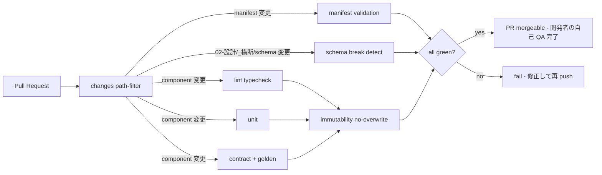

# CI 設計書 v1 — IHL component 開発者の自己 QA（GitHub Actions）

> **ステータス**: 草案（人間レビュー待ち · 実装 Go 不可）
> **作成日（草案）**: 2026-06-08
> **正本（前提）**: [`ADR-Phase2-C-USB-component-契約.md`](./ADR-Phase2-C-USB-component-契約.md) §8 · [`componentテンプレ-標準構成.md`](./componentテンプレ-標準構成.md) · [`テスト設計書-v1.md`](./テスト設計書-v1.md) · [`ADR-Phase1-OSS選定表.md`](./ADR-Phase1-OSS選定表.md)（CI = GitHub Actions · dummy embedding · 鍵を CI で使わない）
> **schema 基準**: [`../02-設計/_横断/schema/02-設計/_横断/schema/README.md`](../02-設計/_横断/schema/02-設計/_横断/schema/README.md)
> **実装禁止ゲート**: `.cursor/rules/design-before-implementation-gate.mdc` — 本書は CI 設計であり、`.github/workflows/` の実体は設計ゲート 4 点の人間確定後

---

## 1. ゴール

**component 開発者が PR を出すだけで、自分の部品が C-USB 契約を満たすかを自動で自己 QA できる。**

ユーザー開発サイクル「OSS 薄ラップ → C-USB component → unit/contract test → **component 別 CI** → 自己 QA」の **component 別 CI** を定義する。

| 原則 | 内容 |
|------|------|
| **component 局所性** | 変更した component のジョブだけを回す（path-filter）。全体を毎回回さない |
| **契約優先** | OUT が `02-設計/_横断/schema/` に適合するか（contract）を最重要チェックにする |
| **鍵なし** | 本番 R2 鍵・GPU を CI で使わない。embedding は dummy backend、R2 は moto/ローカル fs |
| **append-only 検証** | 同一キー再 put 拒否（immutability）を Phase 0 から CI で守る |
| **schema 破壊検知** | 破壊的 schema 変更を PR で fail させる |

---

## 2. ジョブ構成（GitHub Actions）

| ジョブ | 内容 | 対象 schema/test | トリガ |
|--------|------|------------------|--------|
| **changes（path-filter）** | 変更パスから対象 component・schema を決定（`dorny/paths-filter` 等） | — | PR / push |
| **lint-typecheck** | ruff / black --check / mypy（TS は eslint / tsc） | 変更 component | PR |
| **unit** | `pytest tests/unit`（変更 component のみ・matrix） | unit | PR |
| **contract** | OUT を `out_schema_ref` で検証（jsonschema/Pydantic、TS は zod/ajv）+ golden 比較 | contract | PR |
| **manifest-validation** | 全 `components/*/manifest.yaml` の必須フィールド・`in/out_schema_ref` の ref 切れ検知 | manifest | PR |
| **downstream-contract**（任意） | 上流 OUT が下流 IN に入るか（OUT ⊇ 次 IN）。pipeline 隣接ペアを検証 | pipeline smoke | PR（手動 or 影響時） |
| **schema-break** | 旧 `02-設計/_横断/schema/` との破壊的差分（列削除・型変更・required 追加・enum 削除）を検出 | schema diff | PR（`02-設計/_横断/schema/**` 変更時） |
| **immutability** | R2 no-overwrite（同一キー再 put 拒否）を moto / ローカル fs モックで検証 | immutability | PR / main |
| **pipeline-smoke**（main） | fixtures で ingest→thumbnail→embedding(dummy)→manifest を直列実行 | smoke | main merge |

---

## 3. PR / main / release の実行範囲

| イベント | 実行ジョブ | 目的 |
|----------|-----------|------|
| **PR（feature → main）** | changes → lint/typecheck / unit / contract / manifest-validation / schema-break(条件) / immutability | 開発者の自己 QA。変更 component に限局 |
| **main（merge 後）** | 上記全 + downstream-contract + pipeline-smoke（dummy backend） | 結合の健全性。隣接 component の接続性 |
| **release（tag）** | main 全 + ライセンス互換チェック（将来）+ 成果物固定（Docker image build / SBOM 任意） | 公開品質。OSS 公開（Apache-2.0 推奨 · H-07 待ち） |

> **本番 embedding（dinov2）/ 実 R2 結合**は CI のスコープ外（鍵・GPU 必要）。必要時は **手動 dispatch + 環境 secret** の限定ジョブとし、PR 自動実行には載せない（H-09 / D-03 人間確定待ち）。

---

## 4. Phase 境界（Phase 1 Streamlit vs Phase 2 web）

| 観点 | Phase 1（Streamlit 期） | Phase 2（Next.js web shell） |
|------|------------------------|------------------------------|
| 言語 | Python 主（pytest / ruff / mypy） | + TS（vitest / eslint / tsc / Playwright 最小） |
| UI テスト | Streamlit は smoke（import・起動）程度 | web shell は E2E 最小（[`テスト設計書-v1.md`](./テスト設計書-v1.md)） |
| ベクトル索引 | numpy cosine（subset） | + FAISS build_info 再生成検証 |
| API | なし（CLI / Makefile） | OpenAPI 契約テスト（ルート規約） |
| CI 追加 | lint/unit/contract/manifest/immutability | + frontend job（tsc/vitest）+ contract(OpenAPI) |

Phase 1 では **forum/market OSS・FAISS・FastAPI のジョブを作らない**（OSS 選定表 §3）。

---

## 5. 秘密情報を CI に入れない

| 対象 | CI での扱い |
|------|-------------|
| **R2 鍵**（`R2_ENDPOINT`/`R2_ACCESS_KEY_ID`/`R2_SECRET_ACCESS_KEY`/`R2_BUCKET`） | **CI に置かない**。immutability/pipeline-smoke は **moto（S3 モック）or ローカル fs** で代替 |
| **embedding 本番モデル**（dinov2 / GPU） | CI は **dummy backend**（`MODEL_BACKEND=dummy`）。決定的・鍵不要 |
| **実 R2 結合確認** | 必要時のみ **手動 dispatch** の限定 job（環境 secret · read-only probe 推奨）。PR 自動には載せない |
| **Cloudflare 管理 API**（`CF_API_TOKEN`） | バケット作成等は CI 外の運用スクリプト（`scripts/`） |

> Phase 0 受入（R2 実接続・raw 登録・no-overwrite 証跡）は **CI ではなくローカル/運用 spike** で実施（HANDOFF §1.3）。CI が検証するのは **no-overwrite ロジック**（モック）であり、実バケット書込ではない。

---

## 6. C-USB 契約と CI ジョブの対応

| C-USB が保証する（ADR-Phase2 §8） | 担保する CI ジョブ |
|-----------------------------------|---------------------|
| OUT が宣言 schema に適合 | contract / manifest-validation |
| provenance が全レコードに揃う | contract（provenance_fields 検査） |
| 同一キー再 put が起きない | immutability |
| OSS 差替でも pinned_contract 不変 | contract（dummy↔本番で同一契約）+ schema-break |
| 上流 OUT が下流 IN に入る | downstream-contract（任意） |

---

## 7. 未決 / 将来

| ID | 論点 | 状態 |
|----|------|------|
| H-09 / D-03 | embedding CI backend（dummy 固定 + 本番 dinov2 の手動 job） | 草案 — 人間確定待ち |
| H-07 / D-06 | ライセンス互換チェックを release で自動化 | 公開前確定待ち |
| H-04 / D-01 | `manifests/latest/` pointer 方式 → immutability テストの期待値 | 未決 |
| — | self-hosted runner（GPU 本番 embedding 用）要否 | 未決（原則 PR では不要） |

---

## 影響

- [`テスト設計書-v1.md`](./テスト設計書-v1.md) のテストピラミッドを CI ジョブに 1:1 で対応させる。
- [`componentテンプレ-標準構成.md`](./componentテンプレ-標準構成.md) のフォルダ規約に path-filter が依存。
- 実体 `.github/workflows/*.yml` は設計ゲート 4 点の人間確定後（実装 Go 不可）。

## 参照

- [`ADR-Phase1-OSS選定表.md`](./ADR-Phase1-OSS選定表.md) — CI=GHA · dummy embedding · 鍵を CI で使わない
- [`ADR-Phase2-C-USB-component-契約.md`](./ADR-Phase2-C-USB-component-契約.md) §8 保証範囲
- [`../02-設計/_横断/schema/02-設計/_横断/schema/README.md`](../02-設計/_横断/schema/02-設計/_横断/schema/README.md) — 検証基準・schema break
- `指示/it-hercules-laboratory/99-アーカイブ/2026.06-06-legacy/AI実装指示書` — test 一覧（test_no_overwrite 等）

---

*草案・非正本 / 人間レビュー用 / 設計 AI 引き継ぎ用 / 実装禁止ゲート有効 — 実装 Go 不可*
