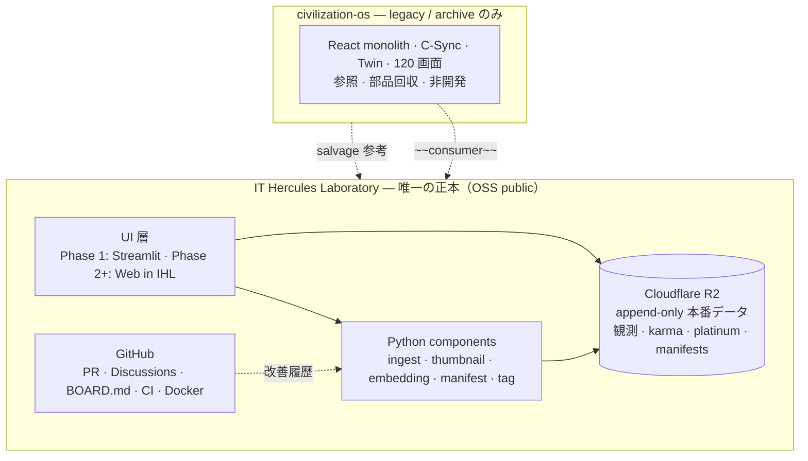

# 理想設計 — 構成マップ（たたき台・非正本）

> **用途**: 01〜20 機能が **どの component · UI · pipeline · GitHub 運用** に映射されるかを可視化する。  
> **作成日**: 2026-06-07（**2026-06-07 方針改訂**: 単一 IHL 正本 · civ-os legacy · C-Sync 不採用）  
> **根拠**: `2026.06,06/*` · `00-土台` · `16-UIbuilder.md` §12 · `01-要件/_横断/FEATURE-REQUIREMENTS-INVENTORY.md` · [`05-運用/_横断/リポジトリ戦略-legacyとIHL.md`](./05-運用/_横断/リポジトリ戦略-legacyとIHL.md)

---

## 1. 一文結論

| 質問 | 回答 |
|------|------|
| **正本システムはどれか？** | **`it-hercules-laboratory` のみ。** component · UI · R2 runtime を **1 repo** に載せる OSS システム。 |
| **civilization-os の位置づけは？** | **legacy / archive。** `itherculeslaboratory-cyber/civilization-os` およびローカル clone は **参照 + salvage のみ**。並行製品ではない。 |
| **GitHub で機能改善するか？** | **はい。** IHL repo 内 **component フォルダ単位**の PR / Issue / BOARD.md / Discussions（[`05-GitHub運用-コンポーネント掲示板.md`](./05-GitHub運用-コンポーネント掲示板.md)）。 |
| **C-Sync 4 媒体は？** | **理想設計では全面不採用** ~~C-Sync~~。改善履歴 = GitHub。ランタイム監査 = R2 append-only。 |
| **ランタイムデータ（観測 · karma · platinum）は？** | **R2 append-only 必須。** GitHub には置かない。 |
| **観測 v1 完了後の進め方は？** | [`観測v1完了-横展開と段階計画.md`](./観測v1完了-横展開と段階計画.md) — Phase 0〜7 · ver2 配線→検索→#18→血統→マーケット |

---

## 2. 単一 IHL システム（理想アーキテクチャ）



| 層 | 正本 | 永続真実 | 改善履歴 |
|----|------|----------|----------|
| **UI** | IHL repo（`apps/`） | — | GitHub PR |
| **Transform（component）** | IHL repo（`components/`） | R2 出力 artifact | GitHub + BOARD.md |
| **ランタイムデータ** | R2 のみ | 観測 JSON · karma · platinum · tag events · manifests | R2 INSERT ONLY（上書き禁止） |
| **設計・憲法** | IHL `docs/` + ADR | — | GitHub（~~C-Sync spec/post~~ **不採用**） |

**混同禁止（2026-06-07 確定）**:

- ~~IHL = データレイク、civ-os = UI consumer~~ → **廃止**
- civ-os monolith への **継続開発・consumer 接続は行わない**
- IHL に Twin / civ-os Builder / 120 画面 API を **そのまま混在させない**（必要な知見は **再設計して IHL 内に再構築**）

---

## 3. 01〜20 機能 → IHL 再構築マップ

legacy civ-os 実装は **参照のみ**。理想配置では **すべて IHL 内で再設計・再実装** する（Phase 境界は ADR で切る）。

```text
┌─────────────────────────────────────────────────────────────────────────┐
│                   理想配置 — IHL 単一正本（たたき台）                      │
├────┬──────────────────┬─────────────────┬──────────────────────────────┤
│ #  │ 機能             │ IHL 配置         │ legacy civ-os                 │
├────┼──────────────────┼─────────────────┼──────────────────────────────┤
│ 00 │ 土台             │ docs/ · 02-設計/_横断/schema/ │ C-USB 思想 → manifest 契約     │
│ 01 │ ログイン         │ IHL rebuild      │ legacy 参照（JWT 知見）        │
│ 02 │ 利用規約         │ IHL rebuild      │ legacy 条文たたき台参照        │
│ 03 │ 新規登録         │ IHL rebuild      │ legacy 参照                    │
│ 04 │ ホーム           │ IHL rebuild      │ legacy UI 文化参照             │
│ 05 │ 観測             │ **IHL core**     │ solidObservationLogic salvage  │
│ 06 │ マーケット       │ Phase 2+ ADR     │ legacy 経済ルール参照          │
│ 07 │ 掲示板           │ IHL rebuild      │ legacy BBS 参照                │
│ 08 │ カルマ           │ IHL + **R2**     │ legacy → R2 イベント再設計     │
│ 09 │ 論文             │ IHL research/    │ legacy PaperMatch 参照         │
│ 10 │ マチアプ         │ IHL rebuild      │ tag/rerank 思想共有            │
│ 11 │ 裁判             │ Phase 2+ ADR     │ legacy 司法参照                │
│ 12 │ 設定             │ IHL rebuild      │ legacy 設定 UI 参照            │
│ 13 │ データ取得元     │ **IHL core**     │ collector 契約再設計           │
│ 14 │ 貢献度           │ IHL + **R2**     │ legacy 参照                    │
│ 15 │ データ設計       │ 02-設計/_横断/schema/ 正本    │ CoreEntityBase 思想 salvage    │
│ 16 │ UIbuilder        │ IHL UI 編集 ADR  │ legacy ScreenDef **参照のみ**  │
│ 17 │ UI選択           │ IHL rebuild      │ legacy 参照                    │
│ 18 │ 写真解析         │ **IHL core**     │ embedding pipeline             │
│ 19 │ コンポーネント掲示板 │ **GitHub BOARD** | legacy file-board **参照のみ** │
│ 20 │ 投票・プラチナ   │ IHL + **R2**     │ legacy → R2 append-only 再設計 │
└────┴──────────────────┴─────────────────┴──────────────────────────────┘
```

詳細 sub-component 分解: [`02-設計/_横断/component/00-マスターcomponent分解表.md`](./02-設計/_横断/component/00-マスターcomponent分解表.md)

**凡例**: 「legacy 参照」= コード移植ではなく **設計・UX・ルールの salvage**。実装は IHL repo のみ。

---

## 4. 三層分離 · UI · pipeline（IHL 内完結）

ユーザー哲学（`16-UIbuilder.md` §12）の **配置 / デザイン / 機能** 分離は IHL 内で再解釈する。

```text
                    ┌─────────────────────────────────────┐
                    │     機能（Transform · IHL のみ）      │
                    │  components/*/run.py · Docker · CI  │
                    └──────────────┬──────────────────────┘
                                   │ manifest / schema 契約
          ┌────────────────────────┼────────────────────────┐
          ▼                        ▼                        ▼
   ┌─────────────┐         ┌─────────────┐         ┌─────────────┐
   │ 配置        │         │ デザイン     │         │ データ契約   │
   │ apps/       │         │ theme · CSS │         │ 02-設計/_横断/schema/    │
   │ Streamlit → │         │ preferences │         │ Parquet     │
   │ Web UI      │         │ 相当トークン │         │ run_info    │
   └─────────────┘         └─────────────┘         └─────────────┘
                                   │
                          R2 append-only（本番データ）
                          観測 · karma · platinum · events
```

| 「builder」語彙 | 意味 | repo |
|-----------------|------|------|
| **UI 編集**（旧 UIbuilder 相当） | IHL 内 UI 配置 · catalog 紐づけ | **it-hercules-laboratory**（Phase 2+ ADR） |
| **thumbnail_builder 等** | データ処理 CLI component | **it-hercules-laboratory** |

---

## 5. IHL パイプライン + R2 ランタイム層

```text
                         ┌──────────────────────────────┐
                         │   R2 — append-only 本番層     │
                         │  raw/ · manifests/ · logs/   │
                         │  karma/ · platinum/ · tags/  │
                         │  observation/ · events/      │
                         └──────────────▲───────────────┘
                                        │ write-only · no overwrite
raw/images + metadata                   │
        │                                 │
        ▼                                 │
┌───────────────────┐                     │
│ ingest_normalize  │─────────────────────┤
└─────────┬─────────┘                     │
    ┌─────┴─────┬─────────────┐           │
    ▼           ▼             ▼           │
┌────────┐ ┌──────────┐ ┌───────────┐     │
│thumbnail│ │embedding │ │ qc/color  │     │
│_builder │ │_dinov2   │ │ (optional)│     │
└────┬───┘ └────┬─────┘ └─────┬─────┘     │
     └──────────┴──────┬──────┘           │
                       ▼                   │
              ┌─────────────────┐          │
              │ manifest_builder │─────────┤
              └────────┬────────┘          │
                       ▼                   │
              ┌─────────────────┐          │
              │ search_ui / Web  │◄────────┘ read manifest · signed URL
              └─────────────────┘

  tag_event / usage_logger / tag_aggregator ──► R2 tags/events/
  karma / platinum / 投票 ────────────────────► R2 （GitHub に置かない）
```

**環境 IoT（#13）**: IHL collector 契約 → R2 env-samples → `environment_timeseries` schema。

**固体観測**: IHL 内 ingest パイプラインに統合。civ-os session JSON ブリッジは **legacy 移行 ADR** のみ（新規は IHL 形式）。

---

## 6. GitHub ワークフロー（改善履歴 · C-Sync 代替）

```text
[it-hercules-laboratory repo — 改善履歴の正]

components/
├── ingest_normalize/     ← PR · Issue · docs/components/ingest_normalize/BOARD.md
├── thumbnail_builder/
├── embedding_builder_dinov2/
├── manifest_builder/
└── tag_aggregator/

apps/simple_search_ui/   ← UI 改善も同一 repo

改善フロー:
  1. BOARD.md / Discussions で intent 記録     ← 旧 C-Sync「post」相当
  2. ADR · schema PR                             ← 旧 C-Sync「spec」相当
  3. component PR + CI                           ← 旧 C-Sync「commit」相当
  4. merge → Docker tag · R2 新 run_id           ← 旧 C-Sync「R2 意図」→ 実ランタイムは R2 必須

~~C-Sync 4 媒体~~ — 理想設計では **不採用**（civ-os legacy のみ）
```

詳細: [`05-GitHub運用-コンポーネント掲示板.md`](./05-GitHub運用-コンポーネント掲示板.md) §6

---

## 7. 2026.06,06 整合チェック

| 2026.06,06 原則 | 本マップでの体现 |
|-----------------|------------------|
| R2 のみ永続 | IHL 全 component + **ランタイムデータ** = R2 |
| DB 禁止 | 検索 = DuckDB/Polars が Parquet を読むだけ |
| append-only | 新 run_id · 新 snapshot · pointer · **karma/platinum イベント** |
| OSS 薄ラップ | [`05-観測-OSS候補表.md`](./02-設計/_横断/component/05-観測-OSS候補表.md) |
| USB-C = file contract | `02-設計/_横断/schema/` + input/output manifest |
| Streamlit Phase 1 UI | `apps/simple_search_ui` → Phase 2 IHL Web |
| タグ = event | tag_event JSONL + tag_aggregator → **R2** |
| FAISS Phase 2 | indexes/ ディレクトリ予約 |

---

## 8. legacy civilization-os（archive ボックス）

```text
┌─────────────────────────────────────────────────────────────┐
│  civilization-os — legacy / archive（開発対象外）              │
│  · C-Sync 4 媒体（ProjectRules — 旧 repo の法律のみ）         │
│  · React monolith · Twin · file-board · 120 画面 API        │
│  · 用途: 設計 salvage · コード片段参考 · 移行元データ抽出      │
│  · ~~consumer 接続~~ · ~~並行 UI~~ · ~~継続開発~~ — すべて否  │
└─────────────────────────────────────────────────────────────┘
```

---

## 9. 未決（ADR 候補）

| ID | 論点 | たたき台 |
|----|------|----------|
| D-01 | latest = 実体コピー vs pointer | pointer 推奨 |
| D-04 | R2 バケット | IHL 専用バケット（legacy civ-os バケットと分離） |
| D-07 | lineage JSON → IHL individual 移行 | legacy から one-time export |
| D-09 | legacy session id → IHL capture id | 移行 ADR のみ |
| D-10 | component BBS = Discussions vs BOARD.md | Discussions + BOARD 索引 |
| D-11 | IHL 憲法 ADR-001 | C-Sync 不採用 · GitHub + R2 統治の明文化 |
| D-12 | karma / platinum R2 schema | append-only イベント列 · GitHub 非保存 |

---

*たたき台・非正本 / 人間レビュー用 / 設計 AI 引き継ぎ用*
