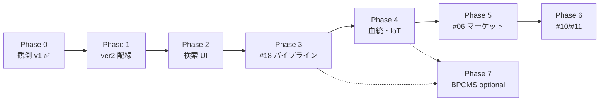

# 観測 v1 完了 — 横展開分析と段階的開発計画

> **用途**: 観測 ver1 COMPLETE（2026-06-26）後の **他機能への再利用パターン**・**ver2 バックログ**・**旧 Phase 0〜7 ロードマップ**の正本。  
> **作成日**: 2026-06-26  
> **根拠**: 前セッション横影響分析 · [`01-要件/05-観測.md`](../../01-要件/05-観測.md) §「v1 完成サマリー」· 詳細設計 v2 · ADR-H-28〜36 · 実装（`apps/web` · `apps/api` · `libs/ihl`）  
> **非正本**: 採用・実装判断は `docs/REQUIREMENTS.md`・`rag/accepted_requirements.csv`・各機能要件を優先。  
> **ユーザー向けバージョン語彙（ver1 / ver2 / ver3 / ver4+）**: [`IHL-段階リリース計画-ver1-4+.md`](./IHL-段階リリース計画-ver1-4+.md) — **マイルストーン・DONE 判定・リリース境界の正本**。本 doc の §5 Phase 表は設計ゲート用の内部ラベルとして維持（付録 A で ver へマッピング）。

---

## 1. 一文結論

観測 ver1 は **R2 append-only · `capture_id` スパイン · StructuredRow · binding 派生 · 環境 IoT 二経路（ingest / CSV）· B モデル（`photo_conditions` vs `environment_snapshot`）** を実装済みである。

**ユーザー向け次マイルストーン（ver 語彙）**: **ver2 = 検索 + 表示**（`.dev` · 画像 · Q2 可変詳細）→ **ver3 = 初回 Web リリース** → **ver4+ = 機能区分ごと段階拡張**。詳細・DONE 判定・質問票は [`IHL-段階リリース計画-ver1-4+.md`](./IHL-段階リリース計画-ver1-4+.md)。

**設計ゲート用着手順（旧 Phase · バケット [A]）**: Phase 1 ver2 配線 → Phase 2 検索 UI → Phase 3 #18 パイプライン → Phase 4 血統/環境 → Phase 5〜7 マーケット/マチアプ/BPCMS

---

## 2. 観測 v1 が確立した土台（reuse patterns）

以下は **他機能がそのまま再利用・拡張** できる実装・設計パターン。新規 ADR を増やす前に本節を参照すること。

| パターン | 内容 | 実装・正本 |
|----------|------|------------|
| **R2 INSERT ONLY** | 観測・binding・スケジュールはすべて **新イベント INSERT**。同一 `capture_id` の UPDATE 禁止 | `libs/ihl` R2 writer · [`05-観測.md`](../../01-要件/05-観測.md) OBS-FUP-01 |
| **`capture_id` スパイン** | 個体観測の時系列・`prior_capture_id` 連鎖・binding の `trigger_capture_id` | commit API · `derive_bindings.py` |
| **StructuredRow** | 計測・環境・撮影条件を **統一行モデル**（`group` · `device_id` · `source` · `value_origin`） | [ADR-H-36](./adr/ADR-H-36-構造化行統一-v1-DRAFT.md) · `obs-chunk-individual-data` |
| **binding 派生** | commit 時 `placement_id` + `devices[]` → Occupancy + DeviceBinding **自動 INSERT** | [ADR-H-33](./adr/ADR-H-33-観測追記-デバイス紐づけ-v1-DRAFT.md) · [ADR-H-32](./adr/ADR-H-32-生体-デバイス-期間-紐づけ-v1-DRAFT.md) |
| **B モデル（写真 vs 環境）** | 写真あり時は `photo_conditions[]` のみ · `environment_snapshot` は写真なし時のみ | ADR-H-36 · `clearEnvSnapshotFromDraft` |
| **環境 IoT 二経路** | Tier B: `/latest` ingest · CSV import · 行 IoT: `/sync`（dev のみ）· **サーバ secret poll 禁止** | [ADR-H-30](./adr/ADR-H-30-SwitchBot-秘密非保持-v1-DRAFT.md) · [ADR-H-31](./adr/ADR-H-31-SwitchBot-Import-API-v1-DRAFT.md) · [ADR-H-35](./adr/ADR-H-35-汎用デバイスCSV取り込み-v1-DRAFT.md) |
| **下書き分離** | sessionStorage（slim draft）+ タブ内メモリ（写真 data URL） | `observation-draft.ts` · OBS-RX-DRAFT-01 |
| **次回観測スケジュール** | `next_observation_at` + `observation_schedule` イベント · ホーム「今日の要約」 | §4.17 · OBS-FUP-09/11 · OBS-RX-UX-11 |
| **3 データチャンク UI** | 個体データ / 写真追加 / 写真撮影時環境 — confirm 1 主ボタン | [観測入力-v2.md](../features/05-観測/ui/観測入力-v2.md) · [ADR-H-34](./adr/ADR-H-34-観測UX-研究データ-v1-DRAFT.md) |
| **dev 起動契約** | hybrid Docker API :8000 + Next :3000 | OBS-RX-DEV-01 · `scripts/dev-up.ps1` |

**横断 schema / ADR 索引（観測 v1 同期済）**: ADR-H-28（dev R2）· H-29（collector）· H-30〜36（上表）· [`詳細設計-v2.md`](../features/05-観測/詳細設計-v2.md)

---

## 3. ver2 / 他機能が楽になる理由

| 受益者 | 観測 v1 から得られるもの | ver1 で既に IN / 実装済 | まだ Phase 後続 |
|--------|---------------------------|-------------------------|-----------------|
| **#05 観測 ver2** | commit 契約・binding 派生・B モデルが固定 — **配線のみ**で digest / 差分 UI を足せる | 入力〜commit 全経路 | `clientContentDigest` · binding diff confirm · 計測行 IoT 必須 |
| **#04 ホーム** | `observation_schedule` イベント · `today_lines` 要約の **データ源**が存在 | OBS-RX-UX-11 要件 · 個体 upcoming/overdue | ダッシュボード API 本番 polish · REQ-024 IA 完全整合 |
| **#13 データ取得元** | Placement · DeviceBinding · Occupancy · CSV import · `/latest` — **観測が binding moment** | Tier B ingest · import API · registry | サーバ live poll · collector 本番 · HUMAN-COLLECTOR-KEYS |
| **#18 写真解析** | 観測 commit に写真 blob 経路 · `capture_id` で manifest 紐づけ可能 | プレビュー・commit ボディ | ingest→thumbnail→embedding→manifest **本番パイプライン** |
| **lineage（血統）** | `individual_id` · sire/dam · `prior_capture_id` · binding 区間 | OBS-IND-01〜05 · 1 世代親ナビ | 血統グラフ · cross 集計 UI |
| **#10 マチアプ** | タグ event 思想 · 類似検索 API 下地 · StructuredRow provenance | 設計共有のみ（v1 OUT） | rerank UI · マッチングフロー |
| **#06 マーケット** | 観測プロファイル bundle · `capture_id` 監査 | v1 **明示 OUT** | bundle fork · 経済ルール · 製品 Go |
| **#11 裁判** | 争い対象の **事実キー**（capture · binding 区間） | v1 OUT | 司法インボックス連携 |
| **#09 論文** | 再解析 manifest · BPCMS 参照フック | 最小メタ ver1 | strict BPCMS · 論文級エクスポート |

---

## 4. まだ無いもの・人間ゲート

### 4.1 ver2 既知延期（要件 ID 確定済 · 実装 spec は項目ごとに Partial / No）

> **注意（2026-06-26 監査 23d5b8ea）**: 旧表現「設計済・機械実装可能」は **過大評価**。下表の **実装 spec** 列が **Partial / No** の項目は、REQ ID と延期ラベルだけでは **実装 GO 不可** — [`§4.5 Phase 着手前チェックリスト`](#45-phase-着手前チェックリスト実装-go-判定) を満たすまで設計修正が先。

| 項目 | REQ / ADR | 実装 spec | 備考 |
|------|-----------|:---------:|------|
| `clientContentDigest` canonical SHA-256 on commit | OBS-RX-REP-05 | **Partial** | civ-os `pure.ts` 参照あり · **IHL canonical JSON 仕様未確定** · commit body 未配線 |
| confirm **binding 差分サマリー**（device A→B） | OBS-RX-UX-08 | **Partial** | `BindingChangeSummary`（C-08）名のみ · 差分アルゴリズム・ワイヤー未記載 · 設置静的サマリーのみ |
| 観測検索 **詳細 UI** polish（5 pane · 類似本番） | OBS-IMG-04/05 | **No** | API・Streamlit あり · **Next.js 用 UI/遷移設計なし** |
| 計測行 IoT **必須**化 | OBS-INPUT-06/07 | **No** | ver2 OUT 確定 · Phase 1 再登場時は **方針 ADR 必須** · 環境チャンクが ver1 マスタ |
| DPT / VPD 保存 | ADR-H-31/35 | **N/A** | **意図的に保存しない**（実装不要） |
| Vision / DINOv2 本番 | OBS-IMG-01/03 | **Partial** | #18 詳細設計 ○ · **観測 commit→パイプライン結合設計** 薄い · Phase 3 |
| BPCMS strict · market fork · ネイティブ QR push | §4.14 Phase 2+ | **No** | 要件名・Phase 番号のみ · チェックリスト・schema・UI 未設計 |
| IHL サーバ secret **常時 poll** | ADR-H-30 | **N/A** | ver1 OUT · ユーザー PC 経路のみ（実装しない） |
| **TemplateForkEvent / TemplateUsageEvent** | OBS-TPL-11/14 · ADR-H-04 §7 | **No** | ADR でイベント定義済 · **IHL に schema/API/永続化未配線**（下記 §4.3） |

### 4.2 人間ゲート（AI が `[x]` にしない）

| ゲート ID | 内容 | 影響 Phase |
|-----------|------|------------|
| **HUMAN-ADR-H-30** | ADR-H-30 DRAFT → 確定昇格（運用は **2026-06-21 凍結済**） | Phase 1 / 4 |
| **HUMAN-COLLECTOR-KEYS** | 実 SwitchBot keys · live collector · Ed25519 投入 | Phase 4 |
| **製品 Go（#06）** | マーケット v1 スコープ · 経済ルール確定 | Phase 5 |
| **U-MKT-DSP v1.1** | #11 裁判哲学（実装 Go とは別） | Phase 6 |
| **Tier D 手打鍵** | 全 path キーボード操作証跡（civ-os `P2-NEXT-SHIP-MANUAL-KB` 等） | 各 Phase 完了時 |
| **P0-NEXT-GMO-LIVE-EXEC** | GMO 本番入金（#23 · 観測横断外） | — |

### 4.3 テンプレ Fork / Usage ギャップ（ADR-H-04 vs IHL 実装）

[ADR-H-04](./adr/ADR-H-04-設計規約-v1.2.md) §7 Template Platform では `TemplateForkEvent`・`TemplateUsageEvent` を **Truth 先行定義**しているが、IHL 実装は **未配線**である。

| 論点 | 設計 | IHL 実装 |
|------|------|----------|
| **Fork** | OBS-TPL-11 · `TemplateForkEvent` INSERT | `/templates/[id]/fork` は **クエリ遷移のみ**（イベント INSERT なし） |
| **Usage** | OBS-TPL-14 · `TemplateUsageEvent` INSERT | テンプレ適用時の usage イベント **なし** |
| **永続化** | ADR-H-04 §7 列定義 | `observation/template_event` は **別契約** · schema YAML 未整備 |

**community fork（OBS-TPL-20）** は公開可視性・author 権限・#06 連携まで含め **No**（Phase 7 相当）。Phase 1 ver2 配線のスコープ外だが、「テンプレ fork 実装して」と言われた場合は **本節 + Phase 着手前チェックリスト** を先に満たすこと。

### 4.4 Phase 1 必須差分設計成果物（現状ギャップ）

Phase 1「ver2 配線」を **実装 GO** する前に、独立した差分設計 doc（「次成果物」列挙のみは不可）として以下を作成・v1.0 昇格すること。

| # | 成果物 | 正本パス（追補先） | 内容 |
|---|--------|-------------------|------|
| 1 | **IHL `clientContentDigest` canonical** | [`詳細設計-v2.md`](../features/05-観測/詳細設計-v2.md) §9.1.1 追補 | フィールド順 · サーバ/クライアント計算分担 · civ-os `buildSolidCommitDigestCanonical` **parity 表** |
| 2 | **`BindingChangeSummary` 差分 UI** | [`観測入力-v2.md`](../features/05-観測/ui/観測入力-v2.md) confirm 節 · [`遷移設計-v2.md`](../features/05-観測/遷移設計-v2.md) | 前回 open binding vs draft の差分算出 · 警告文案 · `data-testid` · UAT-05-11 と ver2 境界整合 |
| 3 | **OBS-INPUT-06/07 スコープ ADR** | `02-設計/_横断/adr/` 新規 or 追補 | Phase 1 に **含める / 正式除外** のどちらかを文書確定（ver2 OUT と Phase 1 スコープの矛盾解消） |

上記 3 点が揃うまで Phase 1 の **DELEGATED-IMPL-GO / 実装着手** はゲート未通過とみなす（[`05-観測.md`](../../01-要件/05-観測.md) §4.16.8 · `design-before-implementation-gate.mdc`）。

### 4.5 Phase 着手前チェックリスト（実装 GO 判定）

各 Phase で「実装して」「ver2 進めて」と言う前に、対象スコープについて以下をすべて `[x]` にする。  
**1 つでも `[ ]` なら設計修正が先**（実装禁止ゲート準拠 · [V-model 実行計画](../../05-運用/queues/00-Vモデル実行計画-v1.md)）。

- [ ] **要件**: 対象 REQ ID に ver1/ver2 矛盾がない（例: OBS-RX-RD-06 vs OBS-RX-REP-05）
- [ ] **詳細設計**: 当該 Phase の **差分設計 doc**（パス明記）が v1.0 以上。ver2 は「次成果物」列挙のみは不可
- [ ] **遷移設計**: 新規画面・状態があれば v1.0。E2E 手順と一致
- [ ] **UI 設計**: 新規/変更コンポーネントにワイヤー + `data-testid` 方針
- [ ] **テスト設計**: RTM 行追加済。UAT が ver2 defer と矛盾しない
- [ ] **schema/ADR**: 新イベントは YAML + ADR が **Accepted**（DRAFT のみは不可）
- [ ] **人間ゲート**: 当該 Phase の HUMAN-* を一覧し、未クリアならスコープから除外
- [ ] **延期判定**: スコープ内に「ver2」「Phase N」**ラベルのみ**の項目がない（実装可能 spec 必須）

**Phase 1 追加必須成果物（現状ギャップ）** — 上記チェックの「詳細設計」「UI 設計」行とセットで [§4.4](#44-phase-1-必須差分設計成果物現状ギャップ) の 3 成果物を満たすこと。

**Phase 2 追加必須成果物（現状ギャップ）** — 上記チェックの「詳細設計」「遷移設計」「UI 設計」「schema/ADR」行とセットで [§4.6](#46-phase-2-必須差分設計成果物現状ギャップ) の 5 成果物を満たすこと。

**実装者向けレンズ**（監査 23d5b8ea §8）:

1. **独立した差分設計 doc があるか**（「ver2」「配線のみ」は不十分）
2. **schema YAML + API 契約 + UI ワイヤーの 3 点セットがあるか**
3. **RTM / UAT が defer と矛盾していないか**
4. **ADR が DRAFT のまま実装に入っていないか**

**ver2 COMPLETE 人手 UAT（Phase 2 相当 · 設計ゲート E の運用）**:

- 人手確認・承認の **1 ページ正本**: [`docs/ver2-human-signoff.md`](../../docs/ver2-human-signoff.md)
- 詳細手順・seed 投入: [`docs/ver2-verification-checklist.md`](../../docs/ver2-verification-checklist.md) §8
- **本チェックリストの人間行は AI が `[x]` にしない** — 実施者が日付付きで記入してから ver2 COMPLETE を宣言する

### 4.6 Phase 2 必須差分設計成果物（現状ギャップ）

> **根拠（監査 02f61dbb）**: ユーザー Q2 — 観測検索・詳細の **可変項目（1〜100 行）** と **条件付きグラフ**（snapshot vs 時系列）を Phase 2 で設計確定する。ver1 は入力導線優先 · 検索詳細の全面表示は **No**（§4.1 · [`Phase6-打鍵フィードバック-v1.md`](../Phase6-打鍵フィードバック-v1.md) §4.6）。

Phase 2「検索・一覧 UI + データ閲覧 polish」を **実装 GO** する前に、独立した差分設計 doc（「次成果物」列挙のみは不可）として以下を作成・v1.0 昇格すること。

| # | 成果物 | 正本パス（追補先） | 内容 |
|---|--------|-------------------|------|
| 1 | **観測検索 UI v2** | [`ui/観測検索-v2.md`](../features/05-観測/ui/観測検索-v2.md)（新規） | **共通シェル**（filter → grid → detail → similar → tag）+ **動的セクション**（`measurements` / `devices` / `photo_conditions` / `environment_snapshot` / `manifest` / `similar`）— **存在ベース描画**（空セクション非表示 · B モデル準拠）。**20〜100 行 UX**: 折りたたみ · グルーピング（`group` · `device_id`）· 仮想スクロール方針 · `data-testid` · [`ui/Streamlit.md`](../features/05-観測/ui/Streamlit.md) 5 pane からの Next.js 移植差分 |
| 2 | **観測検索 遷移設計追補** | [`遷移設計-v2.md`](../features/05-観測/遷移設計-v2.md) 検索節 | **検索状態機械**: `idle` → `filtering` → `grid` → `detail`（`capture_id`）→ `similar` / `manifest` / `tag` · URL 同期（`/observation` · `/observation/:capture_id`）· 戻る・深リンク · 空/404/ローディング導線 · E2E 手順と一致 |
| 3 | **詳細 API 契約** | [`詳細設計-v2.md`](../features/05-観測/詳細設計-v2.md) §3.3 追補 | `GET /api/v1/observation/{capture_id}` が **Truth 縦持ち**を返す: `measurements[]`（全行 · `name`/`value`/`unit`/`method`/`value_origin`/`group`/`device_id`/`source`）· `devices[]` · `photo_conditions[]` · `environment_snapshot`（写真なし時のみ · B モデル）· `similar[]`（locator 有時）。**検索 `POST /search` は `searchable_capture_set` 横投影のまま** — 詳細は縦持ち・一覧は横持ちの **読み分け**を契約に明記 |
| 4 | **条件付きウィジェット** | [`ui/観測検索-v2.md`](../features/05-観測/ui/観測検索-v2.md) §ウィジェット | **snapshot 表示**（単一 capture の `environment_snapshot` · `photo_conditions` 表）vs **時系列グラフ**（`environment_timeseries` · Occupancy JOIN）の **Phase 境界**: Phase 2 = snapshot のみ IN · 時系列グラフは **Phase 4 延期**（プレースホルダ文言・代替導線のみ可）· 計測行が 1 点 vs 系列の判定ルール |
| 5 | **reanalysis-manifest IHL API route** | [`詳細設計-v2.md`](../features/05-観測/詳細設計-v2.md) §3 追補 · civ-os [`observation-solid-reanalysis-manifest.md`](../../../../docs/observation-solid-reanalysis-manifest.md) parity | `GET /api/v1/observation/{capture_id}/reanalysis-manifest` — ver1 最小メタ（OBS-RX-RD-06 · OBS-RX-REP-06）· 検索詳細 UI からの導線 · 404/不在 · #18 パイプライン出力との境界 |

上記 5 点が揃うまで Phase 2 の **DELEGATED-IMPL-GO / 実装着手** はゲート未通過とみなす（[`05-観測.md`](../../01-要件/05-観測.md) §4.14 · `design-before-implementation-gate.mdc`）。

**データ読み分け（Phase 2 設計前提 · 監査 02f61dbb）**:

| 層 | 正本 | Phase 2 の使い所 |
|----|------|------------------|
| **Truth 縦持ち** | R2 `capture` / `measurement` イベント · StructuredRow | **詳細画面** — テンプレ可変の 1〜100 計測行を欠落なく表示 |
| **Snapshot 横投影** | `searchable_capture_set` parquet（manifest_builder 再計算） | **検索グリッド・フィルタ** — whitelist 列のみ · 詳細の代替にしない |
| **時系列** | `environment_timeseries` · Occupancy×telemetry JOIN | **Phase 4** — Phase 2 詳細ではリンク/説明のみ |

---

## 5. 段階的開発計画（段階的モデル）

各 Phase 開始時に、対象機能の **設計ゲート 4 点（要件・詳細・遷移・UI）+ テスト設計 v1.0 昇格** を完了させる（[V-model 実行計画](../../05-運用/queues/00-Vモデル実行計画-v1.md) · `.cursor/rules/ihl-waterfall-v-model-gate.mdc`）。既存 impl-ahead コードは **retrofit テスト差分のみ**。

### Phase 0 — 観測 ver1 COMPLETE ✅

| 項目 | 内容 |
|------|------|
| **目標** | 観測入力〜confirm〜commit・binding 派生・環境 IoT 最小経路の **手動 UAT 完了** |
| **スコープ** | #05 観測 · #13 連携（import/latest/sync）· StructuredRow · ADR-H-28〜36 |
| **前提** | HUMAN-IMPL-SIGNOFF · DELEGATED-DESIGN-GO（2026-06-21） |
| **完了定義** | ユーザー宣言 2026-06-26 · [`05-観測.md`](../../01-要件/05-観測.md) §「v1 完成サマリー」同期 · テスト設計 v2 手動 UAT COMPLETE |
| **工数** | —（完了） |
| **人間ゲート** | **達成**: 観測 ver1 手動打鍵 |

---

### Phase 1 — 観測 ver2 配線（wiring bucket [A]）

| 項目 | 内容 |
|------|------|
| **目標** | 再現性・安全弁の **未配線 REQ を commit/confirm に接続**する（UI 大改修なし） |
| **スコープ** | OBS-RX-REP-05（`clientContentDigest`）· OBS-RX-UX-08（binding diff）· OBS-INPUT-06/07（計測行 IoT 検証・任意フラグ）· ADR-H-30 昇格下準備 |
| **前提** | Phase 0 · **[§4.4 必須差分設計成果物](#44-phase-1-必須差分設計成果物現状ギャップ) 3 点 v1.0** · [§4.5 着手前チェックリスト](#45-phase-着手前チェックリスト実装-go-判定) 全 `[x]` |
| **完了定義** | commit body に digest 付与 · confirm に device/placement 差分表示 · 計測行 IoT 選択の E2E 緑（INPUT-06/07 を含める場合のみ）· RTM 該当行 `implemented` |
| **工数** | **S** |
| **人間ゲート** | HUMAN-ADR-H-30（任意 · 文書昇格のみ） |

---

### Phase 2 — 検索・一覧 UI + データ閲覧 polish

| 項目 | 内容 |
|------|------|
| **目標** | 観測履歴・画像検索の **閲覧体験を研究利用可能な密度**まで引き上げる（可変計測 1〜100 行 · 存在ベース動的セクション · 条件付き snapshot 表示） |
| **スコープ** | OBS-IMG-04/05 · capture 一覧 · 類似検索導線 · reanalysis-manifest 閲覧 · Streamlit 5 pane 相当の Web 移植 · **詳細 API 縦持ち契約**（§4.6 #3） |
| **前提** | Phase 1（digest があると再現性表示が容易）· **[§4.6 必須差分設計成果物](#46-phase-2-必須差分設計成果物現状ギャップ) 5 点 v1.0** · [§4.5 着手前チェックリスト](#45-phase-着手前チェックリスト実装-go-判定) 全 `[x]` |
| **完了定義** | キーボード中心で検索→詳細（動的セクション）→類似→reanalysis-manifest まで一連操作 · `data-testid` 整備 · Tier B 自動検査緑 |
| **工数** | **M** |
| **人間ゲート** | Tier D: 検索 path 手打鍵（SHIP ルーブリック該当行） |

> **Truth 縦持ち vs `searchable_capture_set` 横投影の読み分け（Phase 2 不変方針 · 監査 02f61dbb）**: 検索グリッド・whitelist フィルタは **Snapshot 横投影**（`searchable_capture_set` · manifest_builder 再計算）のみを参照する。詳細画面の可変計測・`devices[]` · `photo_conditions[]` · `environment_snapshot` は **Truth 縦持ち**（`GET /{capture_id}`）から取得し、横投影列で詳細を代替表示しない。時系列グラフ（`environment_timeseries` · Occupancy JOIN）は **Phase 4** — Phase 2 は snapshot 表と境界説明のみ（§4.6 #4）。

---

### Phase 3 — #18 写真パイプライン本番接続

| 項目 | 内容 |
|------|------|
| **目標** | 観測 commit の写真を **ingest→thumbnail→embedding→manifest** まで R2 上で自動処理する |
| **スコープ** | #18 写真解析 · ingest_normalize · thumbnail_builder · embedding（dummy→DINOv2 段階）· manifest_builder · `capture_id` 紐づけ |
| **前提** | Phase 2（検索 UI がパイプライン出力を表示できる） |
| **完了定義** | 観測写真 commit 後に manifest 検索可能 · no-overwrite 証跡 · component pytest 緑 · #18 設計 4 点 v1.0 |
| **工数** | **M** |
| **人間ゲート** | DINOv2 本番採用時の GPU/コスト判断（任意 ADR） |

---

### Phase 4 — 血統・個体深化 + 環境 IoT 人間ゲート

| 項目 | 内容 |
|------|------|
| **目標** | 個体ライフサイクルと環境時系列を **Occupancy×telemetry JOIN** で説明可能にする |
| **スコープ** | lineage（sire/dam グラフ · cross 集計）· #13 collector 本番 · `series.parquet` · ホーム #04 ダッシュボード連携強化 |
| **前提** | Phase 3（個体画像レイク）· Phase 1（binding 区間安定） |
| **完了定義** | 血統 1 世代超のナビ or グラフ MVP · 実機 collector で Tier B 蓄積証跡 · HUMAN-COLLECTOR-KEYS クリア |
| **工数** | **M/L** |
| **人間ゲート** | **HUMAN-COLLECTOR-KEYS**（必須）· HUMAN-ADR-H-30 確定推奨 |

---

### Phase 5 — #06 マーケット / bundle

| 項目 | 内容 |
|------|------|
| **目標** | 観測プロファイル・bundle を **経済圏に接続**（fork・取引の監査可能性維持） |
| **スコープ** | #06 マーケット · OBS-REP-06 bundle fork · platinum / karma R2 イベント · #20 投票連携（任意） |
| **前提** | Phase 4（個体・環境の事実キーが安定）· **製品 Go** |
| **完了定義** | bundle 貼付→観測再現が E2E · マーケット一覧〜詳細がキーボード操作可能 · 設計 4 点 v1.0 |
| **工数** | **L** |
| **人間ゲート** | **製品 Go（#06 スコープ）** · 経済ルール人間レビュー |

---

### Phase 6 — #10 マチアプ / #11 裁判

| 項目 | 内容 |
|------|------|
| **目標** | タグ・類似・マッチングと **争い解決**を観測事実キー上に構築する |
| **スコープ** | #10 マチアプ（rerank · タグ投票 OBS-TPL-21）· #11 裁判（U-MKT-DSP 哲学下のインボックス） |
| **前提** | Phase 5（経済・bundle 境界確定）· Phase 2/3（検索・embedding） |
| **完了定義** | マッチング主要導線 3 クリック以内 · 裁判案件が `capture_id` / binding を参照 · RTM 緑 |
| **工数** | **L** |
| **人間ゲート** | U-MKT-DSP v1.1（哲学確定済 · 実装サインオフ別） |

---

### Phase 7 — BPCMS strict / 論文級（optional branch）

| 項目 | 内容 |
|------|------|
| **目標** | 査読級再現性（BPCMS B+ · 機材義務）と論文エクスポートを満たす |
| **スコープ** | OBS-REP-01 strict · OBS-RX-11 · #09 論文連携 · スケールシート印刷 · community fork OBS-TPL-20 |
| **前提** | Phase 3〜4（パイプライン・血統安定）· 研究利用の明示 Go |
| **完了定義** | BPCMS チェックリスト自動検査 · 第三者再解析デモ · 論文用エクスポート 1 本 |
| **工数** | **L**（ブランチ可能） |
| **人間ゲート** | 研究責任者サインオフ · 機材リスト人間確認 |

---

### 5.1 Phase 依存関係（概要）

### 5.2 横断 — 設計 4 点 v1.0 昇格ルール

| タイミング | 作業 |
|------------|------|
| **各 Phase 着手前** | [§4.5 着手前チェックリスト](#45-phase-着手前チェックリスト実装-go-判定) 全 `[x]` · 対象機能の要件矛盾解消 · 詳細設計 v1.0 · 遷移設計 v1.0 · UI 設計 v1.0 · テスト設計 + RTM 行追加 |
| **Phase 0 済み機能（#05）** | 左腕は **v2.0 人間レビュー済** — Phase 1 は **§4.4** · Phase 2 は **§4.6** の差分設計 doc（独立成果物・v1.0 昇格）が必須。「次成果物」列挙のみは不可 |
| **新規 in-scope（#18 Phase 3 以降）** | V-model Wave に従い **フル 5 点**（実装禁止ゲート通過後に Codex 実装） |
| **retrofit** | 既存 `it-hercules-laboratory/` 実装は TC 追加のみ — 再実装は parity 不一致時のみ |

---

## 6. Phase 一覧（早見表）

| Phase | 名称 | 目標（1 文） | 主スコープ | 前提 | 工数 | 人間ゲート |
|-------|------|--------------|------------|------|------|------------|
| **0** | 観測 v1 ✅ | 入力〜commit・binding・IoT 最小経路の完成 | #05 · #13 連携 | IMPL-SIGNOFF | — | 手動 UAT 済 |
| **1** | ver2 配線 | digest・binding diff・IoT 検証の配線 | OBS-RX-REP-05 · UX-08 · INPUT-06/07 | P0 | S | HUMAN-ADR-H-30 任意 |
| **2** | 検索 UI | 履歴・類似・manifest の閲覧 polish | OBS-IMG-04/05 | P1 | M | Tier D 検索 path |
| **3** | #18 パイプライン | 写真の ingest→manifest 本番接続 | #18 · components | P2 | M | GPU/コスト任意 |
| **4** | 血統・IoT | Occupancy JOIN・collector 本番 | lineage · #13 · #04 | P3 | M/L | **HUMAN-COLLECTOR-KEYS** |
| **5** | マーケット | bundle・経済接続 | #06 · #20 | P4 | L | **製品 Go** |
| **6** | マチアプ・裁判 | マッチング・争い | #10 · #11 | P5 | L | U-MKT-DSP 実装 SO |
| **7** | BPCMS optional | 査読級・論文級 | #09 · OBS-REP strict | P3/P4 | L | 研究責任者 |

---

## 7. 参照リンク

| 種別 | パス |
|------|------|
| **ver1〜4+ 段階リリース（ユーザー向け正本）** | [`IHL-段階リリース計画-ver1-4+.md`](./IHL-段階リリース計画-ver1-4+.md) |
| **要件正本** | [`01-要件/05-観測.md`](../../01-要件/05-観測.md) |
| **詳細設計** | [`02-設計/features/05-観測/詳細設計-v2.md`](../features/05-観測/詳細設計-v2.md) |
| **UI 設計** | [`02-設計/features/05-観測/ui/観測入力-v2.md`](../features/05-観測/ui/観測入力-v2.md) |
| **遷移設計** | [`02-設計/features/05-観測/遷移設計-v2.md`](../features/05-観測/遷移設計-v2.md) |
| **テスト設計** | [`03-テスト計画/features/05-観測/テスト設計-v2.md`](../../03-テスト計画/features/05-観測/テスト設計-v2.md) |
| **RTM** | [`04-トレーサ/features/05-観測/RTM-v1.csv`](../../04-トレーサ/features/05-観測/RTM-v1.csv) |
| **AI 引き継ぎ** | [`00-AI-HANDOFF-BRIEF.md`](../../00-AI-HANDOFF-BRIEF.md) |
| **構成マップ** | [`理想設計-構成マップ.md`](./理想設計-構成マップ.md) |
| **#13 環境** | [`01-要件/13-データ取得元管理.md`](../../01-要件/13-データ取得元管理.md) · [`02-設計/features/13-データ取得元/詳細設計-v2.md`](../features/13-データ取得元/詳細設計-v2.md) |
| **#18 写真** | [`01-要件/18-写真解析.md`](../../01-要件/18-写真解析.md) |
| **#04 ホーム** | [`01-要件/04-ホーム画面.md`](../../01-要件/04-ホーム画面.md) |
| **V-model** | [`05-運用/queues/00-Vモデル実行計画-v1.md`](../../05-運用/queues/00-Vモデル実行計画-v1.md) |

---

*たたき台・横断正本（観測 v1 完了後ロードマップ）/ 2026-06-26 作成 · 前セッション横影響分析をリポジトリ実装で検証同期 · **2026-06-26** 監査 23d5b8ea 反映（§4.1 Partial/No · §4.3〜4.5 着手前チェックリスト · Phase 1 差分設計成果物）· **2026-06-26** 監査 02f61dbb 反映（§4.6 Phase 2 差分設計成果物 · Truth 縦持ち vs searchable_capture_set 読み分け）*
