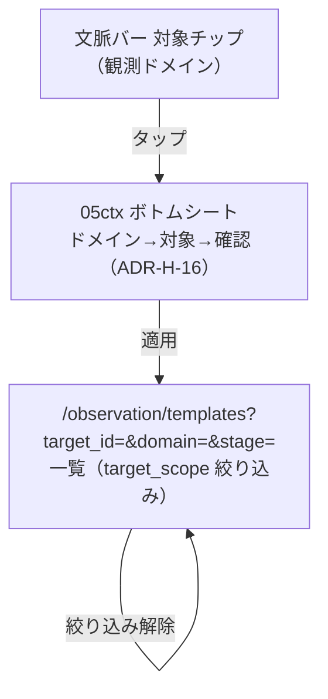
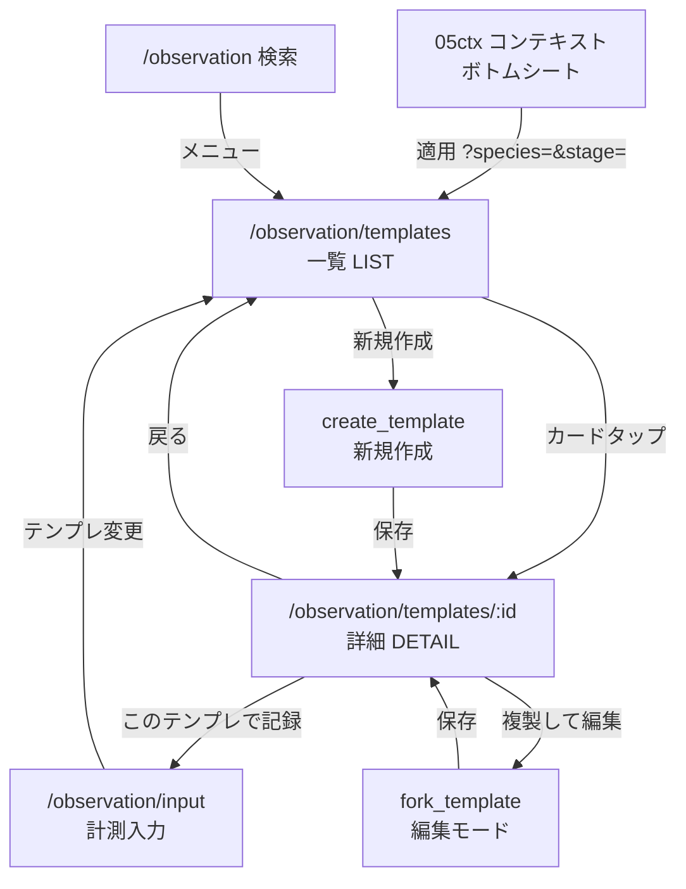

# 05 観測 — 計測テンプレ 一覧・詳細 遷移設計 v1

> **ステータス**: **草案 v1 · 人間レビュー待ち**（設計ゲート「遷移設計」 — 実装 Go 不可）
> **作成日**: 2026-06-08
> **前提**: [ADR-H-13](./ADR-H-13-観測計測テンプレ契約.md) · [ADR-H-15](./ADR-H-15-観測コンテキスト.md)（伝播）· [ADR-H-16](./ADR-H-16-観測対象ナビゲータ.md)（対象ナビゲータ · `target_scope`）· [`05-観測-入力-遷移設計-v1.md`](./05-観測-入力-遷移設計-v1.md) · [`05-観測-計測テンプレ-UI設計-v1.md`](./05-観測-計測テンプレ-UI設計-v1.md)

---

## 0. 観測対象 → 一覧（OBS-CTX / OBS-TGT · target → LIST）

文脈バーの対象チップ → **ボトムシート 05ctx**（対象ナビゲータ）で **ドメイン → 対象（生物は亜種まで）→ 確認** を経て、その状態のまま一覧へ入ると **`target_scope` 合致で絞り込み済み** で開く。



| from → to | トリガ | クエリ |
|-----------|--------|--------|
| 文脈バー → 05ctx | 対象チップタップ | — |
| 05ctx → LIST | 〔適用〕後にテンプレ一覧へ | `?target_id=&domain=&stage=&scope_route=/observation`（旧 `?species=` 後方互換） |
| LIST（絞り込み済）→ LIST | 〔絞り込み解除〕 | クエリ除去（WorkflowContext は保持） |

> **境界**: 〔絞り込み解除〕は **この一覧のフィルタのみ**解除。WorkflowContext 自体は消えず、他画面（05i/05a）のプリフィルは維持（ADR-H-15 §5）。コンテキスト無しなら従来どおり全件表示。**令・性別はテンプレ絞り込みに含めず入力 05i で確定**（ADR-H-16 §6）。

---

## 1. 画面間遷移（LIST ↔ DETAIL ↔ INPUT）



> **コンテキスト引き継ぎ**: DETAIL → INPUT（〔このテンプレで記録〕）でも `species`/`stage` クエリを引き継ぎ、入力画面ヘッダをプリフィルする（OBS-CTX-01）。

---

## 2. 一覧 LIST 状態機械

| 状態 | 意味 | 遷移 |
|------|------|------|
| `list_loading` | 取得中 | → `list_ready` / `list_error` |
| `list_ready` | カード表示 | → `list_empty`（0 件）/ 詳細へ |
| `list_empty` | テンプレ 0 | → CREATE / INPUT（空開始） |
| `list_error` | 取得失敗 | 再試行 → `list_loading` |
| `list_filtering` | フィルタ適用中 | → `list_ready` |

**許可辺**

| from → to | トリガ |
|-----------|--------|
| `list_ready → DETAIL` | カードタップ |
| `list_ready → CREATE` | 〔新規テンプレを作成〕 |
| `list_empty → INPUT` | 〔空の入力から始める〕 |
| `list_ready → INPUT` | ショートカット禁止（必ず DETAIL または CREATE 経由 — 誤選択防止） |

---

## 3. 詳細 DETAIL 状態機械

| 状態 | 意味 | 主アクション |
|------|------|--------------|
| `detail_loading` | 取得中 | — |
| `detail_ready` | メタ + 項目リスト表示 | 記録 / Fork / 編集 |
| `detail_forking` | Fork 編集ペイン | 保存 → `TemplateForkEvent` |
| `detail_editing` | 自分テンプレの項目編集 | 保存 → 新バージョン（INSERT） |
| `detail_forbidden` | 非公開・権限なし | 一覧へ |
| `detail_error` | 404 / ネットワーク | 再試行 / 一覧 |

**許可辺**

| from → to | トリガ | 副作用 |
|-----------|--------|--------|
| `detail_ready → INPUT` | 〔このテンプレで記録〕 | `TemplateUsageEvent` INSERT（OBS-TPL-14） |
| `detail_ready → detail_forking` | 〔複製して編集〕 | child = parent 項目複製 |
| `detail_forking → detail_ready(child)` | 保存 | `TemplateForkEvent` INSERT |
| `detail_ready → detail_editing` | 〔編集〕 | 所有者のみ |
| `detail_editing → detail_ready` | 保存 | 新 template_id（append-only） |

---

## 4. クリック深度（3 以内）

| ユーザ目標 | 経路 | クリック |
|------------|------|:--------:|
| テンプレで記録 | ホーム → 観測 → 一覧 → 詳細 → 記録 | **4** ※ |
| テンプレで記録（ショートカット） | ホーム → 観測 → 入力 → テンプレ変更 → 一覧 → 詳細 → 記録 | 多 |
| Fork して保存 | 一覧 → 詳細 → 複製 → 保存 | **3** |
| 新規テンプレ | 一覧 → 新規 → 保存 | **2** |

> ※ **4 クリック問題**: ホーム起点で「記録」主タスクは **観測入力を 2 クリック**（ホーム→観測→入力）に置き、一覧は **テンプレ管理** 導線とする。入力画面の「テンプレを変更」から一覧へ **1 クリック** で到達（[`05-観測-入力-遷移設計-v1.md`](./05-観測-入力-遷移設計-v1.md) §1 `select_template`）。

**推奨修正（UX）**: 入力画面の `select_template` を **ドロップダウン + 「一覧で管理」リンク** にし、日常記録は 3 クリック以内を維持。一覧/詳細は **管理・Fork・公開設定** 専用。

---

## 5. 可視性・公開（OBS-TPL-15）

```text
[detail_editing]
   │ 可視性トグル: 自分のみ ↔ 公開
   ▼
[visibility_change]  →  TemplateVisibilityEvent INSERT（append-only）
   │
   ├ 公開 → マーケット テンプレ市場（Phase 3 · 06 template channel）へ索引可能
   └ 自分のみ → 一覧の「自分」タブのみ
```

---

## 6. エラー導線

| ケース | 遷移 | UX |
|--------|------|-----|
| テンプレ削除済 | `detail_loading → detail_error(404)` | 「見つかりません」→ 一覧 |
| Fork 保存失敗 | `detail_forking` 留まる | 行ハイライト · 再試行 |
| 使用中テンプレ非公開化 | 警告モーダル | 「入力中のセッションには影響しません」 |

---

*草案 v1 · 非正本 / 人間レビュー用 / 実装禁止ゲート有効*
