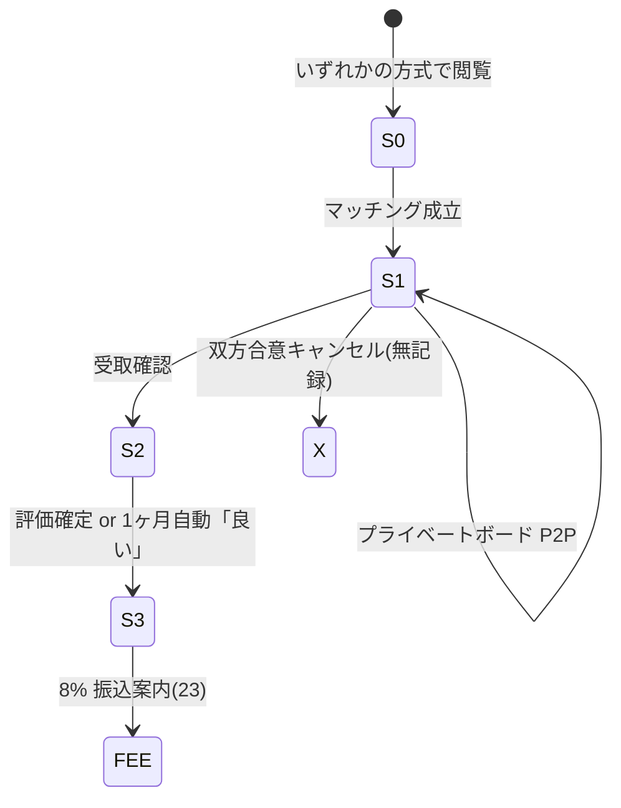

# 06 マーケット — 取引方式・状態機械 v1（全チャネル統合）

> **ステータス**: **草案 v1.1 · 人間レビュー待ち**（2026-06-08 — TX-LOTTERY / TX-PLATINUM-PRIORITY 追記）
> **作成日**: 2026-06-08
> **解消ギャップ**: ユーザー問い「マーケットには様々な取引方法がある — 設計でどう扱うか」
> **正本**: [`06-マーケット.md`](./06-マーケット.md) · [`06-マーケット-遷移設計-v1.md`](./06-マーケット-遷移設計-v1.md) · `rag/market_governance.csv`（`policy_key` 最新行）· `design/phases/Phase_market_channels.md`

---

## 1. 取引方式の分類（Listing 5 様式 + Template + Engagement）

| 方式 ID | 名称 | チャネル | マッチングの形 | 状態正本 |
|---------|------|----------|----------------|----------|
| **TX-FIXED** | 固定価格出品 | Listing | 買い手が即申込 → `sold` | `listing-state` · `listed_fixed` |
| **TX-AUCTION** | オークション | Auction | 最高入札 → `settled` → listing `sold` | `marketAuctionStore` + listing-state |
| **TX-OFFER** | オファー募集 | Listing | 売り手がオファー審査 → `sold` | `listed_offer` → `offer_review` |
| **TX-LOTTERY** | 運による抽選 | Listing | 締切まで応募 · **均等乱数で 1 名当選** → `sold` | `listed_lottery` · `lotteryStore`（草案） |
| **TX-PLATINUM-PRIORITY** | プラチナコイン順 | Listing | 定員超過時 **累計 Coin 枚数降順**で当選 → `sold` | `listed_priority` · `priorityQueueStore`（草案） |
| **TX-TEMPLATE** | テンプレ配布 | Template Market | 管理者 INSERT 配布（fork 連携） | `templateMarketStore` |
| **TX-ENG-QA** | 公開 Q&A | Engagement | 質問即公開 · 回答済みフラグ | `marketEngagementStore` · Stage 0 |
| **TX-ENG-PRAISE** | 称賛 | Engagement | 評価のみ · 取引なし | 同上 |
| **TX-ENG-OFFER-UNLISTED** | 未出品オファー | Engagement | 売り手未出品個体への購入意思 | 同上 → 任意で listing 化 |
| **TX-ENG-LOVELETTER** | ラブレター一括募集 | Engagement | 締切まで応募 · 売り手が相手選択 | 同上 |

**政策根拠（現行 CSV）**: `market_governance.csv` · `mkg_market_modes`（2026-04-05）— オークション · 未出品オファー · ラブレター · Q&A · 称賛。**TX-LOTTERY / TX-PLATINUM-PRIORITY は同 CSV 行に未記載**（§1.1 · G-MKT-07）。

**非エスクロー**: 全方式共通 · `mkg_p2p_core`（2026-04-05）— 決済代行なし · P2P 振込。

### 1.1 アイディア・憲法・政策の出典（TX-LOTTERY / TX-PLATINUM-PRIORITY）

| 方式 | 出典 | 引用・要旨 |
|------|------|------------|
| **TX-LOTTERY** | [`指示/it-hercules-laboratory/99-アーカイブ/2026.06-08-review/アイディア`](../../../2026.06.08/アイディア) **§1** | Phase2 **Reservation · Allocation** — Event `market` 域に `reservation_created` · `allocation_created` · `allocation_completed`（割当＝マッチング確定の Truth イベント）。 |
| **TX-LOTTERY** | [`指示/2026.04.01/normalized/threads/009-システム開発の難しさと課題.md`](../../../2026.04.01/normalized/threads/009-システム開発の難しさと課題.md) | 希少標本は **「購入権」ではなく「抽選参加権」** — **完全ランダム** · 当選者のみ実物受取 · 抽選回数は増やさない（積み上げ型禁止）。 |
| **TX-LOTTERY** | ユーザー対話（copilot 履歴 · 2026-04 頃） | 売り手ごとにマッチング様式を選べる — **「ある人は抽選」**（価格競争・主観選択以外の第三様式）。 |
| **TX-PLATINUM-PRIORITY** | [`指示/it-hercules-laboratory/99-アーカイブ/2026.06-08-review/アイディア`](../../../2026.06.08/アイディア) **§5** | **Pay To Win 禁止** — Coin＝功績章（累計取得枚数）· PT＝消費型影響力。**購入権の即時確定に PT/Coin を使わない**。 |
| **TX-PLATINUM-PRIORITY** | [`ADR-H-08-指標とドメイン仕分け.md`](./ADR-H-08-指標とドメイン仕分け.md) | Coin は **累計枚数のみ公開**（権威）。マーケット評価・カルマ・貢献度と **混同禁止**。 |
| **TX-PLATINUM-PRIORITY** | `civilization/PlatinumCoinRules.md` **§17.2** | プラチナコインは **投票・評価・優先順位決定**に使用（購入不可 · R2 記録）。 |
| **TX-PLATINUM-PRIORITY** | [`指示/2026.04.01/normalized/threads/004-アフィリエイトの仕組みと報酬発生条件.md`](../../../2026.04.01/normalized/threads/004-アフィリエイトの仕組みと報酬発生条件.md) | **プラチナコイン積み上げ順**でキュー優先 — 需要の可視化（改善案→マーケット **定員超過時の公平キュー**へ転用）。 |

> **読み方**: `指示/it-hercules-laboratory/99-アーカイブ/2026.06-08-review/アイディア` 単体ファイルに「抽選」「プラチナコイン順」の **字面は無い**。§1 の Allocation イベント列と §5 の Pay To Win 禁止が **IHL マーケット様式の構造根拠**；009 · 004 スレッドと PlatinumCoinRules が **運用思想の補完出典**。

### 1.2 `market_governance.csv` 参照（最新行 · timestamp 採用）

| `policy_key` | 本 doc との関係 | 備考 |
|--------------|-----------------|------|
| `mkg_p2p_core` | 全 TX 方式 · 非エスクロー | 2026-04-05 |
| `mkg_market_modes` | TX-FIXED/AUCTION/OFFER + Engagement 4 種 | **TX-LOTTERY / TX-PLATINUM-PRIORITY 未収載** → 人間レビューで行追加要（§6 G-MKT-07） |
| `mkg_karma_fee` | Stage 3 後 8% | `platform_fee_percent_bps`=800 |
| `mkg_address_privacy` | Stage 1 配送合意 | 住所非保持 |
| `mkg_post_office_api` | 局留め検索 | 外部 API |

**`mkg_market_modes` 拡張案（草案 · CSV 未反映）**:

```text
(4) 運による抽選 — 締切時点の有効応募者から OS が均等乱数で 1 名を割当。
(5) プラチナコイン順 — 定員超過時、累計 Coin 枚数（CoinEvent 再計算）降順で割当。PT 消費・Coin 購入による順位操作は禁止。
```

---

## 2. 2 層モデル（全方式共通 · 混同禁止）

| 層 | 対象 | 取引方式との関係 |
|----|------|------------------|
| **A. Listing/Auction 在庫状態** | `chunk_id` の出品在庫 | TX-FIXED / TX-AUCTION / TX-OFFER の **前半** |
| **B. Trade ライフサイクル Stage 0–3** | 1 件の取引進行 | **全方式**がマッチング後に **同一 Stage 1–3** を通る |

> **成約 ≠ 取引成立**: いずれの方式も `sold` / `settled` は **Stage 1 開始**のみ。8% は **Stage 3**（[`06-マーケット.md`](./06-マーケット.md) §11.0.1 · FR-MKT-13）。

---

## 3. 方式別状態機械

### 3.1 TX-FIXED（固定価格）

```text
unlisted → listed_fixed → sold → [Trade Stage 1]
                ↓
            delisted
```

- **UI**: `/market` タブ「出品」· カード〔申し込む〕 · **〔出品する〕** → `/market/listing/new`
- **出品作成 UI（2026-06-09）**: 観測中個体のチェックリスト選択 · その場写真/ファイル選択 · **複数匹まとめ出品**（幼虫 12 匹等）
- **mock**: `ihl-06-market-browse.png` · `ihl-06-market-listing-create.png` · `ihl-06-market-detail-board.png` · Stage2/3: `ihl-06-market-detail-board-stage2.png` · `stage3.png`
- **Stage 2〜3 UX**: 振込確認・配達到着確認は **善意設計・取り消し不可** — 押下前に確認モーダル必須。Stage 3 評価後に **貢献費 8%** 積み上がり → 振込案内（`23`）

### 3.2 TX-AUCTION（オークション）

```text
unlisted → listed_auction ──(入札 open)──▶ auction.open
auction.open ──(ends_at)──▶ auction.settled ──(連結※)──▶ listing.sold → [Trade Stage 1]
listed_auction → delisted（取下げ）
```

- **UI**: 同一 browse · 詳細に入札フォーム + 残り時間
- **mock 欠**: `ihl-06-market-auction-bid.png`（仕様のみ）
- **既知ギャップ**: auction `settled` → listing `sold` **自動連結未実装**（§9 · 遷移設計 v1 §2.2 ※）

### 3.3 TX-OFFER（オファー募集）

```text
unlisted → listed_offer → offer_review → sold → [Trade Stage 1]
              ↓                ↓
          delisted         listed_offer（差戻）
```

- **UI**: オファー一覧 · 売り手審査画面（mock 未）

### 3.4 TX-TEMPLATE（テンプレ市場）

```text
(template 公開) → 閲覧 → fork/v2（別 doc）→ 貢献ポイント（Y15）
```

- **UI**: browse タブ「テンプレ」
- **観測連携**: OBS-TPL-15 公開テンプレ → 06 template channel 索引

### 3.5 Engagement（4 方式 · Stage 0 のみ）

| 方式 | マッチング | Trade へ |
|------|------------|----------|
| Q&A | なし（公開情報） | 指摘 → 11 裁判 |
| 称賛 | なし | — |
| 未出品オファー | 売り手承諾 → **新規 listing 化可** | TX-FIXED 等へ合流 |
| ラブレター | 売り手選定 → listing/auction 開始 | A 層へ合流 |

- **UI 面**: `/market/social`（**mock 未** · `ihl-06-market-social.png` 案）
- **権限**: `docs/market-engagement.md`

### 3.6 TX-LOTTERY（運による抽選）

**いつ使うか**: 希少個体・象徴個体など **価格競争・売り手の主観選択を避けたい**出品。009 スレッドの「抽選参加権」思想を **P2P マーケット**に適用（`mkg_p2p_core` 維持）。

```text
unlisted → listed_lottery → lottery.open（応募受付）
lottery.open ──(ends_at · drawLottery)──▶ lottery.drawn（当選者 1 名確定）
lottery.drawn ──▶ listing.sold → [Trade Stage 1]
listed_lottery → delisted（取下げ · 応募者へ通知）
lottery.open ──(応募 0)──▶ lottery.no_entry → delisted
```

| 項目 | ルール |
|------|--------|
| **応募** | 認証ユーザー · 1 ユーザー 1 応募（重複 409） |
| **当選** | `ends_at` 経過後 **均等乱数**（CSPRNG · seed=R2 イベント列ハッシュ） |
| **公平性** | 当選確率は応募者数のみで決定。**Coin/PT で当選率を上げない**（アイディア §5） |
| **透明性** | `allocation_completed` 相当イベントを trade-events + listing-state に append |
| **落選** | 自動通知 · 再応募は **別 listing** のみ（外れ券・回数積み上げ禁止 — 009 スレッド） |

- **UI**: `/market` タブ「抽選」· `/market/:id` 詳細に〔応募する〕+ 締切 + 応募数（当選者非公開）
- **mock 欠**: `ihl-06-market-lottery-apply.png` · `ihl-06-market-lottery-result.png`（仕様のみ）
- **Truth 接続**: アイディア §1 · Event `market` · `reservation_created` → `allocation_created` → `allocation_completed`

### 3.7 TX-PLATINUM-PRIORITY（プラチナコイン順 · マッチング優先）

**いつ使うか**: 定員 1（または N）に **同時申込が殺到**する固定価格出品。長期貢献者（累計 Coin）へ **非金銭的優先**を付与。TX-AUCTION（価格競争）・TX-ENG-LOVELETTER（主観選択）との **第三の公平化軸**。

```text
unlisted → listed_priority → priority.open（申込受付 · 定員=1 既定）
priority.open ──(closes_at · rankByCoin)──▶ priority.ranked
priority.ranked ──(上位 K 名確定)──▶ priority.allocated → listing.sold → [Trade Stage 1]
listed_priority → delisted
priority.open ──(申込 ≤ 定員)──▶ 先着 or 全員成立（売り手設定 · 未決 §8）
```

| 項目 | ルール |
|------|--------|
| **順位キー** | **`Coin Summary.total_coin_count` 降順**（累計功績章 · ADR-H-08 · PlatinumCoinRules §17） |
| **同点** | `created_at` 昇順（先着）— **人間レビュー待ち**（§8） |
| **禁止** | PT 消費で順位変更 · Coin 購入（Coin は付与のみ · §17.1）· Pay To Win（アイディア §5） |
| **表示** | 申込時に **自分の累計 Coin と現在順位帯**のみ表示（他者の Coin 数は非公開可 · UI 未決 §8） |
| **透明性** | 確定時に順位表スナップショット ID を trade-events に記録（個人特定最小化） |

- **UI**: `/market` タブ「優先順」· `/market/:id` 詳細に定員 · 締切 · 自分の順位帯
- **mock 欠**: `ihl-06-market-priority-queue.png`（仕様のみ）
- **Engagement との差**: TX-ENG-LOVELETTER＝売り手が **文面で主観選定** · TX-PLATINUM-PRIORITY＝**客観指標（Coin）**のみ

### 3.8 方式の選び方（売り手 · 草案）

| 売り手の意図 | 推奨方式 |
|--------------|----------|
| 価格で決めたい | TX-AUCTION / TX-FIXED |
| 想いで選びたい | TX-ENG-LOVELETTER |
| 運に委ねたい | **TX-LOTTERY** |
| 長期貢献者を優先したい | **TX-PLATINUM-PRIORITY** |
| 個別交渉 | TX-OFFER |

---

## 4. Trade Stage 0–3（方式非依存 · 正本）



| Stage | UI 面 | mock |
|-------|-------|------|
| 0 | 公開出品/入札/応募/Q&A | browse |
| 1 | プライベートボード | detail-board |
| 2 | 受取確認 + 評価ウィンドウ | （detail-board 内ステッパ） |
| 3 | 取引成立表示 | 同上 |
| FEE | GMO 振込 | `ihl-23-gmo-transfer.png` |

---

## 5. UI 面マトリクス（方式 × 画面）

| 画面 / ルート | TX-FIXED | TX-AUCTION | TX-OFFER | TX-LOTTERY | TX-PLATINUM-PRIORITY | TX-TEMPLATE | Engagement |
|---------------|:--------:|:----------:|:--------:|:----------:|:--------------------:|:-----------:|:----------:|
| `/market` browse | ○ | ○ | ○ | ○ | ○ | ○ | — |
| `/market/:id` 詳細 | ○ | ○+入札 | ○ | ○+応募 | ○+順位帯 | ○ | — |
| `/market/social` | — | — | — | — | — | — | ○ |
| Stage 1 ボード | ○ | ○ | ○ | ○ | ○ | — | — |
| `/market/.../transfer` | ○ | ○ | ○ | ○ | ○ | — | — |
| 争い（11） | ○ | ○ | ○ | ○ | ○ | △ | ○ |

**browse タブ案（草案）**: 出品 · オークション · **抽選** · **優先順** · テンプレ — 5 タブ（`ihl-06-market-browse.png` 拡張要）

---

## 6. ギャップ一覧

| ID | ギャップ | 優先 |
|----|----------|:----:|
| G-MKT-01 | auction→sold 自動連結 | P1 |
| G-MKT-02 | engagement UI + 遷移 v1 | P1 |
| G-MKT-03 | オファー審査画面 mock/遷移 | P2 |
| G-MKT-04 | listing-state / trade-events schema YAML | P1 |
| G-MKT-05 | 返品・キャンセル辺（Y07）明示 | P2 |
| G-MKT-06 | テンプレ市場 ↔ OBS-TPL-15 索引契約 | P2 |
| G-MKT-07 | **TX-LOTTERY / TX-PLATINUM-PRIORITY** — `mkg_market_modes` CSV 行未追加 · `listed_lottery` / `listed_priority` 状態 · API/UI 未 | P1 |
| G-MKT-08 | 抽選 CSPRNG seed 契約 · 順位同点 tie-break · 他者 Coin 表示ポリシー | P2 |

---

## 7. 設計ゲート位置

| ゲート | 状態 |
|--------|------|
| 要件 | ☑ — `06-マーケット.md` FR-MKT-01〜15 |
| 詳細 | △ — 本 doc + listing-state salvage · schema 未 · **TX-LOTTERY/PRIORITY 草案追加（2026-06-08）** |
| 遷移 | ☑草案 — [`06-マーケット-遷移設計-v1.md`](./06-マーケット-遷移設計-v1.md) |
| UI | △ — browse/detail mock のみ |

---

## 8. 人間レビュー待ち（1 バッチ）

1. **`mkg_market_modes` 拡張** — §1.2 案を CSV 正式行として追加するか（ProjectRules §6.6 追記要否含む）。
2. **TX-PLATINUM-PRIORITY 同点** — 先着 vs 抽選 vs 両者併用。
3. **定員未満** — 先着即 `sold` vs 締切まで待つ。
4. **TX-LOTTERY + TX-PLATINUM-PRIORITY 併用** — 同一 listing で不可（本草案）でよいか。
5. **browse 5 タブ** — 既存 3 タブ mock との UI 統合方針。

---

*草案 v1.1 · 2026-06-08 TX-LOTTERY / TX-PLATINUM-PRIORITY 追記 · 非正本 / 人間レビュー用 / 実装禁止ゲート有効*
