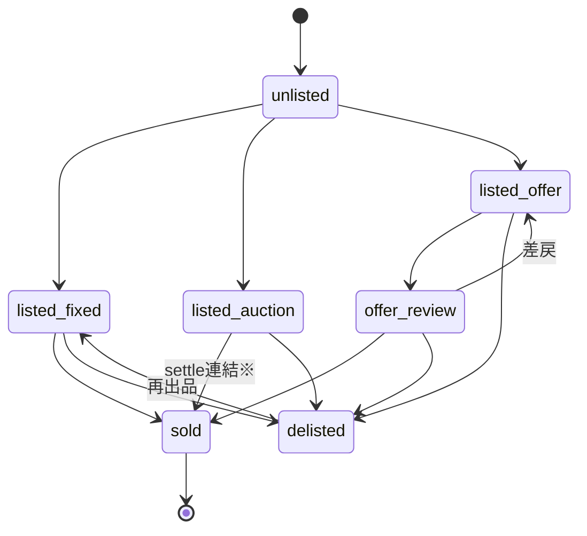
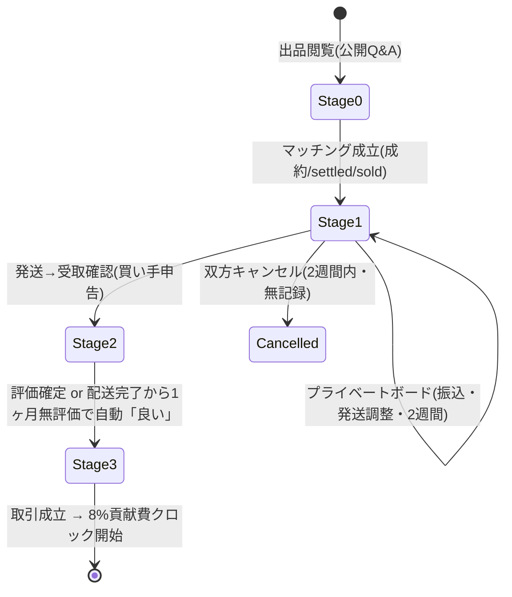

# 06 マーケット — 遷移設計 v1（Listing 状態機械の正式化）

> **ステータス**: 草案 · 人間レビュー待ち / 実装 Go 不可（設計ゲート「遷移設計」）
> **作成日**: 2026-06-08
> **解消ギャップ**: P0-08 / P1-06-STATE-MACHINE（06/11/22 で正式遷移図未着手 · 専門班 E §2.3）
> **前提**: [`06-マーケット.md`](./06-マーケット.md) FR-MKT-02/03/04/13 · §11.0（Stage 0–3）· §11.0.1（取引成立）· `backend/src/logic/marketListingStateStore.ts`（salvage 参照）

---

## 1. 2 層の状態（混同しない）

| 層 | 対象 | 正本 |
|----|------|------|
| **A. Listing 状態** | `chunk_id` の出品状態（在庫の出し入れ）| FR-MKT-02/03 · listing-state イベント |
| **B. Trade ライフサイクル** | 1 件の取引の進行（Stage 0→3）| §11.0 / §11.0.1 · trade-events |

> 重要: listing `sold` / auction `settled` は **B の Stage 1 相当**であり、**取引成立（Stage 3）ではない**（§11.0.1）。

---

## 2. A. Listing 状態機械（FR-MKT-02 — 許可辺）

### 2.1 状態

| 状態 | 意味 |
|------|------|
| `unlisted` | 未出品（イベント無し = 既定 · FR-MKT-03）|
| `listed_fixed` | 固定価格で出品中 |
| `listed_auction` | オークション出品中 |
| `listed_offer` | オファー募集中 |
| `offer_review` | オファー審査中 |
| `sold` | 成約（Stage 1 へ。取引成立ではない）|
| `delisted` | 取下げ |

### 2.2 許可辺（これ以外は 409 · FR-MKT-02）

```text
unlisted ──▶ listed_fixed | listed_auction | listed_offer
listed_fixed   ──▶ sold | delisted
listed_auction ──▶ sold(=settled連結※) | delisted
listed_offer   ──▶ offer_review | delisted
offer_review   ──▶ sold | listed_offer(差戻) | delisted
delisted       ──▶ listed_fixed | listed_auction | listed_offer   (再出品)
sold           ──▶ (終端 · 取引は B へ)
```



> ※ `listed_auction → sold` の **自動連結**は現状未実装（§9 既知ギャップ）。本設計では「auction `settled` 確定時に listing-state へ `sold` 遷移を発火する」連結辺を **正式辺**として定義（実装は Phase）。

### 2.3 認可・整合

- 書込は `requireMarketListingStateWrite`（NFR-MKT-03）。`POST /api/market/listing-state/transition`。
- 現在状態 = イベント列末尾 `to_state`（FR-MKT-03 · append-only）。不正辺は 409。

---

## 3. B. Auction 状態（FR-MKT-04）

```text
open ──(ends_at 経過 · settleDueAuctions)──▶ settled
open ──(取下げ)──▶ cancelled
```

- `open` 中のみ入札可。`ends_at` 経過で `settled`（入札なしも決着）。
- `settled` → Listing `sold` 連結（§2.2 ※）→ Trade Stage 1 開始。

---

## 4. B. Trade ライフサイクル（Stage 0–3 · §11.0/§11.0.1）



| Stage | 状態 | 主イベント | エラー/分岐導線 |
|-------|------|-----------|----------------|
| 0 マッチング前 | 公開 | 公開 Q&A（Y09 指摘 1）| 在庫切れ → delisted |
| 1 マッチング後 | プライベートボード（当事者2人）| 振込・発送調整・2 週間 | 双方キャンセル=無記録 / 支払前指摘 +1 / 支払後指摘 +5（Y09）|
| 2 配送完了 | 受取確認 | 「荷物届きました」→ 評価ウィンドウ開始 | 不着・相違 → 争い（11 §6）|
| 3 評価確定 | **取引成立** | 手動評価 or 1ヶ月無評価で自動「良い」| 8% 義務発生 → 未払いは fee_unpaid（§11.7）|

---

## 5. 取引成立 → 経済（横断整合）

```text
Stage 3 取引成立(§11.0.1)
  → trade-events 確定イベント
  → 8% 貢献費クロック起点(§11.7)
     未払い継続 → 月次 Fibonacci Δcount(§08 §5.1)
  → 振込導線(§23 GMO · deriveTransferCode)
```

- **8% はマッチング確定・settled・sold 単独では発生しない**（FR-MKT-13 を遷移で固定）。

---

## 6. PII・争いの導線（横断）

- Stage 1/2 で住所・口座を **ボードに書かせない** → [`12-設定-詳細設計-v1.md`](./12-設定-詳細設計-v1.md) の counterparty-pii 参照導線へ。
- 争いは **二人部屋（公開観覧）≠ Stage 1 プライベートボード**（§11.0 凡例）。証拠は PII redact（FR-DSP-18）。詳細は [`11-裁判-遷移設計-v1.md`](./11-裁判-遷移設計-v1.md)。

---

## 7. 設計ゲート位置・残

要件☑ · 詳細△（listing-state/trade-events schema は別途）· **遷移=本 doc（草案 v1）** · UI=モックあり（未確定）。

| 残（詳細設計）| 状態 |
|---------------|------|
| listing-state / trade-events イベント schema | 未（02-設計/_横断/schema/ に追加候補）|
| 返品・キャンセル辺の明示（Y07）| 未決（§9 ギャップ）|
| auction→sold 自動連結の実装 | Phase |

---

*草案 v1・非正本 / 人間レビュー用 / 実装禁止ゲート有効 — 実装 Go 不可*
