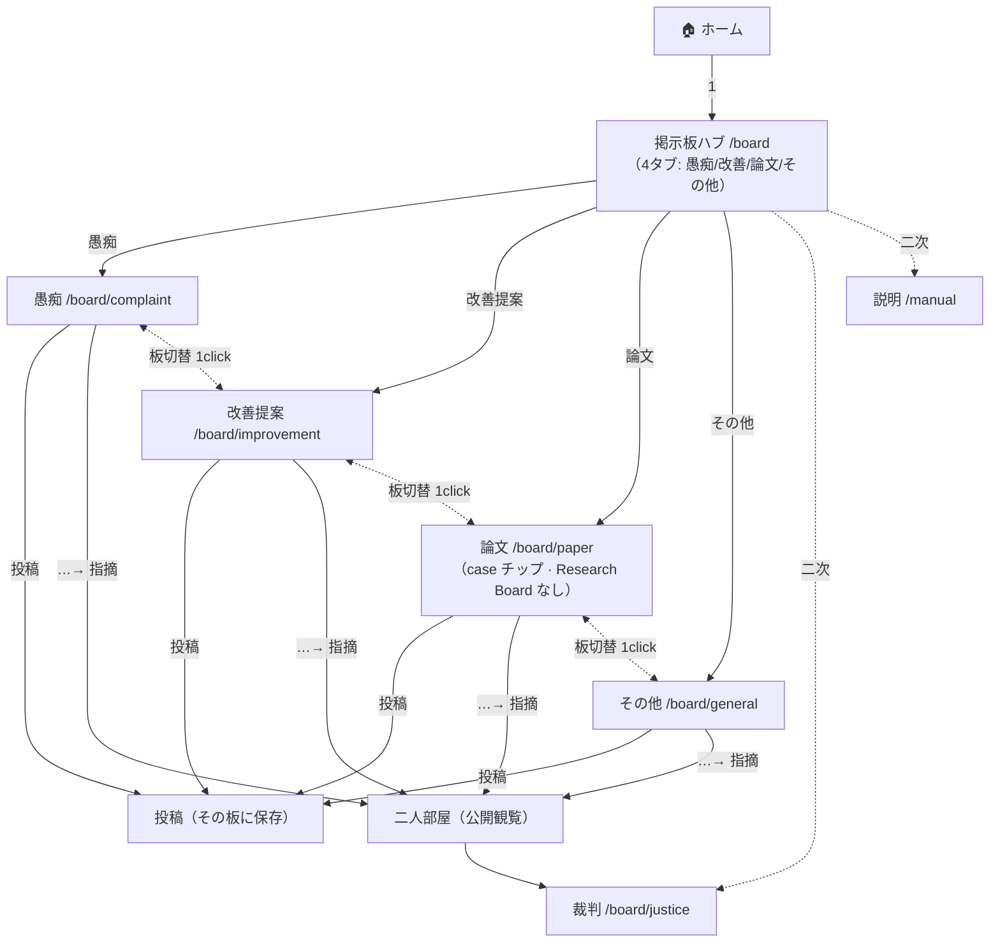

# 07 掲示板 — 板種別ごとの遷移詳細（投稿先の正しさ）

> **ステータス**: **草案 · 人間確定 2026-06-07**（H-BBS · [ADR-H-07](../02-設計/_横断/adr/ADR-H-07-掲示板-入口4つ-論文内研究.md)）
> **目的**: 「どの画面からでも **正しい板**に投稿できるか」を保証する。掲示板は **単一の汎用画面ではなく板種別のサブツリー**。**Research Board 独立ルートは作らない** — 研究・観察長文は **論文板 + case チップ**。
> **正本**: [`../01-要件/07-掲示板.md`](../01-要件/07-掲示板.md)（FR-BBS-05/06/11/12/14/15/16）· 指摘入口は [`../01-要件/11-裁判.md`](../01-要件/11-裁判.md) §3
> **関連 UI**: [`07-掲示板.md`](./07-掲示板.md) · [`00-遷移マップ.md`](./00-遷移マップ.md) · [`00-画面一覧-全体像.md`](./00-画面一覧-全体像.md)

---

## 1. 板種別（FR-BBS-06）

掲示板セクションの板（`menuConfig` 相当）。**愚痴 / 改善提案 / 論文 / その他**を主 4 板とし、**裁判 / 説明**を併設する。

| 板 | ルート（案） | 目的 | 投稿可否 |
|----|--------------|------|:--------:|
| 愚痴 | `/board/complaint` | 感情整理・匿名性高め | ○ |
| 改善提案 | `/board/improvement` | 機能改善の提案・議論 | ○ |
| 論文 | `/board/paper` | 研究・論文 · 観察/繁殖ログ等（**case チップで分類** · Research Board **なし**） | ○ |
| その他 | `/board/general` | 上記に当てはまらない話題 | ○ |
| 裁判 | `/board/justice` | 司法関連スレッド（指摘の集約・観覧） | △（指摘起点） |
| 説明 | `/manual`（hybrid） | 利用マニュアル系 | 閲覧中心 |

> **指摘は独立した「通報」入口ではない**。各板の **投稿カード `…→指摘`**（タグ + 理由 必須）から [`11-争い-二人部屋.md`](./11-争い-二人部屋.md) へ。掲示板・マーケットで **同型**（FR-BBS-11/12）。

---

## 2. 板ハブ（板選び）

```
[ホーム] ──掲示板──▶ [掲示板ハブ /board]
```


- 上部に **4 タブ（愚痴 | 改善提案 | 論文 | その他）** を常時表示 → どの板にいるか・どこへ行けるかが 1 目で分かる。
- 本文は **4 カード**（板タイトル・1 行説明・スレッド数・〔開く →〕）。
- 裁判 / 説明は二次導線（ハブ下部リンクまたはスレッド画面の左ナビ）。

> **投稿先の取り違え防止**: ハブで板を選んでから入るため、ユーザーは「今どの板にいるか」を必ず通過する。

---

## 3. スレッド + 投稿（板ごとに正しい投稿先）

```
[掲示板ハブ] ──板選択──▶ [スレッド /board/:category] ──投稿欄──▶ 投稿（その板に保存）
```


- スレッド画面は **左ナビに板一覧**（愚痴 / 改善提案 / 論文 / その他 / 裁判 / 説明）を持ち、**現在の板をハイライト**。
- **パンくず**で常時「掲示板 › 愚痴」のように **現在板を明示**。投稿欄はその板に保存される（取り違えなし）。
- 板の切替は左ナビ 1 クリック（板間移動も迷子にならない）。

> 上のモックは **愚痴 板が active**（左ナビ青ハイライト + パンくず「掲示板 › 愚痴」）。同型で改善提案 / 論文 / その他に切替わる。

### 3.1 論文板 — case チップ（H-BBS 確定）

```
[論文 /board/paper] ──case チップ──▶ フィルタ済みスレッド一覧 ──投稿──▶ paper_case 必須
```

| case（enum） | 用途 |
|--------------|------|
| `paper` | 論文・preprint |
| `observation` | 観察記録 |
| `breeding_log` | 繁殖ログ |
| `analysis` | 分析 |
| `review` | 査読 |
| `replication` | 追試 |
| `hypothesis` | 仮説 |
| `other` | その他（論文板内） |

- **独立 `/board/research` ルートは存在しない**（ADR-H-07）
- 投稿フォーム: 本文の上に **case 選択**（必須）。一覧: タブ下に **横スクロール case チップ**（「すべて」+ 各 case）
- 他 3 板（愚痴/改善/その他）には case 行 **なし**

---

## 4. 板種別ごとのフロー・クリック数

| 板 | list → thread → post 経路 | 投稿までのクリック |
|----|----------------------------|:--------:|
| 愚痴 | ホーム → 掲示板ハブ →（愚痴）→ スレッド → 投稿 | **3〜4** |
| 改善提案 | ホーム → 掲示板ハブ →（改善提案）→ スレッド → 投稿 | **3〜4** |
| 論文 | ホーム → 掲示板ハブ →（論文）→（任意: case チップ）→ スレッド → 投稿（case 選択） | **3〜5** |
| その他 | ホーム → 掲示板ハブ →（その他）→ スレッド → 投稿 | **3〜4** |

> **直行ショートカット**: スレッド画面の **左ナビで板を直接選ぶ**なら、板間移動は **1 クリック**（ハブ経由不要）。ホームのナビ「掲示板」は **既定でハブ**、または **最後に見た板**に入る（設定で選択可・既定はハブ）。

### 4.1 指摘（争い）入口 — 板共通・同型

```
[スレッド投稿カード] ──…→ 指摘（タグ + 理由 必須）──▶ [二人部屋（公開観覧）/board/.../dispute]
```

- **どの板でも同じ `…→指摘`**。専用の「通報」ボタンは置かない（[`11-裁判.md`](../01-要件/11-裁判.md) §3.2）。
- 指摘は **裁判板に集約** されて観覧できる（板を跨いだ争いの一覧性）。

---

## 5. 遷移図（板サブツリー）



> 太線 = 主導線。点線 = 二次導線 / 板間切替（左ナビ 1 クリック）。

---

## 6. 状態（板共通・必須）

| 状態 | 表示 |
|------|------|
| loading | スレッド/カードはスケルトン |
| empty | 「まだ投稿がありません」+ 投稿誘導（その板の文脈で） |
| error | 「読み込めませんでした」+ 再試行（raw error 非表示） |
| 投稿失敗（rescue） | 失敗理由 + 再試行 + 保存境界を明示（FR-BBS-07 · REQ-024） |

---

## 7. レビュー観点

- [ ] 掲示板が **単一汎用画面ではなくサブツリー**（ハブ + 板）になっているか。
- [ ] **どの画面からでも現在板が明示**（パンくず + 左ナビハイライト）され、投稿先を取り違えないか。
- [ ] 板間移動が **1 クリック**（左ナビ）で迷子にならないか。
- [ ] 指摘入口が **全板同型**（独立した通報ボタンを作っていない）か。
- [ ] 各板に **空状態 / ローディング / エラー / 投稿失敗 rescue** があるか。
- [ ] **Research Board 独立ルートを作っていない**か（論文 + case で足りる）。
- [ ] 論文板に **case チップ + 投稿時 case 必須** があるか。

---

*草案 · 非正本 / 人間確定 2026-06-07（H-BBS · ADR-H-07）/ 実装禁止ゲート有効*
