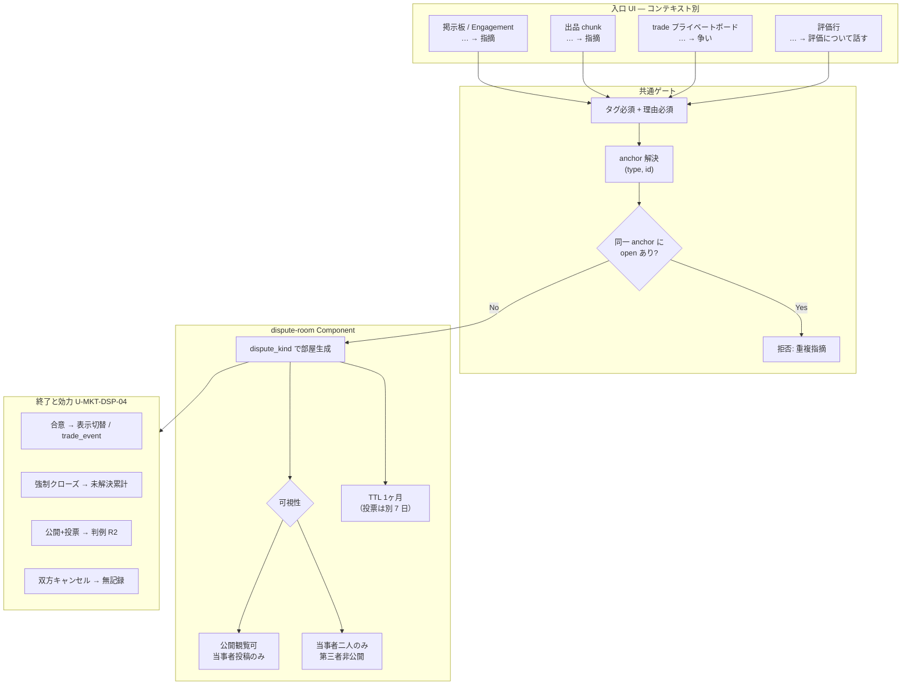
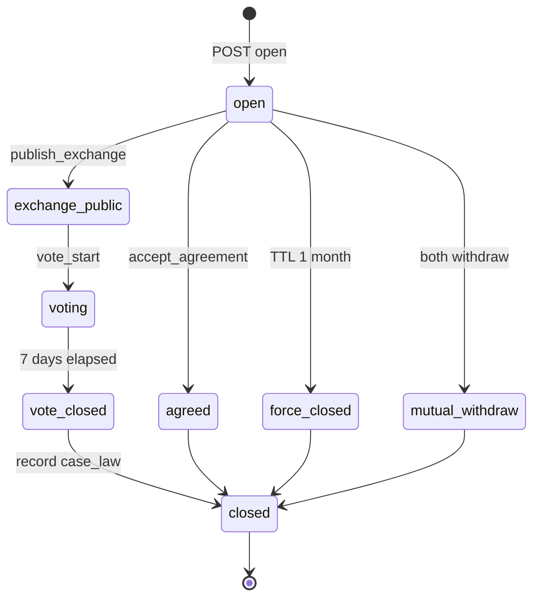

# 11. 裁判 — U-MKT-DSP-01〜04 詳細設計（たたき台 v1 · 非正本）

> **HUMAN-CONFIRMED**: **U-MKT-DSP v1.1 人間 Go** — 2026-06-09（ユーザー `11 Go`）。争い統合モデル（dispute-room · 二層争い · タグ · 錨 · 合意効力）を **哲学として採用**。監査: [`00-監査役-実装前ゲート-v1.md`](./00-監査役-実装前ゲート-v1.md) §2 · §4。**実装 Go ではない** — 設計ゲート 4 点全体・HUMAN-IMPL-SIGNOFF は別途。

> **用途**: 人間レビュー・設計 AI 引き継ぎ用。  
> **親要件**: [`11-裁判.md`](./11-裁判.md) **v2.7** · [`06-マーケット.md`](./06-マーケット.md) **§11**  
> **版**: **たたき台 v1.1** — 2026-06-07（AI レビュー S-02 反映）  
> **設計ゲート**: **U-MKT-DSP v1.1 人間 Go 済**（2026-06-09）— 4 点全体の人間確定・実装 Go は **未**（`.cursor/rules/design-before-implementation-gate.mdc`）
> **実装**: **禁止**（`.cursor/rules/design-before-implementation-gate.mdc`）

---

> **IHL 読み替え（2026-06-07）**: 本文の「stays in civilization-os」は **IHL rebuild（legacy = salvage 参照）** と読む。正本: [README マスターノート](./README.md) · [06-リポジトリ戦略](../05-運用/_横断/リポジトリ戦略-legacyとIHL.md)

## 1. 目的・スコープ

### 1.1 目的

[`11-裁判.md`](./11-裁判.md) §6.7 の **部分解決** 4 件（U-MKT-DSP-01〜04）を、他 IHL システムと **衝突なく一本化** する。

| ID | 本書での位置づけ |
|----|------------------|
| **U-MKT-DSP-01** | 争い入口の **統合モデル**（`dispute-room` 1 本 · `dispute_kind` + 入口 UI 分岐） |
| **U-MKT-DSP-02** | 指摘タグ **初期カタログ**（6〜8 カテゴリ · Y01〜Y15 マッピング · Δcount ヒント） |
| **U-MKT-DSP-03** | 争点 **錨（anchor）** 型と **1 錨 1 open** ルール |
| **U-MKT-DSP-04** | 合意・終了時の **効力**（表示切替 / trade_event / 判例 / 版管理 / 無記録） |

### 1.2 スコープ内

- 掲示板指摘（§3）· Engagement 指摘（U-MKT-DSP-09）· 出品指摘（Y09）· 取引プライベート争い · 公開エクスチェンジ + 投票 · 評価争い（Y08）
- Component 分割 · R2 キー/schema たたき台 · API/状態遷移 たたき台

### 1.3 スコープ外（重複フローを作らない）

| 項目 | 扱い | 正本 |
|------|------|------|
| **8% `fee_unpaid`** | 争い **非経由** · 経済自動 | U-MKT-DSP-07 · [`06-マーケット.md`](./06-マーケット.md) §11.7 |
| **バグ・プラチナ未付与** | 司法外 | [`11-裁判.md`](./11-裁判.md) §2 区分 3 |
| **Y11 行政** | 人間ゲート · 不使用フラグ | §6.7 · §14.7.4 |
| **開発者判定 UI** | 不採用 | NFR-DSP-01 |
| **エスクロー・自動返金** | 非エスクロー（`mkg_p2p_core`）— 合意でも OS は資金移動しない | §14.7.1 |

---

> **IHL 読み替え（2026-06-07）**: 本文の「stays in civilization-os」は **IHL rebuild（legacy = salvage 参照）** と読む。正本: [README マスターノート](./README.md) · [06-リポジトリ戦略](../05-運用/_横断/リポジトリ戦略-legacyとIHL.md)

## 2. 統合モデル（争い入口一本化）

### 2.1 設計原則

| 原則 | 内容 |
|------|------|
| **1 コンポーネント** | ランタイム争い処理は **`dispute-room`**（C-USB Component）に集約 |
| **種別は enum** | `dispute_kind` で可視性・TTL・合意効力・カルマ経路を分岐 |
| **錨は正規化** | 争いの対象は **`(anchor_type, anchor_id)`** の組で一意。UI 入口はコンテキスト別 |
| **入口 UI は分岐** | 公開掲示板の `…→指摘` と、取引プライベートの `…→争い` は **別メニュー文言** だが **同一 create API** |
| **二層争い** | **非金銭**（board / engagement / listing）と **金銭**（post-matching trade）は **経路・可視性が異なる** が **同一 dispute-room エンジン** |

### 2.2 統合フロー図



### 2.3 `dispute_kind` 確定 enum

| `dispute_kind` | 典型 anchor | 可視性 | 入口 UI ラベル | 親要件 |
|----------------|-------------|--------|----------------|--------|
| `board_pointer` | `board_message` / `listing_engagement` | **公開観覧可** | **指摘** | §3 · U-MKT-DSP-09 |
| `listing_pointer` | `listing` | **公開観覧可** | **指摘** | Y09 · §6.2-D |
| `trade_private` | `trade_private` | **非公開** | **争い**（指摘と同義だが文言分離） | §6.1 Stage 1 |
| `trade_exchange` | `trade_public_exchange` | **公開**（opt-in 後） | **公開エクスチェンジ** | §6.2-C · §6.3 |
| `rating_dialogue` | `market_rating` | **公開可**（当事者 opt-in） | **評価について話す** | Y08 |

**判断・理由**

- **UI 文言を分ける**: 取引プライベートで「指摘」と書くと掲示板二人部屋と混同する（§14.7.1「プライベートは第三者非公開」）。**エンジンは同一**。
- **`trade_exchange` は部屋の派生状態**: プライベート争いから当事者が「公開して議論」したとき、**同一 `dispute_id` の `visibility` 遷移** とする（新 dispute を増やさない）。

### 2.4 二層争いの整理

| 層 | 対象 | 入口 | 部屋 | 金銭 |
|----|------|------|------|------|
| **非金銭** | 掲示板発言 · Engagement · 出品（マッチング前） | 単一 = **指摘** | 公開観覧二人部屋 | なし |
| **金銭（マッチング後）** | `trade_id` · プライベートボード投稿 | **争い**（同一 component） | プライベート · 任意で公開エクスチェンジ | P2P · 非エスクロー |
| **評価** | `rating_id` | 会話ボード | 掲示板 TTL 同型 | 間接（評価影響） |

**マッチング前の listing 問題**（Y09 パターン 1〜3）は **`listing_pointer`** — 公開 Q&A も Engagement も **指摘** に収束（特別フローなし · U-MKT-DSP-09）。

---

> **IHL 読み替え（2026-06-07）**: 本文の「stays in civilization-os」は **IHL rebuild（legacy = salvage 参照）** と読む。正本: [README マスターノート](./README.md) · [06-リポジトリ戦略](../05-運用/_横断/リポジトリ戦略-legacyとIHL.md)

## 3. U-MKT-DSP-01 — 争い入口（確定仕様）

### 3.1 判断

| # | 判断 | 理由 |
|---|------|------|
| 1 | **単一 `dispute-room` component** + `dispute_kind` | 重複実装・カルマ二重計上を防ぐ。§10 MiniKernel の Component 集約に合致 |
| 2 | **非金銭はすべて `…→指摘`** | §3.2 · FR-DSP-01/02 · U-MKT-DSP-09 と一致 |
| 3 | **金銭は `trade_id` / プライベート投稿を錨に `…→争い`** | 公開観覧と混同しない。同一 underlying API |
| 4 | **配送完了後はプライベート争い → 任意 `trade_exchange`** | §6.2-C · 記録常時残存 |
| 5 | **Y01/Y02 は争い室を開かず期限ルール** | 別フロー不要（§6.1）。`trade_event` + Δcount +1 のみ |
| 6 | **双方合意キャンセルは争い API を呼ばない** | 無記録（§6.1 · U-MKT-DSP-04） |

### 3.2 入口マトリクス

| コンテキスト | メニュー操作 | `dispute_kind` | `anchor_type` | 備考 |
|--------------|--------------|----------------|---------------|------|
| 国際 BBS 投稿 | 指摘 | `board_pointer` | `board_message` | §3 |
| Engagement Q&A/称賛/ラブレター | 指摘 | `board_pointer` | `listing_engagement` | U-MKT-DSP-09 |
| 出品ページ（chunk） | 指摘 | `listing_pointer` | `listing` | Y09 |
| マッチング後プライベート投稿 | 争い | `trade_private` | `trade_private` | `anchor_id` = `{trade_id}` または `{trade_id}:{message_id}` ※詳細設計下記 |
| 配送完了後・公開移行後 | （部屋内）公開エクスチェンジ | `trade_exchange` | `trade_public_exchange` | 同一 `dispute_id` |
| 低評価行 | 評価について話す | `rating_dialogue` | `market_rating` | Y08 |

**`trade_private` の錨粒度（確定）**

- **デフォルト錨**: `anchor_id = trade_id` — 取引全体についての争い（Y03〜Y07）。
- **オプション細分化**（実装フェーズ 2 可）: 特定プライベート投稿を錨にする場合 `anchor_id = trade_id:msg_{message_id}`。**v1 は trade 単位 1 open を推奨**（当事者の部屋乱立防止）。

### 3.3 却下した代替案

| 代替案 | 却下理由 |
|--------|----------|
| マーケット専用「審理」画面 | 開発者裁判官モデルに近づく · §14.1 |
| Engagement 専用争いフロー | U-MKT-DSP-09 で **掲示板同型** と確定済み |
| 公開掲示板と同一 UI で取引争い | PII・非公開要件と矛盾（§6.8 · §14.7.4） |

---

> **IHL 読み替え（2026-06-07）**: 本文の「stays in civilization-os」は **IHL rebuild（legacy = salvage 参照）** と読む。正本: [README マスターノート](./README.md) · [06-リポジトリ戦略](../05-運用/_横断/リポジトリ戦略-legacyとIHL.md)

## 4. U-MKT-DSP-02 — 指摘タグ（確定仕様）

### 4.1 判断

| # | 判断 | 理由 |
|---|------|------|
| 1 | **初期 7 カテゴリ**（下表）— Y01〜Y15 を UX 用に集約 | 15 タグは選択負荷が高い。§3.2「タグ必須」の意図（軽率指摘抑制）を維持 |
| 2 | **タグ + 理由テキスト必須** | ユーザー確定 · FR-DSP-02 |
| 3 | **タグ → `delta_count_hint` はヒントのみ** | **解決経路完了まで自動 Δcount しない** — 二重計上・誤分類防止（§08 二層） |
| 4 | **取引争いはサブタグ（任意）** | `dispute_kind` が `trade_*` のとき **追加で trade 専用タグ 1 つ** を推奨（UX）· 必須は共通 7 のみ |

### 4.2 共通タグカタログ（v1 初期セット）

| `tag_id` | 表示名（ja 例） | 主な Y マッピング | `delta_count_hint` | 適用 `dispute_kind` |
|----------|-----------------|-------------------|--------------------|---------------------|
| `expr_culture` | 表現・文化差 | 掲示板一般 · Y10 言動 | —（掲示板: 未解決 5 倍数 +1） | `board_pointer` |
| `misleading_listing` | 虚偽出品・説明相違 | Y03 · Y04 · Y09 · Y14 | +1 / +5（タイミング別） | `listing_pointer` · `trade_*` |
| `delivery` | 配送・未着・遅延 | Y01 · Y05 · Y06（配送軸） | +3（支払完了後経路） | `trade_private` · `trade_exchange` |
| `payment` | 代金・支払 | Y02 | +1（期限切れ自動経路） | `trade_private` |
| `rating` | 評価・報復 | Y08 | +1（悪意低評価確定時） | `rating_dialogue` |
| `conduct` | 行動・マナー | Y13 · Engagement 一般 | コミュニティ判断 | 全般 |
| `other` | その他 | Y12 · Y15 等 | — | 全般 |

**掲示板専用**: `expr_culture` / `conduct` / `other` が主。マーケット取引: `misleading_listing` / `delivery` / `payment` が主。

### 4.3 取引争いサブタグ（任意 · 推奨）

| `trade_subtag_id` | 表示名 | Y | 投票可 |
|-------------------|--------|---|--------|
| `t_description_mismatch` | 説明と違う | Y03 | ◎ |
| `t_counterfeit` | 偽物・コピー | Y04 | ◎ |
| `t_shipping_delay` | 未発送・遅延 | Y05 | — |
| `t_damage` | 破損・梱包不良 | Y06 | ◎ |
| `t_return_cancel` | 返品・キャンセル | Y07 | — |

### 4.4 `delta_count_hint` の適用タイミング（確定）

| 経路 | Δcount 発火 | タグの役割 |
|------|-------------|------------|
| 掲示板 · 未解決強制クローズ | **5・10・15… 回目** に +1（§4.1） | タグは **分類のみ** — クローズ時にタグ別 Δcount **なし** |
| マーケット · 支払期限切れ（Y02） | 売り手クローズ時 **+1**（自動） | タグ不要（争い室なし） |
| マーケット · 投票敗者 | 投票終了 **+5**（1 回） | タグは判例メタデータ |
| マーケット · Y05/Y06/Y07 | **解決経路確定イベント** で +3 等 | `delta_count_hint` を **イベント種別と突合** して付与 |
| 虚偽出品指摘（Y09） | 指摘 **成立** + タイミング判定後 | +1 / +5 |

**重要**: 指摘 **開始時** に `delta_count_hint` を **予約表示**（「この種別は解決後 +3 となりうる」等）してよいが、**Fib 適用は §08 経由の確定イベントのみ**。

### 4.5 Component: `dispute-tag-catalog`

- **責務**: タグ一覧 · i18n ラベル · `dispute_kind` フィルタ · Y マッピング · `delta_count_hint` メタ
- **配置**: Kernel `Governance` / FeatureNode `board` + `market` 共有読み取り
- **更新**: GitHub でカタログ変更 · ランタイムは R2 に **versioned catalog snapshot** を INSERT（UPDATE 禁止）

---

> **IHL 読み替え（2026-06-07）**: 本文の「stays in civilization-os」は **IHL rebuild（legacy = salvage 参照）** と読む。正本: [README マスターノート](./README.md) · [06-リポジトリ戦略](../05-運用/_横断/リポジトリ戦略-legacyとIHL.md)

## 5. U-MKT-DSP-03 — 争点錨（確定仕様）

### 5.1 `anchor_type` 一覧

| `anchor_type` | `anchor_id` 形式（たたき台） | 用途 | 典型 `dispute_kind` |
|---------------|------------------------------|------|---------------------|
| `board_message` | `msg_{uuid}` | 国際 BBS 発言 | `board_pointer` |
| `listing_engagement` | `eng_{subject_key}:{engagement_id}` | Q&A · 称賛 · ラブレター | `board_pointer` |
| `listing` | `chunk_{chunk_id}` | 出品自体（Y09） | `listing_pointer` |
| `trade_private` | `trade_{trade_id}` | マッチング後プライベートボード | `trade_private` |
| `trade_public_exchange` | `trade_{trade_id}:exchange` | 公開エクスチェンジ + 投票 | `trade_exchange` |
| `market_rating` | `rating_{trade_id}:{rating_id}` | Y08 評価争い | `rating_dialogue` |

### 5.2 「1 チャット 1 ポインタ」拡張ルール

| ルール | 内容 |
|--------|------|
| **1 錨 1 open** | 同一 `(anchor_type, anchor_id)` に `status ∈ {open, exchange_public, voting}` が存在する間、**新規指摘/争い開始を拒否**（§3.3 · FR-DSP-05） |
| **ネスト指摘** | **親部屋内** のメッセージを **新 anchor**（`board_message` = 部屋内 msg id）にして **子 dispute** を生成。深さ上限なし（§3.4） |
| **横断露出** | **別 anchor** なら別 open 可（§4.2）— 同一ユーザーが複数部屋を持ちうる |
| **`trade_public_exchange`** | プライベート `trade_{id}` から公開移行時、**anchor は `trade_{id}:exchange` に論理昇格** — プライベート錨の open は `exchange_public` 状態へ（重複 open なし） |

### 5.3 判断・理由

- **listing と listing_engagement を分離**: Y09 パターン 1（公開 Q&A）は engagement 錨、出品全体への指摘は listing 錨 — **カルマタイミング判定**（§6.4）に必要。
- **評価は `market_rating` 専用**: 掲示板 `board_message` と混同しない（Y08 版管理の対象が rating エンティティのため）。

---

> **IHL 読み替え（2026-06-07）**: 本文の「stays in civilization-os」は **IHL rebuild（legacy = salvage 参照）** と読む。正本: [README マスターノート](./README.md) · [06-リポジトリ戦略](../05-運用/_横断/リポジトリ戦略-legacyとIHL.md)

## 6. U-MKT-DSP-04 — 合意効力（確定仕様）

### 6.1 終了種別と効力マトリクス

| シナリオ | 終了トリガー | 表示・データ効力 | Δcount | 記録 |
|----------|--------------|------------------|--------|------|
| **Board 指摘** | 合意（修正提案 + OK） | 元 `board_message` / engagement **表示を合意版に切替** · 旧版 R2 保持 · **新 timestamp 勝ち** | 未解決累計に **含めない** | `dispute_resolved` + `content_revision` |
| **Board 指摘** | 1 ヶ月強制クローズ | 元表示 **変更なし** | 双方 **未解決累計 +1** · 5 倍数で +1 | `dispute_force_closed` |
| **Listing 指摘** | 合意 | 出品説明・画像キャプション等 **表示切替**（chunk 表示レイヤ）· 出品状態機械は **別** | Y09 タイミング表 | 同上 + `listing_revision` |
| **Trade プライベート** | 合意 | **`trade_event` append**: `dispute_resolved` · `revised_terms_text`（任意）· **自動返金なし** | 経路に応じ +3 等（§6.4） | 常時（Stage 1 ログは既存） |
| **Trade プライベート** | 取り下げ合意 | 争い `closed_by_mutual_withdraw` · **記録残す** | **取り下げのみなら Δcount なし**（Y03 明示） | 残存 |
| **公開エクスチェンジ + 投票** | 投票終了 | **判例 R2** · 敗者 **Δcount +5**（1 回）· **出品強制編集なし** | +5 | `case_law` + `vote_result` |
| **公開エクスチェンジ + 投票** | 同点 | 判例記録可 · **Δcount 0** | 0 | 同上 |
| **Rating Y08** | 合意 / 版採用 | **評価エンティティ版管理** — 新 rating レコードが表示勝ち | 悪意確定時 +1 · 取り下げ 0 | 記録残 |
| **双方キャンセル（マッチング後）** | 双方ボタン | **無記録** — dispute API **未呼び出し** | なし | なし |

### 6.2 非エスクロー整合（重要）

| 項目 | ルール |
|------|--------|
| **合意テキスト** | 「返金した」「補償した」等は **当事者の申告** として `trade_event` に残すのみ |
| **PII バリデーション（v1.1）** | `revised_terms_text` に **住所・口座番号・電話・メール全文** 等が含まれる場合は **サーバー reject**（400）。UI は [`12-設定.md`](./12-設定.md) §④.5 の構造化フィールド参照を促す — **PII 直書き禁止**（§6.8 · P10） |
| **OS の義務** | 振込・返金・配送の **実行はしない**（`mkg_p2p_core` · FR-MKT-06） |
| **GMO / 8%** | 争い合意と **連動しない** — 照合は [`23-GMO銀行振込判定.md`](./23-GMO銀行振込判定.md) 別軸 |

### 6.3 `trade_event` たたき台（争い関連）

```json
{
  "event_type": "dispute_resolved",
  "trade_id": "trade_…",
  "dispute_id": "dsp_…",
  "payload": {
    "resolution": "agreed_terms",
    "revised_terms_text": "…",
    "tag_id": "delivery",
    "delta_count_applied": 3
  },
  "created_at": "ISO8601"
}
```

**INSERT ONLY** — 訂正は新イベントで表現。

---

> **IHL 読み替え（2026-06-07）**: 本文の「stays in civilization-os」は **IHL rebuild（legacy = salvage 参照）** と読む。正本: [README マスターノート](./README.md) · [06-リポジトリ戦略](../05-運用/_横断/リポジトリ戦略-legacyとIHL.md)

## 7. 他システム整合表

| システム | 接続点 | 本設計との整合 | 衝突回避 |
|----------|--------|----------------|----------|
| **07 掲示板** | 指摘入口 · 公開観覧 | `board_pointer` · §3 同一 | Engagement も **指摘のみ**（FR-BBS-11） |
| **06 マーケット** | Stage 0〜3 · Y 表 | `trade_private` / `listing_*` · §11.4 | `fee_unpaid` は **争い API 外** |
| **08 カルマ** | Δcount · Fib · 二層 | ヒント → 確定イベントのみ付与 | 値直接操作 **なし**（FR-KRM-08） |
| **12 設定** | 取引前 PII | 争い証拠は構造化 ID のみ（§6.8） | ボードに住所・口座 **直書き禁止** |
| **21 翻訳** | 二人部屋 UGC | クライアント翻訳 · 原文 R2 | サーバー強制単一言語 **なし** |
| **22 PT マーケット** | PT 台帳共有 | 投票 1 票 = 1 PT · 指摘 30 回/PT | 単一台帳（FR-PTMKT-04） |
| **23 GMO** | 8% 照合 | 争い合意と **非連動** | `trade_event` ID 参照のみ公開可 |
| **20 投票** | EconomyVote salvage | `trade_exchange` 下部 2 ボタン | quorum なし · 7 日 |

---

> **IHL 読み替え（2026-06-07）**: 本文の「stays in civilization-os」は **IHL rebuild（legacy = salvage 参照）** と読む。正本: [README マスターノート](./README.md) · [06-リポジトリ戦略](../05-運用/_横断/リポジトリ戦略-legacyとIHL.md)

## 8. Component 分割案

| Component | 責務 | IN | OUT |
|-----------|------|----|----|
| **`dispute-room`** | 部屋生成 · メッセージ · TTL · 合意フロー · 公開移行 | create 要求 · anchor · tag · reason | `dispute_id` · room state · events |
| **`dispute-anchor`** | 錨解決 · open 一意制約 · ネスト親子 | `(type, id)` · parent_dispute_id? | resolved entity refs · conflict 409 |
| **`dispute-tag-catalog`** | タグ一覧 · hint · i18n | locale · dispute_kind | tag set · metadata |
| **`dispute-vote-panel`** | PT 投票 UI（Y03/Y06） | dispute_id · opt-in | vote tallies · case_law trigger |
| **`dispute-evidence-attach`** | §6.8 証拠 | structured IDs | evidence refs（PII redact） |

**Kernel 配置（たたき台）**

- **FeatureNode**: `board`（公開指摘）+ `market`（取引争い）— 共有 Kernel `dispute-governance`
- **ルーティング**: `/kernel/dispute/{dispute_id}` — 画面概念ではなく UUID（§00）

---

> **IHL 読み替え（2026-06-07）**: 本文の「stays in civilization-os」は **IHL rebuild（legacy = salvage 参照）** と読む。正本: [README マスターノート](./README.md) · [06-リポジトリ戦略](../05-運用/_横断/リポジトリ戦略-legacyとIHL.md)

## 9. R2 キー / schema たたき台

### 9.1 キー階層

```
r2/dispute/
  catalog/tags/v{version}.json          # INSERT only snapshots
  room/{dispute_id}/
    meta.json                           # kind, anchor, status, parties, ttl_at
    events.jsonl                        # append-only event stream
    messages.jsonl                      # room posts
    vote/{vote_id}.jsonl                # PT votes (if any)
    case_law_ref.json                   # pointer to case law bundle
```

### 9.2 主要イベント型（`events.jsonl`）

| `event_type` | 説明 |
|--------------|------|
| `dispute_opened` | 指摘/争い開始 |
| `message_posted` | 部屋内投稿 |
| `agreement_proposed` | 修正提案 |
| `agreement_accepted` | 指摘者 OK |
| `visibility_exchange_public` | 公開エクスチェンジ移行 |
| `vote_started` / `vote_closed` | プラチナ投票 |
| `dispute_force_closed` | TTL 満了 |
| `dispute_mutual_withdraw` | 双方取り下げ |
| `delta_count_scheduled` | Δcount 確定（§08 へ連携） |
| `content_revision_applied` | 表示切替指示（board/listing/rating） |

### 9.3 `meta.json` 必須フィールド

```json
{
  "dispute_id": "dsp_…",
  "dispute_kind": "trade_private",
  "anchor_type": "trade_private",
  "anchor_id": "trade_…",
  "status": "open",
  "complainant_user_id": "…",
  "respondent_user_id": "…",
  "tag_id": "delivery",
  "trade_subtag_id": "t_damage",
  "reason_text": "…",
  "parent_dispute_id": null,
  "visibility": "private",
  "ttl_at": "ISO8601",
  "created_at": "ISO8601"
}
```

---

> **IHL 読み替え（2026-06-07）**: 本文の「stays in civilization-os」は **IHL rebuild（legacy = salvage 参照）** と読む。正本: [README マスターノート](./README.md) · [06-リポジトリ戦略](../05-運用/_横断/リポジトリ戦略-legacyとIHL.md)

## 10. API / 状態遷移 たたき台

### 10.1 API（HTTP たたき台）

| Method | Path | 説明 |
|--------|------|------|
| `POST` | `/api/dispute/open` | 指摘/争い開始（tag + reason + anchor） |
| `GET` | `/api/dispute/{id}` | 部屋メタ + 可視性チェック |
| `POST` | `/api/dispute/{id}/messages` | 当事者投稿 |
| `POST` | `/api/dispute/{id}/propose-agreement` | 修正提案 |
| `POST` | `/api/dispute/{id}/accept-agreement` | 合意 OK |
| `POST` | `/api/dispute/{id}/publish-exchange` | 公開エクスチェンジ移行（opt-in） |
| `POST` | `/api/dispute/{id}/vote/start` | 投票開始（Y03/Y06） |
| `POST` | `/api/dispute/{id}/withdraw` | 取り下げ |
| `GET` | `/api/dispute/tags` | カタログ（locale · kind フィルタ） |

**認可**

- 投稿: **当事者二人のみ**（公開観覧時も同じ）
- 観覧: `visibility=public` または `exchange_public` なら第三者 **read-only**
- 開発者判定 API: **存在しない**（NFR-DSP-01）

### 10.2 状態遷移



---

> **IHL 読み替え（2026-06-07）**: 本文の「stays in civilization-os」は **IHL rebuild（legacy = salvage 参照）** と読む。正本: [README マスターノート](./README.md) · [06-リポジトリ戦略](../05-運用/_横断/リポジトリ戦略-legacyとIHL.md)

## 11. 設計ゲート checklist

| # | ゲート項目 | 状態 | メモ |
|---|------------|------|------|
| 1 | **要件定義** | **✓** | 親 [`11-裁判.md`](./11-裁判.md) v2.7 · §14 整合。本書で U-MKT-DSP-01〜04 を **詳細化** |
| 2 | **詳細設計** | **△** | 本書 v1 たたき台。**人間/AI レビュー待ち**（[`11-裁判-AIレビュー依頼.md`](./11-裁判-AIレビュー依頼.md)） |
| 3 | **遷移設計** | **△** | §10.2 状態図たたき台。画面遷移・深リンクは **未確定** |
| 4 | **UI 設計** | **△** | 入口メニュー文言 · タグ選択 UI · 公開/非公開の視覚差 — **未着手** |

**実装 Go 条件**: 上記 4 点が **人間確定** または **明示 Go**（`design-before-implementation-gate.mdc`）。

---

> **IHL 読み替え（2026-06-07）**: 本文の「stays in civilization-os」は **IHL rebuild（legacy = salvage 参照）** と読む。正本: [README マスターノート](./README.md) · [06-リポジトリ戦略](../05-運用/_横断/リポジトリ戦略-legacyとIHL.md)

## 12. 正本・参照順

1. 本書 §2〜§6（U-MKT-DSP-01〜04 確定仕様）
2. [`11-裁判.md`](./11-裁判.md) **§14**（判断・理由 — 矛盾時は §14 優先）
3. [`06-マーケット.md`](./06-マーケット.md) **§11.0〜§11.4**
4. [`08-カルマシステム.md`](./08-カルマシステム.md) v2.0
5. [`07-掲示板.md`](./07-掲示板.md) · [`12-設定.md`](./12-設定.md) §④.5 · [`21-翻訳-言語.md`](./21-翻訳-言語.md)
6. [`00-土台-MiniKernel-C-USB-コンポーネント.md`](./00-土台-MiniKernel-C-USB-コンポーネント.md)

---

> **IHL 読み替え（2026-06-07）**: 本文の「stays in civilization-os」は **IHL rebuild（legacy = salvage 参照）** と読む。正本: [README マスターノート](./README.md) · [06-リポジトリ戦略](../05-運用/_横断/リポジトリ戦略-legacyとIHL.md)

## 13. 変更履歴

| 版 | 日付 | 内容 |
|----|------|------|
| **v1.1** | 2026-06-07 | **AI レビュー S-02** — §6.2 `revised_terms_text` PII バリデーション追加 |

---

*たたき台・非正本 / 人間レビュー用 / 設計 AI 引き継ぎ用*
