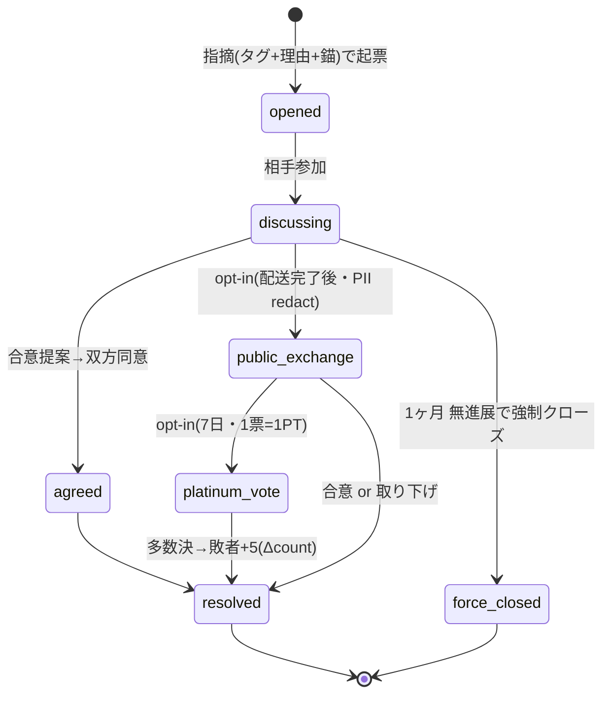

# 11 裁判（争い）— 遷移設計 v1（二人部屋・合意・プラチナ投票）

> **ステータス**: 草案 · 人間レビュー待ち / 実装 Go 不可（設計ゲート「遷移設計」）
> **作成日**: 2026-06-08
> **解消ギャップ**: 専門班 E §4.3（遷移設計 未着手）を補完。U-MKT-DSP-01〜04 詳細設計（人間レビュー待ち）の **状態遷移を図化**
> **前提**: [`11-裁判.md`](./11-裁判.md) v2.7 §6 · [`11-裁判-U-MKT-DSP-01-04-詳細設計.md`](./11-裁判-U-MKT-DSP-01-04-詳細設計.md)（AI レビュー通過・人間 Go 待ち）· [`02-設計/features/11-裁判/ui/争い-二人部屋.md`](../../02-設計/features/11-裁判/ui/争い-二人部屋.md) · [`06-マーケット-遷移設計-v1.md`](./06-マーケット-遷移設計-v1.md)
> **固定前提**: 開発者は裁判官ではない / 人間対話が本体 / 階層審判なし / **INSERT ONLY**

---

## 1. 問題分類 3 区分（入口の分岐）

```text
争いの入口
├── マーケット争い（取引相手との対話）→ §2 二人部屋
├── 掲示板指摘（投稿への指摘）→ §3 指摘フロー（二人部屋と同型）
└── その他（バグ・経済自動）→ 争い経由しない（fee_unpaid 等は別軸）
```

---

## 2. 二人部屋 状態機械（マーケット争い · §6）



| 状態 | 意味 | 期限/効力 |
|------|------|----------|
| `opened` | 指摘起票（タグ + 理由 + 錨 anchor）| — |
| `discussing` | 当事者対話（観覧者は閲覧のみ）| — |
| `agreed` | 合意成立（合意効力 = §詳細設計）| — |
| `public_exchange` | 公開エクスチェンジ移行（opt-in・**PII redact** FR-DSP-18）| 配送完了後 |
| `platinum_vote` | プラチナ投票（opt-in・二択・多数決）| **7 日**・1 票=1 PT |
| `force_closed` | 強制クローズ | **1 ヶ月**無進展 |
| `resolved` | 解決（判例 R2 記録・取り下げでも残す）| 敗者 **+5**（Δcount）|

- **ネスト無制限**: 指摘の中の指摘（討議ネスト）を許容（§6）。各ネストも同じ状態機械。
- **INSERT ONLY**: 状態変化は全て新イベント（dispute_event）。UPDATE/DELETE しない。

---

## 3. 掲示板指摘フロー（二人部屋と同型 · FR-BBS-12/13 ↔ FR-DSP-01）

```text
投稿 …メニュー「指摘」→ 二人部屋 opened（投稿が錨 anchor）
→ discussing → agreed/force_closed/（必要なら public_exchange→platinum_vote）→ resolved
```

- 入口は違う（出品 vs 投稿）が、**状態機械は §2 と同一**（U-MKT-DSP-09 解決）。

---

## 4. カルマ Δcount（横断整合 · 正本は 11 §6.4）

| イベント | Δcount | 備考 |
|---------|--------|------|
| 支払前指摘（Y09 段階2）| +1 | 06 §11 と同期 |
| 支払後指摘（Y09 段階3）| +5 | 同上 |
| プラチナ投票 敗者 | +5 | §6.3 |
| 8% fee_unpaid | （別軸）| 争い経由しない（§11.7・経済自動）|

> Δcount 正本は [`11-裁判.md`](./11-裁判.md) §6.4。06 はマーケット固有メモのみ。

---

## 5. エラー/分岐導線（U-* DoD）

| 状況 | 表示 |
|------|------|
| 相手未参加 | 「相手の参加待ち」+ 期限の説明 |
| PT 不足（投票開始/投票）| 「PT が不足しています」+ 取得導線（22 PT ショップ）|
| 期限切れ | force_closed の理由・判例リンク |
| PII を書こうとした | 公開ボードは PII 禁止 → 設定参照導線（[`12-設定-詳細設計-v1.md`](./12-設定-詳細設計-v1.md)）|

---

## 6. 設計ゲート位置・残

要件☑（v2.7）· 詳細△（U-MKT-DSP v1.1・AI レビュー通過・**人間 Go 待ち**）· **遷移=本 doc（草案 v1）** · UI=二人部屋モックあり（ネスト/投票 UI 未作成）。

| 残 | 状態 |
|----|------|
| ネスト指摘 UI モック | 未（専門班 E §4.4）|
| プラチナ投票 UI モック（スレッド下部 2 ボタン）| 未 |
| 合意効力の正式定義 | 詳細設計 §（人間 Go 待ち）|

---

*草案 v1・非正本 / 人間レビュー用 / 実装禁止ゲート有効 — 実装 Go 不可*
