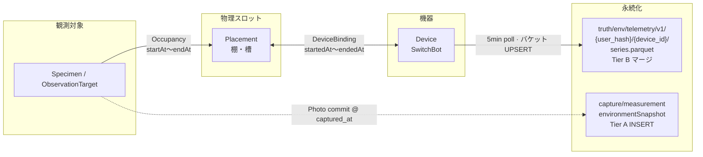

# 13 データ取得元 — 実装設計 v1（C-USB · collector · Placement）

> **ステータス**: 設計確定 v1 · **ADR-H-18/19/20 HUMAN-CONFIRMED 2026-06-10** · 実装は `HUMAN-IMPL-BATCH8-GO` 後  
> **legacy 契約参照**: [`design/adr/ADR-env-placement-device-binding.md`](../../../../design/adr/ADR-env-placement-device-binding.md)（salvage-adapt · copy-paste 禁止）  
> **作成日**: 2026-06-10  
> **要件正本**: [`13-データ取得元管理.md`](../../01-要件/13-データ取得元管理.md) · FR-ENV-01〜10  
> **スコープ ADR**: [`ADR-H-18-IHLスコープ正本-stays-vs-rebuild-v1.md`](./ADR-H-18-IHLスコープ正本-stays-vs-rebuild-v1.md) · **salvage-adapt**  
> **ポーリング ADR**: [`ADR-H-19-SwitchBot-取得戦略-差分ポーリング-v1.md`](./ADR-H-19-SwitchBot-取得戦略-差分ポーリング-v1.md)  
> **データクラス ADR**: [`ADR-H-20-データクラスと書込方針-v1.md`](./ADR-H-20-データクラスと書込方針-v1.md)

---

## 0. 設計方針（再掲）

civ-os の `collector/` · `envPlacement.ts` · `envShelf.ts` は **reference implementation**。  
IHL では **同じユーザー体験・同じセキュリティ境界** を、**別スタック（FastAPI · Python · C-USB component）** で満たす。

---

## 1. コンポーネント構成

```text
┌──────────────────────────────────────────────────────────────┐
│ collector/ (Docker) — env_collector イメージ                    │
│  ・switchbot-local-collector 相当（起動時に Python 化検討可）   │
│  ・SWITCHBOT_TOKEN/SECRET · DEVICE_IDS · Ed25519 private key    │
│  ・5min 周期 · 差分判定は collector 内 or API 側（ADR-H-19）    │
└────────────────────────────┬─────────────────────────────────┘
                             │ POST /api/env/ingest (署名)
┌────────────────────────────▼─────────────────────────────────┐
│ apps/api — FastAPI ルート層                                     │
│  ・ingest 検証 · placements CRUD · devices · telemetry query   │
└────────────────────────────┬─────────────────────────────────┘
                             │
┌────────────────────────────▼─────────────────────────────────┐
│ libs/                                                           │
│  ・switchbot_client.py — HMAC · GET /v1.1/devices/{id}/status │
│  ・placement_store.py — Placement/Binding/Occupancy/QR 投影       │
│  ・env_telemetry.py — Tier B series.parquet マージ · last-read キャッシュ │
└────────────────────────────┬─────────────────────────────────┘
                             │
┌────────────────────────────▼─────────────────────────────────┐
│ components/env_ingest/run.py — C-USB Transform                  │
│  IN: env_collector_ingest_v1 manifest                           │
│  OUT: series.parquet マージ + run_info + errors                   │
└────────────────────────────┬─────────────────────────────────┘
                             │
┌────────────────────────────▼─────────────────────────────────┐
│ libs/event_store.py — truth/env/telemetry/v1/.../series.parquet │
│                    + truth/placement/... (Tier A events)          │
└──────────────────────────────────────────────────────────────┘
```

### 1.1 新規ファイル（実装フェーズ · 設計上の配置）

| パス | 役割 |
|------|------|
| `collector/Dockerfile` | IHL repo 内に移設 or git submodule — **秘密は image に焼かない** |
| `collector/.env.example` | civ-os 同等 · `IHL_INGEST_URL` |
| `libs/switchbot_client.py` | civ-os `switchbotClient.ts` 契約抽出 |
| `libs/placement_store.py` | civ-os `envPlacementStore.ts` 契約抽出 |
| `libs/env_telemetry.py` | Tier B バケット UPSERT · provenance · バックオフ |
| `components/env_ingest/manifest.yaml` | C-USB 宣言 |
| `components/env_ingest/run.py` | ingest normalize → Truth append |
| `02-設計/_横断/schema/events/telemetry_sample.schema.yaml` | env 時系列（新設草案） |
| `02-設計/_横断/schema/events/placement_event.schema.yaml` | Placement ライフサイクル |
| `apps/api/routes/env.py` | ルート集約 |

---

## 2. Secrets — collector/.env のみ、never R2

| 秘密 | 置き場 | 禁止置き場 |
|------|--------|------------|
| `SWITCHBOT_TOKEN` | `collector/.env` | backend `.env` · R2 · フロント |
| `SWITCHBOT_SECRET` | `collector/.env` | 同上 |
| `ENV_COLLECTOR_PRIVATE_KEY_*` | `collector/.env` | 同上 |
| `ENV_COLLECTOR_PUBLIC_KEYS_JSON` | **API** `.env`（公開鍵 map のみ） | R2 |
| `IHL_USER_ID` / actor 文脈 | collector `.env` | — |

**UI 原則**: SwitchBot TOKEN/SECRET をユーザーに入力させない（civ-os checklist §1/§3 踏襲）。

**R2 に保存してよい列**（サニタイズ後）:

- `temperatureC` · `humidityPct` · `co2Ppm` · `lightLevel` · `batteryPct`
- `placementId` · `annotationId` · `deviceId`（公開 ID）
- `capturedAt` · `source` · `measurement_method=iot_switchbot`

**保存禁止**: raw SwitchBot body 全体 · deviceName · hubDeviceId · アカウント一覧 · 秘密値

---

## 3. API 契約（IHL FastAPI）

### 3.1 Ingest（collector → API）

| 項目 | 値 |
|------|-----|
| メソッド | `POST /api/env/ingest` |
| 認証 | Ed25519 · ヘッダ `X-IHL-Collector-Id` · `X-IHL-Collector-Timestamp` · `X-IHL-Collector-Signature` |
| Body schema | `env_collector_ingest_v1`（civ-os 互換形状 · IHL 名前空間） |
| 成功 | `201` + `{ sampleIds: [...] }`（差分スキップ時は `skipped: true`） |
| 失敗 | `401` 署名 · `400` schema · `503` 公開鍵未設定 |

### 3.2 Placement

| メソッド | ルート | 備考 |
|----------|--------|------|
| `POST` | `/api/env/placements` | INSERT · ULID |
| `GET` | `/api/env/placements` | 認証ユーザー一覧 |
| `POST` | `/api/env/placements/{id}/qr` | TTL · QR data URL |
| `GET` | `/api/env/qr/{token}` | Bearer 不要 · 高エントロピー |
| `GET` | `/api/env/placements/{id}/shelf` | Binding/Occupancy 開状態 |

### 3.3 Devices（registry）

| メソッド | ルート | 備考 |
|----------|--------|------|
| `GET` | `/api/devices` | ユーザー登録デバイス（**ID のみ** · 秘密なし） |
| `POST` | `/api/devices` | `kind: switchbot` · `external_device_id` |
| `PATCH` | `/api/devices/{id}` | label · active/paused |
| `POST` | `/api/devices/{id}/sync` | 手動 1 回取得（オプション） |

### 3.4 Telemetry query

| メソッド | ルート | 備考 |
|----------|--------|------|
| `GET` | `/api/env/placements/{id}/telemetry` | `from` · `to` · binding 済みのみ |
| `GET` | `/api/env/history` | admin · 直近 7 日既定 · max 400 |

---

## 4. `measurement_method: iot_switchbot` への接続

| 段 | 処理 |
|----|------|
| **観測入力 UI** | `measurement_method.yaml` の `iot_switchbot` 選択 → `requires_device` チェック |
| **機器未登録** | `/settings/device` へバナー（OBS-TPL-08） |
| **commit 時** | `capture/measurement` 行に `measurement_method=iot_switchbot` · `value_origin=environment_derived` · `instrument_id={device_registry_id}` |
| **時系列参照** | `raw_source_ref` → `truth/env/telemetry/v1/{user_hash}/{device_id}/series.parquet#bucket={unix}` |
| **固体フロー** | 環境の二重 POST 禁止 — 棚は #13 · 固体は #05 commit のみ（FR-ENV-06） |

---

## 5. C-USB component `env_ingest`

### 5.1 manifest.yaml（草案フィールド）

```yaml
name: env_ingest
version: 0.1.0
kind: transform
in_schema_ref: 02-設計/_横断/schema/manifest/env_collector_ingest.schema.yaml
out_schema_ref: 02-設計/_横断/schema/events/telemetry_sample.schema.yaml
value_origin:
  default: environment_derived
emits_run_info: true
emits_errors: true
oss:
  primary: { name: switchbot_open_api, via: libs/switchbot_client.py }
```

### 5.2 ITO

| 段 | 内容 |
|----|------|
| IN | 署名済み ingest body · device readings[] |
| Transform | サニタイズ · Tier B UPSERT 判定（ADR-H-19）· placement 解決 |
| OUT | `series.parquet` Tier B マージ · `provenance.jsonl` append · `run_info.json` · `errors.jsonl` |

---

## 6. civ-os との差分（意図的）

| 項目 | civ-os 現状 | IHL 設計 |
|------|-------------|----------|
| Poller 保存 | 毎サイクル `recordSolidEnvSample` | **Tier B バケット UPSERT** |
| API フレーム | Express | FastAPI |
| 永続化 | civ-os R2 キー `world/env/...` | IHL **`truth/env/`** 正本（legacy `world/env/` は契約参照のみ） |
| mock | N/A（実装済） | `mock_store.devices` → 置換 |
| placementResolved | poller は `false` 固定 | DeviceBinding 後に true 化 |

---

## 7. テスト計画（DoD）

| ファイル | 内容 |
|----------|------|
| `tests/unit/test_switchbot_client.py` | HMAC · status パース · レート limit モック |
| `tests/unit/test_placement_store.py` | INSERT ONLY · 409 重複 binding |
| `tests/unit/test_env_telemetry_diff.py` | Tier B UPSERT · epsilon · heartbeat · value_revision |
| `tests/contract/test_collector_ingest.py` | Ed25519 署名 · civ-os ベクトル互換 |
| `tests/unit/test_env_ingest_component.py` | C-USB run.py · manifest 検証 |

---

## 8. Persistence（永続化）

> **データクラス正本**: [`ADR-H-20-データクラスと書込方針-v1.md`](./ADR-H-20-データクラスと書込方針-v1.md)  
> **SwitchBot 戦略**: [`ADR-H-19`](./ADR-H-19-SwitchBot-取得戦略-差分ポーリング-v1.md) §データクラス Tier B

### 8.1 Tier 別書込

| Tier | 本機能の対象 | 書込方針 | ストア |
|------|-------------|----------|--------|
| **A** | Placement/Binding ライフサイクル · 観測 commit 参照 | INSERT ONLY | `truth/placement/` · `truth/capture/` |
| **B** | SwitchBot テレメトリ · collector ingest | **API 冪等マージ（Parquet UPSERT）** | `truth/env/telemetry/v1/{user_hash}/{device_id}/series.parquet` |
| **C** | 最新 device 読み取り · binding 投影 | REPLACE 可（派生） | `projection/devices/` · `projection/placements/` |

### 8.2 Tier B — 自然キーと UPSERT

```text
natural_key = (device_id, bucket_start_unix)
bucket_start_unix = floor(unix_ts(captured_at), 300)
```

| 条件 | 動作 |
|------|------|
| `source ∈ { switchbot_api, local_collector }` | UPSERT 許可 |
| 変化（epsilon 超）またはバケット初回（heartbeat） | 行を書く |
| 値不変かつ当バケット既存 | スキップ（`env_telemetry_skip_unchanged`） |
| `source=manual_entry` | **Tier B 拒否** — Tier A `capture/measurement` へ |

### 8.3 Tier B 必須 provenance

`source` · `collector_run_id` · `fetched_at` · `value_revision` · `captured_at` · `ingested_at` · `data_tier: B`

### 8.4 event_store 実装メモ（設計）

- `libs/event_store.py` に `merge_telemetry_series(device_id, bucket_row, ...)` を追加（実装フェーズ）— [`ADR-H-20`](./ADR-H-20-データクラスと書込方針-v1.md) §2.4
- Placement/Binding は従来どおり `append_event`（Tier A INSERT ONLY）
- 秘密列は §2 Secrets 準拠 — R2/event に TOKEN/SECRET 禁止

---

## 9. Occupancy 参照モデル

> **契約抽出元（salvage-adapt）**: [`design/adr/ADR-env-placement-device-binding.md`](../../../../design/adr/ADR-env-placement-device-binding.md) — Placement · DeviceBinding · Occupancy · TelemetryIngest の 4 概念。IHL 永続化パスは **`truth/`** 規約（civ-os `world/env/` は legacy 正本）。

### 9.1 参照グラフ



### 9.2 設計原則

| 原則 | 内容 |
|------|------|
| **個体ごとの env ファイル禁止** | Specimen / ObservationTarget 単位で Parquet や JSON 時系列を **増やさない** |
| **クエリ = join** | `Occupancy 区間` × `Placement にバインドされた Device` × `series.parquet` の時間範囲フィルタ |
| **連続 vs 瞬間** | 連続テレメトリは Tier B `series.parquet` · 撮影時点は Tier A `environmentSnapshot`（[`ADR-H-19`](./ADR-H-19-SwitchBot-取得戦略-差分ポーリング-v1.md) §2.4） |
| **R2 パス正本** | IHL は **`truth/env/`** · civ-os legacy は **`world/env/`**（契約・イベント種別の参照のみ） |

### 9.3 クエリ手順（概念）

```text
1. subjectRef（specimen_id / session_id）で Occupancy イベント列を取得（Tier A INSERT ONLY）
2. 各 Occupancy の [startAt, endAt] と placementId を得る
3. placementId に対し、重複しない DeviceBinding 区間を取得
4. 各 binding の device_id について series.parquet を [from, to] で読む
5. UI/API は join 結果を返す（個体専用ストアは作らない）
```

### 9.4 撮影時スナップショット（固体観測接続）

写真 commit（#05）時は **撮影タイムスタンプ時点** の `environmentSnapshot` を Tier A で **1 回 INSERT** する。これは連続 `series.parquet` とは **別レイヤ** — 観測記録に固定された瞬間値であり、後続 poll で上書きされない。

| 項目 | Tier | 備考 |
|------|------|------|
| `environmentSnapshot` | A | `capture/measurement` 内 · INSERT ONLY |
| `placementId` / `occupancyId` | A 参照 | Placement 定義は `truth/placement/` を参照（全文コピーしない） |
| `raw_source_ref` | 任意 | 当該バケットの Tier B 行へのポインタ |

legacy ADR [`ADR-env-placement-device-binding.md`](../../../../design/adr/ADR-env-placement-device-binding.md) §SolidEnvironmentSnapshot との接続を **salvage-adapt**（型形状・参照 ID のみ抽出 · civ-os キーは移植しない）。

---

## 10. 人間ゲート

| ID | 内容 | 状態 |
|----|------|------|
| HUMAN-ADR-H-18 | #13 salvage-adapt 承認 | **✓ CONFIRMED 2026-06-10** |
| HUMAN-ADR-H-19 | SwitchBot 5min poll · バケット UPSERT | **✓ CONFIRMED 2026-06-10** |
| HUMAN-ADR-H-20 | データクラス · Tier B series.parquet | **✓ CONFIRMED 2026-06-10** |
| HUMAN-COLLECTOR-KEYS | 実機 SwitchBot + Ed25519 投入 | 待ち |
| HUMAN-IMPL-BATCH8-GO | コード着手 | **待ち** |

---

*設計確定 v1 · 2026-06-10 · ADR 人間 Go 済 · 実装コードは `HUMAN-IMPL-BATCH8-GO` 後*
