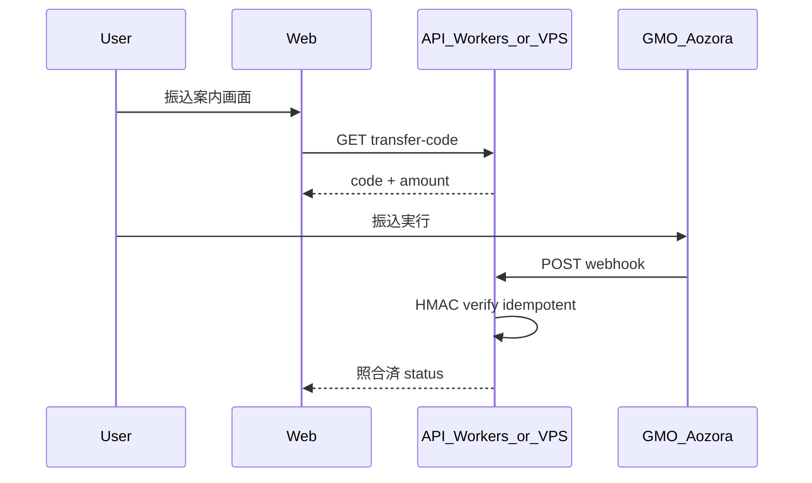

# GMO #23 — 振込照合シーケンス（QUANTUM）

```mermaid
sequenceDiagram
  participant U as User
  participant W as Web
  participant API as API_Workers_or_VPS
  participant GMO as GMO_Aozora

  U->>W: 振込案内画面
  W->>API: GET transfer-code
  API-->>W: code + amount
  U->>GMO: 振込実行
  GMO->>API: POST webhook
  API->>API: HMAC verify idempotent
  API-->>W: 照合済 status
```

Gap 設計: `docs/planning/quantum/shards/gmo-gap-*.md`  
Fixtures: `fixtures/oracle/gmo-*.json`
