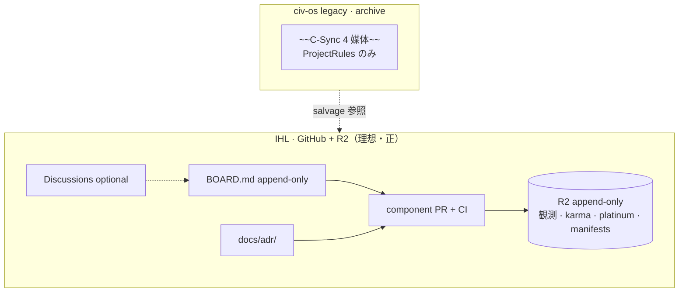

# GitHub 運用 — コンポーネント掲示板（たたき台・非正本）

> **用途**: 2026.06,06 思想 + 機能 #19 + ユーザー意図を統合した **IHL 側** GitHub 運用たたき台。  
> **作成日**: 2026-06-07 · **方針改訂**: C-Sync 全面不採用 · 単一 IHL 正本  
> **根拠**: `2026.06,06/*` · `19-コンポーネント掲示板.md` · `02-設計/_横断/理想設計-構成マップ.md` · `05-運用/_横断/リポジトリ戦略-legacyとIHL.md`

---

## 1. 結論（ユーザー質問への回答）

| 質問 | 回答 |
|------|------|
| **2026.06,06 は GitHub で機能改善を想定しているか？** | **はい（IHL repo 前提）。** Python component · UI は **PR · CI · run_id 証跡** で改善する。append-only R2 出力と両立。 |
| **component ごとに BBS（掲示板）か？** | **はい（IHL）。** 各 pipeline component に **議論・レビュー・採否記録** の面を持つ。 |
| **civ-os monolith の GitHub Issues か？** | **いいえ。** civ-os は **legacy archive** — 新改善は **IHL repo の GitHub のみ**。civ-os file-board は **参照・salvage のみ**。 |
| **C-Sync 4 媒体は？** | **理想設計では全面不採用。** GitHub が改善履歴の正。R2 がランタイム監査の正。 |

---

## 2. IHL GitHub 運用 vs legacy file-board

```text
┌─────────────────────────────────────────────────────────────────┐
│ it-hercules-laboratory（IHL · 唯一の正本 · 改善履歴の正）         │
│   component-scoped GitHub 運用                                   │
│   components/<name>/ + docs/components/<name>/BOARD.md           │
│   GitHub Discussions / PR / Issue（component ラベル必須）        │
│   用途: component · UI · schema · ADR · pipeline 改善           │
│   ランタイムデータ → R2 append-only（GitHub に置かない）          │
└─────────────────────────────────────────────────────────────────┘

┌─────────────────────────────────────────────────────────────────┐
│ civilization-os（legacy / archive · 開発対象外）                  │
│   旧 REQ-018 file-board · C-Sync 4 媒体 · React monolith         │
│   用途: 設計 salvage · 過去議論の参照 · 移行元データ抽出          │
│   ※ 新改善の記録先ではない                                       │
└─────────────────────────────────────────────────────────────────┘
```

**名称整理**（`19-コンポーネント掲示板.md` §名称整理 · **2026-06-07 更新**）:

| 呼び方 | 正体 | repo | 理想設計 |
|--------|------|------|----------|
| civ-os「コンポーネント掲示板」 | REQ-018 **file-board** | civilization-os | **legacy 参照のみ** |
| IHL「component BBS」 | **GitHub component 単位議論面** | it-hercules-laboratory | **正** |

---

## 3. IHL repo フォルダと GitHub の対応

```text
it-hercules-laboratory/
├── components/
│   ├── ingest_normalize/
│   │   ├── run.py
│   │   ├── component.yaml
│   │   ├── README.md              ← 契約・入出力・実行例
│   │   └── tests/
│   ├── thumbnail_builder/
│   ├── embedding_builder_dinov2/
│   ├── manifest_builder/
│   └── tag_aggregator/
├── docs/
│   └── components/
│       ├── ingest_normalize/
│       │   └── BOARD.md           ← 掲示板索引（Discussion リンク・決定履歴）
│       └── ...
└── .github/
    ├── workflows/ci.yml
    └── ISSUE_TEMPLATE/
        └── component_improvement.md
```

**原則**: **1 component フォルダ = 1 責務 = 1 議論スコープ**

---

## 4. 機能改善フロー（GitHub）

### 4.1 標準フロー

```text
1. Intent 記録
   └─ docs/components/<name>/BOARD.md に目的・背景を追記（削除禁止 · append-only 文体）
   └─ または GitHub Discussions（category = component-<name>）

2. 設計たたき台（ゲート内）
   └─ schema 変更なら 02-設計/_横断/schema/ PR を同梱
   └─ ADR が要る場合 docs/adr/NNN-<name>.md

3. 実装 PR
   └─ ブランチ: component/<name>/<short-desc>
   └─ ラベル: component:<name> · phase:1
   └─ CI: pytest · schema validate · no-overwrite テスト

4. レビュー
   └─ output manifest / run_info の sample を PR に添付
   └─ 破壊的 schema 変更は MINOR bump + migration note

5. Merge → リリース
   └─ Docker image tag = component_version
   └─ R2 出力は新 run_id のみ（既存 key 不変）
```

### 4.2 Issue / PR ラベル（案）

| ラベル | 用途 |
|--------|------|
| `component:ingest_normalize` | スコープ固定 |
| `component:embedding_builder` | 同上 |
| `type:schema` | 02-設計/_横断/schema/ dictionaries/ 変更 |
| `type:oss-swap` | OSS 差し替え（契約不変） |
| `type:phase-2` | FAISS · FastAPI 等 Phase 2 |

### 4.3 legacy civilization-os からの salvage PR

legacy civ-os に **参考実装** がある場合:

- **実装先は IHL repo のみ** — civ-os への継続 PR は **行わない**
- salvage 元ファイルを PR 説明に **legacy 参照** として明記
- schema / manifest 変更は IHL `02-設計/_横断/schema/` PR に同梱

---

## 5. component BBS の具体形

### 5.1 BOARD.md（推奨 · append-only）

各 component の `docs/components/<name>/BOARD.md` に以下を **追記のみ** で記録:

```markdown
## [2026-06-07] 類似スコア重み ADR 起票
- **Intent**: embedding 0.5 / color 0.2 / size 0.2 / lineage 0.1 に統一
- **Discussion**: #12
- **PR**: #45
- **Decision**: 採用 · run_id=run_20260607_xxx で検証済
```

### 5.2 GitHub Discussions（任意 · 双方向議論）

| Category | 対象 |
|----------|------|
| `component-ingest` | ingest_normalize |
| `component-embedding` | embedding_builder_dinov2 |
| `component-manifest` | manifest_builder |
| `general-architecture` | R2 レイアウト · snapshot 方式 |

### 5.3 PR レビュー = 掲示板

IHL では **PR コメント履歴** を主要な技術掲示板とみなす。merge 後も履歴は残る（Git append-only 相当）。

---

## §6 C-Sync 4媒体 — 理想設計では **全面不採用**（2026-06-07 確定）

> **ユーザー確定方針**: IHL 理想設計に C-Sync は **採用しない**。本節は legacy 説明 + 代替モデルの明文化。

### 6.1 C-Sync 4媒体とは（legacy · civ-os repo のみ）

**CivilizationSyncEngine（C-Sync）** は、**旧 civilization-os repo** における文明更新の正式手続きである（`civilization/CivilizationSyncEngine.md` · `ProjectRules.md` §2.3）。4 媒体（spec · post · commit · R2 意図メタ）の整合が **旧 repo の憲法**。

| 媒体 | legacy 正体 | IHL 理想設計での代替 |
|------|-------------|---------------------|
| **spec** | `docs/` · `civilization/` 正本 MD | **IHL `docs/` + ADR**（GitHub で版管理） |
| **post** | civ-os file-board（REQ-018） | **BOARD.md · GitHub Discussions** |
| **commit** | git 履歴 | **IHL git PR / merge**（同一） |
| **R2** | 文明史 INSERT ONLY（意図メタ） | **R2 append-only 本番データ**（観測 · karma · platinum · run_info · events）— **必須** |

**重要**: ProjectRules の C-Sync 条項は **civilization-os legacy repo に残る法律**。**新 IHL repo には適用しない。** IHL 統治は **新 ADR-001**（`docs/adr/001-governance.md` · 未作成）で定義する。

---

### 6.2 結論 — IHL では C-Sync **不要 · 不採用**

| スコープ | C-Sync | IHL 正 |
|----------|--------|--------|
| **IHL 全体**（component · UI · schema · 統治） | **~~不採用~~** | **GitHub-first** + **R2 ランタイム必須** |
| **改善・議論・決定の歴史** | ~~post + spec 同期~~ | PR · BOARD.md · Discussions · ADR |
| **ランタイム監査** | ~~R2 意図メタのみ~~ | **R2 append-only**（観測 JSON · karma · platinum · pipeline 出力） |
| **civilization-os repo** | **legacy 法律として文書上存続** | **開発・記録の正本ではない** |

```text
┌──────────────────────────────────────────────────────────────────────┐
│  IHL 統治モデル（理想 · 2026-06-07）                                   │
├──────────────────────────────────────────────────────────────────────┤
│  改善履歴（GitHub）                                                    │
│    Intent  → BOARD.md / Discussions                                   │
│    Design  → ADR · schema PR                                          │
│    Implement → component / apps PR + CI                               │
│    Evidence → merge 履歴 · run_info.json サンプル                      │
│                                                                        │
│  本番データ（R2 · append-only · 必須）                                 │
│    観測 JSON · karma · platinum · tag events · manifests · run_id     │
│    ※ GitHub にランタイムデータを置かない                              │
│                                                                        │
│  ~~C-Sync 4 媒体~~ · ~~civ-os file-board 正本~~ · ~~consumer PR~~    │
└──────────────────────────────────────────────────────────────────────┘

┌──────────────────────────────────────────────────────────────────────┐
│  civilization-os（legacy archive — C-Sync は旧 repo の法律のみ）      │
│  参照 · salvage · 移行元。新改善の記録先ではない。                     │
└──────────────────────────────────────────────────────────────────────┘
```

---

### 6.3 歴史保存の比較表（IHL 理想 vs legacy C-Sync）

| 観点 | **IHL GitHub + R2**（理想・正） | **legacy C-Sync**（civ-os のみ · 不採用） |
|------|--------------------------------|------------------------------------------|
| **設計思想** | README · ADR · `component.yaml` | spec 更新 + R2 意図メタ |
| **議論** | PR コメント · Discussions · BOARD.md | file-board スレ · `discussion_ref` |
| **決定** | merge · BOARD Decision 行 | R2 イベント + intent フィールド |
| **変更理由** | PR 説明 · BOARD Intent | `problem_statement` 等 C-Sync 構造 |
| **改竄耐性** | git SHA · branch 保護 | INSERT ONLY · ハッシュ鎖 |
| **ランタイムデータ** | **R2 必須**（karma · platinum · 観測） | 旧 civ-os R2 投影 |
| **経済・投票** | **R2 イベント**（GitHub 非保存） | PlatinumCoin C-Sync 経由 |

---

### 6.4 質問への回答

#### Q1. C-Sync 4 媒体は IHL で **いらなくなったか？**

**はい（理想設計では全面不採用）。**

- IHL の改善サイクルは **GitHub のみ** で完結する
- ランタイム監査・本番データは **R2 append-only** が正（C-Sync の R2 役割を **実データ層** に昇格）
- civ-os ProjectRules の C-Sync は **旧 repo legacy** — IHL に持ち込まない

#### Q2. GitHub 運用だけで **設計思想・議論・決定・変更理由** の歴史を残せるか？

**はい — BOARD.md + ADR + PR テンプレで enforce する。**

| 要素 | IHL 保存先 |
|------|-----------|
| 設計思想 | README · ADR · `component.yaml` |
| 議論 | Discussions · PR レビュー · `component:<name>` ラベル |
| 決定 | BOARD.md Decision 行 · merge |
| 変更理由 | PR テンプレ · BOARD Intent 行 |
| ランタイム証跡 | **R2** run_info · events（GitHub ではない） |

**enforce 推奨**: BOARD.md 必須 · component ラベル必須 · PR テンプレ（Intent / Decision / run_id）· **ADR-001** で統治を明文化。

---

### 6.5 図 — IHL 単一統治（C-Sync なし）



**運用原則（1 行）**: IHL = **GitHub で改善履歴** + **R2 で本番データ**。C-Sync · civ-os monolith 開発 · 二 repo 横断正本 — **すべて legacy**。

---

## 7. legacy civ-os file-board との関係

| 変更内容 | 記録先（理想） |
|----------|----------------|
| IHL component / UI / schema | **IHL BOARD.md + IHL PR**（正） |
| ProjectRules · civ-os 旧設計 | **legacy 参照のみ** — 新記録は IHL |
| karma · platinum · 観測ランタイム | **R2 append-only** — GitHub 非保存 |
| legacy file-board 過去スレ | civ-os archive — **読取参照** |

**C-Sync 14 ステップ** — civ-os legacy のみ。**IHL では通さない。**

---

## 8. 2026.06,06 との整合

| 2026.06,06 原則 | GitHub 運用での体现 |
|-----------------|---------------------|
| append-only | merge 後も旧 run_id 成果物は R2 に残存 |
| run_info 証跡 | PR に sample run_info.json を添付 |
| OSS 差し替え | `type:oss-swap` PR · 契約テスト必須 |
| component USB-C | 1 folder = 1 契約 = 1 BBS |
| README 再現性 | 各 component README + ルート Makefile |

---

## 9. 禁止事項

1. civilization-os リポジトリ Issues に IHL pipeline タスクだけを大量投稿  
2. component 横断 monolith PR（複数 component 無関係変更）  
3. schema 変更 without 02-設計/_横断/schema/ PR  
4. R2 既存 key 上書きを前提とした merge  
5. file-board スレの削除（civ-os 側 NFR-19-01）  

---

## 10. 未決（人間ゲート）

| ID | 論点 | たたき台 |
|----|------|----------|
| GHB-01 | Discussions 必須 vs BOARD.md のみ | BOARD 必須 + Discussions 任意 |
| GHB-02 | private repo 開始時の外部コントリビュータ | org 設定待ち |
| GHB-03 | component BBS の RAG 取込（IHL docs） | Phase 2 |

---

## 11. 関連ドキュメント

| パス | 用途 |
|------|------|
| [`02-設計/_横断/理想設計-構成マップ.md`](./02-設計/_横断/理想設計-構成マップ.md) §6 | ワークフロー図 |
| [`01-要件/19-コンポーネント掲示板.md`](./01-要件/19-コンポーネント掲示板.md) | civ-os REQ-018 |
| [`02-設計/_横断/component/00-マスターcomponent分解表.md`](./02-設計/_横断/component/00-マスターcomponent分解表.md) | bbs-hook 列 |
| [`03-CIV-OS-AI-SPEC-統合版.md`](./03-CIV-OS-AI-SPEC-統合版.md) | 完了判定 11 項目 · §9 リポジトリ戦略 |
| [`05-運用/_横断/リポジトリ戦略-legacyとIHL.md`](./05-運用/_横断/リポジトリ戦略-legacyとIHL.md) | legacy vs IHL · C-Sync 決定 |

---

*たたき台・非正本 / 人間レビュー用 / 設計 AI 引き継ぎ用*
