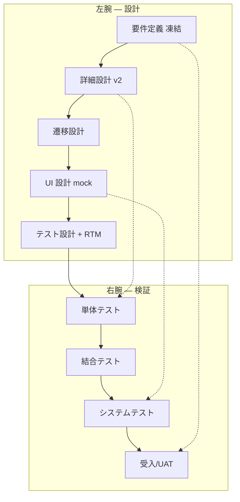

# IHL Vモデル実行計画 v1

> **ステータス**: **人間承認待ち**（ユーザー: 要件定義凍結 OK · rules+計画 承認済み → **計画本文 Go 待ち**）  
> **作成日**: 2026-06-10  
> **上位**: [`00-AI-HANDOFF-BRIEF.md`](../../00-AI-HANDOFF-BRIEF.md) · [`civilization/ProjectRules.md`](../../../civilization/ProjectRules.md)  
> **Cursor ルール**: [`.cursor/rules/ihl-waterfall-v-model-gate.mdc`](../../../.cursor/rules/ihl-waterfall-v-model-gate.mdc) · [`.cursor/rules/ihl-delegated-design-go-strict.mdc`](../../../.cursor/rules/ihl-delegated-design-go-strict.mdc) · [`.cursor/rules/design-before-implementation-gate.mdc`](../../../.cursor/rules/design-before-implementation-gate.mdc)

---

## 0. 目的

POST-B8 / POST-OSS **実装 exhaust 完了後**、要件定義の理想に **左腕（設計厚み）→ 右腕（4 層テスト計画 + RTM）→ 実行** の **完全 V 字**で #00–#23 を揃える。



---

## 1. 前提

| 項目 | 内容 |
|------|------|
| **要件定義** | `#00`–`#23` **凍結確定**（2026-06-10 ユーザー合意）。変更は **CR（Change Request）** のみ |
| **既存 4 点設計** | Batch 0–7 の v1 + mock は **入力**とする。V-model では **v2 厚み + テスト計画**が追加条件 |
| **既存実装** | `it-hercules-laboratory/` = **`retrofit: impl-ahead`**（HUMAN-IMPL-SIGNOFF 2026-06-09） |
| **civ-os** | `frontend/` `backend/` 新機能 **禁止**（IHL 正本 · ADR-H-21） |
| **HUMAN-IMPL-SIGNOFF** | **#5 テスト設計を免除しない**（[design-before-implementation-gate.mdc](../../../.cursor/rules/design-before-implementation-gate.mdc)） |

---

## 2. 成果物パス規約

**正本ディレクトリ**: `指示/it-hercules-laboratory/05-運用/queues/features/`

| 成果物 | パス | 備考 |
|--------|------|------|
| 詳細設計 v2 | `NN-詳細設計-v2.md` | v1（`01-要件/`）から **昇格・厚み追加** |
| 単体テスト計画 | `NN-単体テスト計画-v1.md` | pytest · component 内部 |
| 結合テスト計画 | `NN-結合テスト計画-v1.md` | API × component · route 契約 |
| システムテスト計画 | `NN-システムテスト計画-v1.md` | E2E · 横断フロー |
| 受入/UAT 計画 | `NN-受入テスト計画-v1.md` | FR 受入 · 手動/UAT シナリオ |
| RTM | `NN-RTM-v1.csv` | FR/NFR ↔ 設計 ↔ TC ID |

**既存参照（変更しない · 入力）**:

- 要件: `01-要件/NN-*.md`
- 遷移 v1: `01-要件/NN-*-遷移設計-v1.md`
- UI: `01-要件/NN-*-UI設計-v1.md` · `02-設計/_ui-global/` · `mockups/`

### 2.1 フォルダ構成（正本）

成果物の物理配置は [`00-フォルダ構成-v1.md`](./00-フォルダ構成-v1.md) に従う。  
§2 表の `05-運用/queues/features/` は **`02-設計/features/` + `03-テスト計画/features/` + `04-トレーサ/features/`** への移行先を指す。

| 成果物 | v1 正本（Phase 1 以降の新規） | 移行中フォールバック |
|--------|------------------------------|---------------------|
| 詳細設計 v2 | `02-設計/features/NN-*/詳細設計-v2.md` | `05-運用/queues/features/NN-詳細設計-v2.md` |
| 単体〜受入テスト計画 | `03-テスト計画/features/NN-*/` | — |
| RTM | `04-トレーサ/features/NN-*/RTM-v1.csv` | `05-運用/queues/features/NN-RTM-v1.csv` |

---

## 3. 詳細設計 v2 — 厚くする項目テンプレ

各 `NN-詳細設計-v2.md` に **必須セクション**:

| # | セクション | 内容 |
|---|------------|------|
| 1 | **スコープ・境界** | In/Out · 依存 #NN · ADR 参照 |
| 2 | **データ契約** | schema YAML · R2 キー · append-only 規約 |
| 3 | **API / route 契約** | method · path · request/response · エラーコード |
| 4 | **状態機械** | 主要 state · 永続化 · 冪等 |
| 5 | **component ITO** | IN → Transform → OUT · manifest 参照 |
| 6 | **非機能** | 性能 · セキュリティ · 観測可能性 |
| 7 | **retrofit 注記** | 既存コードパス · parity 既知ギャップ · 再実装要否 |
| 8 | **v1 → v2 差分** | 追加・修正・明示的に変更しない項 |

---

## 4. 機能別 V-model マッピング表

**凡例**: 左 = 設計成果物 · 右 = テスト計画（実装は DELEGATED-IMPL-GO 後 · retrofit は test 差分）

| # | 機能 | 左: 詳細 v2 | 左: 遷移 | 左: UI mock | 右: 単体 | 右: 結合 | 右: システム | 右: UAT | RTM |
|---|------|-------------|----------|-------------|----------|----------|--------------|---------|-----|
| 00 | 土台 | ✓ | N/A | N/A | ✓ | ✓ | ✓ | ✓ | ✓ |
| 01 | ログイン | ✓ | ✓ | ✓ | ✓ | ✓ | ✓ | ✓ | ✓ |
| 02 | 利用規約 | ✓ | ✓ | ✓ | ✓ | ✓ | ✓ | ✓ | ✓ |
| 03 | 新規登録 | ✓ | ✓ | ✓ | ✓ | ✓ | ✓ | ✓ | ✓ |
| 04 | ホーム | ✓ | ✓ | ✓ | ✓ | ✓ | ✓ | ✓ | ✓ |
| 05 | 観測 | ✓ | ✓ | ✓ | ✓ | ✓ | ✓ | ✓ | ✓ |
| 06 | マーケット | ✓ | ✓ | ✓ | ✓ | ✓ | ✓ | ✓ | ✓ |
| 07 | 掲示板 | ✓ | ✓ | ✓ | ✓ | ✓ | ✓ | ✓ | ✓ |
| 08 | カルマ | ✓ | ✓ | ✓ | ✓ | ✓ | ✓ | ✓ | ✓ |
| 09 | 論文 | ✓ | ✓ | ✓ | ✓ | ✓ | ✓ | ✓ | ✓ |
| 10 | マチアプ | ✓ | ✓ | ✓ | ✓ | ✓ | ✓ | ✓ | ✓ |
| 11 | 裁判 | ✓ | ✓ | ✓ | ✓ | ✓ | ✓ | ✓ | ✓ |
| 12 | 設定 | ✓ | ✓ | ✓ | ✓ | ✓ | ✓ | ✓ | ✓ |
| 13 | データ取得元 | ✓ | ✓ | ✓ | ✓ | ✓ | ✓ | ✓ | ✓ |
| 14 | 貢献度 | ✓ | ✓ | ✓ | ✓ | ✓ | ✓ | ✓ | ✓ |
| 15 | データ設計 | ✓ | N/A | N/A | ✓ | ✓ | ✓ | ✓ | ✓ |
| 16 | UIbuilder | ✓ | ✓ | ✓ | ✓ | ✓ | ✓ | ✓ | ✓ |
| 17 | UI選択 | ✓ | ✓ | ✓ | ✓ | ✓ | ✓ | ✓ | ✓ |
| 18 | 写真解析 | ✓ | ✓ | ✓ | ✓ | ✓ | ✓ | ✓ | ✓ |
| 19 | コンポ掲示板 | ✓ | ✓ | ✓ | ✓ | ✓ | ✓ | ✓ | ✓ |
| 20 | 投票 | ✓ | ✓ | ✓ | ✓ | ✓ | ✓ | ✓ | ✓ |
| 21 | 翻訳 | ✓ | ✓ | ✓ | ✓ | ✓ | ✓ | ✓ | ✓ |
| 22 | PTショップ | ✓ | ✓ | ✓ | ✓ | ✓ | ✓ | ✓ | ✓ |
| 23 | GMO | ✓ | ✓ | ✓ | ✓ | ✓ | ✓ | ✓ | ✓ |

---

## 5. 実行順序（依存関係つき）

### 5.1 原則

1. **#00 土台** を **V-WAVE-01** で最初に完走（schema · C-USB · 共通 pytest 基盤）
2. **認証・入口**: #01 → #02 → #03 → #04（#02 法務は USER-WAIVED stub 可 · UAT は人間）
3. **データ横断**: #15 → #13（#05 #18 が #13 に依存）
4. **コア研究**: #05 · #18 · #10（観測・画像・マチアプ）
5. **社会・経済**: #06 · #08 · #14 · #20 · #22 · #11
6. **コミュニケーション**: #07 · #09 · #19
7. **UX 基盤**: #16 · #17 · #12
8. **横断**: #21（翻訳は各機能 UAT 前に RTM へ NFR 紐づけ）
9. **外部・live**: #23（GMO live は `P0-NEXT-GMO-LIVE-EXEC` · 計画/UAT の stub 完走は AI 可）

### 5.2 推奨 Wave 分割

| Wave | 機能 | 依存 | 目的 |
|------|------|------|------|
| **V-WAVE-01** | **#00** | — | 土台 v2 + 全層テスト計画 + RTM テンプレ確立 |
| **V-WAVE-02** | #01 #03 #04 | #00 | 認証・ホーム入口 |
| **V-WAVE-03** | #15 #13 | #00 | schema · env データ取得 |
| **V-WAVE-04** | #05 #18 | #13 #15 | 観測コア |
| **V-WAVE-05** | #06 #08 #14 #20 | #04 | 経済・カルマ |
| **V-WAVE-06** | #07 #09 #19 | #04 | 掲示板・論文 |
| **V-WAVE-07** | #10 #12 | #05 | マチアプ · 設定 |
| **V-WAVE-08** | #16 #17 | #04 | UIbuilder · テンプレ選択 |
| **V-WAVE-09** | #02 #11 #22 | #06 | 法務 · 裁判 · PT ショップ |
| **V-WAVE-10** | #21 | 横断 | i18n RTM 横断整合 |
| **V-WAVE-11** | #23 | #06 #22 | GMO（live 除く） |

**パイロット代替（任意）**: ルール上 **#00 先行が正**。時間短縮検証のみ **#01 #04 #05** の 3 機能パイロットを V-WAVE-01b とする場合は **計画 Go 後**に README へ追記。

---

## 6. Retrofit 方針

| 状況 | 方針 |
|------|------|
| `it-hercules-laboratory/` に実装済み | **`retrofit: impl-ahead`** — 再実装しない |
| V-model 左腕 | v2 doc で **現行コードとの差分**を明示 |
| V-model 右腕 | **4 層計画 + RTM** を新規作成 |
| テスト実行 | 計画に沿った **pytest/E2E 追加・修正のみ** |
| **再実装トリガー** | TC と実装の **C2 不一致**（parity FAIL）· 設計 v2 で **破壊的変更 CR** 承認時のみ |
| POST-OSS 済み機能 | parity PASS を維持しつつ RTM で **未カバー FR** を埋める |

---

## 7. ゲート（委任 Go チェーン）

```
要件凍結（済）
    ↓
DELEGATED-DESIGN-GO  … 詳細 v2 + 遷移 + UI · 機械 trace PASS
    ↓
DELEGATED-TEST-DESIGN-GO … 4 層計画 + RTM 100% · 草案-only BLOCK
    ↓
DELEGATED-IMPL-GO … C1–C4 + parity（retrofit = test 差分）
    ↓
結合テスト実行 → システム → UAT
```

**正本ルール**: [ihl-delegated-design-go-strict.mdc](../../../.cursor/rules/ihl-delegated-design-go-strict.mdc)

---

## 8. 機械検査

| スクリプト | 状態 | 用途 |
|------------|------|------|
| `scripts/ihl-four-point-inventory.mjs` | **拡張予定** | `--strict-v2`: `05-運用/queues/features/NN-詳細設計-v2.md` 必須 · #21–#23 追加 |
| `scripts/ihl-rtm-coverage-check.mjs` | **実装済（最小 stub）** | `--feature NN` で RTM 存在 + `req_id` 列 + 非空行 + 4 層計画存在 · 欠落 = BLOCK(exit 1)。FR 母集合 100% 突合は Phase 1 拡張 |
| `指示/it-hercules-laboratory/scripts/ihl-vmodel-preflight.mjs` | **実装済** | DRAIN 前 preflight: 正本存在 · Wave 先頭 · Phase A exhaust 判定 · 旧パス · `PREFLIGHT_RESULT=PASS/WARN/FAIL` |
| `scripts/ihl-design-impl-parity-check.mjs` | 実装済 | DELEGATED-IMPL-GO · retrofit 後も必須 |
| `.github/workflows/ihl-design-gate.yml` | **拡張予定** | v2 + RTM チェックを Phase B で有効化 |

**RTM CSV 列（最低限）**:

```csv
req_id,design_section,test_case_id,test_layer,automation,status
FR-001,§3 API,UT-001,unit,pytest,pending
```

---

## 9. 自律キュー（IHL-QUEUE-DRAIN 切替）

> **正本の切り分け（ぶれ防止）**: **機械消化の単一正本は [`00-Vモデル-Waveキュー-v1.md`](./00-Vモデル-Waveキュー-v1.md) §8**（`ihl-vmodel-wave-head.mjs` が読む）。  
> 下記 §9 の V-WAVE 一覧は **依存グルーピングの説明用ビュー**（§5.2 と対応）であり、**機械先頭判定には使わない**。両者の Wave 番号体系は異なる（説明用 = 機能群 11 Wave / 機械 = 1 機能 1 Wave 24 件）。チェックボックスの `[x]` 進行は **Wave キュー側を正**とする。  
> **2026-06-14 同期**: Wave キュー **168/168 `[x]`**（`grep '^- \[ \]' 00-Vモデル-Waveキュー-v1.md` = 0 件）。§9 俯瞰も同状態に同期。**§10 の人間ゲート**（本計画 Go · GMO live · Tier D 等）は **未解消のまま** — Wave `[x]` は doc/retrofit 完走を意味し、人間サインオフを偽装しない。

POST-OSS exhaust 完了後、**自律消化キューの機械正本**は [`00-Vモデル-Waveキュー-v1.md`](./00-Vモデル-Waveキュー-v1.md) とする（[`ihl-queue-auto-continue.mdc`](../../../.cursor/rules/ihl-queue-auto-continue.mdc)）。以下は依存関係の俯瞰（**Wave キューと同期済み · 2026-06-14**）。

### V-WAVE-01 — #00 土台

- [x] **V-WAVE-01-00-DET** — `02-設計/features/00-土台-*/詳細設計-v2.md` 作成（テンプレ §3 準拠）
- [x] **V-WAVE-01-00-TD-UT** — `03-テスト計画/features/00-土台-*/単体テスト計画-v1.md`
- [x] **V-WAVE-01-00-TD-IT** — `03-テスト計画/features/00-土台-*/結合テスト計画-v1.md`
- [x] **V-WAVE-01-00-TD-ST** — `03-テスト計画/features/00-土台-*/システムテスト計画-v1.md`
- [x] **V-WAVE-01-00-TD-UAT** — `03-テスト計画/features/00-土台-*/受入テスト計画-v1.md`
- [x] **V-WAVE-01-00-RTM** — `04-トレーサ/features/00-土台-*/RTM-v1.csv` · DELEGATED-TEST-DESIGN-GO 記録（rtm_coverage PASS）
- [x] **V-WAVE-01-00-IMPL** — retrofit テスト差分 · DELEGATED-IMPL-GO · pytest 緑（Docker test · 159 passed · 1 skipped · parity #00 PASS）

### V-WAVE-02 — #01 #03 #04

- [x] **V-WAVE-02-01** — #01 全成果物（DET v2 + 4 層 + RTM + test 差分）
- [x] **V-WAVE-02-03** — #03 同上
- [x] **V-WAVE-02-04** — #04 同上

### V-WAVE-03 — #15 #13

- [x] **V-WAVE-03-15** — #15 同上
- [x] **V-WAVE-03-13** — #13 同上

### V-WAVE-04 — #05 #18

- [x] **V-WAVE-04-05** — #05 同上
- [x] **V-WAVE-04-18** — #18 同上

### V-WAVE-05 — #06 #08 #14 #20

- [x] **V-WAVE-05-06** — #06 同上
- [x] **V-WAVE-05-08** — #08 同上
- [x] **V-WAVE-05-14** — #14 同上
- [x] **V-WAVE-05-20** — #20 同上

### V-WAVE-06 — #07 #09 #19

- [x] **V-WAVE-06-07** — #07 同上
- [x] **V-WAVE-06-09** — #09 同上
- [x] **V-WAVE-06-19** — #19 同上

### V-WAVE-07 — #10 #12

- [x] **V-WAVE-07-10** — #10 同上
- [x] **V-WAVE-07-12** — #12 同上

### V-WAVE-08 — #16 #17

- [x] **V-WAVE-08-16** — #16 同上
- [x] **V-WAVE-08-17** — #17 同上

### V-WAVE-09 — #02 #11 #22

- [x] **V-WAVE-09-02** — #02 同上（法務 UAT = **HUMAN** · stub 完了のみ）
- [x] **V-WAVE-09-11** — #11 同上
- [x] **V-WAVE-09-22** — #22 同上

### V-WAVE-10 — #21

- [x] **V-WAVE-10-21** — #21 横断 RTM · 各機能 NFR 行の整合

### V-WAVE-11 — #23

- [x] **V-WAVE-11-23** — #23 同上（**live 証跡除く** · stub/stg AI 完走 · 人間ゲートは §10）

---

## 10. § ユーザー判断が必要なタイミング

### 10.1 今すぐ必要か？

| 判断 | 今すぐ必要？ | 内容 | ブロッカー |
|------|:------------:|------|------------|
| **要件定義凍結** | **NO**（済） | ユーザー「このまま確定で OK」2026-06-10 | — |
| **V-model rules 追加** | **NO**（済） | `.cursor/rules/ihl-waterfall-*` 等 | — |
| **本計画 Go** | **YES** | 本ファイル §9 V-WAVE 実行開始の明示 Go | Wave 1 doc 作業の **正式開始** |
| **#00 vs 3 機能パイロット** | **NO** | ルール上 #00 先行。パイロットは任意 | 計画 Go 後でも可 |
| **法務 #02 最終文** | **NO** | USER-WAIVED stub · UAT 段階 | V-WAVE-09 |
| **GMO live** | **NO** | `P0-NEXT-GMO-LIVE-EXEC` | V-WAVE-11 後 |
| **Tier D 鍵** | **NO** | collector · live R2 | 該当 POST-B8/HUMAN 行 |

**結論（Wave 1 doc 開始）**: **本計画への明示 Go のみ**が残る。要件・rules はブロッカーにならない。

### 10.2 後で必要か？

| 判断 | タイミング | 内容 |
|------|------------|------|
| **DELEGATED-DESIGN-GO 目視** | 各 Wave 完了時 | mock 差し替え時 · 任意 spot check |
| **法務 #02** | V-WAVE-09 | 公開前最終条文 |
| **裁判 #11 哲学** | V-WAVE-09 UAT | 争いモデル最終デモ |
| **GMO live** | POST V-WAVE | 実入金証跡 |
| **V-model USER-DONE** | V-WAVE exhaust 後 | RTM 100% · pytest · 手動 UAT サインオフ（[`IHL-画面打鍵手順書-v1.md`](../manual/IHL-画面打鍵手順書-v1.md)） |
| **CR（要件変更）** | 随時 | 凍結破りは CR 承認後のみ |

---

## 11. 関連ドキュメント

| パス | 用途 |
|------|------|
| [`00-完成定義と実行キュー-v1.md`](./00-完成定義と実行キュー-v1.md) | POST-B8 · POST-OSS（Phase A） |
| [`00-AI監査役-Goチャーター-v1.md`](../05-運用/queues/00-AI監査役-Goチャーター-v1.md) | 委任 Go 境界 |
| [`00-監査役-設計実装伴走ゲート-v1.md`](./00-監査役-設計実装伴走ゲート-v1.md) | C1–C4 · parity |
| [`テスト設計書-v2.md`](./テスト設計書-v2.md) | 横断テストピラミッド（機能別 4 層は本計画） |
| [`IHL-テスト担保一覧-v1.md`](../manual/IHL-テスト担保一覧-v1.md) | 自動 vs 手動ギャップ |

---

## 12. セッションログ

2026-06-10T22:03:26+09:00 | PAUSE | user=切りがいいタイミングで停止 | queue_head=V-WAVE-04-03-DET | completed=#00,#01,#02 (21/168) | next=Tier B IHL-V-MODEL-DRAIN from #03 | note=Opus 1094bc64 全量DRAINはキャンセル方針

| 日時 | ラン | 完了 | 検査 | 次先頭 | 備考 |
|------|------|------|------|--------|------|
| 2026-06-10 | IHL-V-MODEL-DRAIN | V-WAVE-03-02-IMPL | docker pytest 179 passed · 1 skipped · parity #02 PASS · DELEGATED-IMPL-GO | **V-WAVE-04-03-DET** | Wave #02 利用規約 全7項目クローズ（HUMAN-02-LEGAL · gap/deferred は RTM 追跡） |
| 2026-06-10 | IHL-V-MODEL-DRAIN | V-WAVE-02-01-IMPL | docker pytest 175 passed · 1 skipped · DELEGATED-IMPL-GO | **V-WAVE-03-02-DET** | Wave #01 ログイン IMPL クローズ |
| 2026-06-10 | IHL-V-MODEL-DRAIN | V-WAVE-01-00-IMPL | docker pytest 159 passed · 1 skipped · DELEGATED-IMPL-GO | **V-WAVE-02-01-DET** | Wave #00 土台 IMPL クローズ · 次 Wave #01 DET |
| 2026-06-10 | IHL-V-MODEL-DRAIN | V-WAVE-01-00 DET·TD(4層)·RTM（6 項目） | preflight PASS · rtm_coverage PASS(62 rows·4/4) · parity #00 PASS · four-point 20/20 PASS | **V-WAVE-01-00-IMPL** | `V-WAVE-01-00-IMPL` 保留＝本環境に Python 未導入で pytest 未実行（環境ブロッカー）。retrofit のため再実装なし。次ランで Python 導入後 pytest → DELEGATED-IMPL-GO |

---

*草案 v1 · 2026-06-10 · 機能 TC 実装は本計画 Go 後の V-WAVE 各項目で実施*
