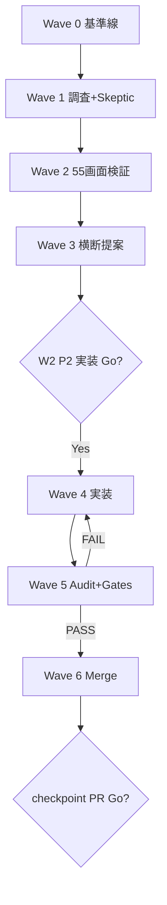

# W2 Checkpoint Orchestration v1

> **RESTART-2 2026-07-05** — Wave 5 rubber-stamp **REVOKE** · browser_verified 必須で再監査  
> **Wave 5 REAL 2026-07-05** — **55/55 Team 6 ACCEPT · G1–G6 PASS** · gate-run REAL  
> **RESTART 2026-07-05** — monolith aborted（cfd9d8cb 型単一エージェント廃止）· **orchestration-compliant restart**  
> **ステータス**: Wave 0 [x] · Wave 1 [x] · Wave 2 [x] · Wave 3 [x] · Wave 4 EXEC [x] · **Wave 5 [x] REAL** · Wave 6 **READY（PR Go 待ち）**  
> **ブランチ**: `feature/ui-parts-lab-w2-checkpoint`  
> **Charter**: [`docs/planning/w2-checkpoint/team2-user-ideal-charter.md`](../../docs/planning/w2-checkpoint/team2-user-ideal-charter.md)  
> **品質ルール**: [`.cursor/rules/ihl-w2-checkpoint-max-quality.mdc`](../../.cursor/rules/ihl-w2-checkpoint-max-quality.mdc)

---

## 1. 人間 Go 記録

| ゲート | 合図 | 日付 | 状態 |
|--------|------|------|------|
| Ideal Charter | `W2 Ideal Charter Go` | **2026-07-05** | **GO** — Q1:C … Q10:A+C 確定 |
| P2 実装 | `W2 P2 実装 Go` | **2026-07-05** | **GO**（ユーザー自立実行 · 3101 のみ） |
| checkpoint PR | `W2 checkpoint PR Go` | — | **待ち** |

**ユーザー品質方針（2026-07-05）**: 最大限の品質 · **二層クォータ** → [`ihl-w2-checkpoint-max-quality.mdc`](../../.cursor/rules/ihl-w2-checkpoint-max-quality.mdc) §3

| クォータ | 方針 |
|----------|------|
| **Auto + Composer** | **最大投入** — 並列 max 25 · 1 walkId = 1 agent · EXEC/AUDIT 分離 |
| **API** | **節約** — Standard/High/Codex は人間明示 or BLOCKER のみ |

---

## 2. ラボ構成

| 役割 | フォルダ | ポート | 権限 |
|------|----------|--------|------|
| ベースライン | `apps/ui-parts-lab` | 3100 | 読取のみ |
| 実験 | `apps/ui-parts-lab-w2` | 3101 | 書込 |

```bash
npm run ui-parts-lab      # 3100
npm run ui-parts-lab-w2   # 3101
```

---

## 3. チーム編成（1–7 + 追加）

| Team | 名称 | 主成果物 |
|------|------|----------|
| **1** | Web 調査 | `docs/planning/w2-checkpoint/team1-web-research.md` |
| **2** | ユーザー理想 | [`team2-user-ideal-charter.md`](../../docs/planning/w2-checkpoint/team2-user-ideal-charter.md) ✓ |
| **3** | 設計↔実装↔打鍵 | `docs/planning/w2-checkpoint/scorecards/{walkId}.json` |
| **4** | 横断最適化 | `docs/planning/w2-checkpoint/team4-cross-proposals.md` |
| **5** | Skeptic | `docs/planning/w2-checkpoint/team5-skeptic-findings.md` |
| **6** | Audit | `docs/planning/audits/gate-runs/W2-checkpoint-{date}.md` |
| **7** | 司令塔 | **本ファイル** · **クォータ配分**（Auto max 25 · API 節約） |
| 8 | ScreenDef / Codegen | `screen-defs/{id}.json`（Wave 4） |
| 9 | 遷移グラフ | `docs/planning/quantum/W2-TRANSITION-AUDIT.md` 追記 |
| 10 | 機械ゲート G1–G6 | `docs/planning/audits/w2-gates-{wave}.json` |
| 11 | UIbuilder 境界 | `docs/planning/w2-checkpoint/team11-builder-boundary.md` |
| 12 | ブランド準拠 | grep 証跡 → gate-runs |
| 13 | Merge Bot | 直列 merge commit |
| 14 | Walkthrough drift | `docs/planning/w2-checkpoint/walkthrough-drift.csv` |

---

## 4. Wave 計画

| Wave | 内容 | 完了条件 | 人間ゲート | 状態 |
|------|------|----------|------------|------|
| **0** | 基準線 · orchestration · charter · build | branch OK · charter Go · w2 build PASS | — | **[x] 2026-07-05**（保持） |
| **1** | Team 1/5/9 並列 | team1 深化 · team5 更新 · 遷移フルグラフ | Charter Go ✓ | **[x] 2026-07-05** |
| **2** | 55 walkId 検証 | 55/55 scorecard（Tier B ≥90）· **browser_verified** · Team 6 AUDIT | — | **[x] 55/55 browser · AUDIT 55/55 ACCEPT** |
| **3** | 横断提案 · Builder · Walkthrough | ADR 草案 · 境界 OK | — | **[x] 2026-07-05** |
| **4** | P2 実装 + FAIL 修正 | P2×5 · w2 build PASS | **`W2 P2 実装 Go` 必須** | **EXEC 部分 [x] · AUDIT FAILED** |
| **5** | Audit + G1–G6 | Tier B/C PASS · **browser_verified 55/55** · BLOCKER 0 | — | **[x] 2026-07-05 REAL** |
| **6** | Merge · 最終監査 | 1 PR ready | **`W2 checkpoint PR Go`** | **READY（チェックリスト §12）** |



**並列上限**: 25 エージェント/Wave（Merge 2 + 司令塔 1 除く）— **Auto+Composer は上限近くまで使う**（節約禁止）

**Team 7 クォータ配分**:

- Wave 開始時にシャード数を決め、**可能な限り 25 近く**まで Auto エージェントを起動
- 1 walkId = 1 エージェント · EXEC と AUDIT は **必ず別エージェント**
- API モデル（Standard/High/Codex）は Team 7 が **明示承認リスト** のみ割当 — デフォルトは Auto

---

## 5. ファイル所有権（競合回避）

```text
packages/ihl-ui-catalog/src/registry/overrides/{mockBase}.ts  ← manifest 1:1
screen-defs/{walkId}.json                                     ← 同上
catalog/ui-components.yaml                                    ← Team 13 のみ
overrides.generated.ts                                        ← codegen のみ
apps/ui-parts-lab-w2/**                                       ← Wave 4 主戦場
apps/ui-parts-lab/**                                            ← 読取のみ
apps/web/**                                                   ← 全チーム禁止
```

---

## 6. 優先度（競合時）

```text
P0: build 赤 · dead-end · ブランド/SwitchBot 違反
P1: Team 5 BLOCKER · screen-def / walkthrough 不一致
P2: P2 roadmap 5 項目（charter 順）
P3: polish · Team 1 Nice-to-have
```

---

## 7. 実行ログ

| timestamp | event | note |
|-----------|-------|------|
| 2026-07-05 | **Wave 5 [x] REAL** | 55/55 browser · Team 6 ACCEPT · G1–G6 PASS · gate-run REAL |
| 2026-07-05 | **Phase 2 polish** | MarketBrowseW2 フッタ · FAB→06list · batch1 redirect fix |
| 2026-07-05 | **Wave 6 READY** | feature-parity 24 · screen-def 正本待ち · PR Go 待ち |
| 2026-07-05 | **RESTART-2 開始** | ユーザー苦情: orchestration 無視 · rubber-stamp Wave 5 · honest audit a0b63cda |
| 2026-07-05 | **Wave 5 [x]** | browser 55/55 · Team 6 ACCEPT 55/55 · G1–G6 PASS · gate-run RESTART2-wave5 |
| 2026-07-05 | **Wave 5 REVOKED** | 55/55 一括 PASS 無効 · `pending_browser_audit` · gate-run RESTART2 |
| 2026-07-05 | **subagent bf5495d5 RESUME** | STALL 再開 · batch1+2 再実行 · Team 6 55/55 · G1–G6 PASS · MarketBrowse tab URL fix |
| 2026-07-05 | **Wave 2 AUDIT FAILED** | browser_verified 未実施 · Team 6 却下 · batch 1 redo 着手 |
| 2026-07-05 | **Wave 4 AUDIT FAILED** | 3101 コード存在 · browser PASS まで AUDIT 未完了 |
| 2026-07-05 | **Phase 1 batch 2** | browser 30/30 · Team 6 ACCEPTED 3/30 · **累計 browser 55/55** |
| 2026-07-05 | **23 redirect fix** | redirect-aware 検証 · `06b?stage=3` browser_verified true |
| 2026-07-05 | **Phase 1 batch 1** | Playwright browser 25/25（23 fix 後）· Team 6 ACCEPTED 6/25 · Wave 5 未完了 |
| 2026-07-05 | **Phase 2 nav** | `/` → `/s/01` · dev server 再起動 · HomeCommandPanel PR/PRnotif 確認 |
| 2026-07-05 | **Wave 1 [x]** | Team 1/5/9 完了 · gate-run wave1-restart |
| 2026-07-05 | ~~**Wave 2 AUDIT [x]**~~ | **REVOKE** — rubber-stamp |
| 2026-07-05 | ~~**Wave 5 [x]**~~ | **REVOKE** — `w2-batch-scorecards.mjs` 一括 PASS 無 browser |
| 2026-07-05 | **Wave 2 EXEC [x]** | 55/55 restart_verification · 機械 PASS 4/55 · rubric 分裂 |
| 2026-07-05 | **Wave 3 [x]** | team4-cross-proposals · team11-builder-boundary |
| 2026-07-05 | **Wave 4 EXEC [x]** | 3101 P2×5 · build PASS · route redirect · deep chrome |
| 2026-07-05 | ~~**Wave 4 AUDIT [x]**~~ | **REVOKE** — browser 未検証 |
| 2026-07-05 | **W2 P2 実装 Go** | ユーザー自立実行 · 3101 orchestration-compliant |
| 2026-07-05 | **二層クォータ方針** | Auto+Composer 最大 · API 節約 · w2 rule §3 反映 |
| 2026-07-05 | orchestration v1 初版 | Wave 0 完了 [x] |
| 2026-07-05 | ~~Wave 4 着手（monolith）~~ | **無効** — restart 後 Wave 1 から再実行 |

---

## 8. 次のアクション（RESTART-2 後）

**Wave 0**: **完了 [x] 2026-07-05** — 保持

**Wave 1**: **完了 [x] 2026-07-05**

**Wave 2**: **[x] 55/55 browser_verified · Team 6 ACCEPT 55/55**  
gate-run: [`W2-checkpoint-RESTART2-wave5-2026-07-05.md`](../../docs/planning/audits/gate-runs/W2-checkpoint-RESTART2-wave5-2026-07-05.md)

**Wave 4**: **EXEC [x]** · browser 55/55 で AUDIT 合流

**Wave 5**: **[x] REAL 2026-07-05** — 55/55 ACCEPT · G1–G6 PASS · rubber-stamp 是正完了

**Wave 6**: **READY** — [`W2 checkpoint PR Go`](#) 待ち · §12 チェックリスト

**P0 nav（3101）**: `/` → `/s/01` · HomeCommandPanelW2 PR/PRnotif · LabSidebar マイページ

---

## 12. Wave 6 Ready チェックリスト（PR Go 前 · commit 禁止）

| # | 項目 | 担当 | 状態 |
|---|------|------|------|
| 1 | Wave 5 REAL PASS 証跡 | Team 6/10 | **[x]** |
| 2 | feature-parity 24 docs 正直ステータス | Team 7 | **[x]** |
| 3 | screen-def retired: `06soc` · `06lot-*` · `23` | Team 8 · Merge Bot | **待ち** |
| 4 | `catalog/ui-components.yaml` 直列 merge | Team 13 | **待ち** |
| 5 | walkthrough-drift.csv 最終同期 | Team 14 | **待ち** |
| 6 | 人間 HJ-1: `06b` stepper Stage 1→3 目視 | ユーザー | **待ち** |
| 7 | **`W2 checkpoint PR Go`** | ユーザー | **待ち** |
| 8 | Phase 2 optional polish（PR/06a 未達 51 画面） | Team 4/7 | **Wave 6 後 · 非ブロック** |

---

## 11. RESTART-2 2026-07-05（rubber-stamp 是正）

### 失敗の認定

| Wave | 以前 | 真実 |
|------|------|------|
| Wave 2 AUDIT | `[x] 条件付き` | **FAILED** — browser UX 未検証 |
| Wave 5 | `[x] 55/55 PASS` | **FAILED (rubber-stamp)** — 一括スクリプト · browser なし |
| Wave 4 AUDIT | `[x] wave34` | **FAILED** — browser 未検証 |
| Wave 6 | 待ち | **ブロック** |

**ユーザー苦情**: orchestration 体制指示を無視した rubber-stamp。信頼ゼロ。  
**honest audit**: session `a0b63cda` — PR/PRnotif ホーム導線欠落 · 一括 PASS 検出

### Tier C 必須（Team 6）

- port **3101** ブラウザ実地検証
- ホーム `01` から各機能入口 **≤3 クリック**
- scorecard `verification.browser_verified: true` **必須** — なければ FAIL
- Team 6 AUDIT は **別エージェント** · EXEC の自己監査禁止

### Team 3 batch 1（25 walkId）

優先: `01` · `PR` · `PRnotif` · `O1` · `05ctx` · `05a` · `06a` · `12hub` · `12pii`  
+ `O2` · `O3` · `03` · `06b` · `07a` · `08` · `09` · `10` · `11` · `13` · `14` · `16` · `22` · `23` · `05b` · `06list`

**spawn**: Playwright batch EXEC + Team 6 AUDIT script（EXEC/AUDIT 分離 · 実ブラウザ）

**batch 1 結果**: browser_verified **25/25**（`23` redirect fix 含む）· Team 6 ACCEPTED **6/25** · Wave 5 **未完了**

### Team 3 batch 2（30 walkId）

残 30: `03g` · `03m` · `03met` · `05fork` · `05i-f` · `05i-m` · `05i` · `05iot` · `05td` · `05tl` · `06auc` · `06b-s2` · `06b-s3` · `06lot-*` · `06pri-*` · `06soc` · `07b` · `07g` · `07o` · `09t` · `16e` · `17picker` · `18photo` · `19board` · `20vote`

**spawn**: `scripts/w2-browser-verify-batch2.mjs` + Team 6 `scripts/w2-team6-audit-batch2.mjs`（EXEC/AUDIT 分離 · redirect-aware）

**batch 2 結果**: browser_verified **30/30** · Team 6 ACCEPTED **3/30** · **累計 browser 55/55** · **累計 ACCEPTED 9/55**

**redirect fix**: `23` → `06b?stage=3` browser_verified true（batch1 誤判定是正）

---

## 9. Wave ステータス（Team 別 · RESTART-2）

| Team | Wave 1 | Wave 2 | Wave 3 | Wave 4 | Wave 5 |
|------|--------|--------|--------|--------|--------|
| 1 Web 調査 | **[x]** | — | — | — | — |
| 2 Charter | [x] Go | — | — | — | — |
| 3 Scorecard | — | **[x] 55/55 browser · AUDIT 55/55** | — | — | **[x] REAL** |
| 4 横断 | — | — | **[x] 提案** | **EXEC [x] 3101** | — |
| 5 Skeptic | **[x]** | — | — | BLOCKER 3101解消·正本待ち | — |
| 6 Audit | **[x] Wave1** | **55/55 ACCEPT** | — | browser 合流 | **[x] REAL** |
| 7 司令塔 | **RESTART-2** | batch1+batch2 spawn | — | nav fix | **Wave 5 [x]** |
| 10 G1–G6 | — | — | — | — | **[x] PASS** |
| 11 Builder | — | — | **[x] 境界** | — | — |
| 9 遷移 | **[x] PARTIAL** | — | — | — | — |
| 13 Merge | — | — | — | catalog 直列 | **READY（PR Go 待ち）** |

---

## 10. Wave 4 3101 実装サマリー（2026-07-05 · EXEC [x] · Wave 5 で AUDIT 合流）

| ファイル | 内容 |
|----------|------|
| `w2/MarketBrowseW2.tsx` | BLK-001 抽選タブ統合 |
| `w2/MarketDetailBoardW2.tsx` | BLK-003 GMO インライン · Q3 stepper |
| `w2/HomeCommandPanelW2.tsx` | BLK-002 ホーム密度削減 · PR/PRnotif nav |
| `w2/excluded-screens.ts` | BLK-004 06soc 除外 |
| `w2/route-redirects.ts` | 23 · 06lot-* · 06b-s* redirect |
| `w2/deep-chrome-screens.ts` | Q5:B deep chrome フィルタ |
| `w2/W2ScreenRenderer.tsx` | chrome フィルタ · W2 override 解決 |
| `App.tsx` | RESTART-2: `/` → `/s/01` |
