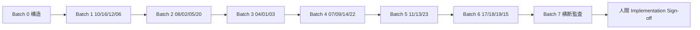

# 実装前バッチ実行計画 v1

> **ステータス**: **Batch 0〜7 完了**（2026-06-09）· **Batch 8 設計着手**（2026-06-10）  
> **方針**: 機能 01〜20 を **AI が着手しやすい順（易→難）** で設計パック完成。各バッチ末に **AI 監査役の機械チェック + 委任 Go**。  
> **実装**: Batch 0〜7 は設計パック完了。**Batch 8 以降は salvage+再アーキテクチャ実装**（`HUMAN-IMPL-BATCH8-GO` 後）。

---

## 1. バッチ一覧サマリー

| Batch | 名称 | モデルティア | 主な成果 | 状態 |
|:-----:|------|-------------|----------|------|
| **0** | 構造・ガバナンス | **Auto** | チャーター・スコープ・配置マップ・本計画・スタブ・assets README | **完了** |
| **1** | 設計完成度上位 | Standard | #10 #16 #12 #06 の 4 点 + トレース行 | **完了** |
| **2** | 経済・規約・観測 | Standard | #08 #02 #05 #20 | **完了** |
| **3** | 認証シェル | Standard | #04 #01 #03 | **完了** |
| **4** | コミュニティ・研究 | Standard | #07 #09 #14 #22 | **完了** |
| **5** | 司法・データ・決済 | **High** | #11 #13 #23 | **完了** |
| **6** | 未着手機能・横断 schema | **High** | #17 #18 #19 #15 | **完了** |
| **7** | 横断監査・機械化 | Auto + Standard | OSS ライセンス · CI/test v2 · トレース script · 最終監査 | **完了** |
| **8** | **実装 · salvage+再アーキ** | **Codex**（ゲート後） | C-USB 実装 · mock peel · DoD 4 列 · #13 先行 | **設計のみ着手** |

**モデルティア**（[`ihl-ai-model-routing.mdc`](../../../../.cursor/rules/ihl-ai-model-routing.mdc)）:

| ティア | モデル | 用途 |
|--------|--------|------|
| Auto | `composer-2.5-fast` | 索引・README・機械チェック・監査ログ行 |
| Standard | `claude-4.6-sonnet-medium-thinking` / `gpt-5.5-medium` | 単機能 4 点設計・遷移表 |
| High | `claude-opus-4-8-thinking-high` | 裁判·schema 横断·矛盾解消 |

---

## 2. Batch 0 — 構造・ガバナンス（完了）

### 成果物

- [x] [`00-AI監査役-Goチャーター-v1.md`](./00-AI監査役-Goチャーター-v1.md)
- [x] [`00-実装前ブループリント-スコープ.md`](./00-実装前ブループリント-スコープ.md)
- [x] [`00-ブループリント-成果物配置マップ-v1.md`](./00-ブループリント-成果物配置マップ-v1.md)
- [x] 本ファイル
- [x] [`00-監査役-実装前ゲート-v1.md`](./00-監査役-実装前ゲート-v1.md)（スタブ）
- [x] [`00-モック要件トレーサビリティ-v1.md`](./00-モック要件トレーサビリティ-v1.md)（スタブ）
- [x] [`../02-設計/_横断/OSS-ライセンス監査表-v1.md`](../02-設計/_横断/OSS-ライセンス監査表-v1.md)（スタブ）
- [x] [`../02-設計/_横断/ci/CI設計書-v2.md`](../02-設計/_横断/ci/CI設計書-v2.md)（スタブ）
- [x] [`../../03-テスト計画/_横断/テスト設計書-v2.md`](../../03-テスト計画/_横断/テスト設計書-v2.md)（スタブ）
- [x] [`../02-設計/_ui-global/00-世界観アセット一覧-v1.md`](../02-設計/_ui-global/00-世界観アセット一覧-v1.md)
- [x] [`../02-設計/_ui-global/assets/`](../02-設計/_ui-global/assets/README.md) ディレクトリ + README
- [x] [`README.md`](./README.md) 索引更新

### 出口基準

- 配置マップとチャーターが矛盾しない  
- Batch 1 担当 AI が **読むだけで着手可能**

---

## 3. Batch 1 — 設計完成度上位（#10 #16 #12 #06）

| 項目 | 内容 |
|------|------|
| **モデル** | Standard（ADR 矛盾時のみ High） |
| **機能順** | 10 → 16 → 12 → 06 |
| **理由** | 4 点草案が最も揃っている。機械トレースで委任 Go を初回確立 |

### 機能別 deliverables

| # | 不足の主な埋め | モック |
|---|----------------|--------|
| 10 | 監査ログ行 · トレース行 | 既存 1 枚で可 |
| 16 | H-17 整合確認 · テーマ md リンク | 既存 2 枚 |
| 12 | **遷移設計 v1 完成** | 既存 2 枚 |
| 06 | 落選 variant mock 2 枚 | `ihl-06-market-lottery-result-lose.png` 等 |

### バッチ出口

- 4 機能すべて **DELEGATED-DESIGN-GO**（監査ログ）  
- ユーザーへ **モック目視 4 件**依頼

---

## 4. Batch 2 — 経済・規約・観測（#08 #02 #05 #20）

| 項目 | 内容 |
|------|------|
| **モデル** | Standard（05 のみ High 検討 — OBS-TGT/CTX） |
| **機能順** | 08 → 02 → 05 → 20 |

| # | 重点 |
|---|------|
| 08 | 詳細設計 v2 · 月次バッチ UI |
| 02 | 版更新フロー遷移（法務文確定は人間） |
| 05 | schema YAML 参照 · artifact/digital は N/A 明記 |
| 20 | 一般投票 UI v2 モック |

---

## 5. Batch 3 — 認証シェル（#04 #01 #03）

| 項目 | 内容 |
|------|------|
| **モデル** | Standard |
| **機能順** | 04 → 01 → 03 |

| # | 重点 |
|---|------|
| 04 | 詳細設計 v1 · ホーム状態機械 |
| 01 | マジックリンク詳細/遷移 · 失効エラー |
| 03 | handle/言語/規約 API 契約 · オンボーディング遷移 |

---

## 6. Batch 4 — コミュニティ・研究（#07 #09 #14 #22）

| 項目 | 内容 |
|------|------|
| **モデル** | Standard |
| **機能順** | 07 → 09 → 14 → 22 |

| # | 重点 |
|---|------|
| 07 | 詳細設計 v1 · 板別 state machine |
| 09 | Paper schema · 研究フロー state machine |
| 14 | 詳細/遷移 v1 · 貢献度内訳 UI |
| 22 | PT ショップ 4 点（20 とモック連動整理） |

---

## 7. Batch 5 — 司法・データ・決済（#11 #13 #23）

| 項目 | 内容 |
|------|------|
| **モデル** | **High**（11 裁判） + Standard |
| **機能順** | 11 → 13 → 23 |

| # | 重点 |
|---|------|
| 11 | U-MKT-DSP v1.1 · dispute-room モック追加 · **人間レビュー行** |
| 13 | 詳細設計 v1 · collector 遷移 |
| 23 | 本番鍵は runbook のみ · UI/遷移完成 |

---

## 8. Batch 6 — 未着手・横断 schema（#17 #18 #19 #15）

| 項目 | 内容 |
|------|------|
| **モデル** | **High** |
| **機能順** | 17 → 18 → 19 → 15 |

| # | 重点 |
|---|------|
| 17 | 全 4 点 + OS 切替スコープ外の明記 |
| 18 | Vision/CLIP 契約 · component 分解連動 |
| 19 | GitHub 連携 UI · file-board 遷移 |
| 15 | `02-設計/_横断/schema/*.schema.yaml` 草案 · 画面 N/A |

---

## 9. Batch 7 — 横断監査・機械化

| 項目 | 内容 |
|------|------|
| **モデル** | Auto（スクリプト・表） + Standard（監査統合） |

### Deliverables

| 成果物 | パス |
|--------|------|
| OSS ライセンス監査（Phase1+2 全行） | `02-設計/_横断/OSS-ライセンス監査表-v1.md` |
| CI 設計 v2 | `02-設計/_横断/ci/CI設計書-v2.md` |
| テスト設計 v2 | `03-テスト計画/_横断/テスト設計書-v2.md` |
| モック要件トレーサビリティ（全行） | `00-モック要件トレーサビリティ-v1.md` |
| 最終監査サマリー | `00-監査役-実装前ゲート-v1.md` §サマリー |
| 21 翻訳横断 | FR トレース行 |

### バッチ出口

- 01〜20 全機能 **設計パック `[x]`**  
- ギャップマトリクス ✗ = 0  
- ユーザーへ **実装 Sign-off 判断材料**を提示（Sign-off 自体は人間）

---

## 10. 機械チェックスクリプト（追加予定 · コードは Batch 7）

| スクリプト | 目的 | 追加 Batch |
|------------|------|:----------:|
| `scripts/ihl-mock-fr-trace.mjs` | mock ファイル名 ↔ `00-画面一覧` ↔ FR 節の対応 | 7 |
| `scripts/ihl-transition-edge-trace.mjs` | 遷移設計の edge ↔ walkthrough hotspot | 7 |
| `scripts/ihl-adr-term-conflict.mjs` | ADR 間の数値・用語衝突 grep | 7 |
| `scripts/ihl-four-point-inventory.mjs` | 01〜20 の 4 点ファイル存在チェック | 7 |
| `scripts/ihl-oss-license-audit.mjs` | package/lock と監査表の差分 | 7 |
| `scripts/ihl-mock-coverage.mjs` | 必須 mock リストと PNG 存在 | 1（部分）→ 7（完全） |

> **Batch 0〜6**: 上記は **手動チェックリスト**で代替可（[`00-AI監査役-Goチャーター-v1.md`](./00-AI監査役-Goチャーター-v1.md) §6）。

---

## 11. 実行順フロー（全体）

---

## 12. Batch 8 — 実装 · salvage + 再アーキテクチャ（2026-06-10 設計着手）

> **本節は設計 doc のみ**。コードは **`00-監査役-Batch8-実装前ゲート-v1.md`** の G1〜G8 + **`HUMAN-IMPL-BATCH8-GO`** 後。

### 12.1 目的

- civ-os を **reference implementation** として契約抽出
- IHL を **View → API → libs → components(C-USB) → event_store** で再実装
- **盲移植禁止** — [`ADR-H-18`](../02-設計/_横断/adr/ADR-H-18-IHLスコープ正本-stays-vs-rebuild-v1.md) がスコープ正本

### 12.2 Batch 8 設計成果物（本タスク）

| 成果物 | パス |
|--------|------|
| スコープ ADR | [`02-設計/_横断/adr/ADR-H-18-IHLスコープ正本-stays-vs-rebuild-v1.md`](../02-設計/_横断/adr/ADR-H-18-IHLスコープ正本-stays-vs-rebuild-v1.md) |
| 実装設計・レイヤー | [`02-設計/_横断/00-Batch8-実装設計-スコープ-v1.md`](../02-設計/_横断/00-Batch8-実装設計-スコープ-v1.md) |
| DoD マトリクス | [`02-設計/_横断/00-機能別実装DoD-マトリクス-v1.md`](../02-設計/_横断/00-機能別実装DoD-マトリクス-v1.md) |
| 監査ゲート | [`02-設計/_横断/00-監査役-Batch8-実装前ゲート-v1.md`](../02-設計/_横断/00-監査役-Batch8-実装前ゲート-v1.md) |
| #13 実装設計 | [`02-設計/features/13-データ取得元/sub/13-データ取得元-実装設計-v1.md`](../../02-設計/features/13-データ取得元/sub/13-データ取得元-実装設計-v1.md) |
| SwitchBot ADR | [`02-設計/_横断/adr/ADR-H-19-SwitchBot-取得戦略-差分ポーリング-v1.md`](../02-設計/_横断/adr/ADR-H-19-SwitchBot-取得戦略-差分ポーリング-v1.md) |
| データクラス ADR | [`02-設計/_横断/adr/ADR-H-20-データクラスと書込方針-v1.md`](../02-設計/_横断/adr/ADR-H-20-データクラスと書込方針-v1.md) |

### 12.3 mock 剥がし順（深さ優先）

`13 → 12 → 01 → 03 → 09 → 18 → 08 → 11 → 06 → 07 → … → 05（統合）`

理由: #13（IoT 土台）なしに #05 観測の `iot_switchbot` が空振りするため。

### 12.4 実装出口基準

| 指標 | 目標 |
|------|------|
| DoD マトリクス | P0 機能（#13,#12,#01,#03,#09,#18,#05）が 4 列 `✓` |
| 監査 | 機能ごと `DELEGATED-IMPL-GO` ログ |
| 矛盾 | ADR-H-18 · H-19 と実装が一致 |
| 秘密 | grep で TOKEN/SECRET が truth JSON に無い |

### 12.5 人間ゲート

| ID | タイミング | 状態 |
|----|------------|------|
| **HUMAN-ADR-H-18** | Batch 8 設計確定 | **✓ CONFIRMED 2026-06-10** |
| **HUMAN-ADR-H-19** | #13 poller 設計 | **✓ CONFIRMED 2026-06-10** |
| **HUMAN-ADR-H-20** | データクラス · series.parquet | **✓ CONFIRMED 2026-06-10** |
| **HUMAN-IMPL-BATCH8-GO** | **初回実装 PR 前** | **待ち** — 次ゲート |
| **HUMAN-COLLECTOR-KEYS** | 実機 E2E 前 | 待ち |

> **2026-06-10**: ユーザー `ADR-H-18 Go ADR-H-19 Go ADR-H-20 Go` — ADR 人間 Go **完了**。Occupancy 参照モデルは [`13-データ取得元-実装設計-v1.md`](../../02-設計/features/13-データ取得元/sub/13-データ取得元-実装設計-v1.md) §9。**実装着手は `HUMAN-IMPL-BATCH8-GO`（または `Batch 8 実装 Go`）が別途必要**。

---

## 13. 関連

- [`00-実装前ブループリント-スコープ.md`](./00-実装前ブループリント-スコープ.md)
- [`00-AI監査役-Goチャーター-v1.md`](./00-AI監査役-Goチャーター-v1.md)
- [`00-設計ゲート4点-ギャップマトリクス-v1.md`](./00-設計ゲート4点-ギャップマトリクス-v1.md)
- [`../02-設計/_横断/00-Batch8-実装設計-スコープ-v1.md`](../02-設計/_横断/00-Batch8-実装設計-スコープ-v1.md)

---

*v1.3 · 2026-06-10 · ADR-H-18/19/20 HUMAN-CONFIRMED · 次: **HUMAN-IMPL-BATCH8-GO***
