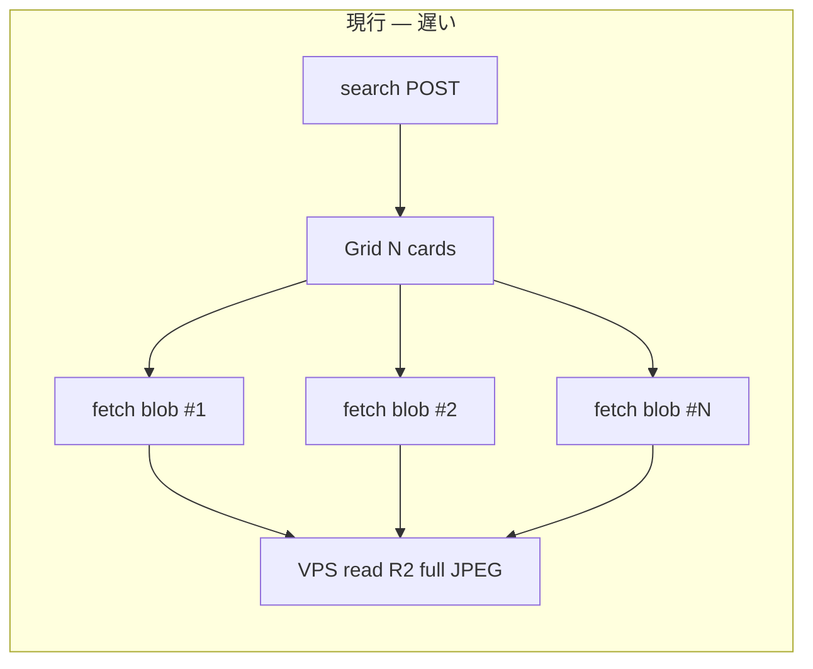

# 観測画像 — 性能・コスト改善計画

> **作成**: 2026-07-03  
> **対象 repo**: `it-hercules-laboratory-clean`  
> **本番**: `it-hercules.uk` (CF Pages) · `api.it-hercules.uk` (Sakura VPS) · R2  
> **ステータス**: **計画のみ** — 本バッチは doc 追加。実装は Phase 順に小さく進める。  
> **関連コミット**: `dafdd53` — `AuthenticatedImage` · `api.fetchBlob`

---

## 1. 問題（Problem statement）

| 症状 | 影響 |
|------|------|
| 観測検索グリッドのサムネイル表示が **遅い** | 初回スクロール・フィルタ変更後の体感待ちが長い |
| 1 画面あたり **N 枚の画像 = N 回の個別 fetch** | 検索 20 件 → 最大 20 並列 HTTP + blob 変換 |
| **ブラウザ HTTP キャッシュが効かない** | 同じ capture を一覧→詳細で見ても毎回フル再取得 |
| **フル解像度 JPEG** を一覧でも配信 | 帯域・VPS CPU・R2 読み出しが過大（thumbnail パイプライン未配線） |
| blob `objectURL` の生成・破棄コスト | メモリピーク · GC 圧力 · 一覧スクロールでちらつき |

**ユーザー要望**: 軽量・低コスト（R2 egress · VPS 帯域 · Workers 課金を抑える）。

---

## 2. 根本原因（Root cause）

### 2.1 認証モデルと `` の制約（歴史）

`IHL_AUTH_REQUIRED=1` 導入時、観測画像 GET も router 全体の `enforce_auth_when_required` で **401** になっていた。  
`` は **カスタムヘッダー（`X-IHL-Session`）を送れない**ため、JSON API は成功しても画像だけ壊れる。

**対応（`dafdd53`）**: `AuthenticatedImage` が `fetch` + `X-IHL-Session` + `blob()` + `URL.createObjectURL` で表示。

### 2.2 Scope A 確定後の状態（2026-07-03）

観測 **search / list / detail / image GET** は **未ログイン可**（Scope A · コミュニティカタログ）。  
`test_it_01_14_observation_image_public_read_when_auth_on` で **無認証 image GET = 200** を固定。

→ **画像エンドポイントは公開 READ**。セッションヘッダーは **不要**（付いていても通る）。

### 2.3 なお残る性能問題

| 要因 | 説明 |
|------|------|
| **blob 経路の慣性** | `AuthenticatedImage` が引き続き fetch+blob を使う → ネイティブ `` の並列・キャッシュ利点を捨てている |
| **サムネ専用 URL なし** | `GET /api/v1/observation/{id}/image` は `resolve_image_path` で **raw / フルサイズ** を返す（`thumbnail_path` 列はあるが API 未分岐） |
| **Cache-Control 未設定** | API `Response` に長寿命キャッシュヘッダなし → CDN・ブラウザとも再検証/再取得 |
| **N+1 クライアントパターン** | 検索 1 回 + 画像 N 回。バッチ URL・sprite・JSON 埋め込みなし |

---

## 3. 改善方針（軽量・低コスト優先）

**原則**

1. **安い順** — 設定・ルーティング・ヘッダー・既存公開 READ の活用が先。新規 SaaS（Cloudflare Images 等）は Phase 3 以降。
2. **VPS を画像 CDN 代わりにしない** — キャッシュ可能な静的サムネは **R2 直配信 or CF キャッシュ** へ寄せる（ver4 Workers バインディングと整合）。
3. **API JSON に base64 画像を入れない** — search レスポンス肥大 · CPU · メモリ。URL のみ維持。
4. **WRITE 認証は維持** — 公開するのは **カタログ READ（Scope A）** のみ。commit/upload は現行どおり。

---

## 4. フェーズ計画

### Phase 0 — 即効（コード数行 · 要実装 GO）

> Scope A で image GET が公開済みのため、**認証付き blob 経路は一覧/詳細の READ では不要**。

| 項目 | 内容 | コスト |
|------|------|--------|
| **ネイティブ `` へ切替** | `resolveApiPath(image_url)` + `` · 公開 GET のみ | 実装極小 · egress 即減 |
| **`AuthenticatedImage` 縮退** | WRITE 後プレビュー等、将来ヘッダ必須の経路だけ残す | テスト: `test_auth` 既存を維持 |

**期待効果**: ブラウザ並列取得 · HTTP キャッシュ候補 · blob メモリ削減。  
**リスク**: 低（公開エンドポイントの利用方法変更のみ）。未ログイン観測検索 fix と **非競合**。

---

### Phase 1 — クイックウィン（1〜2 日 · VPS のみ）

| # | 施策 | 詳細 | コスト影響 |
|---|------|------|------------|
| 1a | **サムネイル専用エンドポイント** | `GET .../image?size=thumb` または `.../thumbnail` — `thumbnail_path` 優先、無ければ raw（後方互換） | egress **大幅↓**（512px JPEG 想定） |
| 1b | **Cache-Control** | 不変 `capture_id` + コンテンツハッシュ or `?v=` — `public, max-age=31536000, immutable`（サムネ） | VPS 再読込↓ · CF が乗れば **無料枠内キャッシュ** |
| 1c | **クライアント並列上限** | どうしても fetch 経路が残る場合のみ — 同時 6 本キュー（p-limit 等） | VPS スパイク防止 |
| 1d | **objectURL 再利用** | 同一 `src` の in-memory Map（セッション内）· unmount 時 revoke ポリシー明文化 | メモリ・再 fetch 削減 |
| 1e | **ローディング UI** | 現状: 空 `div`（`data-testid="-loading"`）— **スケルトン / プレースホルダ色** 追加で体感改善 | コストゼロ |

**thumbnail パイプライン**: `components/thumbnail_builder` は設計済み · ver3 最小配線は [`IHL-段階リリース計画`](../../../02-設計/_横断/IHL-段階リリース計画-ver1-4+.md) B5①。Phase 1a と **セットで初回生成**（既存 capture は on-demand or バッチ kick）。

---

### Phase 2 — 中程度（認証とキャッシュの両立）

一覧は公開サムネ、**将来の非公開化・署名付き raw** に備える。

| 方式 | メリット | デメリット | 推奨度 |
|------|----------|------------|--------|
| **A. 短命 signed query** | `` のまま · CDN キャッシュ可 · Scope 変更に強い | API で HMAC 発行 · 時計同期 | **高**（低コスト） |
| **B. Session cookie `Domain=.it-hercules.uk`** | ネイティブ img · サブドメイン共有 | `Secure` `SameSite` · CSRF 整理 · magic link フロー影響 | 中 |
| **C. Pages `/api` rewrite 同一オリジン** | 相対 URL で cookie 共有可能 | 大きな blob の Pages 経由は **非推奨**（帯域二重） | 低 |

**推奨**: **A（signed URL）** をサムネ専用に。有効期限 15〜60 分 · search レスポンスに `thumbnail_url`（署名済み）を載せ、**1 search で URL 確定**し N+1 を緩和。

---

### Phase 3 — インフラ寄せ（ver4 以降 · 要 ADR）

| 施策 | 内容 | コスト |
|------|------|--------|
| **R2 公開バケット（thumbs のみ）** | `thumbnails/{capture_id}.jpg` を public read · API はリダイレクト or 直接 URL | R2 egress **Class A 無料枠** · VPS バイパス |
| **Cloudflare Images** | 変換・リサイズ委譲 | **月額・従量** — トラフィック次第。小規模なら Phase 1 の自前 512px の方が安い |
| **Workers + R2 bind** | 画像 GET を Edge で返す（[`ver4-infra-agreement.md`](../../ver4-infra-agreement.md)） | VPS 512MB 解放 · Workers 無料枠内を目標 |

**やらない（高コスト / 重い）**

- search JSON への base64 / data-URL 埋め込み
- 一覧用のサーバサイドスプライト生成
- 全 raw を CF Images にアップロード（ストレージ二重課金）

---

## 5. コストメモ

| 項目 | 現行負荷 | 改善後イメージ |
|------|----------|----------------|
| **R2 egress** | フル JPEG × リクエスト数 | サムネ + キャッシュヒットで **1/10〜1/50** 目安 |
| **Sakura VPS 512MB** | 画像バイトを Python が毎回読み込み streaming | Phase 3 で Workers/R2 直配信 · VPS は API JSON のみ |
| **CF Pages** | 静的のみ（帯域小） | 変更不要。画像は api / R2 側 |
| **CF Workers** | ver4 未着手 | 主 API 移行時に image route を Edge 化（ADR-H-33） |
| **ブラウザ** | blob URL N 個 | ネイティブ img + lazy → メモリ安定 |

**計測（実装後）**

- DevTools Network: 検索 20 件時の **転送量合計 · 完了時間 ·  waterfall**
- VPS: `nginx` access log の `/image` QPS · 平均 bytes
- 目標: 一覧初回 **LCP 画像 2s 以内**（3G Fast 相当）— 数値は Phase 1 完了後に確定

---

## 6. 実装スコープ外（本計画）

- DINOv2 embedding · 類似検索 rerank
- 色補正・フィルタ（NFR: 禁止のまま）
- 非公開観測（`visibility` 列）— Scope A 確定の間は対象外

---

## 7. 参照

| 用途 | パス |
|------|------|
| 現行コンポーネント | `apps/web/src/components/observation/AuthenticatedImage.tsx` |
| 画像 API | `apps/api/routes/observation.py` — `observation_capture_image` |
| API base / 本番 URL | `apps/web/src/lib/api-base.ts` — `resolveApiPath` |
| Scope A · 公開 image GET | `tests/unit/test_auth.py` — `test_it_01_14_...` |
| thumbnail 設計 | `components/thumbnail_builder/` · `01-要件/05-観測.md` OBS-IMG-02 |
| 運用ステータス | [`../STATUS.md`](../STATUS.md) |
| ver4 インフラ | [`../../ver4-infra-agreement.md`](../../ver4-infra-agreement.md) |

---

## 8. 次のアクション（優先順）

1. **Phase 0** — 公開 READ 向けネイティブ ``（実装 GO 後 · 1 PR）
2. **Phase 1a + 1b** — thumb エンドポイント + Cache-Control
3. **thumbnail_builder** — 既存 capture の thumb バックフィル手順を runbook に 1 節
4. Phase 2 signed URL は **非公開化要件が出た時点**で設計ゲート

*本ファイルは計画正本。実装完了時は `STATUS.md` と `DESIGN-IMPL-AUDIT.md` を更新する。*
