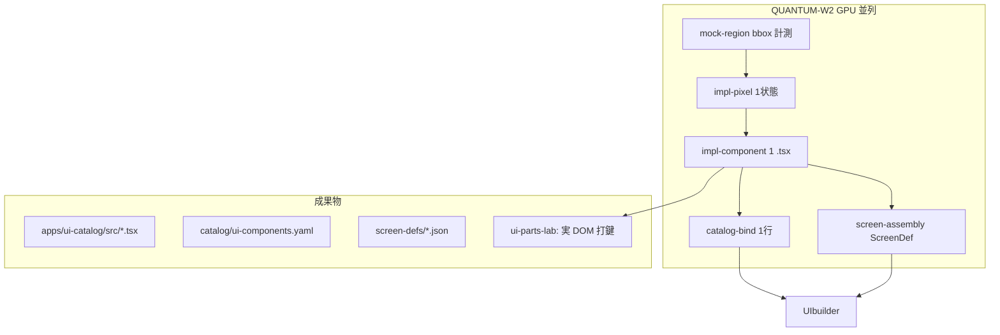

# QUANTUM-W2 — UI カタログ実装リメディエーション

> **日付**: 2026-07-03  
> **きっかけ**: `apps/ui-parts-lab` が mock PNG 貼り付け + 透明ホットスポットのみで、**UIbuilder 編集可能なコード部品になっていない**  
> **判定**: QUANTUM レーン A は **設計インデックスまで**。**実装カタログは未着手**だった。

---

## 1. なぜこうなったか（正直な診断）

### 1.1 カテゴリ誤認（最大の原因）

| 求められていたもの | 誤って納品したもの |
|-------------------|-------------------|
| **React/TSX の再利用部品**（catalog id · props · 4状態） | **PNG 1枚 + クリック矩形** |
| UIbuilder がパレットからドラッグできる **テンプレパーツ** | walkthrough と同型の **目視プロトタイプ** |
| mock は **採点用参照**（±2px）のみ | mock を **画面本体**として表示 |
| GPU 並列で **1部品 = 1 .tsx ファイル** | GPU 並列で **1部品 = 1 .md テンプレ** |

「画面打鍵」を **遷移の体験** と解釈し、**部品のコード化** まで含む実装波を飛ばした。

### 1.2 QUANTUM-COMPLETE のゲートが「文書数」止まりだった

`ihl-quantum-shard-gen.mjs` は **1813 個の markdown を機械展開**しただけ:

- `bbox | TBD 目視` — 座標未計測
- `padding | sm=8px` — 全部品同一の汎用値
- **`.tsx` / `catalog` 登録 / ScreenDef ノード** — ゼロ

`ihl-quantum-preflight.mjs` は **ファイル存在** を見るだけで、**コード部品の実体**は検証していない。

→ **「1813 シャード完了」≠「263 部品が UIbuilder 可能」**

### 1.3 `apps/ui-parts-lab` の位置づけミス

- 5 プリミティブ（AppShell 等）は **汎用枠**のみ
- ContentArea は **``** — ボタン・入力は DOM に存在しない
- `catalog/components.yaml` は **データパイプライン用**（ingest 等）で UI 部品台帳ではない

---

## 2. あるべき完成像（ユーザー案 = 正しい）



**原則（再確認）**:

1. mock PNG → **本番直行禁止**（採点オーバーレイは dev のみ）
2. 部品は **`catalog/ui-components.yaml` の id** と 1:1
3. 画面は **ScreenDef = 部品ツリー**（画像ツリーではない）
4. UIbuilder は **登録済み id のみ**配置・編集

### status tiers（catalog 正直性）

| status | 意味 | ScreenDef での扱い |
|--------|------|-------------------|
| `w2_pilot` | L0 プリミティブ / レイアウト（手実装） | そのまま配置可 |
| `w2_hand` | 機能部品の手実装（RegionPart 以外） | そのまま配置可 |
| `w2_scaffold` | `w2-generate.mjs` の RegionPart 仮置き | **override なし単独参照は不可** |

旧称 `w2_generated` は **`w2_scaffold` に改名**（「生成済み＝実 UI」と誤認しないため）。

- 手実装差し替えは `packages/ihl-ui-catalog/src/registry/overrides.ts` の `COMPONENT_OVERRIDES` に登録。
- `ihl-quantum-w2-preflight.mjs` は **content ノードが scaffold のみ**の ScreenDef を **FAIL**、混在は **WARN**。

---

## 3. W2 工程細分化（GPU / Auto 並列単位）

**競合回避**: 1 ワーカー = **1 新規ファイル**（既存 append 禁止）

| Wave | shard 種 | 単位 | 推定本数 | ワーカー出力 |
|------|----------|------|----------|--------------|
| **W2-0** | `mock-region-measure` | 1 PNG × 1 矩形 | ~150 | `registry/MOCK-BBOX-v1.json` 1行 |
| **W2-1** | `impl-pixel` | 1 部品 × 1 状態 | 1052 | `packages/ihl-ui-catalog/src/pixels/{id}/{state}.css.json` |
| **W2-2** | `impl-component` | 1 部品 | 263 | `packages/ihl-ui-catalog/src/components/{id}.tsx` |
| **W2-3** | `catalog-bind` | 1 部品 | 263 | `catalog/ui-components.yaml` 追記（merge bot） |
| **W2-4** | `screen-assembly` | 1 ルート | 48 | `screen-defs/{route-slug}.json` |
| **W2-5** | `template-default` | 1 画面 | 48 | ThemePack 初期 binding 節 |
| **W2-6** | `story-entry` | 1 部品 | 263 | `apps/ui-parts-lab/stories/{id}.tsx` |

### ワーカー入力（コンテキスト < 8KB）

```
shard_id: impl-component-ihl-05-obs-search-grid__SearchFilterBar
read_only:
  - registry/MOCK-BBOX-v1.json (該当 region 1行)
  - shards/pixel-...-ok.md + loading|empty|error
  - schemas/dictionaries/ui_primitive_catalog.yaml (Input variant)
write_exactly_one: packages/ihl-ui-catalog/src/components/ihl-05-obs-search-grid__SearchFilterBar.tsx
acceptance:
  - export function + props: state, onSubmit?, className?
  - 4状態を props.state で切替
  - --civ-* のみ · 装飾 hex 禁止
  - mock img 禁止
```

---

## 4. 機械ゲート（W2 完了定義 — 旧 QUANTUM とは別）

| # | ゲート | コマンド / 条件 |
|---|--------|----------------|
| G1 | **mock 本体表示禁止** | `rg '<img.*mockups/ihl-' apps/ui-parts-lab/src packages/ihl-ui-catalog` → 0（overlay 専用ファイル除く） |
| G2 | **catalog カバー** | `ui-components.yaml` 行数 = 263 |
| G3 | **ScreenDef** | 48/48 · 全ノードが catalog id |
| G4 | **pixel 矛盾** | Conflict Bot ±2px（bbox + computed style） |
| G5 | **UIbuilder 読取** | `GET catalog` + palette に id 表示（スモーク） |
| G6 | **打鍵** | ui-parts-lab port 3100 · **実 button/input** にクリック |

**旧 `QUANTUM-COMPLETE` は「設計インデックス完了」に格下げ**。W2 PASS まで **UI IMPL 未完**。

---

## 5. フォルダ構成（apps/web 非接触）

```text
packages/ihl-ui-catalog/          # 正本 TSX 部品（UIbuilder 参照）
  src/components/*.tsx
  src/tokens/civ.css
catalog/ui-components.yaml        # UI 部品台帳（新設 · pipeline≠ingest）
screen-defs/*.json                # 画面組み立て図
apps/ui-parts-lab/                # port 3100 · 実 DOM プレビューのみ
  src/screens/                    # ScreenDef → React 木
  src/dev/MockOverlay.tsx         # 任意 · 50% 採点用（本番ビルド除外）
apps/web/                         # 触らない（統合は W2 完了 + 別 PR）
```

---

## 6. 直近アクション（優先順）

### 6.1 即時（人間合意 · 1 画面パイロット）

**パイロット画面**: `ihl-00-onboarding-login`（部品少 · 遷移明確）

| 順 | 作業 | 成果 |
|----|------|------|
| 1 | W2-0 で login 5 region の bbox 手動 or 計測 | JSON 5 行 |
| 2 | W2-2 で 5 `.tsx` 実装（手 + 1 Auto ワーカー検証） | 実ボタン「ログインリンクを送る」 |
| 3 | W2-4 `screen-defs/login.json` | 部品ツリー |
| 4 | ui-parts-lab を **img 廃止**してパイロット差し替え | 打鍵で `/register` へ |

→ **これで「雑な画像プレビュー」から「コード部品」への差が目視できる**

### 6.2 並列波（パイロット PASS 後）

- W2-1〜3 を **feature 単位**（05 観測 · 06 マーケット …）で 10〜20 Task 同時
- merge bot: `catalog/ui-components.yaml` · Conflict bot: 同名 id

### 6.3 ドキュメント修正

- `QUANTUM-COMPLETE-REPORT.md` — レーン A を「インデックスのみ」明記
- `apps/ui-parts-lab/README.md` — 現状は **プロトタイプ（画像）** と警告
- `ihl-quantum-preflight.mjs` — W2 ゲートは **別スクリプト** `ihl-quantum-w2-preflight.mjs`

---

## 7. ui-parts-lab の扱い

| 現状 | W2 後 |
|------|-------|
| PNG 本体 + 透明 hotspot | **ScreenDef 駆動の実コンポーネント木** |
| 部品カタログ = markdown 索引 | Storybook 的プレビュー + catalog id リンク |
| 「composed-parts 完了」表記 | **削除** · 「遷移プロトタイプ v0」に改名 |

mock オーバーレイは **開発者モードのみ**（`?overlay=1`）— UIbuilder ユーザーには出さない。

---

## 8. 見積（Auto 並列）

| 塊 | ワーカー数 | 備考 |
|----|-----------|------|
| 263 impl-component | 20 バッチ ×13 | 主力 |
| 1052 impl-pixel | 40 バッチ ×26 | CSS 断片 → component に merge |
| 48 screen-assembly | 48 同時 | route 単位 |
| **合計** | ~3500 ジョブ | 旧 QUANTUM と同スケール · **出力は .tsx** |

---

*正本: 本書 · 合図案: `IHL-DOC-QUANTUM-W2`*
