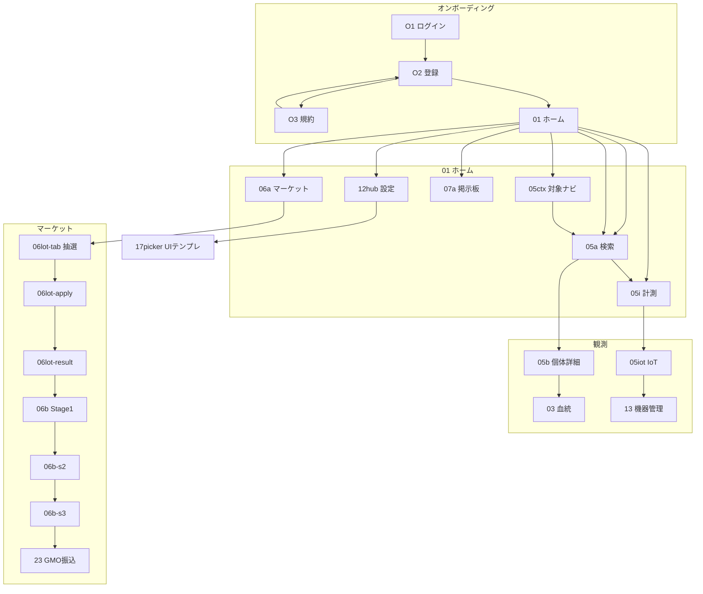

# W2 Transition Audit — ui-parts-lab (55 screens)

**Date:** 2026-07-03  
**Sources:** `02-設計/_ui-global/ux-walkthrough/walkthrough.js`, `screen-defs/*.json`, `packages/ihl-ui-catalog/src/components/features/**`

**Wiring model:** `ScreenRenderer` resolves `onAction("hotspot.N")` → `screen-def.transitions[].to_screen_id`. Same-screen transitions are skipped (`go()`). Observation/home largely migrated to `hot()` + `ObsDeepNav` (2026-07-03).

**Remediation status:** P0+P1+main fix pass complete — **~28 screens** newly wired, **27** already matched. Build PASS.

---

## 1. Graph metrics

| Metric | Value |
|--------|------:|
| Screens (nodes) | 55 |
| Hotspot edges (out-degree sum) | 156 |
| Self-loop edges | 26 |
| External edges | 130 |
| screen-def transitions | 154 |
| Cyclomatic-style (E − V + 2) | **103** (all) / **77** (external only) |

**Top complexity hubs (Cx = out + in):**

| walkId | Title | out | in | Cx |
|--------|-------|----:|---:|---:|
| **01** | ホーム | 14 | 6 | **20** |
| **05ctx** | 対象ナビ | 13 | 4 | **17** |
| **06a** | マーケット一覧 | 6 | 8 | **14** |
| **05i** | 計測入力 | 6 | 6 | 12 |
| **07a** | 掲示板ハブ | 5 | 5 | 10 |

`05ctx` has 10 self-loops (local tab/tree UI state) — inflates out-degree without adding navigation depth.

---

## 2. Simplified transition map (Mermaid)



---

## 3. Broken transitions (fixed / remaining)

### P0 — fixed in components

| Screen | hotspot | Target | Fix |
|--------|---------|--------|-----|
| **12hub** | 2 | `17picker` | UI テンプレ選択カード追加 |
| **05a** | 4 | `01` | ホーム ghost ボタン |
| **18photo** | 2 | `16` | UI Builder リンク |
| **06b-s3** | 0 | self | 評価を確定ボタン |

### P1 — fixed 2026-07-03 ([P1 navigation wiring fixes](f60b703d-a898-431f-98e0-8b09a6c4cb36))

| Issue | Status |
|-------|--------|
| 観測 `hot()` 移行 (05td, 05fork, 05iot 等) | ✅ |
| 深葉ホーム導線 (10, 19board, 20vote, マーケット10画面) | ✅ |
| ハブ shortcut (06a, 07a 各2チップ) | ✅ |
| **06b** hotspot 衝突 | ✅ `SCREEN_TRANSITION_OVERRIDES` + `part-0.hotspot.0` |
| **07o** 新規投稿ラベル | ✅ hotspot.1 自己ループ / ハブ=hotspot.0 |

### P1b — [Fix missing navigation buttons](19451126-6014-4f86-8a7a-f6fba2bf1ce8)

| Scope | Status |
|-------|--------|
| 観測11画面 `hot()` + `ObsDeepNav` | ✅ |
| 血統・論文6画面 | ✅ |
| 01/06a/07a ハブショートカット | ✅ |
| マーケット深層ホーム導線 | ✅ |
| `ScreenRenderer` 自己ループ抑止 | ✅ |

### P1c — lineage per-organism (2026-07-03)

| Change | Detail |
|--------|--------|
| **Entry path** | 血統は個体特定後 — **05b → 03** が正本導線。ホーム左ナビ「血統」は削除済み。**検索**（05a）で個体 browse |
| **03 metric drilldown** | 3 率カード「詳細 →」→ **03m**（`?metric=mortality\|completion\|eclosion_failure`）— 単一 `LineageMortalityPanel` |
| **03m back** | 「← Crossへ」→ **03** |
| **Bugfix** | `LineageCrossPanel` 未定義変数 `i` で hotspot 未発火 |

---

| Issue | Screens | Remediation |
|-------|---------|-------------|
| `onNavigate` bypasses screen-def | **01** (shortcut 3件), **16** | Add hotspot indices for 13/18photo/23; node-scope Builder |
| hotspot index collision | **16** | Node-scoped transitions in screen-def |
| Self-loops UI-only | **05ctx** (×10) | Local state OK; walkthrough overlay only |
| Orphan stub | **06soc** | `stubOnly` — not in main graph |
| 抽選5ホップ | 06lot-* | Collapse to tab state on `06a` |

---

## 4. 3-click rule violations

| Goal | Shortest path | Clicks | Proposal |
|------|--------------|-------:|----------|
| 抽選当選 → 取引 | `01→06a→06lot-tab→06lot-apply→06lot-result→06b` | **5** | Tab state on `06a` |
| GMO振込 | `…→06b-s3→23` | **≥4** | Inline transfer on Stage 3 |
| 設定 → UIテンプレ | `01→12hub→17picker` | 2 | **Fixed** (hop 2 wired) |
| IoT → 機器管理 | `01→05i→05iot→13` | 3 | At limit — OK |

---

## 5. Simplification roadmap

1. **Persistent hub nav** on observation/market leaves (`ObsDeepNav` pattern).
2. **Collapse market lottery walkIds** into tab state on `06a`.
3. **Trade stages** (`06b` / `06b-s2` / `06b-s3`) → single screen with internal stepper.
4. **Global chrome**: ホーム + プロフィール on all deep screens.
5. **Screen-def parity**: retire direct `onNavigate` in feature components.

---

## 6. Architecture note

`ScreenRenderer` matches bare `hotspot.N` without node scoping — multi-node screens (**16**, **06b**) need `${nodeId}.hotspot.N` in screen-defs or per-node transition tables.

```27:29:packages/ihl-ui-catalog/src/renderer/ScreenRenderer.tsx
 onAction: (action) => {
 const t = def.transitions?.find((tr) => tr.from === `${nodeId}.${action}` || tr.from === action);
 if (t) onNavigate?.(t.to_screen_id);
```
