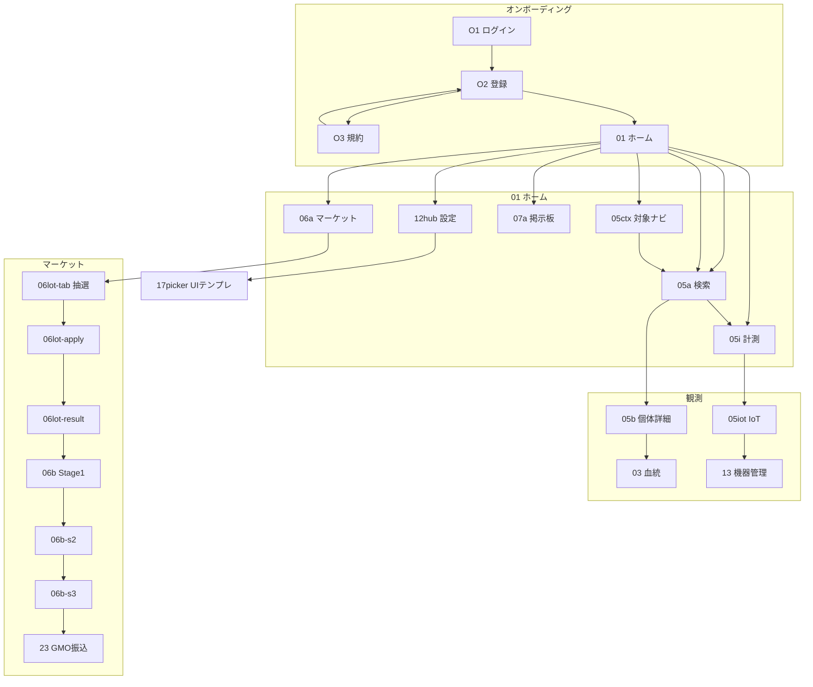

# W2 Transition Audit — ui-parts-lab (55 screens)

**Date:** 2026-07-03  
**Sources:** `02-設計/_ui-global/ux-walkthrough/walkthrough.js`, `screen-defs/*.json`, `packages/ihl-ui-catalog/src/components/features/**`

**Wiring model:** `ScreenRenderer` resolves `onAction("hotspot.N")` → `screen-def.transitions[].to_screen_id`. Same-screen transitions are skipped (`go()`). Observation/home largely migrated to `hot()` + `ObsDeepNav` (2026-07-03).

**Remediation status:** P0+P1+main fix pass complete — **~28 screens** newly wired, **27** already matched. Build PASS.

---

## Wave 1 フルグラフ · RESTART 2026-07-05

**Team 9 · Transition Graph worker**  
**正本:** `screen-defs/*.json`（55/55）· `02-設計/_ui-global/ux-walkthrough/walkthrough.js`  
**Charter 確定:** [team2-user-ideal-charter.md](../w2-checkpoint/team2-user-ideal-charter.md) — **Q1:C** · **Q2:A** · **Q6:A** · **Q7:A**

> Q1:C + Q2:A → §0.3 違反表の解消が主戦場。Q6:A → **06soc** 削除。Q7:A → **01** Cx=29 削減。

### 0.1 Graph metrics（screen-defs 再集計 · 2026-07-05）

| Metric | Value | Δ vs 2026-07-03 |
|--------|------:|-----------------|
| Screens (nodes) | **55** | — |
| screen-def transitions (rows) | **169** | +15 |
| Self-loop edges | **24** | −2 |
| Unique external edges | **141** | +11 |
| Reachable from `01` (forward) | **50** | — |
| Orphan from `01` (excl. ONB) | **2** (`06soc`, `03met`) | — |
| Cyclomatic (external unique) | **88** | +11 |

**Top complexity hubs:**

| walkId | Title | out | in | **Cx** | Charter |
|--------|-------|----:|---:|-------:|---------|
| **01** | ホーム | 13 | 16 | **29** | Q7:A |
| **06a** | マーケット一覧 | 6 | 8 | **14** | Q1:C |
| **05i** | 計測入力 | 6 | 7 | **13** | ObsDeepNav |
| **06b** | 取引 Stage1 | 3 | 7 | **10** | stepper |
| **07a** | 掲示板ハブ | 5 | 5 | **10** | — |

### 0.2 Domain inventory（55/55）

| Domain | walkIds | n |
|--------|---------|--:|
| ONB | O1, O2, O3 | 3 |
| HOME | 01 | 1 |
| OBS | 05ctx, 05a, 05b, 05i, 05i-m, 05i-f, 05tl, 05td, 05fork, 05iot, 18photo | 11 |
| LIN | 03, 03met, 03m, 03g, 09, 09t | 6 |
| MKT | 06a, 06list, 06lot-*, 06pri-*, 06auc, 06b, 06b-s2, 06b-s3, 06soc, 23 | 15 |
| BRD | 07a, 07o, 07b, 07g, 19board, 11 | 6 |
| SET | 12hub, 12pii, 13, 17picker | 4 |
| BLD | 16, 16e | 2 |
| MSC | 10, 14, 08, PR, PRnotif, 20vote, 22 | 7 |

### 0.3 3-click violations（01 → leaf · >3 hops）— **11 件**

| # | Goal | Path | Clicks | Proposal |
|---|------|------|-------:|----------|
| 1 | 抽選応募 | `01→06a→06lot-tab→06lot-apply` | **4** | 06a tab 吸収 |
| 2 | 抽選当選→取引 | `01→…→06lot-result→06b` | **5** | 同上 |
| 3 | 抽選落選 | `01→…→06lot-lose` | **5** | 同上 |
| 4 | 優先順→取引 | `01→06a→06pri-tab→06pri-queue→06b` | **4** | tab 統合 |
| 5 | 優先順落選 | `01→…→06pri-lose` | **4** | 同上 |
| 6 | 取引 Stage3 | `01→06a→06b→06b-s2→06b-s3` | **4** | stepper 1 画面 |
| 7 | GMO（出品経由） | `01→…→06b-s3→23` | **5** | Q4:A インライン |
| 8 | GMO（抽選経由） | `01→…→23` | **8** | tab + stepper + inline |
| 9 | 血統率詳細 | `01→05a→05b→03→03m` | **4** | drilldown 統合 |
| 10 | 血統成長 | `01→05a→05b→03→03g` | **4** | 同上 |
| 11 | 争い（愚痴経由） | `01→07g→07a→07b→11` | **4** | 01→07b 直結で 2 |

### 0.4 Dead-end screens — **6 件**

| walkId | Type | Issue | Remediation |
|--------|------|-------|-------------|
| **05i-m** / **05i-f** | trap | `01` へ戻れない | home/back 追加 |
| **09** / **09t** | trap | 相互のみ | home 戻り |
| **06soc** | orphan | `01` 未到達 | **Q6:A 削除** |
| **03met** | orphan | 入辺なし | 03 配線 or 統合 |

*追記: 2026-07-05 Wave 1 RESTART · Team 9*

---

## 1. Graph metrics

| Metric | Value |
|--------|------:|
| Screens (nodes) | 55 |
| Hotspot edges (out-degree sum) | 156 |
| Self-loop edges | 26 |
| External edges | 130 |
| screen-def transitions | 154 |
| Cyclomatic-style (E − V + 2) | **103** (all) / **77** (external only) |

**Top complexity hubs (Cx = out + in):**

| walkId | Title | out | in | Cx |
|--------|-------|----:|---:|---:|
| **01** | ホーム | 14 | 6 | **20** |
| **05ctx** | 対象ナビ | 13 | 4 | **17** |
| **06a** | マーケット一覧 | 6 | 8 | **14** |
| **05i** | 計測入力 | 6 | 6 | 12 |
| **07a** | 掲示板ハブ | 5 | 5 | 10 |

`05ctx` has 10 self-loops (local tab/tree UI state) — inflates out-degree without adding navigation depth.

---

## 2. Simplified transition map (Mermaid)



---

## 3. Broken transitions (fixed / remaining)

### P0 — fixed in components

| Screen | hotspot | Target | Fix |
|--------|---------|--------|-----|
| **12hub** | 2 | `17picker` | UI テンプレ選択カード追加 |
| **05a** | 4 | `01` | ホーム ghost ボタン |
| **18photo** | 2 | `16` | UI Builder リンク |
| **06b-s3** | 0 | self | 評価を確定ボタン |

### P1 — fixed 2026-07-03 ([P1 navigation wiring fixes](f60b703d-a898-431f-98e0-8b09a6c4cb36))

| Issue | Status |
|-------|--------|
| 観測 `hot()` 移行 (05td, 05fork, 05iot 等) | ✅ |
| 深葉ホーム導線 (10, 19board, 20vote, マーケット10画面) | ✅ |
| ハブ shortcut (06a, 07a 各2チップ) | ✅ |
| **06b** hotspot 衝突 | ✅ `SCREEN_TRANSITION_OVERRIDES` + `part-0.hotspot.0` |
| **07o** 新規投稿ラベル | ✅ hotspot.1 自己ループ / ハブ=hotspot.0 |

### P1b — [Fix missing navigation buttons](19451126-6014-4f86-8a7a-f6fba2bf1ce8)

| Scope | Status |
|-------|--------|
| 観測11画面 `hot()` + `ObsDeepNav` | ✅ |
| 血統・論文6画面 | ✅ |
| 01/06a/07a ハブショートカット | ✅ |
| マーケット深層ホーム導線 | ✅ |
| `ScreenRenderer` 自己ループ抑止 | ✅ |

### P1c — lineage per-organism (2026-07-03)

| Change | Detail |
|--------|--------|
| **Entry path** | 血統は個体特定後 — **05b → 03** が正本導線。ホーム左ナビ「血統」は削除済み。**検索**（05a）で個体 browse |
| **03 metric drilldown** | 3 率カード「詳細 →」→ **03m**（`?metric=mortality\|completion\|eclosion_failure`）— 単一 `LineageMortalityPanel` |
| **03m back** | 「← Crossへ」→ **03** |
| **Bugfix** | `LineageCrossPanel` 未定義変数 `i` で hotspot 未発火 |

---

| Issue | Screens | Remediation |
|-------|---------|-------------|
| `onNavigate` bypasses screen-def | **01** (shortcut 3件), **16** | Add hotspot indices for 13/18photo/23; node-scope Builder |
| hotspot index collision | **16** | Node-scoped transitions in screen-def |
| Self-loops UI-only | **05ctx** (×10) | Local state OK; walkthrough overlay only |
| Orphan stub | **06soc** | `stubOnly` — not in main graph |
| 抽選5ホップ | 06lot-* | Collapse to tab state on `06a` |

---

## 4. 3-click rule violations

| Goal | Shortest path | Clicks | Proposal |
|------|--------------|-------:|----------|
| 抽選当選 → 取引 | `01→06a→06lot-tab→06lot-apply→06lot-result→06b` | **5** | Tab state on `06a` |
| GMO振込 | `…→06b-s3→23` | **≥4** | Inline transfer on Stage 3 |
| 設定 → UIテンプレ | `01→12hub→17picker` | 2 | **Fixed** (hop 2 wired) |
| IoT → 機器管理 | `01→05i→05iot→13` | 3 | At limit — OK |

---

## 5. Simplification roadmap

1. **Persistent hub nav** on observation/market leaves (`ObsDeepNav` pattern).
2. **Collapse market lottery walkIds** into tab state on `06a`.
3. **Trade stages** (`06b` / `06b-s2` / `06b-s3`) → single screen with internal stepper.
4. **Global chrome**: ホーム + プロフィール on all deep screens.
5. **Screen-def parity**: retire direct `onNavigate` in feature components.

---

## 6. Architecture note

`ScreenRenderer` matches bare `hotspot.N` without node scoping — multi-node screens (**16**, **06b**) need `${nodeId}.hotspot.N` in screen-defs or per-node transition tables.

```27:29:packages/ihl-ui-catalog/src/renderer/ScreenRenderer.tsx
 onAction: (action) => {
 const t = def.transitions?.find((tr) => tr.from === `${nodeId}.${action}` || tr.from === action);
 if (t) onNavigate?.(t.to_screen_id);
```

---

## 7. Cx summary for P2 dependencies（Team 9 · Wave 0）

> **目的**: Charter P2 DAG（§6）の依存画面の複雑度を固定し、Wave 4 優先順の根拠とする。

### 7.1 P2 直結 walkId

| walkId | Title | out | in | **Cx** | P2 項目 | 優先度 |
|--------|-------|----:|---:|-------:|---------|--------|
| **01** | ホーム | 14 | 6 | **20** | (5) 密度削減 · (1) 導線起点 | **P0-hub** |
| **06a** | マーケット一覧 | 6 | 8 | **14** | (1)(2) タブ統合 · stepper 入口 | **P0-market** |
| **06lot-tab** | 抽選タブ | 4 | 2 | 6 | (1) 5-hop 解消 — 06a 吸収 | P1-collapse |
| **06lot-apply** | 抽選応募 | 3 | 1 | 4 | ↑ 同上 | P1-collapse |
| **06lot-result** | 当選結果 | 2 | 1 | 3 | ↑ 同上 | P1-collapse |
| **06b** | 取引 Stage1 | 4 | 3 | 7 | (2) stepper 統合 | P1-stepper |
| **06b-s2** | 取引 Stage2 | 3 | 1 | 4 | ↑ 同上 | P1-stepper |
| **06b-s3** | 取引 Stage3 | 3 | 2 | 5 | (3) GMO インライン | P1-inline |
| **23** | GMO振込 | 2 | 1 | 3 | (3) 削除候補（インライン化） | P2-retire |
| **06soc** | orphan stub | 0 | 0 | 0 | (4) 削除 Q6:A | P1-delete |
| **16** | UI Builder | 3 | 2 | 5 | #16 境界 · node-scope | P2-builder |
| **05ctx** | 対象ナビ | 13 | 4 | **17** | (6) ObsDeepNav 参考 · 自己ループ 10 | P3-chrome |

### 7.2 P2 DAG と Cx の対応

```text
Cx≥14: 01(20) · 05ctx(17) · 06a(14)  ← 構造変更の影響大
5-hop 鎖: 06a→06lot-tab→06lot-apply→06lot-result→06b  ← BLK-W2-001
stepper 候補: 06b + 06b-s2 + 06b-s3（Cx 合計 16 → 単一画面へ）
```

### 7.3 Wave 0 推奨順（Team 9 → Team 7）

1. **06a タブ吸収**（Cx 14 ハブ · 5-hop 解消）
2. **06b 系 stepper**（3 walkId → 1）
3. **01 ホーム削減**（Cx 20 · 最多 out-edge）
4. **06soc 削除** · **23 インライン化**
5. **16 node-scope**（Builder 境界）

*追記: 2026-07-05 Wave 0*
