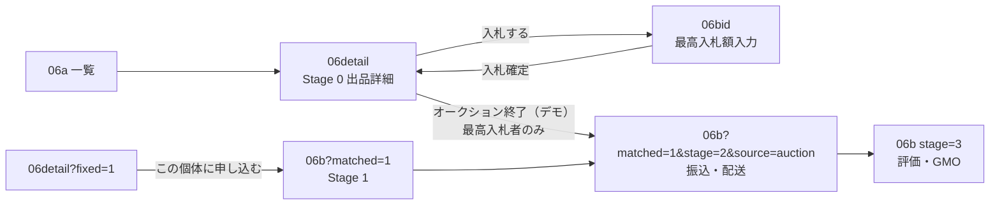

# 06 マーケット — オークション入札フロー v1

> **日付**: 2026-07-06  
> **スコープ**: `apps/ui-parts-lab-w2` のみ（本番 API 未実装）  
> **lab 実装**: `MarketBidEntryW2` · `auction-bid-mock.ts` · `MarketListingDetailW2` · `MarketDetailBoardW2`

---

## フロー概要

オークション出品は **Stage 0（公開詳細）→ 入札入力 → Stage 2（振込・配送）** へ直行する。  
落札＝マッチング成立のため **Stage 1 プライベートボードはスキップ**（抽選・固定価格は従来どおり Stage 1 あり）。



---

## walkId 一覧

| walkId | 画面 | 主 CTA | 備考 |
|--------|------|--------|------|
| `06detail` | 出品詳細（Stage 0） | **入札する**（オークション） | デフォルト = オークション |
| `06detail?fixed=1` | 固定価格詳細 | この個体に申し込む | Stage 1 経由 |
| `06bid` | 入札入力 | この金額で入札する | 自動入札 UI |
| `06b?matched=1&source=auction` | 取引 | — | **stage 省略時 → stage=2 へ自動 redirect** |
| `06b?matched=1&stage=2&source=auction` | 振込・配送 | 振込確認 / 配達到着 | Stage 1 UI 非表示 |
| `06b?matched=1` | Stage 1 | 振込・配送へ進む | 抽選・固定価格用 |

---

## 入札単位（Yahoo 風）

| 現在価格 | 入札単位 |
|----------|----------|
| ¥1,000 未満 | ¥10 |
| ¥1,000 以上 ¥5,000 未満 | ¥100 |
| ¥5,000 以上 ¥10,000 未満 | ¥250 |
| ¥10,000 以上 | ¥500 |

**最低入札額**

- 入札者なし: 現在価格（開始価格）
- 入札者あり: 現在価格 + 入札単位

検証: 入力額 ≥ 最低入札額、かつ（最低を超える分は）入札単位の倍数。

---

## 自動入札 UI

- ラベル: **予算の最高額で入札**
- 入力: **最高入札額**（表示価格ではない）
- `<details>` で Yahoo 風の説明文（短縮 + 全文）
- lab mock: `sessionStorage` キー `ihl-w2-auction-mock`
- 入札後ステータス: **最高入札者** / **他者に上回られました**（06detail バナー）

---

## Stage 1 スキップ条件

| 条件 | 挙動 |
|------|------|
| `source=auction` + `matched=1` + `stage` なし | ScreenPage が `stage=2` へ replace redirect |
| `source=auction` + `stage=1` | MarketDetailBoardW2 が Stage 2 UI を表示 |
| 抽選当選 `06b?matched=1`（source なし） | Stage 1 従来どおり |

---

## テスト URL（dev server port **3101**）

```text
http://localhost:3101/s/06detail                         — オークション詳細 · CTA「入札する」
http://localhost:3101/s/06detail?auction=1               — 高額 mock（¥18,500 · 5件入札）
http://localhost:3101/s/06detail?fixed=1                 — 固定価格 · CTA「この個体に申し込む」
http://localhost:3101/s/06bid                            — 入札入力（自動入札）
http://localhost:3101/s/06b?matched=1&source=auction     — auto → stage=2
http://localhost:3101/s/06b?matched=1&stage=2&source=auction — 振込・配送
http://localhost:3101/s/06b?matched=1                    — 抽選/固定 Stage 1（比較用）
```

### デモ手順

1. `/s/06detail` → **入札する** → `/s/06bid`
2. 最高入札額（例: `12500`）入力 → **この金額で入札する**
3. `/s/06detail?bid=submitted` — 最高入札者バナー確認
4. **オークション終了（デモ）** → `/s/06b?matched=1&stage=2&source=auction`
5. （任意）**デモ: 他者が上回る** で outbid 状態を確認

---

## 実装ファイル

| ファイル | 役割 |
|----------|------|
| `src/w2/MarketBidEntryW2.tsx` | walkId `06bid` UI |
| `src/w2/auction-bid-mock.ts` | 入札単位 · sessionStorage mock |
| `src/w2/MarketListingDetailW2.tsx` | CTA 分岐 · 落札デモ |
| `src/w2/MarketDetailBoardW2.tsx` | auction Stage 1 スキップ |
| `src/pages/ScreenPage.tsx` | `source=auction` auto redirect |
| `scripts/w2-generate.mjs` | `06bid` ScreenDef patch |

---

*v1 · lab-only · 設計正本化前の W2 oracle*
