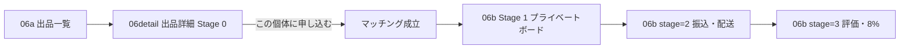

# 06 マーケット — FLOW GAP v1

> **日付**: 2026-07-06  
> **トリガー**: ユーザー feedback — `/s/06a` カードクリックが `/s/06b` 直行（誤り）  
> **Oracle**: [`W2-DESIGN-DOC-PROCESSING-v1.md`](./W2-DESIGN-DOC-PROCESSING-v1.md) · REQ §11.0 · FR-MKT-05

---

## 1. 正しいフロー（REQ 確定）



| 段階 | walkId | 内容 | REQ 根拠 |
|------|--------|------|----------|
| **Stage 0** | `06detail` | 個体 spec · 出品者 · **公開 Q&A** · **称賛（ほめ）ボード** · 主CTA「申し込む」 | §11.0 Stage 0 · FR-MKT-05 |
| **Stage 1+** | `06b` | **マッチング後のみ** プライベートボード（当事者2人）· ステッパ | §11.0 Stage 1 · 遷移設計 §4 |

**禁止**: Stage 0 画面にプライベートボードを表示すること（mock §2.3 は詳細+ボードを **1 PNG に合成** しているが、REQ §11.0 で **段階分離が確定**）。

---

## 2. REQ § 引用（Q&A · 称賛）

| ID | 原文 |
|----|------|
| **FR-MKT-05** | `subject_key` 単位で **Q&A（質問即公開・回答済みフラグ）**、**称賛**、未出品オファー、ラブレター募集 API |
| **§2 Engagement** | **Engagement**（`/market/social`）: **公開 Q&A、称賛**、未出品個体へのオファー、ラブレター募集 |
| **§11.0 Stage 0** | **マッチング前** — 出品・オークション・テンプレ · **公開 Q&A**（Y09 指摘 1） |
| **§11.0 Stage 1** | **マッチング後** — **プライベートボード**（第三者非公開）— 振込・発送調整 |
| **遷移設計 §4** | Stage 0: 公開 · **公開 Q&A** · Stage 1: **プライベートボード（当事者2人）** |

---

## 3. 調査結果 — mock / walkthrough / lab

### 3.1 Mock PNG

| ファイル | 用途 | 出品詳細のみ mock |
|----------|------|-------------------|
| `ihl-06-market-browse.png` | 一覧 | — |
| `ihl-06-market-detail-board.png` | **詳細 + プライベートボード合成** | **別 PNG なし** — lab は左カラム相当を `06detail`、右を `06b` に分離 |
| `ihl-06-market-detail-board-stage2/3.png` | 取引 Stage 2/3 | — |

### 3.2 walkthrough.js（修正前）

| walkId | 問題 |
|--------|------|
| `06a` hotspot | カード → **`06b` 直行**（誤） |
| `06b` | タイトル「出品詳細 + プライベートボード」— Stage 0/1 混在 |
| `06soc` | **retired** — 3101 excluded · 通知は `PRnotif` |
| `06detail` | **存在しない** |

### 3.3 lab 実装（修正前）

| 箇所 | 問題 |
|------|------|
| `MarketBrowseW2` ListingCard onClick | `onNavigate("06b")` |
| `MarketDetailBoardW2` stage 1 | 個体詳細 + プライベートボード **同時表示** |
| `MarketDetailBoardW2` PrimaryAction stage 1 | 「申し込む」が 06b 上 — **06detail に属すべき** |
| Engagement UI | Q&A · 称賛ボード **未実装** |

---

## 4. 修正方針（v1 fix）

| # | 対応 |
|---|------|
| F1 | 新 walkId **`06detail`** — `MarketListingDetailW2.tsx` |
| F2 | `06a` カード → `06detail` |
| F3 | `06detail` 主CTA → `06b?matched=1` |
| F4 | `06b` — `matched=1` 以外はゲート · プライベートボードのみ |
| F5 | walkthrough · screen-defs · generate-data 同期 |

---

## 5. テスト URL（修正後）

```text
/s/06a                    — 一覧 · カード → 06detail
/s/06detail               — 出品詳細 · Q&A · ほめ · 申し込む
/s/06detail?guest=1       — 未ログインゲート
/s/06b?matched=1          — Stage 1 プライベートボード
/s/06b                    — マッチング前ゲート（06detail へ誘導）
/s/06b?matched=1&stage=2  — Stage 2
/s/06a?tab=lottery&lotteryStep=result — 当選 → 06b?matched=1
```

---

## 6. user direction 追記（v5 · 統一シェル · 2026-07-06）

**Core architecture（ユーザー指示）**:

- `/s/06detail` は **`/s/05b`（観測個体詳細）ベース** + **公開 Q&A** + **ほめボード**
- 1 シェル · **入力データのみ差し替え**:
  - `06a?tab=lottery&lotteryStep=apply` → `mode=lottery`（抽選状況）
  - `06a?tab=priority&priorityStep=queue` → `mode=priority`（順位4位 · 上位3+あなた）
  - `06detail` → `mode=listing`（現在の金額 + 入札履歴）
  - オークションカード → `06detail`（listing データ）

**実装**: `apps/ui-parts-lab-w2/src/w2/MarketEntityDetailShellW2.tsx`

| 05b 由来 | シェル |
|----------|--------|
| `obs-detail-layout` | 2 カラム骨格 |
| `obs-detail-photo` | 左カラム写真 |
| `obs-measure-row` | spec 表 |

**テスト URL（3101）**:

```text
/s/06detail
/s/06a?tab=lottery&lotteryStep=apply
/s/06a?tab=priority&priorityStep=queue
```

---

*v1 · 2026-07-06 · user feedback 反映 · v5 shell 追記*
