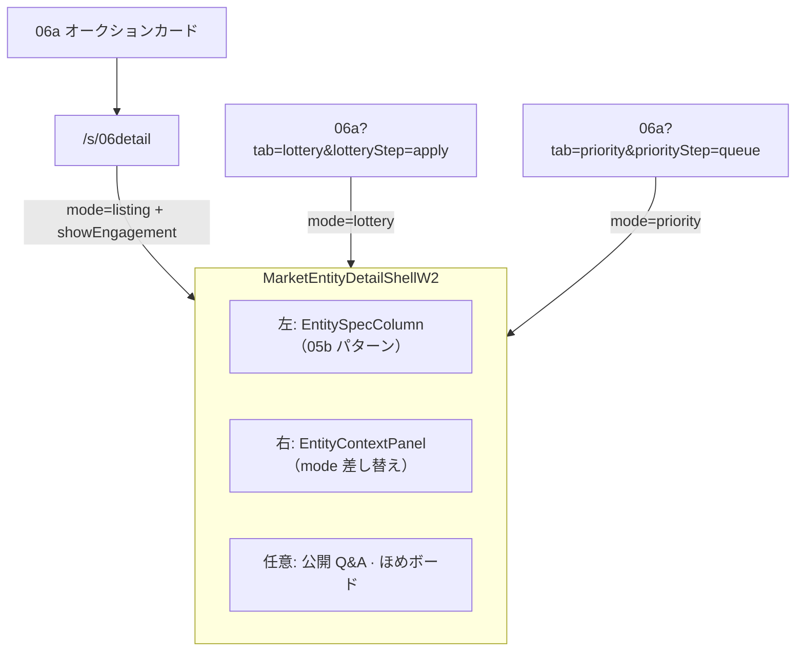

# 06 マーケット — LAB Design Note v5

> **日付**: 2026-07-06  
> **前版**: [`06-マーケット-LAB-DESIGN-NOTE-v4.md`](./06-マーケット-LAB-DESIGN-NOTE-v4.md)  
> **gap**: [`06-マーケット-FLOW-GAP-v1.md`](./06-マーケット-FLOW-GAP-v1.md)  
> **Oracle**: [`W2-DESIGN-DOC-PROCESSING-v1.md`](./W2-DESIGN-DOC-PROCESSING-v1.md)

---

## v4 → v5 oracle 変更（統一エンティティ詳細シェル）

| 項目 | v4 | **v5（user direction · 05b ベース）** |
|------|-----|----------------------------------------|
| 06detail レイアウト | `ihl-mkt-detail` 独自 2 カラム | **`MarketEntityDetailShellW2`** — 05b `obs-detail-layout` 再利用 |
| 抽選 apply / 優先 queue | `MarketBrowseW2` インライン重複 | **同一シェル** · `mode=lottery` / `mode=priority` |
| 05b 参照 | catalog mock のみ | **`ihl-05-obs-detail-similar`** の photo · spec · measure-row パターンを左カラムに移植 |
| 文脈パネル | 画面ごとに JSX 重複 | **data-driven** — `listing` / `lottery` / `priority` |
| Engagement | 06detail のみ | **06detail のみ**（`showEngagement`）— 抽選/優先は文脈パネルのみ |

---

## 統一シェルアーキテクチャ



### コンポーネント

| ファイル | 役割 |
|----------|------|
| `MarketEntityDetailShellW2.tsx` | 統一シェル · spec 列 · 文脈パネル · Engagement |
| `MarketListingDetailW2.tsx` | walkId `06detail` — shell + PrimaryAction |
| `MarketBrowseW2.tsx` | 抽選 apply · 優先 queue — 同一 shell を embed |

### 05b から再利用する要素

| 05b（catalog） | シェルでの利用 |
|----------------|----------------|
| `obs-detail-layout` | 2 カラム grid |
| `obs-detail-photo` | 標本写真プレースホルダ |
| `obs-card` + `obs-measure-row` | spec 表（体長 · 角長 · 系統） |
| `obs-shooting-meta` | 撮影条件（06detail のみ） |

> 05b walkId は **catalog-only**（`ihl-05-obs-detail-similar` · W2 専用 override なし）。lab は CSS/構造パターンを **MarketEntityDetailShellW2** に抽出。

---

## データモード（context）

| mode | 画面 | 文脈パネル内容 | 主 CTA |
|------|------|----------------|--------|
| `listing` | `/s/06detail` | **現在の価格** · **入札履歴**（件数 + 展開リスト）· **終了予定** | この個体に申し込む → `06b?matched=1` |
| `lottery` | `06a?tab=lottery&lotteryStep=apply` | 抽選状況 · 応募者数 · 締切 | 応募する |
| `priority` | `06a?tab=priority&priorityStep=queue` | 順位 · 上位3 + あなた | 申し込む → `06detail` |

---

## UI 要素 → 設計 § 対照（v5 追記）

| UI 要素 | 設計 § | MUST | v5 実装 |
|---------|--------|------|---------|
| 個体 spec（05b 同等） | §2.3 #4 · 05b mock | MUST | `EntitySpecColumn` |
| 文脈パネル差し替え | user direction | MUST | `EntityContextPanel` |
| **listing 価格ブロック** | user direction · Yahoo 参照 | MUST | `ListingContextPanel` — 現在の価格（金 `#C9A227`）· 入札履歴 · 終了予定 |
| 公開 Q&A · ほめ | FR-MKT-05 | MUST | `showEngagement` on 06detail only |
| 抽選/優先の重複排除 | lab 品質 | SHOULD | 同一 shell |

---

## テスト導線（v5）

```text
/s/06detail                                    — listing + Q&A + ほめ
/s/06detail?guest=1                            — ログインゲート
/s/06detail?auction=1                        — listing · 高額オークション mock（5件入札）
/s/06a                                         — オークションカード → 06detail
/s/06a?tab=lottery&lotteryStep=list          — 抽選一覧
/s/06a?tab=lottery&lotteryStep=apply         — 統一シェル mode=lottery
/s/06a?tab=priority&priorityStep=list        — 優先一覧
/s/06a?tab=priority&priorityStep=queue       — 統一シェル mode=priority（順位4位）
/s/06b?matched=1                               — Stage 1
```

> lab dev server: **port 3101**（`vite.config.ts` · user 指定 3001 ではなく 3101 が正）

---

## v5 追記 — listing 価格ブロック（2026-07-06）

**変更**: `ListingContextPanel` を Yahoo オークション入札画面を参照し IHL ダークテーマで再設計。

| ブロック | 内容 | スタイル |
|----------|------|----------|
| 現在の価格 | mock `¥12,000` | ラベル muted · 金額 `#C9A227` 1.75rem |
| 入札履歴 | 🔨 + `3件` リンク展開 · user/amount/time リスト | 展開パネル `#121212` |
| 終了予定 | 🕐 + `7月11日（土）2時19分 終了予定` | 区切り線付き meta 行 |

**削除**: 「固定価格 · 即時申込可」を主情報とする `priceNote` パターン。固定価格は将来 `fixedPriceLabel`（即決価格）のみ補助表示。

**CSS**: `apps/ui-parts-lab-w2/src/index.css` — `.ihl-mkt-price-block*` · `.ihl-mkt-bid-history*`

---

*v5 · 統一シェル · 05b レイアウト移植 · listing 価格ブロック oracle 追記 2026-07-06*
