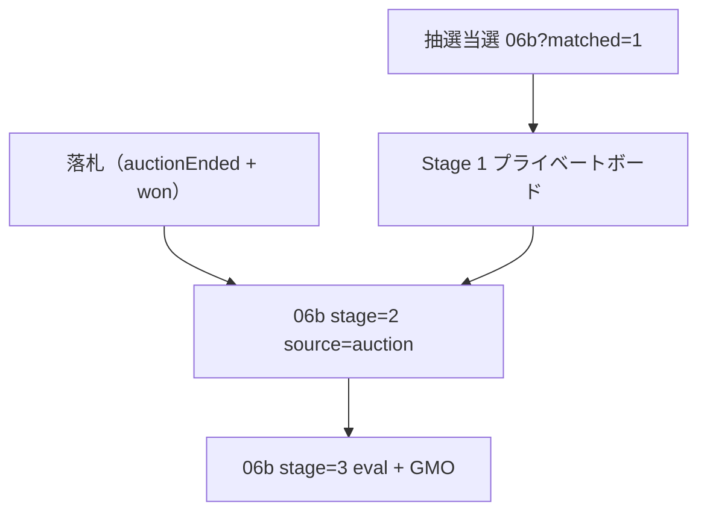

# 06 マーケット — LAB Design Note v6

> **日付**: 2026-07-06  
> **前版**: [`06-マーケット-LAB-DESIGN-NOTE-v5.md`](./06-マーケット-LAB-DESIGN-NOTE-v5.md)  
> **フロー正本**: [`06-マーケット-AUCTION-FLOW-v1.md`](./06-マーケット-AUCTION-FLOW-v1.md)

---

## v5 → v6 oracle 変更（オークション入札フロー）

| 項目 | v5 | **v6** |
|------|-----|--------|
| 06detail CTA（オークション） | この個体に申し込む → `06b?matched=1` | **入札する** → `06bid` |
| 入札画面 | なし（06auc stub → 06a タブ redirect） | **walkId `06bid`** · `MarketBidEntryW2` |
| 入札方式 | — | **自動入札（最高入札額）** · Yahoo 入札単位 |
| 落札後 | Stage 1 プライベートボード | **`source=auction` で Stage 2 直行** |
| Stage 1 | 全 matched 共通 | **オークションのみスキップ** · 抽選/固定は維持 |
| mock 状態 | なし | `sessionStorage` · 最高/ outbid · 終了デモ |

---

## 新規 walkId

| walkId | component | 備考 |
|--------|-----------|------|
| `06bid` | `ihl-06-market-auction-bid__*` → W2 override | route `/market/auction/:id/bid` |

---

## CTA マトリクス（06detail）

| 条件 | CTA | 遷移先 |
|------|-----|--------|
| デフォルト（オークション） | 入札する | `06bid` |
| `?fixed=1` | この個体に申し込む | `06b?matched=1`（Stage 1） |
| `?guest=1` | （非表示） | ログインゲート |

---

## 入札単位 · 検証（lab 実装済）

`auction-bid-mock.ts` — 設計 doc 未記載分を lab が oracle 化。

| 現在価格帯 | 単位 |
|------------|------|
| < ¥1,000 | ¥10 |
| ¥1,000 – ¥4,999 | ¥100 |
| ¥5,000 – ¥9,999 | ¥250 |
| ≥ ¥10,000 | ¥500 |

---

## Stage スキップ（auction のみ）



ScreenPage: `matched=1&source=auction` で `stage` 省略 → **`stage=2` replace**  
MarketDetailBoardW2: `effectiveStage()` が auction + stage=1 を 2 に昇格

---

## テスト導線（v6）

```text
/s/06detail                    — 入札する → 06bid
/s/06bid                       — 最高入札額 · 自動入札 help
/s/06detail?bid=submitted      — 入札後バナー
/s/06b?matched=1&source=auction — Stage 2 直行（redirect 確認）
/s/06detail?fixed=1            — 固定価格 · Stage 1 経路（回帰）
/s/06b?matched=1               — 抽選 Stage 1（回帰）
```

> dev server: **http://localhost:3101**（`vite.config.ts` strictPort）

---

## 設計 doc 追随 TODO（本番前）

- [ ] `02-設計/features/06-マーケット/遷移設計-v1.md` — 06bid 追加 · Stage 1 スキップ条件
- [ ] `FR-MKT-*` — 自動入札 · 入札単位 NFR
- [ ] E2E — オークション落札 → Stage 2 直行シナリオ

---

## v6 追記 — プラチナコイン優先タブ（2026-07-06）

**参照**: オークションタブ list shell（検索 · 好み新着順 · `ListingCard` grid）  
**REQ**: FR-MKT-15 · 取引方式-v1 §3.7 · §8 tie-break

| 画面 | URL | 主 CTA | 文脈パネル |
|------|-----|--------|------------|
| 優先一覧 | `/s/06a?tab=priority&priorityStep=list` | カード → `06detail?mode=priority` | — |
| 優先 queue | `/s/06a?tab=priority&priorityStep=queue` | **申し込む** → `06detail?mode=priority` | 順位 · 上位3+あなた · 累計 PT |
| 優先 detail | `/s/06detail?mode=priority` | **申し込む** → `06b?matched=1` | 同上 + 公開 Q&A · ほめ |

**禁止（priority モード）**: 現在価格 · 入札履歴 · 終了予定 · 「固定価格」表記 · CTA「入札する」「応募する」

**ルール UI コピー**:
- 最低申込: **1 PT 枚ずつ**（`+1 PT` mock）
- 同点: **申込が早い順**（`created_at` 昇順 · FR-MKT-15）

**実装**: `priority-mock.ts` · `MarketBrowseW2` `PriorityTabBody` · `MarketEntityDetailShellW2` `PriorityContextPanel` · `MarketListingDetailW2` `mode=priority`

```text
/s/06a?tab=priority&priorityStep=list
/s/06a?tab=priority&priorityStep=queue
/s/06detail?mode=priority
/s/06a?tab=priority&priorityStep=lose
```

---

## v6 追記 — 抽選タブ（2026-07-06）

**参照**: オークション / 優先タブ list shell（検索 · 好み新着順 · `ListingCard` grid）

| 画面 | URL | 主 CTA | 文脈パネル |
|------|-----|--------|------------|
| 抽選一覧 | `/s/06a?tab=lottery&lotteryStep=list` | カード → `06detail?mode=lottery` | — |
| 抽選 apply | `/s/06a?tab=lottery&lotteryStep=apply` | **応募する** → `lotteryStep=result` | 抽選状況 · 応募者数 · 締切 |
| 抽選 detail | `/s/06detail?mode=lottery` | **応募する** → `lotteryStep=result` | 同上 |
| 当選 | `/s/06a?tab=lottery&lotteryStep=result` | プライベートボード → `06b?matched=1` | — |

**禁止（lottery モード）**: 現在価格 · 入札履歴 · 終了予定 · 「固定価格」表記 · CTA「入札する」「申し込む」

**カード副行**: `応募 N名 · 締切 残りX`（`lottery-mock.ts` · `lotteryCardMeta`）

**当選後**: `06b?matched=1` — **Stage 1 維持**（`source=auction` とは別）

**実装**: `lottery-mock.ts` · `MarketBrowseW2` `LotteryTabBody` · `MarketEntityDetailShellW2` `LotteryContextPanel` · `MarketListingDetailW2` `mode=lottery`

```text
/s/06a?tab=lottery&lotteryStep=list
/s/06detail?mode=lottery
/s/06a?tab=lottery&lotteryStep=apply
/s/06a?tab=lottery&lotteryStep=result
/s/06a?tab=lottery&lotteryStep=lose
/s/06b?matched=1
```

---

*v6 · オークション入札フロー oracle · priority + lottery tab rebuild 2026-07-06 · build PASS*
