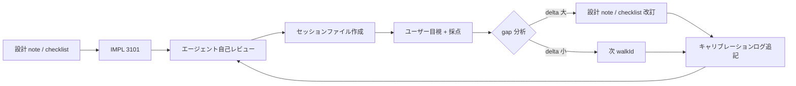

# W2 LAB — レビュー採点システム v1

> **日付**: 2026-07-05  
> **スコープ**: port **3101** · `apps/ui-parts-lab-w2`  
> **ステータス**: **運用開始** — 人間 oracle 採点待ち  
> **関連**: [`W2-LAB-REVIEW-TEMPLATE-v1.md`](./W2-LAB-REVIEW-TEMPLATE-v1.md) · [`W2-SCORE-CALIBRATION-LOG.md`](./W2-SCORE-CALIBRATION-LOG.md) · [`W2-DESIGN-DOC-PROCESSING-v1.md`](./W2-DESIGN-DOC-PROCESSING-v1.md) · [`.cursor/rules/ihl-w2-lab-review-scoring.mdc`](../../.cursor/rules/ihl-w2-lab-review-scoring.mdc) · [`.cursor/rules/ihl-w2-design-doc-oracle.mdc`](../../.cursor/rules/ihl-w2-design-doc-oracle.mdc)

---

## 1. 目的

3101 lab の **設計→実装→自己レビュー→ユーザー採点→ギャップ分析→設計改訂** を、画面・機能ごとに繰り返し、エージェント自己採点の精度を **キャリブレーション** する。

| 解決する問題 | 本システムの答え |
|--------------|------------------|
| rubber-stamp 自己 PASS | ユーザー oracle 採点を **必須** とし delta を記録 |
| フィードバック消失 | セッションファイル + キャリブレーションログに **永続化** |
| 同じ過ちの反復 | N セッション後、自己採点前に **過去 gap を引用** 義務化 |
| 構造 PASS ≠ 内容 PASS | 3 軸採点で DESIGN-FULFILLMENT を **50%** に据え、checklist oracle と直結 |

---

## 2. 役割

| 役割 | 主体 | 責務 | 禁止 |
|------|------|------|------|
| **設計 oracle** | 設計 doc · Charter · checklist · ui-copy-spec | MUST/SHOULD の正本 · 採点根拠 | 実装都合で要件を書き換えない |
| **エージェント自己レビュー** | IMPL 完了エージェント | checklist 照合 · 正直なギャップ列挙 · **自己採点（根拠付き）** | ユーザー採点の代行 · 過去 gap 無視の満点 |
| **ユーザー oracle** | 人間（プロダクトオーナー） | 3101 目視 · 6 問回答 · **各軸 0–100 採点** · フィードバック | チェックリスト未読の印象のみ採点（推奨: セッション §2 を先に確認） |
| **キャリブレーション記録** | 次セッションのエージェント | [`W2-SCORE-CALIBRATION-LOG.md`](./W2-SCORE-CALIBRATION-LOG.md) 参照 · lesson → rule 化 | ログ行の改ざん（append-only） |

**Oracle 階層**（矛盾時の優先順）:

```text
Charter（team2-user-ideal-charter.md）
  → 機能 checklist（例: 05-観測-LAB-ACCEPTANCE-CHECKLIST-v1.md）
    → ui-copy-spec CONFIRMED 行
      → mock PNG（参考 · Charter Q8:B で UX 優先可）
        → apps/web（parity 基準にしない）
```

---

## 3. 3 軸採点（0–100 · 加重 TOTAL）

| 軸 | 重み | 測定内容 | 主データソース |
|----|------|----------|----------------|
| **STRUCTURAL** | **25%** | walkId 存在 · `/s/{id}` 200 · build PASS · nav/hotspot 到達 · registry 整合 | `screens.json` · HTTP · build |
| **DESIGN-FULFILLMENT** | **50%** | 設計 note / checklist の **MUST PASS 率**（SHOULD は加点）· 意図的 deviation は明記 · **§ 対照表 MUST 行 100% citation 必須** | 機能 checklist · design note §2 · [`W2-DESIGN-DOC-PROCESSING-v1.md`](./W2-DESIGN-DOC-PROCESSING-v1.md) §2.3 |
| **UX** | **25%** | 3-click · 3–5 チャンク · コピー oracle · 1 主ボタン · 空/loading/error | Charter Q1/Q2 · grep · 手動 |

### 3.1 TOTAL 算出式

```text
DESIGN-FULFILLMENT = MUST_pass / MUST_total × 100
  （SHOULD 每 PASS +0.5 点、上限 100）

§ 対照表ゲート（processing v1 §2.3）:
  MUST 行の 100% が design note「UI 要素 → 設計 §」表に citation あり
  → 未達なら DESIGN-FULFILLMENT **上限 70**（自己採点 > 70 禁止）

UX（詳細 rubric 使用時）=
  (3click_PASS ? 40 : 0) + (chunk_3-5 ? 30 : 0) + (copy_oracle_PASS ? 30 : 0)
  ※ 簡易採点時は主観 0–100 可 — 根拠を 1 行以上記載

TOTAL = 0.25 × STRUCTURAL + 0.50 × DESIGN-FULFILLMENT + 0.25 × UX
```

> **注**: [`05-観測-LAB-ACCEPTANCE-CHECKLIST-v1.md`](./05-観測-LAB-ACCEPTANCE-CHECKLIST-v1.md) §6.2 は DESIGN 45% / UX 30% の **暫定案**。本システム v1 以降は **50% / 25%** を正とする。移行セッション（01 HOME v1）は旧重み TOTAL もログに併記可。

### 3.2 ゲート判定

| TOTAL | 判定 | 次アクション |
|-------|------|--------------|
| ≥ 85 | **PASS** | Tier D 昇格候補 · 次 walkId へ |
| 70–84 | **CONDITIONAL** | MUST FAIL のみ次イテレーション |
| < 70 | **FAIL** | 設計 note 再読 · lab index 修正 |

---

## 4. フィードバックループ（プロセス）



**ASCII（同等）**:

```text
  ┌─────────────┐     ┌──────────┐     ┌─────────────────┐
  │ Design note │────▶│ IMPL     │────▶│ Agent self-review│
  │ + checklist │     │ (3101)   │     │ + self-score     │
  └─────────────┘     └──────────┘     └────────┬────────┘
                                                   │
                     ┌─────────────────────────────▼─────────────────────────────┐
                     │ sessions/{feature}-score-session-vN.md（テンプレート複製） │
                     └─────────────────────────────┬─────────────────────────────┘
                                                   │
                     ┌─────────────────────────────▼─────────────────────────────┐
                     │ User oracle: 6 questions + STRUCTURAL/DESIGN/UX/TOTAL    │
                     └─────────────────────────────┬─────────────────────────────┘
                                                   │
              ┌────────────────────────────────────┼────────────────────────────┐
              │                                    ▼                            │
              │  GAP = user − agent（各軸 · TOTAL）                          │
              │  → feedback bullets · revision actions · lesson learned       │
              └────────────────────────────┬────────────────────────────────────┘
                                           │
              ┌────────────────────────────▼────────────────────────────────────┐
              │ W2-SCORE-CALIBRATION-LOG.md（append-only · 1 row / feedback）   │
              └────────────────────────────┬────────────────────────────────────┘
                                           │
              ┌────────────────────────────▼────────────────────────────────────┐
              │ 次 IMPL: 自己採点前に直近 N 行の gap / lesson を引用（§5）       │
              └─────────────────────────────────────────────────────────────────┘
```

---

## 5. ギャップ taxonomy

### 5.1 過大評価（agent > user · delta 負）

| コード | 名称 | 典型原因 | 検出シグナル | 対策 rule |
|--------|------|----------|--------------|-----------|
| **OS-01** | rubber-stamp | checklist を形式的 PASS のみ | MUST FAIL を「意図的」と記載せず PASS | browser 目視必須 · FAIL ID 列挙義務 |
| **OS-02** | wrong oracle | ui 草案 / legacy catalog を正本扱い | DET/REQ と DOM 文言不一致 | oracle 階層 §2 を自己採点前に引用 |
| **OS-03** | scope creep 正当化 | スコープ外を N/A で DESIGN 点維持 | 「lab mock 想定内」がユーザー期待と乖離 | スコープ外は DESIGN から **減点** |
| **OS-04** | structural bias | build/nav のみで STRUCTURAL 満点 | コピー・密度・Charter 逸脱を UX に押し付け | STRUCTURAL は **到達性のみ** |
| **OS-05** | charter blind | Q7/Q8 等の人間 Go を未反映 | mock 厳守 vs UX 優先の判断誤り | Charter 行を checklist 各行に紐付け |

### 5.2 過小評価（agent < user · delta 正）

| コード | 名称 | 典型原因 | 対策 |
|--------|------|----------|------|
| **US-01** | 過剰保守 | 意図的 deviation を FAIL 扱い | design note に **accepted deviation** 表を追加 |
| **US-02** | mock 固執 | PNG 9 行ナビ不一致を過減点 | Charter Q7:A を MUST 根拠に加点 |
| **US-03** | lab スコープ無視 | API 未配線を過度に penalize | lab mock 境界を DESIGN note §1 に固定 |

---

## 6. キャリブレーション rule

| # | rule | 条件 |
|---|------|------|
| **CAL-01** | **append-only ログ** | ユーザー採点 1 回 = [`W2-SCORE-CALIBRATION-LOG.md`](./W2-SCORE-CALIBRATION-LOG.md) に **1 行追加** |
| **CAL-02** | **引用義務** | キャリブレーションログに **≥ 3 行**（ユーザー feedback 済み）蓄積後、エージェントは自己採点 § 冒頭で **直近 3 行の delta 要約** を引用 |
| **CAL-03** | **lesson → rule** | \|TOTAL delta\| ≥ 10 のセッションは **lesson learned** と **rule added** を必須記載 |
| **CAL-04** | **自己採点上限** | 直近同一 walkId で OS-01 が 2 回以上 → 次回 agent TOTAL **≤ user TOTAL + 5** を目安（満点禁止） |
| **CAL-05** | **Tier D 連携** | TOTAL ≥ 85 かつ user TOTAL ≥ 85 で初めて Tier D 昇格候補（[`W2-QUALITY-ROOT-CAUSE-AND-FIX-v1.md`](./W2-QUALITY-ROOT-CAUSE-AND-FIX-v1.md) §4.1） |
| **CAL-06** | **成功パターン引用** | user TOTAL = 100 の walkId は [`W2-SUCCESS-PATTERNS-v1.md`](./W2-SUCCESS-PATTERNS-v1.md) に § 追記 · 次 IMPL 前に該当 § を自己チェック |

**成功事例（参照）**: 05ctx **100/100** — [`W2-SUCCESS-PATTERNS-v1.md`](./W2-SUCCESS-PATTERNS-v1.md) §1 · CAL-05-CTX-04

---

## 7. 成果物とファイル配置

| ファイル | 用途 | 更新者 |
|----------|------|--------|
| [`W2-LAB-REVIEW-SCORING-SYSTEM-v1.md`](./W2-LAB-REVIEW-SCORING-SYSTEM-v1.md) | 本書 — プロセス正本 | 人間 Go 時のみ |
| [`W2-LAB-REVIEW-TEMPLATE-v1.md`](./W2-LAB-REVIEW-TEMPLATE-v1.md) | 複製用テンプレート | 改訂時のみ |
| [`W2-SCORE-CALIBRATION-LOG.md`](./W2-SCORE-CALIBRATION-LOG.md) | 全セッション横断 ledger | **append-only** |
| [`W2-SUCCESS-PATTERNS-v1.md`](./W2-SUCCESS-PATTERNS-v1.md) | user 100/100 からの再現パターン（05ctx §1） | 成功時に追記 |
| `sessions/{walkId}-{feature}-score-session-vN.md` | 1 feedback ラウンドの実体 | エージェント作成 → ユーザー記入 |
| `{walkId}-{feature}-LAB-REVIEW-vN.md` | 自己レビュー要約（テンプレート非複製） | エージェント |
| `{walkId}-{feature}-LAB-DESIGN-NOTE-vN.md` | 設計 oracle | 設計フェーズ |

---

## 8. 関連正本リンク

| ドキュメント | 役割 |
|--------------|------|
| [`team2-user-ideal-charter.md`](./team2-user-ideal-charter.md) | Q1–Q10 人間 Go · 密度 · mock 優先度 |
| [`05-観測-LAB-ACCEPTANCE-CHECKLIST-v1.md`](./05-観測-LAB-ACCEPTANCE-CHECKLIST-v1.md) | #05 checklist · §6 rubric 起源 |
| [`W2-DESIGN-DOC-PROCESSING-v1.md`](./W2-DESIGN-DOC-PROCESSING-v1.md) | § 引用 · conflict · pre-impl gate 10 |
| [`W2-QUALITY-ROOT-CAUSE-AND-FIX-v1.md`](./W2-QUALITY-ROOT-CAUSE-AND-FIX-v1.md) | Tier D · STRUCTURAL/CONTENT 分離 |
| [`.cursor/rules/ihl-w2-checkpoint-max-quality.mdc`](../../.cursor/rules/ihl-w2-checkpoint-max-quality.mdc) | Tier B scorecard · browser 必須 |
| [`.cursor/rules/ihl-w2-lab-review-scoring.mdc`](../../.cursor/rules/ihl-w2-lab-review-scoring.mdc) | エージェント MUST 動作 |

---

## 9. 改訂履歴

| 版 | 日付 | 内容 |
|----|------|------|
| v1 | 2026-07-05 | 初版 — 01 HOME パイロット · 3 軸 25/50/25 · gap taxonomy · CAL-01–05 |
| v1.1 | 2026-07-05 | DESIGN-FULFILLMENT § 対照表 100% citation ゲート · processing doc リンク |
| v1.2 | 2026-07-06 | [`W2-SUCCESS-PATTERNS-v1.md`](./W2-SUCCESS-PATTERNS-v1.md) リンク · 05ctx 100/100 パターン |

---

*正本: 本書 · ユーザー採点が最終 oracle*
