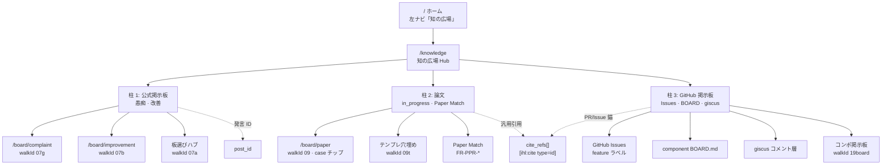

# 知の広場 — 仮採用 MASTER v1

> **ステータス**: **仮採用（PROVISIONAL）** — W2 checkpoint 設計たたき台。`01-要件` / `02-設計` 正式版への昇格前。  
> **作成日**: 2026-07-06  
> **スコープ**: 知の広場（Knowledge Plaza）横断 — #07 掲示板 · #09 論文 · #19 コンポーネント掲示板 · 汎用引用 · GitHub 改善面  
> **実装禁止**: 設計ゲート 5 点未通過 · 本 doc は **docs のみ**（`apps/web` 変更禁止）  
> **処理プロトコル**: [`W2-DESIGN-DOC-PROCESSING-v1.md`](./W2-DESIGN-DOC-PROCESSING-v1.md)  
> **W2 lab**: `apps/ui-parts-lab-w2` port **3101**

---

## §0 文書マップ（この MASTER の役割）

本書は知の広場に関する **W2 仮採用設計の索引・横断 RTM・人間ゲート一覧** を担う。柱ごとの詳細は子ドキュメントへ分割し、将来の REQ / DET / UI 昇格時に **機械的に切り出せる構造** とする。

| 層 | 本書 | 子 doc（並行執筆） |
|----|------|-------------------|
| 横断方針 · IA · RTM | **本 MASTER** | — |
| 柱 1 公式掲示板 | §2 要約 | [`知の広場-仮採用-01-掲示板-v1.md`](./知の広場-仮採用-01-掲示板-v1.md) |
| 柱 2 論文 | §2 要約 | [`知の広場-仮採用-02-論文-v1.md`](./知の広場-仮採用-02-論文-v1.md) |
| 柱 3 GitHub 掲示板 | §2 要約 | [`知の広場-仮採用-03-GitHub掲示板-v1.md`](./知の広場-仮採用-03-GitHub掲示板-v1.md) |
| 汎用引用 | §2 要約 | [`知の広場-仮採用-04-汎用引用-v1.md`](./知の広場-仮採用-04-汎用引用-v1.md) |
| OSS 横断索引 | §2 要約 | [`知の広場-OSS-PRIOR-ART-v1.md`](./知の広場-OSS-PRIOR-ART-v1.md) |

**既存正本（参照のみ · 本書は上書きしない）**:

| 種別 | パス |
|------|------|
| Hub E2E（DRAFT） | [`02-設計/E2E/KN-知の広場-E2E-v1-DRAFT.md`](../../02-設計/E2E/KN-知の広場-E2E-v1-DRAFT.md) |
| 横断遷移（DRAFT） | [`02-設計/features/_横断/知の広場-遷移設計-v1-DRAFT.md`](../../02-設計/features/_横断/知の広場-遷移設計-v1-DRAFT.md) |
| UX 提案（DRAFT） | [`02-設計/E2E/07-09-24-コンテンツ導線・UX提案-v1-DRAFT.md`](../../02-設計/E2E/07-09-24-コンテンツ導線・UX提案-v1-DRAFT.md) |
| 掲示板要件（たたき台） | [`01-要件/07-掲示板.md`](../../01-要件/07-掲示板.md) |
| 論文要件（たたき台） | [`01-要件/09-論文.md`](../../01-要件/09-論文.md) |
| W2 掲示板 lab note | [`07-掲示板-LAB-DESIGN-NOTE-v1.md`](./07-掲示板-LAB-DESIGN-NOTE-v1.md) |
| W2 BBS prior art | [`07-掲示板-BBS-PRIOR-ART-v1.md`](./07-掲示板-BBS-PRIOR-ART-v1.md) |

---

## §1 仮採用宣言

### 1.1 スコープ（In）

| 領域 | 内容 |
|------|------|
| **知の広場 Hub** | `/knowledge` 着地 · 左ナビ 1 クリック · 3 柱 IA（仮） |
| **柱 1 — 公式掲示板** | 製品 BBS の **愚痴 · 改善** 2 板を主対象（ADR-H-07 の 4 入口のうちコミュニティ向け半分） |
| **柱 2 — 論文** | 進行中論文 · テンプレ穴埋め · Paper Match · case チップ（探索用） |
| **柱 3 — GitHub 掲示板** | Issues / BOARD.md / giscus · link-out · 改善履歴の可視化層 |
| **汎用引用** | `[ihl:cite type=id]` · `cite_refs[]` · `post_id` 横断スキーマ（仮） |
| **W2 lab 配線** | walkId `07a`〜`09t` · `19board` の設計↔実装マップ |

### 1.2 スコープ外（Out · 本仮採用では束ねない）

| 領域 | 理由 |
|------|------|
| **記事 · ブログ（#24）** | KN E2E の 3 タブ案に含まれるが、W2 3 柱案では **柱外**。人間ゲートで再統合可否を判断（§5） |
| **legacy file-board（REQ-018）** | civ-os 専用 · IHL 正本は GitHub + R2 |
| **裁判二人部屋（#11）** | 掲示板二次導線 · 知の広場柱には含めない |
| **LaTeX エディタ · 査読 WF 本実装** | ADR-H-09 Phase 1 対象外 |
| **apps/web 実装** | 設計ゲート通過前は禁止 |

### 1.3 まだ拘束力を持たないもの（Non-binding）

以下は **W2 議論・lab 検証用の仮説** であり、実装・REQ 昇格・E2E assert の根拠に **単独では使えない**:

- 本 MASTER および子 doc の **PROVISIONAL** 節全体
- §2 の **3 柱 IA**（KN 既存 3 タブ案との差分は未決）
- 汎用引用スキーマ（`ihl:cite` 等）— コードベースに未実装
- walkId ↔ 本番ルートの **1:1 対応表**（lab は mock 優先）
- OSS 採用表の「候補」行 — [`知の広場-OSS-PRIOR-ART-v1.md`](./知の広場-OSS-PRIOR-ART-v1.md) スタブ

### 1.4 本採用（正式昇格）の判定基準

人間が **本採用 Go** を出すまで、以下をすべて満たすこと:

| # | ゲート | 合格条件 |
|---|--------|----------|
| G1 | **IA 確定** | §5 未決事項がすべて **決定済み** または **明示 defer**（ADR 番号付き） |
| G2 | **柱別 doc レビュー** | 子 doc 4 本 + OSS 索引が **人間 PASS**（W2 lab scorecard ≥ 閾値は参考のみ） |
| G3 | **RTM 閉包** | §4 の全 `KN-FR-*` が将来 REQ/DET/UI 先取り先が **空欄なし** |
| G4 | **E2E 整合** | `KN-知の広場-E2E` または後継 E2E doc が **3 柱 or 3 タブの確定案** と一致 |
| G5 | **設計ゲート 5 点** | Phase 2 詳細 · Phase 3 遷移 · Phase 4 UI · テスト設計 · CI — [`ihl-waterfall-v-model-gate.mdc`](../../.cursor/rules/ihl-waterfall-v-model-gate.mdc) |
| G6 | **C1–C4 監査** | [`ihl-design-impl-audit`](../../.cursor/skills/ihl-design-impl-audit/SKILL.md) 伴走監査 PASS |

**昇格先（予定）**:

```text
本 MASTER §Future-*  →  01-要件/00-プロダクト方針 §3 追記 + 07/09/19/25 要件更新
                      →  02-設計/features/_横断/知の広場-遷移設計-v2.md（本採用版）
                      →  02-設計/features/{07,09,19}/詳細設計-v4.md
                      →  02-設計/features/{07,09,19}/ui/*.md
```

---

## §2 IA 確定案（仮）— 3 柱モデル

### 2.1 メンタルモデル

> **知の広場 = 「話す（愚痴・改善）」「検証する（論文）」「改善履歴を見る（GitHub）」の 3 面が、ホーム左ナビ 1 クリックで開くコンテンツ Hub**

掲示板の「雑談・改善」と論文の「条件検証」と GitHub の「開発改善ログ」は **入口・主タスク・Truth 保存先が異なる** ため、W2 では **タブではなく柱（pillar）** として並列化する（KN 既存案との差分は §5.2）。

### 2.2 柱定義（仮採用）

| 柱 | 表示名（案） | 主タスク | Truth / 正本 | 製品ルート（案） | W2 walkId |
|----|-------------|----------|--------------|-----------------|-----------|
| **P1** | 公式掲示板 | スレを読み愚痴・改善を書く | R2 ThreadEvent/PostEvent（ADR-H-10） | `/board/complaint` · `/board/improvement` | `07a` `07g` `07b` |
| **P2** | 論文 | 進行中論文 · 条件マッチ · テンプレ | Content append-only · Paper Match API | `/board/paper` · `/research/paper-match` | `09` `09t` |
| **P3** | GitHub 掲示板 | 改善履歴・component 議論を **link-out** で見る | GitHub Issues · `docs/components/*/BOARD.md` | `/knowledge/github`（新設案）· `19board` | `19board` |

**柱 1 の範囲（仮）**: ADR-H-07 の 4 入口のうち **愚痴 + 改善** のみを柱 1 に含める。**論文板**は柱 2、**その他板**は人間ゲート（§5.1）。

### 2.3 Hub 構造図（mermaid）



### 2.4 クリックパス（≤3 · ホーム起点 · 仮）

| 起点 | 目的 | クリック数 | 経路 |
|------|------|:----------:|------|
| `/` | 知の広場 → 愚痴板スレ一覧 | **2** | 左ナビ → `07a` or KN → `07g` |
| `/` | 知の広場 → 改善板へ投稿 | **3** | 左ナビ → KN → 改善 → 新規 |
| `/` | 知の広場 → 進行中論文 | **2** | 左ナビ → KN → `09` |
| `/` | 知の広場 → GitHub 改善を開く | **2** | 左ナビ → KN → 柱 3 → link-out |
| `/` | 論文 → テンプレ穴埋め | **3** | KN → `09` → `09t` |

### 2.5 柱間関係（引用 · 導線）

| From | To | 導線種別 | スキーマ |
|------|-----|----------|----------|
| 柱 2 論文詳細 | 柱 1 論文板 | 「論文板で議論」CTA（既存 FR-ART-11 系） | `case=article` · **本仮採用では柱 2 内 case チップを優先** |
| 柱 2 Paper Match | 柱 2 テンプレ | 不足キー → 穴埋め提案 | `content_id` |
| 柱 3 GitHub Issue | 柱 1 改善板 | 要約 + link-out（#25 草案） | `source=github` クエリ |
| 任意柱 | 任意 Content | 汎用引用 | `[ihl:cite type=id]` → `cite_refs[]` |

詳細: [`知の広場-仮採用-04-汎用引用-v1.md`](./知の広場-仮採用-04-汎用引用-v1.md)

### 2.6 KN 既存 3 タブ案との対照（参考 · 未決）

| KN E2E（2026-06-18 確定案） | W2 3 柱案（本書） | 差分 |
|----------------------------|------------------|------|
| タブ: 掲示板 | 柱 1 公式掲示板（愚痴+改善） | 論文板・その他を柱 1 から分離 |
| タブ: 記事 | **柱外（§5.2）** | #24 記事の扱い未決 |
| タブ: ブログ | **柱外（§5.2）** | 観測ログ導線の再配置未決 |
| — | 柱 2 論文 | KN では記事タブ内フィルタだった論文を独立柱化 |
| — | 柱 3 GitHub | KN では未モデル化 |

---

## §3 子ドキュメント索引

| ファイル | 柱 / テーマ | 状態 | 要約 |
|----------|------------|------|------|
| [`知の広場-仮採用-01-掲示板-v1.md`](./知の広場-仮採用-01-掲示板-v1.md) | P1 公式掲示板 | **執筆予定 / 並行** | 愚痴·改善 · 5ch prior art · ADR-H-07 部分集合 · `07a/07g/07b` |
| [`知の広場-仮採用-02-論文-v1.md`](./知の広場-仮採用-02-論文-v1.md) | P2 論文 | **執筆中** | `09/09t` · in_progress 一級 · ADR-H-09 · Paper Match |
| [`知の広場-仮採用-03-GitHub掲示板-v1.md`](./知の広場-仮採用-03-GitHub掲示板-v1.md) | P3 GitHub | **執筆中** | giscus · Issues · BOARD.md · link-out · `19board` |
| [`知の広場-仮採用-04-汎用引用-v1.md`](./知の広場-仮採用-04-汎用引用-v1.md) | 横断 | **執筆予定 / 並行** | `ihl:cite` · `cite_refs[]` · `post_id` · 柱間リンク |
| [`知の広場-OSS-PRIOR-ART-v1.md`](./知の広場-OSS-PRIOR-ART-v1.md) | OSS 横断 | **スタブ v1** | 5ch-template · shadcn · giscus · QuartoReview 索引 |

**W2 checkpoint 既存 doc（柱の参考実装）**:

| ファイル | 関連 walkId |
|----------|------------|
| [`07-掲示板-LAB-DESIGN-NOTE-v1.md`](./07-掲示板-LAB-DESIGN-NOTE-v1.md) | `07a` `07b` `07g` `07o` `09` |
| [`07-掲示板-BBS-PRIOR-ART-v1.md`](./07-掲示板-BBS-PRIOR-ART-v1.md) | `07a` 重複調査 · CAL-07-HUB-03 |
| [`feature-parity/07.md`](./feature-parity/07.md) | scorecard 4/4 PASS |
| [`feature-parity/09.md`](./feature-parity/09.md) | `09` `09t` scorecard 2/2 PASS |
| [`feature-parity/19.md`](./feature-parity/19.md) | `19board` scorecard 1/1 PASS |

---

## §4 RTM トレーサビリティ表（仮 FR → 将来 doc）

> **ID 規則**: `KN-FR-*` は本仮採用用。昇格時に既存 `FR-CONTENT-NAV-*` · `FR-BBS-*` · `FR-PPR-*` へマージまたは alias を張る。

### 4.1 Hub · 横断

| 仮 FR ID | 要約 | 既存 REQ（参考） | 将来 REQ 先 | 将来 DET 先 | 将来 UI 先 |
|----------|------|-----------------|-------------|-------------|-----------|
| KN-FR-HUB-01 | `/knowledge` Hub 着地 · 左ナビ 1 クリック | FR-CONTENT-NAV-01 | `00-プロダクト方針` §3 | `_横断/知の広場-遷移設計-v2` §1 | `_横断/ui/知の広場-hub.md` §2 |
| KN-FR-HUB-02 | 3 柱 IA（掲示板/論文/GitHub） | FR-CONTENT-NAV-07（差分） | 同上 + ADR 新設候補 | 遷移 v2 §2 柱定義 | hub §3 柱カード |
| KN-FR-HUB-03 | 柱間汎用引用 | FR-CONTENT-NAV-02 | `04-汎用引用` 要件新設 | `_横断/引用-データ契約-v1` | `04-汎用引用-v1` UI |
| KN-FR-HUB-04 | 空/loading/error 各柱 | NFR-BBS-04 | 各機能 NFR | 各 DET §状態機械 | 各 UI §4 状態 |
| KN-FR-HUB-05 | ≤3 クリック主要導線 | preferences §A | Charter 参照 | 遷移 v2 §3 | walkthrough 整合 |

### 4.2 柱 1 — 公式掲示板

| 仮 FR ID | 要約 | 既存 REQ | 将来 REQ 先 | 将来 DET 先 | 将来 UI 先 |
|----------|------|----------|-------------|-------------|-----------|
| KN-FR-BBS-01 | 愚痴板スレ閲覧·投稿 | FR-BBS-05, FR-BBS-14 | `07-掲示板` §4 | `07-掲示板/詳細設計-v4` §スレ | `ui/掲示板.md` §愚痴 |
| KN-FR-BBS-02 | 改善板スレ閲覧·投稿 | 同上 | 同上 | 同上 §改善 | 同上 §改善 |
| KN-FR-BBS-03 | 板選びハブ 2×2 カード単一ナビ | FR-BBS-14 | `07-掲示板` | `ui/遷移詳細.md` §2 | `07a` mock 整合 |
| KN-FR-BBS-04 | 投稿 rescue（失敗理由·再試行） | FR-BBS-07 | REQ-024 統合 | DET §投稿 | UI §エラー |
| KN-FR-BBS-05 | 争い入口（指摘）→ #11 | FR-BBS-12 | `07` + `11` cross-ref | `11-裁判` DET | スレ画面 secondary |
| KN-FR-BBS-06 | `post_id` 安定発言 ID | ADR-H-10 | `07` NFR | ADR-H-10 §PostEvent | — |

### 4.3 柱 2 — 論文

| 仮 FR ID | 要約 | 既存 REQ | 将来 REQ 先 | 将来 DET 先 | 将来 UI 先 |
|----------|------|----------|-------------|-------------|-----------|
| KN-FR-PPR-01 | 進行中論文一覧（in_progress 一級） | FR-PPR-* · ADR-H-09 | `09-論文` §4 拡張 | `09/詳細設計-v4` | `ui/低コスト導線.md` |
| KN-FR-PPR-02 | テンプレ穴埋め 6 節 | 詳細設計-v3 | `09-論文` | DET §テンプレ | `09t` walkId |
| KN-FR-PPR-03 | Paper Match（条件×観測） | FR-PPR-01〜11 | `09-論文` | DET §マッチ API | Paper Match 画面 |
| KN-FR-PPR-04 | case チップ（論文板内フィルタ） | FR-BBS-15/16 | `07`+`09` cross | ADR-H-07 | `09` UI §チップ |
| KN-FR-PPR-05 | 観測逆流 1 クリック | FR-PPR-04 | `09`+`05` cross | `05-観測` 橋 | `09` hotspot |
| KN-FR-PPR-06 | 論文→掲示板議論 CTA | FR-ART-11 系 | `09`+`07` | 遷移 v2 §柱間 | `09` 二次導線 |

### 4.4 柱 3 — GitHub 掲示板

| 仮 FR ID | 要約 | 既存 REQ | 将来 REQ 先 | 将来 DET 先 | 将来 UI 先 |
|----------|------|----------|-------------|-------------|-----------|
| KN-FR-GH-01 | GitHub Issues 索引表示 | `25-AI要約` 草案 | `25` 要件昇格 | `25/DET` | 柱 3 hub UI |
| KN-FR-GH-02 | component BOARD.md 一覧 | FR-19-* | `19-コンポーネント掲示板` | `19/DET` | `19board` |
| KN-FR-GH-03 | giscus コメント層（link-out 補助） | ADR-H-10 §6 | `19` or `_横断` | OSS 節 | giscus 埋め込み規約 |
| KN-FR-GH-04 | iframe 禁止 · 新タブ link-out | 柱 3 原則 | ADR 新設 | DET §セキュリティ | UI §CTA |
| KN-FR-GH-05 | AI 要約バッチ（#25） | FR-CONTENT-NAV-06 | `25` | `25/DET` §バッチ | 改善板 `?source=github` |

### 4.5 E2E シナリオ対応（参考）

| 仮 FR | KN E2E Scenario（既存） | 備考 |
|-------|------------------------|------|
| KN-FR-HUB-01 | SC-KN-HUB-01, 02 | 3 タブ assert は柱化後に改訂要 |
| KN-FR-BBS-01/02 | SC-KN-HUB-05, SC-07-BBS-01 | 愚痴·改善 |
| KN-FR-PPR-04 | SC-KN-HUB-06 | 論文板 case |
| KN-FR-PPR-03 | — | Paper Match 専用 SC 要追加 |
| KN-FR-GH-02 | — | `19board` lab SC 要追加 |

---

## §5 人間ゲート未決事項

| ID | 論点 | 選択肢 | 推奨（AI 仮） | ブロック影響 |
|----|------|--------|--------------|-------------|
| **HG-KN-01** | **その他板**（`/board/general`）の柱所属 | A) 柱 1 に含める B) 独立 4 柱目 C) v1 非掲載 | **B または C** — 柱 1 は愚痴+改善に限定 | `07o` walkId の Hub カード要否 |
| **HG-KN-02** | **KN 3 タブ vs W2 3 柱** | A) 3 タブ維持（記事/ブログ込み） B) 3 柱に置換 C) ハイブリッド（外側3柱·内側タブ） | **C ハイブリッド** — 柱 2 内に記事/論文チップ | `KN-知の広場-E2E` 全面改訂 |
| **HG-KN-03** | **walkId mapping** 本番ルート | A) walkId=ルート B) walkId=画面種別 only C) 段階的 alias | **B** — lab は画面種別、本番は `/knowledge` 配下 | route-matrix CI |
| **HG-KN-04** | **論文板**（`/board/paper`）の柱 | A) 柱 2 のみ B) 柱 1+2 両方から入口 C) 柱 1 維持 | **A** — 柱 2 正本 · 柱 1 からリンクのみ | `07a` 4 カードの 1 枚 |
| **HG-KN-05** | **記事/ブログ（#24）** | A) 柱 2 サブタブ B) 独立柱 C) Phase 2 defer | **A** — 柱 2「研究コンテンツ」に統合 | #24 要件の分割 |
| **HG-KN-06** | **汎用引用** 昇格タイミング | A) 柱確定と同時 B) 実装直前 C) Phase 2 | **A** — 柱間導線が引用に依存 | `cite_refs` API 未設計 |
| **HG-KN-07** | **GitHub 柱の URL** | A) `/knowledge/github` B) `/board/github` C) `19board` のみ | **A** — 知の広場配下に統一 | 新 route 追加 |
| **HG-KN-08** | **07a ハブ** 4 カード vs 2 カード | A) ADR-H-07 4 枚維持 B) 柱 1 は 2 枚+柱 2/3 へ | **B** — Hub を 3 柱カードに再設計 | CAL-07-HUB-03 継続 |

**決定記録先（本採用時）**: 本表の「決定」列を埋め · 必要なら `02-設計/_横断/adr/ADR-H-3x-知の広場-IA-v1.md` 新設。

---

## §6 W2 lab 実装マップ

### 6.1 walkId ↔ 画面 ↔ ルート

| walkId | 画面タイトル | 本番ルート（参考） | W2 コンポーネント | 柱 | scorecard |
|--------|-------------|-------------------|------------------|-----|-----------|
| `07a` | 掲示板ハブ | `/knowledge/board` or `/board` hub | `BoardHubW2` | P1（全体入口） | PASS 97 |
| `07g` | 愚痴板 | `/board/complaint` | `BoardThreadListW2` | P1 | PASS 97 |
| `07b` | 改善提案板 | `/board/improvement` | `BoardThreadListW2` | P1 | PASS 97 |
| `07o` | その他板 | `/board/general` | `BoardThreadListW2` | **未決（HG-KN-01）** | （07 系） |
| `09` | 論文板 | `/board/paper` | `BoardThreadListW2` / `PaperBoardW2` | P2 | PASS 97 |
| `09t` | 論文テンプレ穴埋め | `/board/paper/template` | catalog override | P2 | PASS 97 |
| `19board` | コンポーネント掲示板 | `/components/board`（案） | catalog | P3 | PASS 97 |

**検証 URL（dev）**:

```text
http://localhost:3101/s/07a
http://localhost:3101/s/07g
http://localhost:3101/s/07b
http://localhost:3101/s/07o
http://localhost:3101/s/09
http://localhost:3101/s/09t
http://localhost:3101/s/19board
```

### 6.2 グローバル導線（W2GlobalChrome）

| 導線 | 出典 | target walkId | 柱 |
|------|------|---------------|-----|
| 左ナビ「掲示板」 | `HomeCommandPanelW2` | `07a` | P1 |
| 左ナビ「論文」 | `walkthrough.js` HOME | `09` | P2 |
| フッター「愚痴」 | `w2-global-chrome.tsx` | `07g` | P1 |
| フッター「改善提案」 | 同上 | `07b` | P1 |
| `07a` カード「論文板」 | `BoardHubW2` | `09` | P2 |
| `07a` カード「コンポ掲示板」 | hotspot.4 | `19board` | P3 |

### 6.3 walkthrough.js ホットスポット（正本）

| walkId | 主要 hotspot | target |
|--------|-------------|--------|
| `07a` | 改善提案を開く | `07b` |
| `07a` | 愚痴板 | `07g` |
| `07a` | 論文板 | `09` |
| `07a` | その他板 | `07o` |
| `07a` | コンポ掲示板 | `19board` |
| `09` | テンプレ穴埋め | `09t` |
| `09t` | 進行中論文 | `09` |

出典: [`02-設計/_ui-global/ux-walkthrough/walkthrough.js`](../../02-設計/_ui-global/ux-walkthrough/walkthrough.js)

### 6.4 lab ↔ 本番ギャップ（既知）

| ID | 内容 | 状態 |
|----|------|------|
| GAP-KN-LAB-01 | `/knowledge` Hub 画面が lab 未実装（`07a` が掲示板ハブを兼ねる） | **OPEN** — HG-KN-02 決定後に KN hub walkId 追加 |
| GAP-KN-LAB-02 | 柱 3 専用画面（GitHub 索引）未実装 | **OPEN** — `19board` のみ |
| GAP-KN-LAB-03 | 汎用引用 UI 未実装 | **OPEN** — スキーマのみ |
| GAP-KN-LAB-04 | `07a` タブ+カード二重（CAL-07-HUB-03 修正済） | **解消** |

---

## §7 汎用引用（横断要約）

3 柱をまたいで Content · 掲示板発言 · GitHub Issue/PR を参照するための **仮スキーマ**（詳細は子 doc）:

| 要素 | 形式 | 用途 |
|------|------|------|
| インライン | `[ihl:cite type=<kind> id=<uuid>]` | 本文中の引用マーカー |
| 構造化 | `cite_refs: [{ type, id, label?, post_id? }]` | API レスポンス · R2 イベント payload |
| 発言鍵 | `post_id` | 柱 1 BBS 発言の安定 ID（ADR-H-10 PostEvent） |

**type 候補（仮）**: `observation` · `paper` · `article` · `blog` · `board_post` · `github_issue` · `github_pr` · `component`

---

## §8 §Future-REQ — 昇格先と移管内容

本仮採用 doc 群から `01-要件/` へ移すとき、**機能横断の要件**として `00-プロダクト方針・MVP・拡張安全枠-v1` §3（FR-CONTENT-NAV-*）を拡張し、既存 `07-掲示板.md` · `09-論文.md` · `19-コンポーネント掲示板.md` · `25-AI要約-GitHub改善掲示板-v1-DRAFT.md` へ **柱ごとに FR を再分配**する。具体的には §4 RTM の `KN-FR-*` 各行を正式 `FR-*` ID にマージし、記事/ブログ（#24）の扱いは HG-KN-02/05 の決定を反映してから `24-記事・ブログ` 要件へ cross-ref を張る。汎用引用は新規 `01-要件/_横断/汎用引用-v1.md`（仮称）として切り出す。

---

## §9 §Future-DET — 昇格先と移管内容

詳細設計層では `02-設計/features/_横断/知の広場-遷移設計-v1-DRAFT.md` を **v2 本採用版**に昇格し、3 柱（または確定したハイブリッド IA）の状態機械・ルートマスター・柱間遷移を正本化する。柱 1 は `07-掲示板/詳細設計-v4.md` へ愚痴·改善とハブの責務分界を移し、柱 2 は `09-論文/詳細設計-v4.md` へ in_progress · Paper Match · テンプレを集約する。柱 3 は `19-コンポーネント掲示板/詳細設計` と `25-*` を統合した **GitHub 可視化層 DET** を新設する。汎用引用のデータ契約は `02-設計/_横断/引用-データ契約-v1.md`（仮称）として ADR-H-10 と整合させる。

---

## §10 §Future-UI — 昇格先と移管内容

UI 層では `02-設計/features/_横断/ui/知の広場-hub.md`（新設）を Hub の正本とし、3 柱カード（または確定タブ）のレイアウト · 1 主 CTA · 空状態を定義する。柱 1 は既存 `07-掲示板/ui/掲示板.md` · `遷移詳細.md` を更新し、**ハブは 2×2 カード単一ナビ**（CAL-07-HUB-03）を維持するか 3 柱 Hub に統合するかを HG-KN-08 決定後に反映する。柱 2 は `09-論文/ui/低コスト導線.md` と mock `ihl-09-*` を正本とし、柱 3 は `19-コンポーネント掲示板/ui/` に giscus · link-out 規約を追加する。全画面 `data-testid` は `KN-知の広場-E2E` を 3 柱版に改訂してから UI doc §testid へ写経する。

---

## §11 変更履歴

| 日付 | 版 | 内容 |
|------|-----|------|
| 2026-07-06 | v1 | 初版 · W2 checkpoint 仮採用 MASTER · OSS スタブ新設 |

---

*仮採用 PROVISIONAL · 実装禁止ゲート有効 · 人間本採用 Go まで拘束力なし*
