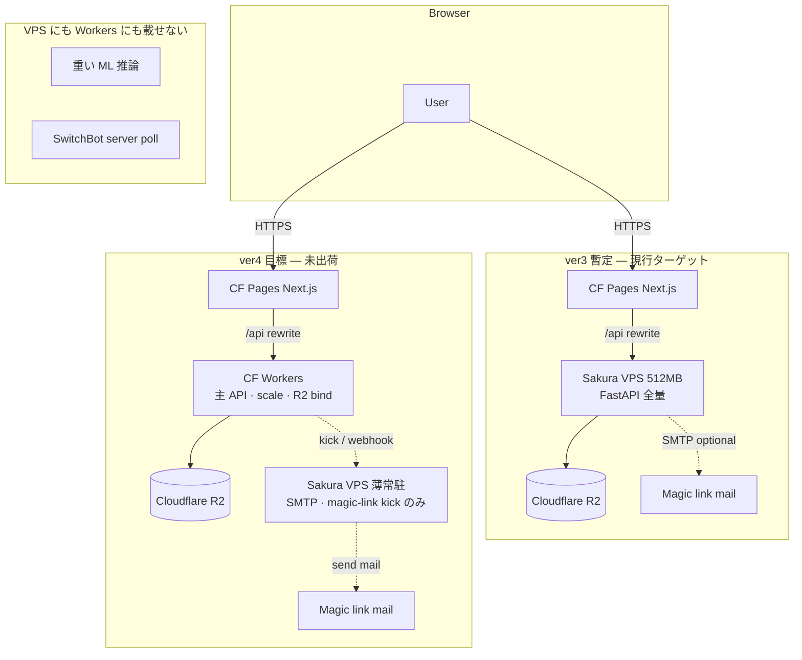

# IHL ver4 インフラ合意 — Workers × VPS ハイブリッド v1.0

> **ステータス**: **v1.0 確定**（2026-06-26 · ユーザー会話合意の文書化）  
> **性質**: **コミットメント文書** — ver4 インフラ移行は **未完了**（本 doc は「やること」の固定のみ）  
> **上位**: [`02-設計/_横断/adr/ADR-H-33-ver4-Workers-VPS-役割分離-v1.md`](../02-設計/_横断/adr/ADR-H-33-ver4-Workers-VPS-役割分離-v1.md)  
> **関連**: [`ver3-deploy-runbook.md`](./ver3-deploy-runbook.md) · [`docs/runbooks/production-deploy.md`](../../../docs/runbooks/production-deploy.md)（civ-os legacy 参照）· [`02-設計/_横断/IHL-段階リリース計画-ver1-4+.md`](../02-設計/_横断/IHL-段階リリース計画-ver1-4+.md)

---

## 0. 合意文（会話確定 · 5 項目）

1. **負荷の偏在禁止** — 512MB VPS **だけ**に API・永続化・認証・バッチを集約してはならない。同様に **Workers だけ**に全 API・SMTP 代替・常駐 kick を集約してはならない。
2. **ver4 ターゲット** — **メイン API・スケール・R2 バインディングは Cloudflare Workers**。**VPS は薄い常駐のみ** — SMTP 経由 magic link 送信・軽量 kick（スケジュール起動・ヘルス補助等、ADR-H-33 参照）。
3. **ver3 は暫定妥協** — ver4 出荷まで **FastAPI 全量を Sakura VPS 512MB** に載せる構成を許容する（[`ver3-deploy-runbook.md`](./ver3-deploy-runbook.md) 正本）。ver3 を ver4 の最終形と誤認しない。
4. **どちらにも載せない** — **重い ML 推論**（DINOv2 本番バッチ等）と **SwitchBot サーバ側 poll**（token+secret 保持）は VPS にも Workers にも載せない（[`ADR-H-30`](../02-設計/_横断/adr/ADR-H-30-SwitchBot-秘密非保持-v1-DRAFT.md) · ユーザー PC collector / import / 手入力が正本）。
5. **ver4 完了の定義（インフラ）** — Workers へ **観測・認証・CRUD 等の主 API** を移し、VPS を **SMTP + magic-link + 最小 kick** にスリム化したうえで、Pages の `/api/*` rewrite 先を Workers に切り替える。**本 doc の記載時点では ver4 インフラは未着手・未完了**。

---

## 1. アーキテクチャ比較（legacy · ver3 · ver4）

### 1.1 一覧

| 世代 | Web | API | 永続化 | 認証メール | 備考 |
|------|-----|-----|--------|------------|------|
| **civ-os legacy** | Vite SPA · 各種ホスト | Node Express · 単一 VPS 想定 | R2 + インメモリ fallback | backend `SMTP_*` 同一プロセス | [`production-deploy.md`](../../../docs/runbooks/production-deploy.md) 参照 · IHL 正本ではない |
| **IHL ver3（暫定）** | CF Pages · Next.js | **FastAPI 全量 · Sakura VPS 512MB** | Cloudflare R2（VPS ローカル blob なし） | API プロセス内 or VPS 同居 SMTP | **暫定妥協** · ver4 まで有効 |
| **IHL ver4（目標）** | CF Pages · Next.js | **CF Workers（主 API）** | R2 **Workers バインディング** | **VPS 薄常駐** — SMTP + magic-link kick | ver4 ゲート · **未出荷** |

### 1.2 図（ver3 暫定 → ver4 目標）



### 1.3 テキスト図（ver4 目標 · 簡略）

```text
[Browser] ──► it-hercules.uk (CF Pages)
                  │
                  │ /api/* ──► CF Workers (主 API · R2 bindings · 水平スケール)
                  │                │
                  │                ▼
                  │         Cloudflare R2 (Truth events)
                  │
                  └── (認証メール) ──► VPS 薄常駐 ── SMTP ──► ユーザー inbox
                                       ▲
                                       └── Workers から kick のみ（常駐負荷は最小）

【載せない】重い ML · SwitchBot サーバ poll → ユーザー PC collector / import / 手入力
```

---

## 2. VPS の役割

| 区分 | ver3（暫定） | ver4（目標） |
|------|--------------|--------------|
| **API** | FastAPI **全ルート** | **なし**（主 API は Workers） |
| **SMTP / magic link** | API 同居 or 同一 VPS | **専用薄プロセス**（送信・トークン kick のみ） |
| **常駐** | uvicorn + Docker `api` | **最小メモリ** — cron/systemd kick · ヘルス補助 |
| **永続化** | R2 経由（VPS ローカル blob 禁止） | **変更なし** — blob は R2 のみ |
| **512MB 制約** | 全 API が乗るため **厳しい** | **緩和** — API 負荷は Workers へ |

**禁止（ver4 以降）**: VPS のみで全 REST を賄う構成への回帰。

---

## 3. Workers の役割

| 区分 | ver4（目標） |
|------|--------------|
| **主 API** | 観測 CRUD · セッション検証 · 環境 ingest · 検索等の **リクエスト駆動 API** |
| **スケール** | CF エッジ · 同時接続・バーストを VPS 512MB から切り離す |
| **R2** | `R2_*` **バインディング** — S3 互換クライアントより低レイテンシ・運用単純化 |
| **認証** | opaque `session_token` 検証 · magic link **消費**（**送信は VPS**） |

**禁止（ver4 以降）**: Workers のみで SMTP 送信まで完結させ、VPS をゼロにする構成（magic link の実メール経路が欠落する）。

---

## 4. どちらにも載せないもの

|  workload | 正本経路 | 参照 |
|-----------|----------|------|
| **重い ML**（DINOv2 本番バッチ・GPU 推論） | 別パイプライン · ver5+ ADR · 本番 API 外 | ver5 #18 深化 |
| **SwitchBot server poll** | ユーザー PC `collector/` · Export→Import · 手入力 | ADR-H-30 · ADR-H-29 |

---

## 5. ver3 暫定（full FastAPI on VPS）

ver3 初回 Web リリースは **コア機能の internet 公開**が目的であり、インフラは **時間対効果の暫定形**とする。

| 項目 | ver3 暫定の内容 |
|------|-----------------|
| 構成 | CF Pages + **`api.it-hercules.uk` = VPS FastAPI 全量** |
| 根拠 | 512MB で Workers 移植 + SMTP 分離を同時にやると ver3 リリースが遅延する |
| 有効期限 | **ver4 インフラ移行完了まで** |
| 正本 runbook | [`ver3-deploy-runbook.md`](./ver3-deploy-runbook.md) |

> **注意**: §8.1 B1 の「CF Pages + Workers/API」選択は **ver4 方向性**を含む。ver3 の具体形は **ハイブリッド脚注**（VPS API-only）で上書き（段階リリース計画 §8.1 脚注参照）。

---

## 6. ver4 必須スコープチェックリスト（インフラ）

**完了時にすべて `[x]` とする。現時点はすべて未完了。**

- [ ] **Workers 主 API** — 現行 FastAPI の **本番相当ルート**を Workers に移植（観測・認証・ingest 等）
- [ ] **R2 バインディング** — Workers `wrangler.toml` / ダッシュボードで本番バケット接続 · INSERT ONLY 維持
- [ ] **Pages rewrite 切替** — `/api/*` → Workers エンドポイント（VPS API から切り離し）
- [ ] **VPS スリム化** — FastAPI 全量停止 · **SMTP + magic-link kick** のみ常駐
- [ ] **認証フロー E2E** — メール送信（VPS）→ リンククリック → セッション確立（Workers）の通しテスト
- [ ] **負荷偏在レビュー** — 512MB VPS 単独負荷 · Workers-only（SMTP なし）の **両方が再発していない**こと
- [ ] **ADR-H-33 整合** — 本 checklist 完了をもって ver4 インフラゲート通過（機能 ver4 テンプレ platform とは **別トラック可**だが **併走推奨**）
- [ ] **runbook 更新** — `ver3-deploy-runbook.md` に ver4 移行手順追記 · 本 doc へリンク

---

## 7. 参照

| ドキュメント | 用途 |
|--------------|------|
| [`ver3-deploy-runbook.md`](./ver3-deploy-runbook.md) | ver3 暫定デプロイ · CF Pages + VPS API · DNS · R2 |
| [`docs/runbooks/production-deploy.md`](../../../docs/runbooks/production-deploy.md) | civ-os legacy 本番手順（R2 → Workers → API → UI 依存順） |
| [`ADR-H-33-ver4-Workers-VPS-役割分離-v1.md`](../02-設計/_横断/adr/ADR-H-33-ver4-Workers-VPS-役割分離-v1.md) | 決定記録（短縮版） |
| [`IHL-段階リリース計画-ver1-4+.md`](../02-設計/_横断/IHL-段階リリース計画-ver1-4+.md) | ver3 / ver4+ 機能マイルストーン |
| [`.cursor/rules/ihl-ver4-hybrid-infra.mdc`](../../../.cursor/rules/ihl-ver4-hybrid-infra.mdc) | エージェント向け禁止事項 |

---

## 変更履歴

| 日付 | 内容 |
|------|------|
| 2026-06-26 | v1.0 — ユーザー会話合意の文書化 · ver4 未完了を明示 |
